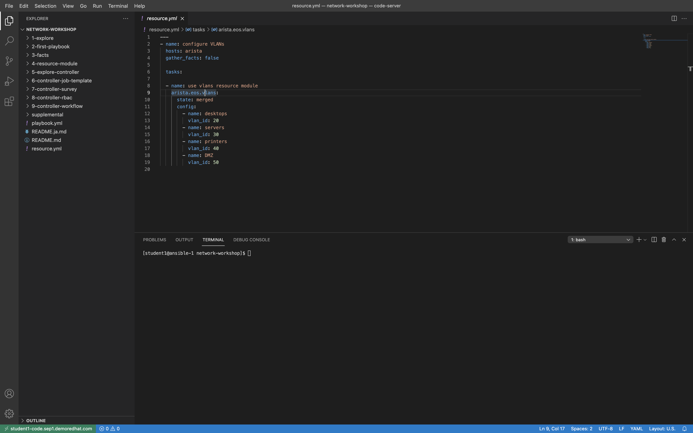
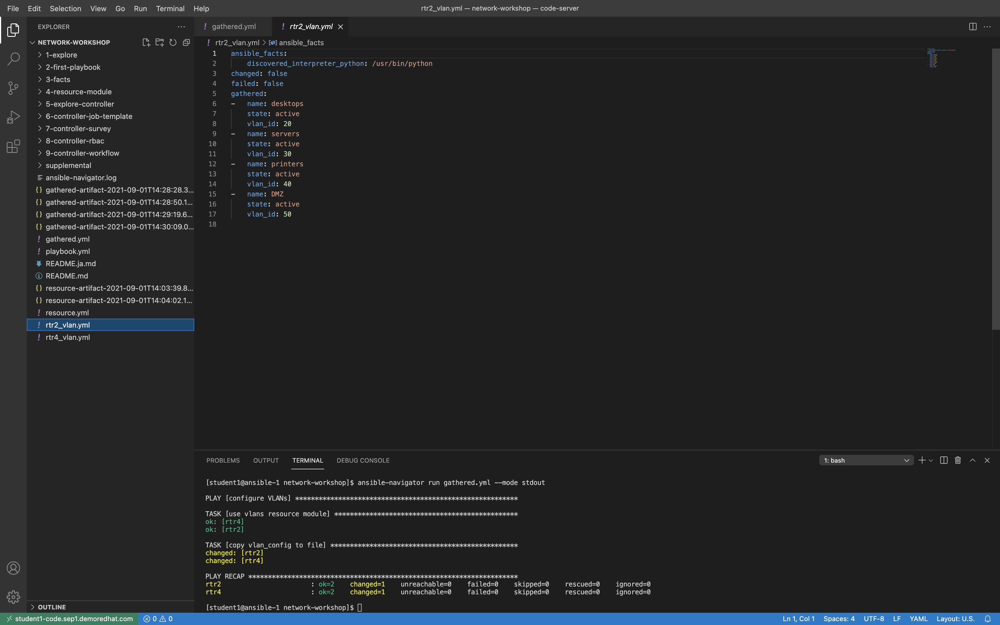

# 演習 4: Ansible ネットワークリソースモジュール

**他の言語でもお読みいただけます**:  [English](README.md),  [日本語](README.ja.md),  [Español](README.es.md).

If you are using an **all Cisco workbench** (all four routers are Cisco IOS
routers) please [switch to these
directions](../supplemental/4-resource-module-cisco/README.md).

## 目次

  * [目的](#objective)
  * [ガイド](#guide)
    * [ステップ 1 - VLAN 設定の確認](#step-1---verify-vlan-configuration)
    * [ステップ 2 - Ansible Playbook
      の作成](#step-2---creating-the-ansible-playbook)
    * [ステップ 3 - Ansible Playbook
      の検証](#step-3---examine-the-ansible-playbook)
    * [ステップ 4 - Ansible Playbook
      の実行](#step-4---execute-the-ansible-playbook)
    * [ステップ 5 - VLAN 設定の確認](#step-5---verify-vlan-configuration)
    * [ステップ 6 - 収集したパラメーターの使用](#step-6---using-the-gathered-parameter)
    * [ステップ 7 - 収集した Playbook の実行](#step-7---execute-the-gathered-playbook)
    * [ステップ 8 - ファイルの検証](#step-8---examine-the-files)
  * [重要なこと](#takeaways)
  * [ソリューション](#solution)
  * [完了](#complete)

## 目的

[Ansible
ネットワークリソースモジュール](https://docs.ansible.com/ansible/latest/network/user_guide/network_resource_modules.html)
のデモ使用

Ansible
ネットワークリソースモジュールは、さまざまなネットワークデバイスの管理方法を簡素化し、標準化します。ネットワークデバイスは、ネットワークサービスに適用されるセクション
(インターフェースや VLAN など) に設定を分割します。

ネットワークリソースモジュールは、異なるネットワークデバイス間で一貫したエクスペリエンスを提供します。つまり、複数のベンダーで同一のエクスペリエンスが得られます。たとえば、**VLAN**
モジュールは、以下のモジュールで同じように動作します。

* `arista.eos.vlans`
* `cisco.ios.vlans`
* `cisco.nxos.vlans`
* `cisco.iosxr.vlans`
* `junipernetworks.junos.vlans`

[VLAN](https://en.wikipedia.org/wiki/Virtual_LAN)
をネットワークデバイスで設定することは非常に一般的なタスクであり、設定ミスは頭痛の種で、ネットワーク障害の原因になります。また、VLAN
設定は複数のネットワークスイッチで同じになるため、自動化の優れたユースケースです。

この演習では、以下について説明します。

* Arista EOS での VLAN の設定
* [arista.eos.vlans
  モジュール](https://docs.ansible.com/ansible/latest/collections/arista/eos/eos_vlans_module.html)
  を使用した Ansible Playbook の構築
* `state: merged` の概要
* `state: gathered` の概要

## ガイド

### ステップ 1 - VLAN 設定の確認

* Arista スイッチにログインし、現在の VLAN 設定を確認します。

* コントロールノードターミナルから、`ssh rtr2` に続いて `enable` と入力します。

  ```bash
  $ ssh rtr2
  Last login: Wed Sep  1 13:44:55 2021 from 44.192.105.112
  rtr2>enable
  ```

* `show vlan` コマンドを使用して、VLAN 設定を検証します。

  ```bash
  rtr2#show vlan
  VLAN  Name                             Status    Ports
  ----- -------------------------------- --------- -------------------------------
  1     default                          active   
  ```

* `show run | s vlan` を使用して、Arista デバイスの VLAN running-confgiuration を検証します。

  ```bash
  rtr2#show run | s vlan
  rtr2#
  ```

上記の出力では、デフォルトの VLAN 1（どのポートも割り当てられていない）以外の VLAN 設定はないことが分かります。

### ステップ 2 - Ansible Playbook の作成

*  Visual Studio Code で `resource.yml` という名前の新規ファイルを作成します。

   

* 以下の Ansible Playbook を `resource.yml` にコピーします。

  ```yaml
  ---
  - name: configure VLANs
    hosts: arista
    gather_facts: false

    tasks:

    - name: use vlans resource module
      arista.eos.vlans:
        state: merged
        config:
          - name: desktops
            vlan_id: 20
          - name: servers
            vlan_id: 30
          - name: printers
            vlan_id: 40
          - name: DMZ
            vlan_id: 50
   ```

* 設定は、Visual Studio Code で以下のようになります。

   

### ステップ 3 - Ansible Playbook の検証

* まず、最初の 4 行を検証してみましょう。

  ```yaml
  ---
  - name: configure VLANs
    hosts: arista
    gather_facts: false
  ```

  * `---`: これが Playbook を作成する [YAML](https://en.wikipedia.org/wiki/YAML)
    ファイルであることを指定します。
  * `name`: この Playbook が実行する内容の説明です。
  * `hosts: arista`: Playbook が Arista ネットワークデバイスでのみ実行されることを意味します。
  * `gather_facts: false`: このプレイのファクト収集を無効にします。デフォルトでは有効になっています。


* 後半には、`arista.eos.vlans` を使用するタスクが 1 つあります。

  ```yaml
    tasks:

    - name: use vlans resource module
      arista.eos.vlans:
        state: merged
        config:
          - name: desktops
            vlan_id: 20
          - name: servers
            vlan_id: 30
          - name: printers
            vlan_id: 40
          - name: DMZ
            vlan_id: 50
  ```

  * `name:` - プレイと同様に、各タスクにはその特定のタスクの説明があります。
  * `state: merged` -
    リソースモジュールのデフォルト動作です。これにより、提供された設定がネットワークデバイスに存在することを強制します。リソースモジュールには実際には
    7 つのパラメーターがあります。
    * merged
    * replaced
    * overridden
    * deleted
    * rendered
    * gathered
    * parsed

    この演習では、これらのパラメーターの中の 2 つのみについて説明しますが、それ以外に [追加の演習](../supplemental/README.ja.md) に説明があります。
  * `config:` - これは提供された VLAN 設定です。これはディクショナリーのリストです。最も重要なのは、モジュールが `arista.eos.vlans` から `junipernetworks.junos.vlans` に変更されると、同じ動作になることです。これにより、ネットワークエンジニアは、ベンダー構文や実装よりもネットワーク（VLAN 設定など）にフォーカスできるようになります。

### ステップ 4 - Ansible Playbook の実行

* `ansible-navigator run` を使用して Playbook を実行します。タスクは 1 つしかないため、`--mode
  stdout` を使用できます。

  ```bash
  $ ansible-navigator run resource.yml --mode stdout
  ```

* 出力は以下のようになります。

  ```bash
  $ ansible-navigator run resource.yml --mode stdout

  PLAY [configure VLANs] *********************************************************

  TASK [use vlans resource module] ***********************************************
  changed: [rtr4]
  changed: [rtr2]

  PLAY RECAP *********************************************************************
  rtr2                       : ok=1    changed=1    unreachable=0    failed=0    skipped=0    rescued=0    ignored=0   
  rtr4                       : ok=1    changed=1    unreachable=0    failed=0    skipped=0    rescued=0    ignored=0   
  ```

* Playbook を再実行すると、[べき等性](https://en.wikipedia.org/wiki/Idempotence)
  の概念が示されます

  ```bash
  $ ansible-navigator run resource.yml --mode stdout

  PLAY [configure VLANs] *********************************************************

  TASK [use vlans resource module] ***********************************************
  ok: [rtr2]
  ok: [rtr4]

  PLAY RECAP *********************************************************************
  rtr2                       : ok=1    changed=0    unreachable=0    failed=0    skipped=0    rescued=0    ignored=0   
  rtr4                       : ok=1    changed=0    unreachable=0    failed=0    skipped=0    rescued=0    ignored=0
  ```

* 出力で分かるように、すべてのものが `ok=1` を返し、変更が行われていないことを示します。

### ステップ 5 - VLAN 設定の確認

* Arista スイッチにログインし、現在の VLAN 設定を確認します。

* コントロールノードターミナルから、`ssh rtr2` に続いて `enable` と入力します。

  ```bash
  $ ssh rtr2
  Last login: Wed Sep  1 13:44:55 2021 from 44.192.105.112
  rtr2>enable
  ```

* `show vlan` コマンドを使用して、VLAN 設定を検証します。

  ```bash
  rtr2#show vlan
  VLAN  Name                             Status    Ports
  ----- -------------------------------- --------- -------------------------------
  1     default                          active   
  20    desktops                         active   
  30    servers                          active   
  40    printers                         active   
  50    DMZ                              active  
  ```

* `show run | s vlan` を使用して、Arista デバイスの VLAN running-confgiuration を検証します。

  ```bash
  rtr2#sh run | s vlan
  vlan 20
     name desktops
  !
  vlan 30
     name servers
  !
  vlan 40
     name printers
  !
  vlan 50
     name DMZ
  ```

リソースモジュールは、指定された設定で Arista EOS ネットワークデバイスを設定したことが分かります。現在、合計 5 つの
VLAN（デフォルトの VLAN 1 を含む）があります。

### ステップ 6 - 収集したパラメーターの使用

* `gathered.yml` という名前の新しい Playbook を作成します。

<!--  -->

  ```yaml
  ---
  - name: configure VLANs
    hosts: arista
    gather_facts: false

    tasks:

    - name: use vlans resource module
      arista.eos.vlans:
        state: gathered
      register: vlan_config

    - name: copy vlan_config to file
      copy:
        content: "{{ vlan_config | to_nice_yaml }}"
        dest: "{{ playbook_dir }}/{{ inventory_hostname }}_vlan.yml"
  ```
  <!--  -->

* `state: merged` が `gathered`
  に切り替えられていることを除き、最初のタスクは同一です。設定で読み取っているので（ネットワークデバイスに適用する代わりに）、`config`
  は必要ありません。`register` を使用して、モジュールからの出力を `vlan_config` という名前の変数に保存します

* 2 つ目のタスクは、`vlan_config` 変数をフラットファイルにコピーします。二重の中かっこは、これが変数であることを示します。

*  `| to_nice_yaml` は
   [フィルター](https://docs.ansible.com/ansible/latest/user_guide/playbooks_filters.html)
   で、JSON 出力（デフォルト）を YAML に変換します。

* `playbook_dir` および `inventory_hostname`
  は、[マジック変数](https://docs.ansible.com/ansible/latest/reference_appendices/special_variables.html)
  とも呼ばれる特別な変数です。`playbook_dir` は、Playbook
  を実行したディレクトリーを意味し、`inventory_hostname` はインベントリー内のデバイスの名前です。つまり、2 つの Arista
  デバイスについて、ファイルは `~/network-workshop/rtr2_vlan.yml` および
  `~/network-workshop/rtr4_vlan.yml` として保存されます。

### ステップ 7 - 収集した Playbook の実行

* `ansible-navigator run` を使用して Playbook を実行します。

  ```bash
  $ ansible-navigator run gathered.yml --mode stdout
  ```

* 出力は以下のようになります。

  ```bash
  $ ansible-navigator run gathered.yml --mode stdout

  PLAY [configure VLANs] *********************************************************

  TASK [use vlans resource module] ***********************************************
  ok: [rtr4]
  ok: [rtr2]

  TASK [copy vlan_config to file] ************************************************
  changed: [rtr2]
  changed: [rtr4]

  PLAY RECAP *********************************************************************
  rtr2                       : ok=2    changed=1    unreachable=0    failed=0    skipped=0    rescued=0    ignored=0   
  rtr4                       : ok=2    changed=1    unreachable=0    failed=0    skipped=0    rescued=0    ignored=0   
  ```

### ステップ 8 - ファイルの検証

* Arista ネットワークデバイスから VLAN 設定を `収集した` 新規作成ファイルを開きます。

* 2 つの Arista デバイスについて、2 つのファイルが `~/network-workshop/rtr2_vlan.yml` および
  `~/network-workshop/rtr4_vlan.yml` に保存されました。

* スクリーンショットを以下に示します。

  

## 重要なこと

* リソースモジュールは、ネットワークデバイス構文に変換できる単純なデータ構造を持ちます。この場合、VLAN ディクショナリーは Arista EOS
  ネットワークデバイス構文に変換されます。
* リソースモジュールはべき等で、デバイスの状態を確認するように設定できます。
* リソースモジュールは双方向です。つまり、リソースモジュールはその特定のリソースのファクトを収集すると共に、設定を適用することができます。リソースモジュールを使用してネットワークデバイスを設定していない場合でも、リソースの状態をチェックする価値がたくさんあります。
* また、双方向の動作により、ブラウンフィールドネットワーク（既存のネットワーク）は、running-configuration
  を構造化データに迅速に変換することもできます。これにより、ネットワークエンジニアは自動化をより迅速に運用に移行し、すばやく成功させることができます。

## ソリューション

完成した AnsiblePlaybook は、回答キーとしてここで提供されています。

- [resource.yml](resource.yml)  - [gathered.yml](gathered.yml)

## 完了

ラボ演習 4 を完了しました

前述したように、この演習では 2 つのリソースモジュールパラメーターのみが対象ですが、それ以外に
[追加の演習](../supplemental/README.ja.md) に説明があります。

次の演習では、自動コントローラーの使用を開始します。
---
[前の演習](../3-facts/README.ja.md) | [次の演習](../5-explore-controller/README.ja.md)

[Ansible Network Automation ワークショップに戻る](../README.ja.md)
