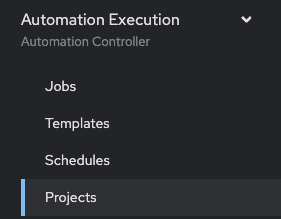

# Exercise 5: Explore Automation controller

**Read this in other languages**:  [English](README.md),   [日本語](README.ja.md),  [Español](README.es.md).

## Índice

* [Objetivo](#objetivo)
* [Guía](#guía)
   * [Paso 1: Entrando en el controlador de Automatización, Automation controller](#paso-1-entrando-en-el-controlador-de-automatización-automation-controller)
   * [Paso 2: Examinar el Inventario del Controlador de Automatización](#paso-2-examinar-el-inventario-del-controlador-de-automatización)
   * [Paso 3: Examinar el Proyecto del Controlador de Automatización](#paso-3-examinar-el-proyecto-del-controlador-de-automatización)
   * [Paso 4: Examinar la Credencial del Controlador de Automatización](#paso-4-examinar-la-credencial-del-controlador-de-automatización)
* [Consejos a recordar](#consejos-a-recordar)
* [Completado](#completado)

## Objetivo

Explorar y comprender el entorno de laboratorio. Este ejecicio se cubrirá:

* Determinar la versión en ejecución de Ansible Automation Platform en el nodo de control
* Ubicar y comprender:
  * El **Inventario** del controlador de Automatización
  * Las **Credentiales** del controlador de Automatización
  * Los **Proyectos** del controlador de Automatización

## Guía

### Paso 1: Entrando en el controlador de Automatización, Automation controller

1.  Vuelve al taller y lanza la página que el instructor te ha indicado.

2.  Haz click en el enlace a la webUI del controlador de Automatización. Deberías ver una pantalla similar a la siguiente:

   Pantallazo de la ventana de entrada al controlador de Automatización.

   * El usuario es `admin`
   * La password se obtiene en la página de inicio

3. Después de haber entrado en el tablero de trabajos "Job" se ve la vista por defecto:

   

4. Haz click en el botón **?** arriba a la derecha y haz click en **About**

   

5. Una ventana aparecerá similar a ésta:

   

### Paso 2: Examinar el Inventario del Controlador de Automatización

Se requiere un inventario para que el controlador de Automatización sea capaz de ejecutar trabajos. Un inventario es una colección de máquinas contra los que ejecutar trabajos, de igual manera que lo es un fichero de inventario de Ansible. Además, el controlador de automatización puede usar una base de datos de gestión de configuración (cmdb) ya existente tales como ServiceNow o Infoblox DDI.

> Nota:
>
> Más información sobre inventarios en el controlador de automatización puede consultarse en la [documentación aquí](https://docs.ansible.com/automation-controller/4.0.0/html/userguide/inventories.html)

1. Haz click en el botón **Inventories** bajo **RESOURCES** en la barra de menú de la izquierda.

    

2. Bajo Inventarios, haz click en `Workshop Inventory`.

    

3. Bajo `Workshop Inventory` haz click en el botón **Hosts** en la parte de arriba.  Aparecerán cuatro hosts, de rtr1 a rtr4 además del nodo de control de ansible control.

   

4. Haz click en alguno de los dispositivos.

   

     Take note of the **VARIABLES** field.  The `host_vars` are set here including the `ansible_host` variable.

5. Haz click en **GROUPS**. Aparecerán múltiples grupos incluyendo `routers` y `cisco`. Haz click en alguno de los grupos.

   

6. Haz click en alguno de los grupos.

   

     Fíjate en el campo **VARIABLES**. Las variables de grupo, `group_vars`, se han definido aquí incluyendo las variables `ansible_connection` y `ansible_network_os`.

### Paso 3: Examinar el Inventario del Controlador de Automatización

A project is how Ansible Playbooks are imported into Automation controller.  You can manage playbooks and playbook directories by either placing them manually under the Project Base Path on your Automation controller server, or by placing your playbooks into a source code management (SCM) system supported by Automation controller, including Git and Subversion.

> Note:
>
> For more information on Projects in Automation controller, please [refer to the documentation](https://docs.ansible.com/automation-controller/latest/html/userguide/projects.html)

1. Click on the **Projects** button under **RESOURCES** on the left menu bar.

   

2. Under **PROJECTS** there will be a `Workshop Project`.  

    

    Note that `GIT` is listed for this project.  This means this project is using Git for SCM.

3. Click on the `Workshop Project`.

  

    Note that Source Control URL is set to [https://github.com/network-automation/toolkit](https://github.com/network-automation/toolkit
)

### Paso 4: Examinar la Credencial del Controlador de Automatización

Credentials are utilized by Automation controller for authentication when launching **Jobs** against machines, synchronizing with inventory sources, and importing project content from a version control system.  For the workshop we need a credential to authenticate to the network devices.

> Note:
>
> For more information on Credentials in Automation controller please [refer to the documentation](https://docs.ansible.com/automation-controller/4.0.0/html/userguide/credentials.html).

1. Click on the **Credentials** button under **Resources** on the left menu bar.

    

2. Under **Credentials** there will be multiple pre-configured credentials, including `Workshop Credential`, `Controller Credential` and the `registry.redhat.io credential`.  Click on the `Workshop Credential`.

    

3. Under the `Workshop Credential` examine the following:

* The **CREDENTIAL TYPE** is a **Machine** credential.
* The **USERNAME** is set to `ec2-user`.
* The **PASSWORD** is blank.
* The **SSH PRIVATE KEY** is already configured, and is **ENCRYPTED**.
  


## Takeaways

* Automation controller needs an inventory to execute Ansible Playbooks again.  This inventory is identical to what users would use with the command line only Ansible project.
* Although this workshop already setup the inventory, importing an existing Ansible Automation inventory is easy.  Check out [this blog post](https://www.ansible.com/blog/three-quick-ways-to-move-your-ansible-inventory-into-red-hat-ansible-tower) for more ways to easily get an existing inventory into Automation controller.
* Automation controller can sync to existing SCM (source control management) including Github.
* Automation controller can store and encrypt credentials including SSH private keys and plain-text passwords.  Automation controller can also sync to existing credential storage systems such as CyberArk and Vault by HashiCorp

## Complete

You have completed lab exercise 5

You have now examined all three components required to get started with Automation controller.  A credential, an inventory and a project.  In the next exercise we will create a job template.

---
[Previous Exercise](../4-resource-module/README.md) | [Next Exercise](../6-controller-job-template/README.md)

[Click here to return to the Ansible Network Automation Workshop](../README.md)
