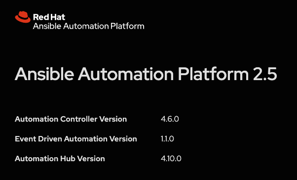
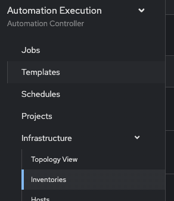
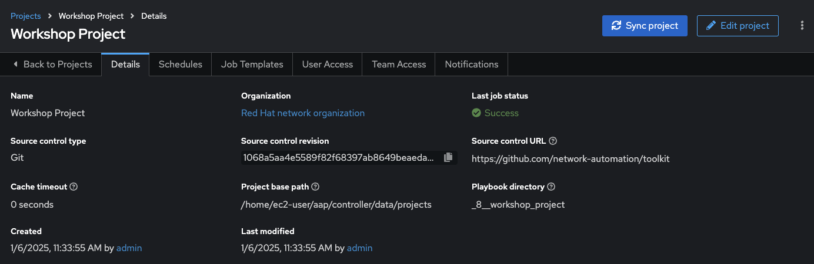

# Exercise 5: Explore Automation controller

**Leálo en otros idiomas**:  [English](README.md),   [日本語](README.ja.md),  [Español](README.es.md).

## Índice

* [Objetivo](#objetivo)
* [Guía](#guía)
   * [Paso 1: Entrando en el controlador de Automatización, Automation controller](#paso-1-entrando-en-el-controlador-de-automatización-automation-controller)
   * [Paso 2: Examinar el Inventario del Controlador de Automatización](#paso-2-examinar-el-inventario-del-controlador-de-automatización)
   * [Paso 3: Examinar el Proyecto del Controlador de Automatización](#paso-3-examinar-el-proyecto-del-controlador-de-automatización)
   * [Paso 4: Examinar la Credencial del Controlador de Automatización](#paso-4-examinar-la-credencial-del-controlador-de-automatización)
* [Consejos a recordar](#consejos-a-recordar)
* [Completado](#completado)

## Objetivo

Explorar y comprender el entorno de laboratorio. Este ejecicio se cubrirá:

* Determinar la versión en ejecución de Ansible Automation Platform en el nodo de control
* Ubicar y comprender:
  * El **Inventario** del controlador de Automatización
  * Las **Credentiales** del controlador de Automatización
  * Los **Proyectos** del controlador de Automatización

## Guía

### Paso 1: Entrando en el controlador de Automatización, Automation controller

1.  Vuelve al taller y lanza la página que el instructor te ha indicado.

2.  Haz click en el enlace a la webUI del controlador de Automatización. Deberías ver una pantalla similar a la siguiente:

   Pantallazo de la ventana de entrada al controlador de Automatización.

   * El usuario es `admin`
   * La password se obtiene en la página de inicio

3. Después de haber entrado en el tablero de trabajos "Jobs" se ve la vista por defecto:

   

4. Haz click en el botón **?** arriba a la derecha y haz click en **About**

   

5. Una ventana aparecerá similar a ésta:

   

### Paso 2: Examinar el Inventario del Controlador de Automatización

Se requiere un inventario para que el controlador de Automatización sea capaz de ejecutar trabajos. Un inventario es una colección de máquinas contra los que ejecutar trabajos, de igual manera que lo es un fichero de inventario de Ansible. Además, el controlador de automatización puede usar una base de datos de gestión de configuración (cmdb) ya existente tales como ServiceNow o Infoblox DDI.

> Nota:
>
> Más información sobre inventarios en el controlador de automatización puede consultarse en la [documentación aquí](https://docs.ansible.com/automation-controller/4.0.0/html/userguide/inventories.html)

1. Haz click en el botón **Inventories** bajo **RESOURCES** en la barra de menú de la izquierda.

    

2. Bajo Inventarios, haz click en `Workshop Inventory`.

    

3. Bajo `Workshop Inventory` haz click en el botón **Hosts** en la parte de arriba.  Aparecerán cuatro hosts, de rtr1 a rtr4 además del nodo de control de ansible control.

   

4. Haz click en alguno de los dispositivos.

   

     Observa el campo **VARIABLES**. Verás que `host_vars` están configuradas, incluyendo la variable `ansible_host`.

5. Haz click en **GROUPS**. Aparecerán múltiples grupos incluyendo `routers` y `cisco`. Haz click en alguno de los grupos.

   

6. Haz click en alguno de los grupos.

   

     Fíjate en el campo **VARIABLES**. Las variables de grupo, `group_vars`, se han definido aquí incluyendo las variables `ansible_connection` y `ansible_network_os`.

### Paso 3: Examinar el Inventario del Controlador de Automatización

Un proyecto es la forma en cómo los Playbooks de Ansible se importan en el controlador de Automatización. Se pueden gestionar playbooks y directorios de playbooks poniéndolos manualmente bajo el path base al proyecto en el servidor del controlador de Automatización, or poniendo los playbooks en un gestor de código fuente (SCM) soportado por controlador de Automatización, incluyendo Git y Subversion.

> Nota:
>
> Más información sobre proyectos en el controlador de automatización puede consultarse en la [documentación aquí](https://docs.ansible.com/automation-controller/latest/html/userguide/projects.html)

1. Haz click en el botón **Projects** bajo **RESOURCES** en el menú de la izquierda.

   

2. Bajo **PROJECTS** aparecerá `Workshop Project`.  

    

    Observa que `GIT` aparece listado para este proyecto. Esto significa que este proyecto está usando Git como SCM.

3. Haz click en `Workshop Project`.

  

    Observa que la URL de "Source Control" está configurada como [https://github.com/network-automation/toolkit](https://github.com/network-automation/toolkit)

### Paso 4: Examinar la Credencial del Controlador de Automatización

Las credenciales son utilizadas por el controlador de automatización para autenticar cuando se lanzan los trabajos (**Jobs**) contra las máquinas, sincronizándose con fuentes de inventarios e importando el contenido de los proyectos desde un sistema de control de versiones. Para este taller, necesitamos una credencial para autenticar los dispositivos de red.

> Nota:
>
> Más información sobre credenciales en el controlador de automatización puede consultarse en la [documentación aquí](https://docs.ansible.com/automation-controller/4.0.0/html/userguide/credentials.html).

1. Haz click en el botón **Credentials** bajo **Resources** en el menú de la izquierda.

    

2. Bajo **Credentials** se mostrarán múltiples credenciales pre configuradas, incluyendo `Workshop Credential`, `Controller Credential` y la credencial `registry.redhat.io credential`. Haz click en `Workshop Credential`.

    

3. Bajo `Workshop Credential` examina lo siguiente:

* **CREDENTIAL TYPE** es credencial de tipo máquina (**Machine**).
* **USERNAME** está configurado como `ec2-user`.
* **PASSWORD** está en blanco.
* **SSH PRIVATE KEY** ya está configurada y está encriptada (**ENCRYPTED**).
  


## Consejos a recordar

* El controlador de automatización necesita un inventario para poder ejecutar Playbooks de Ansible. Este inventario es idéntico al que se usa para proyectos de Ansible de línea de comandos.
* Aunque en este taller el inventario estaba configurado, importarlo de un de un inventario ya existente de Ansible es fácil. Puedes leer [este blog post](https://www.ansible.com/blog/three-quick-ways-to-move-your-ansible-inventory-into-red-hat-ansible-tower) para aprender otras formas fáciles de importar un inventario en el controlador de Automatización.
* El controlador de Automatización se puede sincronizar con un gestor de control de código fuente (SCM), Github incluído.
* El controlador de Automatización puede almacenar y encriptar credenciales, incluyendo claves privadas SSH y claves en texto plano. El controlador de Automatización puede igualmente, sincronizarse con sistemas existentes de almacenamiento de credenciales, tales como CyberArk y Vault de HashiCorp.

## Completado

¡Felicidades, has completado el ejercicio de laboratorio 5!

Ahora ya has examinando los tres componentes requeridos para comenzar a trabajar con el controlador de Automatización. Una credencial, un inventario y un proyecto. En el siguiente ejercicio crearemos una plantilla de trabajo (job template).

---
[Ejercicio Anterior](../4-resource-module/README.es.md) | [Próximo ejercicio](../6-controller-job-template/README.es.md)

[Haz click aquí para volver al taller Ansible Network Automation](../README.es.md)
