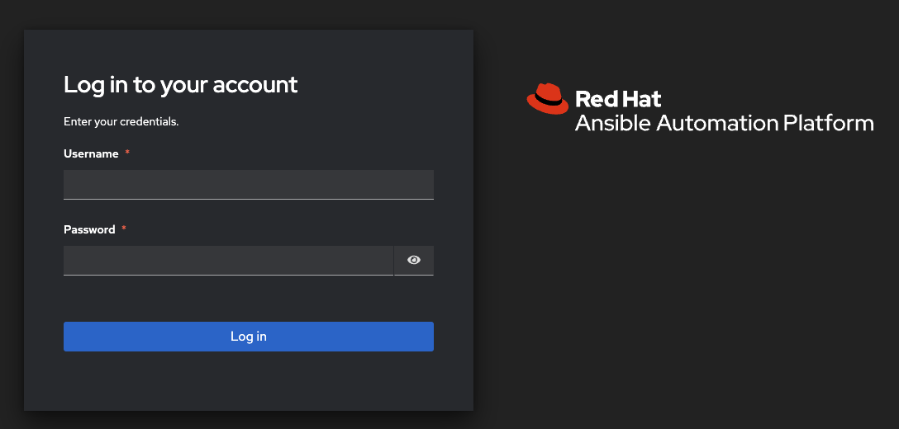
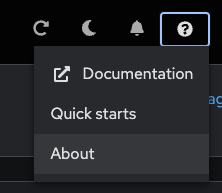
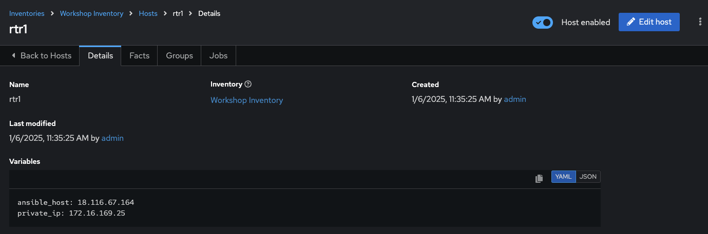
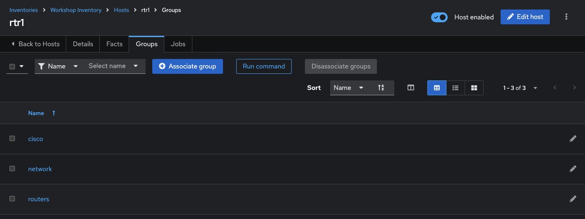

# Exercice 5 : Exploration de la Plateforme d’Automatisation Ansible

**Lisez ceci dans d'autres langues** :  [English](README.md),  [日本語](README.ja.md),  [Español](README.es.md),  [Français](README.fr.md).

## Table des matières

- [Exercice 5 : Exploration de la Plateforme d’Automatisation Ansible](#exercice-5--exploration-de-la-plateforme-dautomatisation-ansible)
  - [Table des matières](#table-des-matières)
  - [Objectif](#objectif)
  - [Guide](#guide)
    - [Étape 1 : Connexion à la Plateforme d’Automatisation Ansible](#étape-1--connexion-à-la-plateforme-dautomatisation-ansible)
    - [Étape 2 : Examiner l'Inventaire de la Plateforme d’Automatisation Ansible](#étape-2--examiner-linventaire-de-la-plateforme-dautomatisation-ansible)
    - [Étape 3 : Examiner le Projet de la Plateforme d’Automatisation Ansible](#étape-3--examiner-le-projet-de-la-plateforme-dautomatisation-ansible)
    - [Étape 4 : Examiner les Informations d’identification de la Plateforme d’Automatisation Ansible](#étape-4--examiner-les-informations-didentification-de-la-plateforme-dautomatisation-ansible)
  - [Points Clés](#points-clés)
  - [Conclusion](#conclusion)

## Objectif

Explorer et comprendre l'environnement de laboratoire. Cet exercice couvrira :

* Déterminer la version de la Plateforme d’Automatisation Ansible sur le nœud de contrôle
* Localiser et comprendre :
  * **Inventaire**
  * **Informations d’identification**
  * **Projets**

## Guide

### Étape 1 : Connexion à la Plateforme d’Automatisation Ansible

1. Revenez à la page de lancement de l'atelier fournie par votre instructeur.

2. Cliquez sur le lien vers l'interface Web de la Plateforme d’Automatisation Ansible. Vous devriez voir un écran de connexion similaire à ceci :

   

   * Le nom d'utilisateur est `admin`
   * Le mot de passe est fourni sur la page de lancement

3. Après la connexion, le tableau de bord des jobs sera affiché par défaut comme ci-dessous.

   

4. Cliquez sur le bouton **?** en haut à droite de l'interface utilisateur, puis cliquez sur **À propos**.

   

5. Une fenêtre pop-up apparaîtra avec les informations de version.

   

### Étape 2 : Examiner l'Inventaire de la Plateforme d’Automatisation Ansible

Un inventaire est requis pour que la Plateforme d’Automatisation Ansible puisse exécuter des jobs. Un inventaire est une collection d'hôtes contre lesquels les jobs peuvent être lancés, semblable à un fichier d'inventaire Ansible. En outre, la plateforme peut utiliser une base de données de gestion de configuration (CMDB) existante comme ServiceNow ou Infoblox DDI.

> Note :
>
> Pour plus d'informations sur les inventaires dans la Plateforme d’Automatisation Ansible, consultez [la documentation ici](https://docs.redhat.com/en/documentation/red_hat_ansible_automation_platform/latest/html/automation_controller_user_guide/controller-inventories)

1. Cliquez sur le lien **Infrastructure** sous **Automation Execution** dans la barre de menu à gauche, puis cliquez sur le lien **Inventaires**.

   

2. Sous Inventaires, cliquez sur `Workshop Inventory`.

   

3. Sous `Workshop Inventory`, cliquez sur le bouton **Hôtes** en haut. Il y aura quatre hôtes ici, de `rtr1` à `rtr4`, ainsi que le nœud de contrôle Ansible.

   

4. Cliquez sur l'un des dispositifs.

   

   Prenez note du champ **VARIABLES**. Les `host_vars` sont définis ici, y compris la variable `ansible_host`.

5. Cliquez sur **GROUPES**. Il y aura plusieurs groupes ici, y compris `routers` et `cisco`. Cliquez sur l'un des groupes.

   

6. Cliquez sur l'un des groupes.

   

   Prenez note du champ **VARIABLES**. Les `group_vars` sont définis ici, y compris les variables `ansible_connection` et `ansible_network_os`.

### Étape 3 : Examiner le Projet de la Plateforme d’Automatisation Ansible

Un projet permet d’importer des playbooks dans la Plateforme d’Automatisation Ansible. Vous pouvez gérer les playbooks et les répertoires de playbooks en les plaçant manuellement sous le chemin de base des projets sur votre serveur de Plateforme d’Automatisation Ansible, ou en les plaçant dans un système de gestion de code source (SCM) pris en charge par la plateforme, notamment Git (GitHub, GitLab, etc.).

> Note :
>
> Pour plus d'informations sur les Projets dans la Plateforme d’Automatisation Ansible, veuillez [consulter la documentation](https://docs.redhat.com/en/documentation/red_hat_ansible_automation_platform/latest/html/using_automation_execution/controller-projects)

1. Cliquez sur le lien **Projets** sous **Automation Execution** dans la barre de menu à gauche.

   

2. Sous **PROJETS**, il y aura un `Workshop Project`.

   

   Notez que `GIT` est indiqué pour ce projet. Cela signifie que ce projet utilise Git pour la gestion du code source.

3. Cliquez sur `Workshop Project`.

   

   > Note :
   > L’URL de contrôle source est configurée sur [https://github.com/network-automation/toolkit](https://github.com/network-automation/toolkitcredentials.html).

### Étape 4 : Examiner les Informations d’identification de la Plateforme d’Automatisation Ansible

Les identifiants sont utilisés par la Plateforme d’Automatisation Ansible pour l’authentification lors du lancement de **Jobs** sur des machines, de la synchronisation avec des sources d'inventaire et de l'importation de contenu de projet à partir d'un système de contrôle de version. Pour l'atelier, nous avons besoin d'un identifiant pour nous authentifier aux dispositifs réseau.

> **Note :**
>
> Pour plus d'informations sur les Informations d’identification dans la Plateforme d’Automatisation Ansible, veuillez [consulter la documentation](https://docs.redhat.com/en/documentation/red_hat_ansible_automation_platform/latest/html/automation_controller_user_guide/controller-credentials).

1. Cliquez sur le lien **Infrastructure** sous **Automation Execution** dans la barre de menu à gauche, puis cliquez sur le lien **Informations d’identification**.

    

2. Sous **Informations d’identification**, plusieurs identifiants préconfigurés sont présents, notamment `Workshop Credential`, `Controller Credential` et l’identifiant `registry.redhat.io`. Cliquez sur `Workshop Credential`.

    

3. Sous `Workshop Credential`, examinez les éléments suivants :

* Le **Type d'identifiant** est un identifiant de **Machine**.
* Le **Nom d'utilisateur** est configuré sur `ec2-user`.
* La **Clé SSH Privée** est déjà configurée et est **Chiffrée**.

## Points Clés

- **Plateforme d'Automatisation Ansible** a besoin d'un **inventaire** pour exécuter des Playbooks Ansible. Cet inventaire est identique à celui utilisé dans les projets Ansible en ligne de commande.
- La plateforme peut synchroniser des projets avec un SCM existant tel que GitHub.
- Elle peut également stocker et chiffrer des identifiants, notamment des clés privées SSH et des mots de passe en clair. La plateforme peut aussi se synchroniser avec des systèmes de gestion des identifiants existants comme CyberArk et Vault de HashiCorp.

## Conclusion

Vous avez complété l'exercice 5.

Vous avez maintenant examiné les trois composants nécessaires pour démarrer avec la Plateforme d'Automatisation Ansible : un **identifiant**, un **inventaire** et un **projet**. Dans le prochain exercice, nous créerons un modèle de travail.

---
[Exercice précédent](../4-resource-module/README.fr.md) | [Exercice suivant](../6-controller-job-template/README.fr.md)

[Retour à l'atelier d'automatisation réseau Ansible](../README.fr.md)

