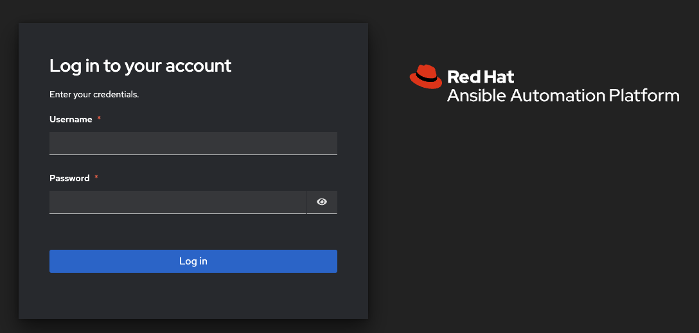
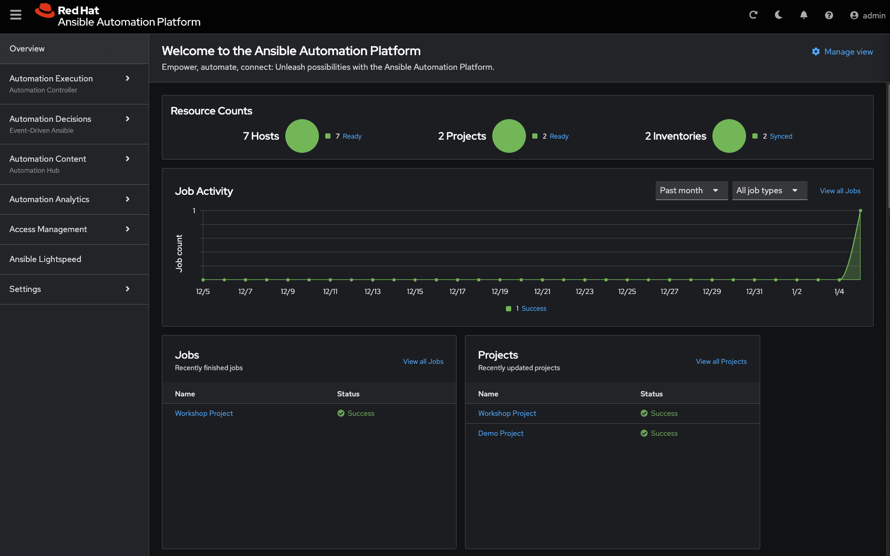
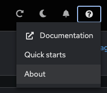
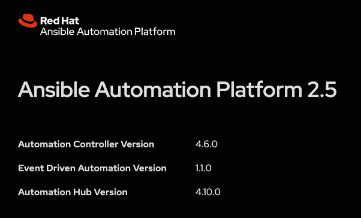
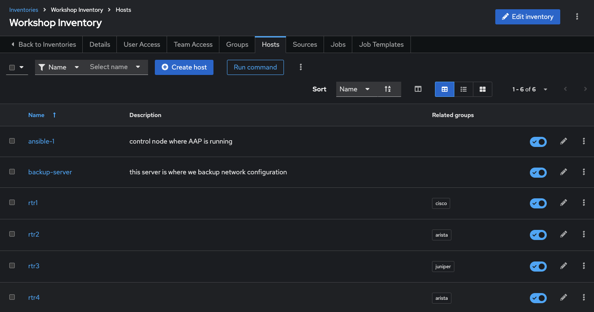
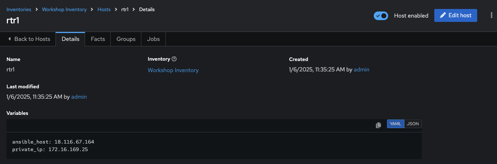
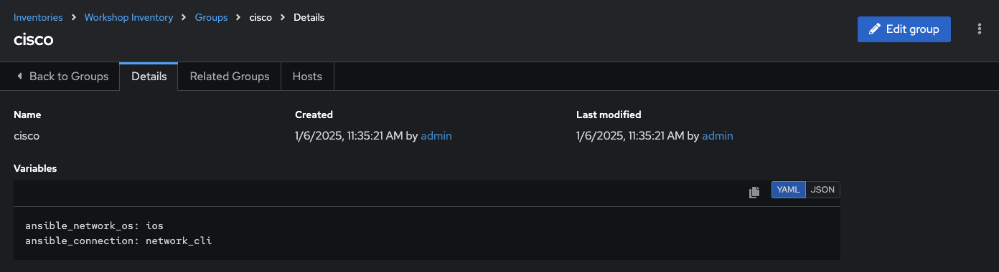
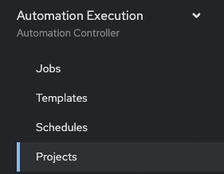
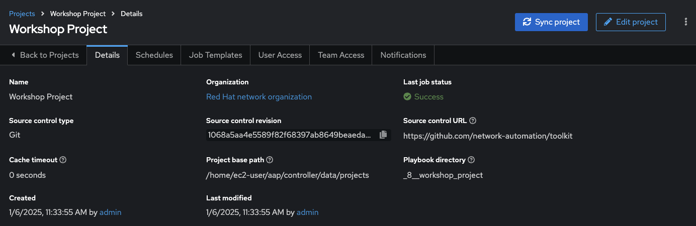
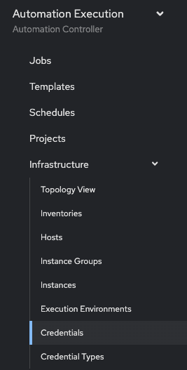

# Exercise 5: Explore Automation controller

**Read this in other languages**:  [English](README.md),   [日本語](README.ja.md).

## Table of Contents

* [Objective](#objective)
* [Guide](#guide)
   * [Step 1: Login to Automation controller](#step-1-login-to-automation-controller)
   * [Step 2: Examine the Automation controller Inventory](#step-2-examine-the-automation-controller-inventory)
   * [Step 3: Examine the Automation controller Workshop Project](#step-3-examine-the-automation-controller-workshop-project)
   * [Step 4: Examine the Automation controller Workshop Credential](#step-4-examine-the-automation-controller-workshop-credential)
* [Takeaways](#takeaways)
* [Complete](#complete)

## Objective

Explore and understand the lab environment.  This exercise will cover

* Determining the Ansible Automation Platform version running on the control node
* Locating and understanding:
  * Automation controller **Inventory**
  * Automation controller **Credentials**
  * Automation controller **Projects**

## Guide

### Step 1: Login to Automation controller

1.  Return to the workshop launch page provided by your instructor.

2.  Click on the link to the Automation controller webUI.  You should see a login screen similar to the follow:

   Screenshot of Automation controller login window.

   * The username will be `admin`
   * password provided on launch page

3. After logging in the Job Dashboard will be the default view as shown below.

   

4. Click on the **?** button on the top right of the user interface and click **About**

   

5. A window will pop up similar to the following:

   

   Take note that both the Automation controller version and the Ansible Engine version are provided here.

### Step 2: Examine the Automation controller Inventory

An inventory is required for Automation controller to be able to run jobs.  An inventory is a collection of hosts against which jobs may be launched, the same as an Ansible inventory file. In addition, Automation controller can make use of an existing configuration management data base (cmdb) such as ServiceNow or Infoblox DDI.

> More info on Inventories in respect to Automation controller can be found in the [documentation here](https://docs.ansible.com/automation-controller/4.0.0/html/userguide/inventories.html)

1. Click on the **Inventories** button under **RESOURCES** on the left menu bar.

    

2. Under Inventories there will be two inventories, the `Demo Inventory` and the `Workshop Inventory`.  Click on the `Workshop Inventory`.

    

3. Under the `Workshop Inventory` click the **Hosts** button at the top.  There will be four hosts here, rtr1 through rtr4 as well as the ansible control node.  

   

4. Click on one of the devices.

   

     Take note of the **VARIABLES** field.  The `host_vars` are set here including the `ansible_host` variable.

5. Click on **GROUPS**.  There will be multiple groups here including `routers` and `cisco`.  Click on one of the groups.

   

6. Click on one of the groups.

   

     Take note of the **VARIABLES** field. The `group_vars` are set here including the `ansible_connection` and `ansible_network_os` variable.

### Step 3: Examine the Automation controller Workshop Project

A project is how Ansible Playbooks are imported into Automation controller.  You can manage playbooks and playbook directories by either placing them manually under the Project Base Path on your Automation controller server, or by placing your playbooks into a source code management (SCM) system supported by Automation controller, including Git and Subversion.

> For more information on Projects in Automation controller, please [refer to the documentation](https://docs.ansible.com/automation-controller/latest/html/userguide/projects.html)

1. Click on the **Projects** button under **RESOURCES** on the left menu bar.

   

2. Under **PROJECTS** there will be two pre-configured projects, `Ansible official demo project` and the `Workshop Project`.  

    

    Note that `GIT` is listed for this project.  This means this project is using Git for SCM.

3. Click on the `Workshop Project`.

  

    Note that Source Control URL is set to [https://github.com/network-automation/toolkit](https://github.com/network-automation/toolkit
)

### Step 4: Examine the Automation controller Workshop Credential

Credentials are utilized by Automation controller for authentication when launching **Jobs** against machines, synchronizing with inventory sources, and importing project content from a version control system.  For the workshop we need a credential to authenticate to the network devices.

> For more information on Credentials in Automation controller please [refer to the documentation](https://docs.ansible.com/automation-controller/4.0.0/html/userguide/credentials.html).

1. Click on the **Credentials** button under **Resources** on the left menu bar.

    

2. Under **Credentials** there will be multiple pre-configured credentials, including `Workshop Credential`, `Controller Credential` and the `registry.redhat.io credential`.  Click on the `Workshop Credential`.

    

3. Under the `Workshop Credential` examine the following:

* The **CREDENTIAL TYPE** is a **Machine** credential.
* The **USERNAME** is set to `ec2-user`.
* The **PASSWORD** is blank.
* The **SSH PRIVATE KEY** is already configured, and is **ENCRYPTED**.

## Takeaways

* Automation controller needs an inventory to execute Ansible Playbooks again.  This inventory is identical to what users would use with the command line only Ansible project.
* Although this workshop already setup the inventory, importing an existing Ansible Automation inventory is easy.  Check out [this blog post](https://www.ansible.com/blog/three-quick-ways-to-move-your-ansible-inventory-into-red-hat-ansible-tower) for more ways to easily get an existing inventory into Automation controller.
* Automation controller can sync to existing SCM (source control management) including Github.
* Automation controller can store and encrypt credentials including SSH private keys and plain-text passwords.  Automation controller can also sync to existing credential storage systems such as CyberArk and Vault by HashiCorp

## Complete

You have completed lab exercise 5

You have now examined all three components required to get started with Automation controller.  A credential, an inventory and a project.  In the next exercise we will create a job template.

---
[Previous Exercise](../4-resource-module/README.md) | [Next Exercise](../6-controller-job-template/README.md)

[Click here to return to the Ansible Network Automation Workshop](../README.md)
