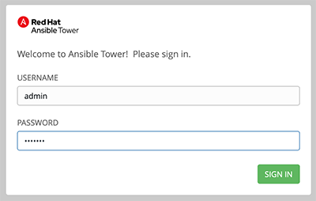

# Exercise 5: Ansible Tower 環境の確認

**別の言語で読む**:  [English](README.md),   [日本語](README.ja.md).

## Table of Contents

- [Objective](#objective)
- [Guide](#guide)
   - [Step 1: Login to Ansible Tower](#step-1-login-to-ansible-tower)
   - [Step 2: Examine the Ansible Tower Inventory](#step-2-examine-the-ansible-tower-inventory)
   - [Step 3: Examine the Ansible Tower Workshop Project](#step-3-examine-the-ansible-tower-workshop-project)
   - [Step 4: Examine the Ansible Tower Workshop Credential](#step-4-examine-the-ansible-tower-workshop-credential)
- [Takeaways](#takeaways)

# Objective

演習環境を確認します。本演習は以下を含みます。
- コントローラーノード上の Ansible バージョンを確認します。
- 以下について確認します:
  - Ansible Tower の **インベントリー**
  - Ansible Tower の **クレデンシャル**
  - Ansible Tower の **プロジェクト**

# Guide

## Step 1: Login to Ansible Tower

ブラウザでコントローラーノードのDNS名にアクセスしてください。

>例えば、受講者に作業環境 student1 が割り当てられており、ワークショップ名が `durham-workshop` の場合にリンクは以下になります:

    **https://student1.durham-workshop.rhdemo.io**

>このログイン情報はワークショップの開始時に講師から提供されています。

- ユーザー名は `admin`
- パスワードは講師から提供されます。

ログインすると、以下のようなジョブダッシュボードがデフォルトで表示されます。

1.  画面右上の **i** ボタンをクリックします。

    

2.  以下のようなウインドウがポップアップします:

    

    ここで Ansible Tower と Ansible Engine のバージョンを確認することができます。

## Step 2: Examine the Ansible Tower Inventory

Ansible Tower でジョブを実行するためにはインベントリーが必要となります。インベントリーは先の演習で登場したインベントリーフェイルと同様のもので、ジョブの実行対象となるホストの一覧です。また、Red Hat Ansible Tower では、ServiceNow や Infoblox DDI のような構成管理データベース（CMDB）と連携することも可能です。

>Ansible Tower のインベントリーに関する詳細情報は [documentation](https://docs.ansible.com/ansible-tower/latest/html/userguide/inventories.html) から参照できます。

1. 左側のメニューから **RESOURCES** の下の **Inventories** をクリックします。

    

2. インベントリーには `Demo Inventory` と `Workshop Inventory` の2つがあるはずです。`Workshop Inventory` をクリックします。

    

3. `Workshop Inventory` から上部の **HOSTS** ボタンを選択します。ここには rtr1 から rtr4 のホストが登録されています。1つのデバイスをクリックしてください。

     **VARIABLES** フィールドに注目してください。`ansible_host` 変数を含めて `host_vars`はここに設定されています。

4. 画面上部の `Workshop Inventory` リンクをクリックしてトップレベルメニューへと戻ります。

    

5. 次に **GROUPS** を選択します。`routers` や `cisco` などの複数のグループが確認できるはずです。1つのグループをクリックします。

     **VARIABLES** フィールドに注目してください。 `ansible_connection` や `ansible_network_os` 変数といった `group_vars` はここに設定されています。

ここでのチュートリアル動画は以下になります:

Youtube でも確認できます  [Click Here](https://youtu.be/4JNbFNSUS9g)

## Step 3: Examine the Ansible Tower Workshop Project

プロジェクトは Ansible Tower に Playbook をどのようにインポートするかを定義します。Playbook と関連するディレクトリを手動で Ansible Tower Server 上で管理することもできますし、Playbook を格納した Git や Subversion、Merucial のようなソースコード管理システム(SCM)を利用することも可能です。

> プロジェクトに関するより詳細な情報は [documentation](https://docs.ansible.com/ansible-tower/latest/html/userguide/projects.html) を参照してください。

1. 左メニューバーの **RESOURCES** の下の **Projects** ボタンをクリックします。

    

2. **PROJECTS** には事前設定された2つのプロジェクト `Demo Project` と `Workshop Project` があるはずです。ここでは `Workshop Project` を選択します。

    

    このプロジェクトでは `GIT` が選択されていることに注目してください。これは、このプロジェクトにおいてSCMとしてGITが利用されることを意味します。

3. `Workshop Project` の中からドロップダウンメニューの **SCM TYPE** をクリックします。

    Git や Mercurial、Subversion などが選択できることを確認します。このあとの演習を正しく進めるために、選択は Git へと戻しておいてください。

Youtube でも確認できます  [Click Here](https://youtu.be/xRA97XTxMjA)

## Step 4: Examine the Ansible Tower Workshop Credential

クレデンシャルは認証情報を管理し、 Tower での **Jobs** を起動する時の対象マシンに対してやインベントリーソースの同期、SCMを使ったプロジェクトの同期に利用されます。このワークショップでは、ネットワークデバイスへの認証にクレデンシャルが必要になります。

> クレデンシャルに関するより詳細な情報は [documentation](https://docs.ansible.com/ansible-tower/latest/html/userguide/credentials.html) を参照してください。

1. 左メニューバーの **RESOURCES** の下の **Credentials** ボタンをクリックします。

    

2. **CREDENTIALS** には事前設定された3つのクレデンシャル `Demo Credential`、`Tower Credntial` と `Workshop Credentials` があるはずです。ここでは `Workshop Credential` を選択します。

    

3. `Workshop Credential` の以下を確認してください:
    - **CREDENTIAL TYPE** は **Machine** に設定されています。
    - **USERNAME** には `ec2-user` が入力されています。
    - **PASSWORD** はブランクです。
    - **SSH PRIVATE KEY** は設定されており、**ENCRYPTED** と隠蔽されています。

Youtube でも確認できます [Click Here](https://youtu.be/UT0t_hlNw-c)

# Takeaways

- Ansible Tower は Playbook を実行するのにインベントリーが必要になります。このインベントリーは、コマンドラインからPlaybookを実行したときのものと同じです。
- この演習では Tower のインベントリーは事前設定されていましたが、既存のコマンドライン用インベントリーをインポートすることも簡単です。[こちらの blog ](https://www.ansible.com/blog/three-quick-ways-to-move-your-ansible-inventory-into-red-hat-ansible-tower) ではいくつかの既存インベントリーを Ansible Tower へインポートする方法が紹介されています。
- Ansible Tower は GitHub などの既存SCM(ソースコード管理システム)と同期することが可能です。
- Ansible Tower は SSH秘密鍵やログイン用パスワードを暗号化して保存することが可能です。その他にも、CyberArk や HashiCorp の Vault など、既存の認証情報管理システムと連携することも可能です。

---

# Complete

以上で exercise 5 は終了です。

これで Ansible Tower を利用するために必要な3つのコンポーネント（クレデンシャル、インベントリー、プロジェクト）を確認できました。次の演習ではジョブテンプレートを作成していきます。

[Click here to return to the Ansible Network Automation Workshop](../README.ja.md)
