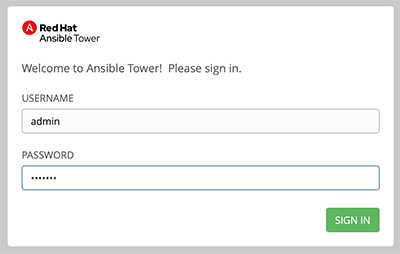

# Exercise 5: Explore Red Hat Ansible Tower

## Table of Contents

- [Objective](#objective)
- [Guide](#guide)
- [Takeaways](#takeaways)

# Objective

Explore and understand the lab environment.  This exercise will cover
- Determining the Ansible version running on the control node
- Locating and understanding the Ansible Tower **Inventory**
- Locating and understanding the Ansible Tower **Credentials**
- Locating and understanding the Ansible Tower **Projects**

# Guide

#### Step 1: Login to Ansible Tower

Open up your web browser and type in the Ansible control node's DNS name

>For example if the student was assigned the student1 workbench and the workshop name was `durham-workshop`
`https://student1.durham-workshop.rhdemo.io`

>This login information has been provided by the instructor at the beginning of class.

- The username will be `admin`
- password provided by instructor

After logging in the Job Dashboard will be the default view as shown below.

#### Step 2: Examine the Ansible Tower Inventory

An inventory is required for Red Hat Ansible Tower to be able to run jobs.  An inventory is a collection of hosts against which jobs may be launched, the same as an Ansible inventory file. In addition, Red Hat Ansible Tower can make use of an existing configuration management data base (cmdb) such as ServiceNow or Infoblox DDI.

>More info on Inventories in respect to Ansible Tower can be found in the [documentation here](https://docs.ansible.com/ansible-tower/latest/html/userguide/inventories.html)

1. Click on the **Inventories** button under **Resources** on the left menu bar.  

    

2. Under Inventories there will be two inventories, the `Demo Inventory` and the `Workshop Inventory`.  Click on the `Workshop Inventory`.  

    

3. Under the `Workshop Inventory` click the **HOSTS** button at the top.  There will be four hosts here, rtr1 through rtr4 as well as the ansible control node.  Click on one of the devices.

     Take note of the **VARIABLES** field.  The `host_vars` are set here including the `ansible_host` variable.

4. Click on the `Workshop Inventory` link at the top of the page to return the top level menu.

    

5. Click on **GROUPS**.  There will be multiple groups here including `routers` and `cisco`.  Click on one of the groups.

     Take note of the **VARIABLES** field. The `group_vars` are set here including the `ansible_connection` and `ansible_network_os` variable.

Here is a walkthrough:

Prefer Youtube?  [Click Here](https://youtu.be/4JNbFNSUS9g)

## Step 3: Setting up a Project

A project is how actually Playbooks are imported into Red Hat Ansible Tower.  You can manage playbooks and playbook directories by either placing them manually under the Project Base Path on your Tower server, or by placing your playbooks into a source code management (SCM) system supported by Tower, including Git, Subversion, Mercurial, and Red Hat Insights.  

> For more information on Projects in Tower, please [refer to the documentation](https://docs.ansible.com/ansible-tower/latest/html/userguide/projects.html)

For this exercise we are going to use an already existing Github repository and turn it into a project in Tower.  Click on the Projects link on the left menu.

In the Ansible Tower UI there will be two projects.  In addition to the default `Demo Project` a new `Workshop Project` will appear.

## Step 4: Setting up a Credential

Credentials are utilized by Tower for authentication when launching Jobs against machines, synchronizing with inventory sources, and importing project content from a version control system.  For the workshop we need a credential to authenticate to the network devices.

> For more information on Credentials in Tower please [refer to the documentation](https://docs.ansible.com/ansible-tower/latest/html/userguide/credentials.html).

In the Tower UI, click on the Credentials link on the left menu.  

Click the green `+` button to create a new credential.

| Parameter | Value |
|---|---|
| Name  | Workshop Credential  |
| Organization |  Default |
| Credential Type |  Machine |
| SSH Private Key |  value from `~/.ssh/aws-private.pem` |

Click the green save button.

In addition to the default `Demo Credential` a new `Workshop Credential` will appear.

## End of Exercise

You have now setup all 3 components required to get started with Ansible Tower.  A credential, an inventory and a Project.  In the next exercise we will create a job template.

---
[Click Here to return to the Ansible - Network Automation Workshop](../../README.md)

---
[Click Here to return to the Ansible - Network Automation Workshop](../../README.md)
