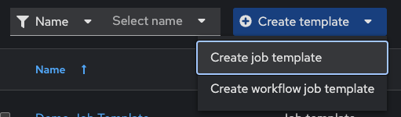
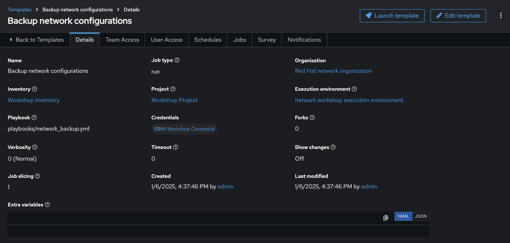
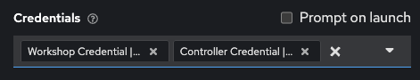
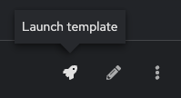

# Exercice 6 : Création d’un Modèle de job sur la Plateforme d'Automatisation Ansible

**Lisez ceci dans d'autres langues** :  [English](README.md),  [日本語](README.ja.md),  [Español](README.es.md),  [Français](README.fr.md).

## Table des matières

- [Exercice 6 : Création d’un modèle de job sur la Plateforme d'Automatisation Ansible](#exercice-6--création-d’un-modèle-de-job-sur-la-plateforme-dautomatisation-ansible)
  - [Table des matières](#table-des-matières)
  - [Objectif](#objectif)
  - [Guide](#guide)
    - [Étape 1 : Créer un modèle de job](#étape-1--créer-un-modèle-de-job)
    - [Étape 2 : Lancer le modèle de job](#étape-2--lancer-le-modèle-de-job)
    - [Étape 3 : Examiner le Job](#étape-3--examiner-le-job)
    - [Étape 4 : Examiner la Fenêtre des Jobs](#étape-4--examiner-la-fenêtre-des-jobs)
    - [Étape 5 : Vérifier que les Sauvegardes ont été créées](#étape-5--vérifier-que-les-sauvegardes-ont-été-créées)
  - [Points Clés](#points-clés)
  - [Conclusion](#conclusion)

## Objectif

Démontrer un modèle de job de sauvegarde de configuration réseau avec la Plateforme d'Automatisation Ansible. Ce modèle sauvegardera la configuration en cours des quatre routeurs et les stockera sous `/backup` sur le nœud de contrôle avec un horodatage.

Pour exécuter un Playbook Ansible dans le Contrôleur d'Automatisation, nous devons créer un **Modèle de Job**. Un **Modèle de Job** requiert :

* Un **Inventaire** pour exécuter le travail sur les hôtes
* Un **Identifiant** pour se connecter aux dispositifs
* Un **Projet** contenant les Playbooks Ansible

## Guide

### Étape 1 : Créer un modèle de job

* Ouvrez l’interface Web et cliquez sur le lien `Modèles` dans le menu à gauche sous la section **Automation Execution**.

   

* Cliquez sur le bouton bleu **Ajouter** pour créer un nouveau modèle.

   

> **Note :**
>
> Assurez-vous de sélectionner `modèle de job` et non `modèle de flux de travail`.

* Remplissez les paramètres du modèle de job comme suit :

  | Paramètre | Valeur |
  |---|---|
  | Nom  | Sauvegarder les configurations réseau  |
  | Type de Job | Exécuter |
  | Inventaire | Workshop Inventory |
  | Projet | Workshop Project |
  | Environnement d'Exécution | network workshop execution environment |
  | Playbook | playbooks/network_backup.yml |
  | Identifiant | Workshop Credential |

Capture d’écran des paramètres du modèle de job remplis :
   

* Ajoutez un deuxième identifiant au modèle de job.

   L’identifiant **Controller Credential** doit également être ajouté à ce modèle de job particulier. Cela permet au Contrôleur d'Automatisation de mettre à jour dynamiquement le pool de sauvegardes que le modèle **Network-Restore** utilisera. Le Contrôleur d'Automatisation peut être mis à jour de manière programmée avec des modèles de travail pour ajouter ou mettre à jour les configurations. Sélectionnez le second identifiant :

  

* Faites défiler la page vers le bas et cliquez sur le bouton bleu `Enregistrer`.

### Étape 2 : Lancer le modèle de job

1. Revenez à la fenêtre des `Modèles` sous la section Automation Execution, où tous les modèles de travail sont listés.

2. Lancez le modèle de job `Sauvegarder les configurations réseau` en cliquant sur le bouton en forme de fusée.

    

    Lorsque le bouton fusée est cliqué, cela lance le travail. Le travail s’ouvre dans une nouvelle fenêtre appelée la **Vue Détails du Job**. Plus d’informations sur les <a target="_blank" href="https://docs.redhat.com/en/documentation/red_hat_ansible_automation_platform/latest/html/automation_controller_user_guide/controller-jobs">jobs du Contrôleur d'Automatisation</a> peuvent être trouvées dans la documentation.

### Étape 3 : Examiner le Job

Après avoir exécuté le modèle de job, la [fenêtre Standard Out](https://docs.ansible.com/automation-controller/latest/html/userguide/jobs.html#standard-out) s’ouvre automatiquement.


1. Examinez la **Fenêtre Standard Out**.

   La fenêtre Standard Out affichera la sortie du Playbook Ansible. Chaque sortie de tâche correspondra exactement à ce qui serait vu en ligne de commande.

2. Cliquez sur une tâche dans la **Fenêtre Standard Out** pour ouvrir la sortie structurée de cette tâche particulière.

   > Cliquez sur n’importe quelle ligne où il y a un statut **changed** ou **ok**.

   

3. Cliquez sur l’onglet **Détails** pour ouvrir la **Fenêtre Détails**.

   La **Fenêtre Détails** affiche des informations telles que l’horodatage du début et de la fin du travail, le type de travail (Vérification ou Exécution), les identifiants utilisés et les journaux.

### Étape 4 : Examiner la Fenêtre des Jobs

1. Revenez au menu principal et cliquez sur `Jobs` sous **Automation Execution**.

   

2. Cliquez sur l’un des jobs listés.

   

3. Examinez les détails du travail, y compris l’état, la durée et les journaux associés.

### Étape 5 : Vérifier que les Sauvegardes ont été créées

1. Connectez-vous au nœud de contrôle Ansible via SSH.

   ```bash
   $ ssh student@ansible-1
   ```

2. Naviguez vers le répertoire `/backup`.

   ```bash
   $ cd /backup
   ```

3. Listez les fichiers pour vérifier les sauvegardes créées.

   ```bash
   $ ls -l
   ```

   Vous devriez voir des fichiers avec les configurations sauvegardées des routeurs.

## Points Clés

- Un **Modèle de Job** dans la Plateforme d'Automatisation Ansible combine un inventaire, un projet, un identifiant et un playbook.
- Les modèles de travail permettent d'automatiser les configurations réseau et les sauvegardes de manière centralisée.
- Les journaux et sorties structurées permettent une analyse approfondie des exécutions.

## Conclusion

Vous avez complété l'exercice 6.

Dans le prochain exercice, nous explorerons les Modèles de Job REST API.

---
[Exercice précédent](../5-explore-controller/README.fr.md) | [Exercice suivant](../7-controller-survey/README.fr.md)

[Retour à l'atelier d'automatisation réseau Ansible](../README.fr.md)

