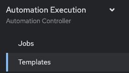
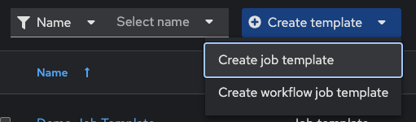
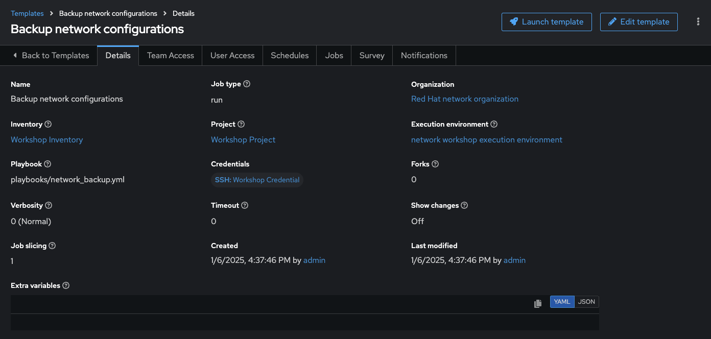
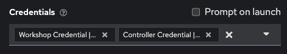
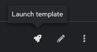
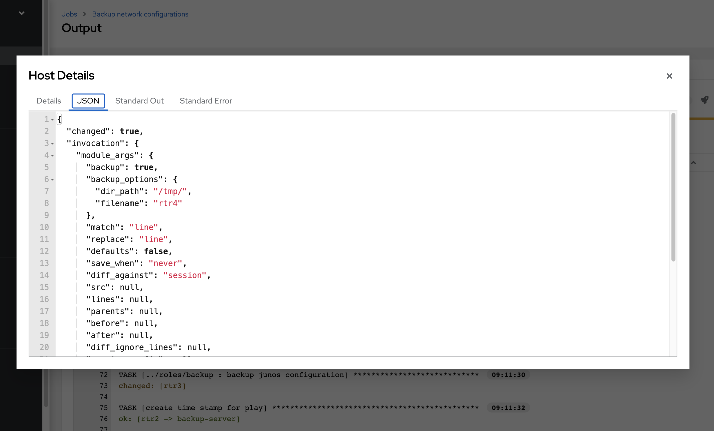

# Exercise 6: Creating an Automation controller Job Template

**Read this in other languages**:  [English](README.md),   [日本語](README.ja.md).

## Table of Contents

* [Objective](#objective)
* [Guide](#guide)
  * [Step 1: Create a Job Template](#step-1-create-a-job-template)
  * [Step 2: Launch the Job Template](#step-2-launch-the-job-template)
  * [Step 3: Examine the Job Details View](#step-3-examine-the-job-details-view)
  * [Step 4: Examine the Jobs window](#step-4-examine-the-jobs-window)
  * [Step 5: Verify the backups were created](#step-5-verify-the-backups-were-created)
* [Takeaways](#takeaways)

## Objective

Demonstrate a network backup configuration job template with Automation controller.  This job template will save the running configuration from all four routers and store them under /backup on the control node with a timestamp.

To run an Ansible Playbook in Automation controller we need to create a **Job Template**.  A **Job Template** requires:

* An **Inventory** to run the job against
* A **Credential** to login to devices.
* A **Project** which contains Ansible Playbooks

## Guide

### Step 1: Create a Job Template

* Open the web UI and click on the `Templates` link on the left menu.

   

* Click on the blue **Add** button to create a new job template

   

> Make sure to select `job template` and not `workflow template`)

* Fill out the job template parameters as follows:

  | Parameter | Value |
  |---|---|
  | Name  | Backup network configurations  |
  |  Job Type |  Run |
  |  Inventory |  Workshop Inventory |
  |  Project |  Workshop Project |
  |  Execution Environment | Default execution environment |
  |  Playbook |  playbooks/network_backup.yml |
  |  Credential |  Workshop Credential |

  Screenshot of the job template parameters filled out:
   

* Add a second credential to the Job Template.

   The **Controller Credential** also must be added to this particular Job Template.  This is so Automation controller can update the pool of backups the **Network-Restore** Job Template will use. Automation controller can be programmatically updated with Job Templates to add or update configurations dynamically.  Select the 2nd credential by using the drop down box to select the **Red Hat Ansible Automation Platform** credential type:

  

  When you have both credential successfully added to the Job Template it will look like the following picture:

  

* Scroll down and click the blue `Save` button.

### Step 2: Launch the Job Template

1. Navigate back to the `Templates` window, where all Job Templates are listed.

2. Launch the `Backup network configurations` Job Template by clicking the Rocket button.

    

    When the rocket button is clicked this will launch the job.  The job will open in a new window called the **Job Details View**.  More info about [Automation controller jobs](https://docs.ansible.com/automation-controller/latest/html/userguide/jobs.html) can be found in the documentation.

### Step 3: Examine the Job

After executing the Job Template it will automatically open the [Standard Out pane](https://docs.ansible.com/automation-controller/latest/html/userguide/jobs.html#standard-out)


1. Examine the **Standard Out pane**

   The Standard Out pane will display the output from the Ansible Playbook.  Every task output will match exactly what would be seen on the command line.

2. Click on a task in the **Standard Out pane** to open up structured output from that particular task.

   > Click on any line where there is a **changed** or **ok**

   

3. Click on the **Details**  tab to open the **Details pane**

   The **Details pane** will information such as the timestamp for when the job started and finished, the job type (Check or Run), the user that launched the job, which Project and Ansible Playbook were used and more.

   If the Job has not finished yet, the **Details Pane** will have a **Cancel Job** button that can be used to stop the Job.

### Step 4: Examine the Jobs window

Any **Job Template** that has been run or is currently running will show up under the **Jobs** window.

1. Click the Jobs button the left menu.

   

   The Jobs link displays a list of jobs and their status–shown as completed successfully or failed, or as an active (running) job. Actions you can take from this screen include viewing the details and standard output of a particular job, relaunch jobs, or remove jobs.

2. Click on the **Backup network configurations** Job

   

   The **Backup network configurations** job was the most recent (unless you have been launching more jobs).  Click on this job to return to the **Standard Out pane**.  Automation controller will save the history of every job launched.

### Step 5: Verify the backups were created

* On the Ansible control node command line `ls /backup` to view the time stamped folder (or folders if you created multiple backups)

  ```sh
  [student1@ansible-1 ~]$ ls /backup
  2021-08-31-12-58  2021-08-31-13-04  2021-08-31-13-11
  ```

  `ls` is a command to list computer files in Linux operating systems

* Either open `/backup` with Visual Studio Code or use the `cat` command to view the contents of one of the time stamped network devices

  ```sh
  [student1@ansible-1 ~]$ cat /backup/2021-08-31-1
  2021-08-31-12-58/ 2021-08-31-13-04/ 2021-08-31-13-11/
  [student1@ansible-1 ~]$ cat /backup/2021-08-31-12-58/rtr1.txt
  Building configuration...

  Current configuration : 5072 bytes
  !
  ! Last configuration change at 12:53:30 UTC Tue Aug 31 2021 by ec2-user
  !
  version 16.9
  service timestamps debug datetime msec
  service timestamps log datetime msec
  platform qfp utilization monitor load 80
  no platform punt-keepalive disable-kernel-core
  platform console virtual
  !
  hostname rtr1
  ```

* Examine the remaining routers.  Your instructor may have setup multiple vendors for this exercise including Juniper and Arista.  Ansible Playbooks can be written to be vendor agnostic,  in this case we provided the Ansible Playbook via the Github repo: [https://github.com/network-automation/toolkit](https://github.com/network-automation/toolkit)

## Takeaways

You have successfully demonstrated

* Creating a Job Template for backing up network configurations
* Launching a Job Template from the Automation controller UI
* Verifying the backups are correctly stored

## Complete

You have completed lab exercise 6

---
[Previous Exercise](../5-explore-controller/README.md) | [Next Exercise](../7-controller-survey/README.md)

[Click here to return to the Ansible Network Automation Workshop](../README.md)
