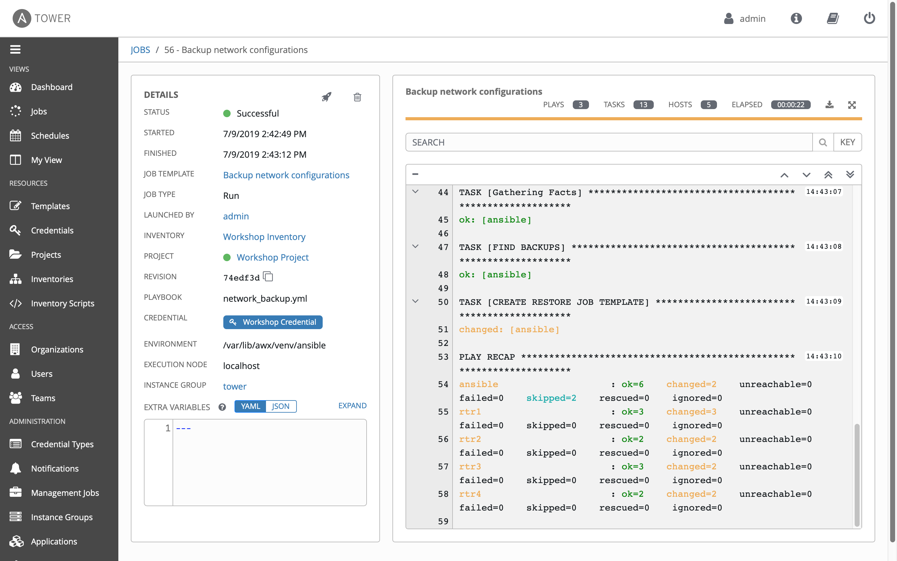

# Exercise 6: ジョブテンプレートの作成

**別の言語で読む**:  [English](README.md),   [日本語](README.ja.md).

## Table of Contents

- [Objective](#objective)
- [Guide](#guide)
   - [Step 1: Create a Job Template](#step-1-create-a-job-template)
   - [Step 2: Launch the Job Template](#step-2-launch-the-job-template)
   - [Step 3: Examine the Job Details View](#step-3-examine-the-job-details-view)
   - [Step 4: Examine the Jobs window](#step-4-examine-the-jobs-window)
   - [Step 5: Verify the backups were created](#step-5-verify-the-backups-were-created)
- [Takeaways](#takeaways)

# Objective

Ansible Tower を使ってネットワークコンフィグのバックアップを行うジョブテンプレートを確認していきます。このジョブテンプレートは4つルーターから稼働中のコンフィグを取得し、コントローラーノードの /backup 配下にタイムスタンプ付きで保存します。

Ansible Tower で Playbook を実行するには **Job Template** を作成する必要があります。**Job Template** の作成には以下が必要です:
 - ジョブの対象となる **Inventory**
 - デバイスへログインするための **Credential**
 - Playbook を含んだ **Project**

# Guide

## Step 1: Create a Job Template

1.  左のメニューから `Templates` を選択します。

    

2. グリーンのボタン  をクリックしてジョブテンプレートを作成します。

    >作成には `Job Template` を選択します。`Workflow Template` ではありません。

3. 以下のジョブテンプレートのパラメーターを入力します:

    | Parameter | Value |
    |---|---|
    | Name  | Backup network configurations  |
    |  Job Type |  Run |
    |  Inventory |  Workshop Inventory |
    |  Project |  Workshop Project |
    |  Playbook |  network_backup.yml |
    |  Credential |  Workshop Credential |


    入力した状態の画面は以下になります。

    

4. 2つ目の認証情報をジョブテンプレートに割り当てます。

    この **Tower Credential** (認証タイプ Ansible Tower)もジョブテンプレートに追加する必要があります。これは **Network-Restore** ジョブテンプレートが使用しているプールをアップデートするために使用されます。Ansible Tower ではジョブテンプレートから、プログラマブルに Ansible Tower 自身の設定を動的に追加・更新することができます。

    

5. 画面を下方向へスクロールしてグリーンの `save` ボタンをクリックします。

以下がチュートリアルです:


Youtube で確認するにはこちら  [Click Here](https://youtu.be/EQVkFaQYRiE)


## Step 2: Launch the Job Template

1. `Templates` 画面へと戻ります。ここでは全てのジョブテンプレートのリストが表示されます。

2. ジョブテンプレート `Backup network configurations` のロケットボタンをクリックしてジョブを起動します。

    

    ロケットボタンをクリックするとジョブが起動されます。ジョブが起動されると **Job Details View** という新しい画面が起動します。ジョブについての詳細の情報は [Tower Jobs](https://docs.ansible.com/ansible-tower/latest/html/userguide/jobs.html) から参照できます。

## Step 3: Examine the Job Details View

画面の左側は **Details pane** で、右側は **Standard Out pane** です。



1.  **Details pane** を確認します。

    **Details pane** ではジョブの起動、終了時間や、ジョブのタイプ(Check / Run)、ジョブを起動したユーザー、どのプロジェクトのどのPlaybookが使われているか等が確認できます。

    もし、ジョブが実行中であれば **Details Pane** にはキャンセルボタン  が表示され、これを使うとジョブを停止することができます。

2.  **Standard Out pane** を確認します。

    **Standard Out pane** には Playbook の出力が表示されます。この内容はコマンドラインで実行したものと同じです。

3.  **Expand Output**  ボタンをクリックします。

    **Standard Out pane** が表示領域が拡大します。

4.  **Standard Out pane** の中から特定タスクの出力部分をクリックすると、タスクが出力する構造化されたデータを表示できます。

    > **changed** または **ok** となっている好きな行をクリックしてください。

    

## Step 4: Examine the Jobs window

起動された、もしくは起動中の **Job Template** は **Jobs** ウインドに全て表示されます。

1. 左メニューから Jobs ボタンをクリックします。

    

    この Jobs 画面はジョブの一覧と成功、失敗、実行中といったジョブの状態を表示します。この画面からは、特定ジョブの詳細、出力結果、再実行、ジョブの削除が行えます。

2. **Backup network configurations** ジョブをクリックします。

    

    この **Backup network configurations** ジョブは最も最近に起動されています(他のジョブを起動していなければ)。このジョブをクリックすると **Job Details View** へと戻ることができます。Ansible Tower は起動された全てのジョブの履歴を保存しています。

## Step 5: Verify the backups were created

1. コントローラーノード上で `ls /backup` コマンドを実行してタイムスタンプが付加されたディレクトリを確認します(もし複数回ジョブテンプレートを実行した場合は複数のディレクトリが存在します）

   ```
   [student1@ansible ~]$ ls /backup
   2019-07-09-18-42  2019-07-09-19-18
   ```

   - `ls` コマンドはファイルの一覧を表示します

2. `cat` コマンドでバックアップされたネットワークデバイスの内容を確認します。

   ```
   [student1@ansible ~]$ cat /backup/2019-07-09-18-42/rtr1

   Current configuration : 5625 bytes
   !
   ! Last configuration change at 02:44:24 UTC Wed Jul 3 2019 by ec2-user
   !
   version 16.9
   service tcp-keepalives-in
   service tcp-keepalives-out
   service timestamps debug datetime msec
   service timestamps log datetime msec
   service password-encryption
   !
   ! [[REST OF OUTPUT REMOVED FOR BREVITY]]
   !
   ```

  3. 残りのルーターに関してもバックアップファイルを確認してください。この演習環境はJuniper や Arista を含む複数のベンダーの機器でセットアップされています。Playbook はこのようにベンダー非依存で動くように書くことも可能です。ここで使われたPlaybookは [https://github.com/network-automation/tower_workshop](https://github.com/network-automation/tower_workshop) で確認できます。

# Takeaways

ここで確認した内容は以下となります。
 - ネットワーク設定のバックアップを行うジョブテンプレートの作成
 - Ansible Tower の UI からジョブテンプレートを起動
 - バックアップが正しく実行されたか確認

---

# Complete

以上で exercise 6 は終了です。

[Click here to return to the Ansible Network Automation Workshop](../README.ja.md)
