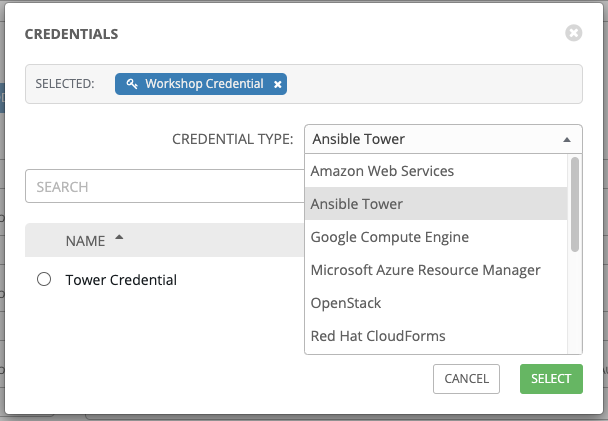

# Exercise 6: Creating a Tower Job Template

**Read this in other languages**:  [English](README.md),   [日本語](README.ja.md).

## Table of Contents

- [Objective](#objective)
- [Guide](#guide)
   - [Step 1: Create a Job Template](#step-1-create-a-job-template)
   - [Step 2: Launch the Job Template](#step-2-launch-the-job-template)
   - [Step 3: Examine the Job Details View](#step-3-examine-the-job-details-view)
   - [Step 4: Examine the Jobs window](#step-4-examine-the-jobs-window)
   - [Step 5: Verify the backups were created](#step-5-verify-the-backups-were-created)
- [Takeaways](#takeaways)

# Objective

Demonstrate a network backup configuration job template for Red Hat Ansible Tower.  This job template will save the running configuration from all four routers and store them under /backup on the control node with a timestamp.

To run an Ansible Playbook in Ansible Tower we need to create a **Job Template**.  A **Job Template** requires:
 - An **Inventory** to run the job against
 - A **Credential** to login to devices.
 - A **Project** which contains Ansible Playbooks

# Guide

## Step 1: Create a Job Template

1.  Open the web UI and click on the `Templates` link on the left menu.

    

2. Click on the green  button to create a new job template

    >Make sure to select `Job Template` and not `Workflow Template`)

3. Fill out the job template parameters as follows:

    | Parameter | Value |
    |---|---|
    | Name  | Backup network configurations  |
    |  Job Type |  Run |
    |  Inventory |  Workshop Inventory |
    |  Project |  Workshop Project |
    |  Playbook |  network_backup.yml |
    |  Credential |  Workshop Credential |


    Here is a screenshot of the job template parameters filled out.

    


4. Add a second credential to the Job Template.

    The **Tower Credential** also must be added to this particular Job Template.  This is so Ansible Tower can update the pool of backups the **Network-Restore** Job Template will use. Ansible Tower can be programmatically updated with Job Templates to add or update configurations dynamically.  Select the 2nd credential by using the drop down box to select the **Ansible Tower** credential type:

    

    When you have both credential successfully added to the Job Template it will look like the following picture:

    

5. Scroll down and click the green `save` button.

Here is a walkthrough:


Prefer Youtube?  [Click Here](https://youtu.be/Vd4jyx7xGuU)


## Step 2: Launch the Job Template

1. Navigate back to the `Templates` window, where all Job Templates are listed.

2. Launch the `Backup network configurations` Job Template by clicking the Rocket button.

    

    When the rocket button is clicked this will launch the job.  The job will open in a new window called the **Job Details View**.  More info about [Tower Jobs](https://docs.ansible.com/ansible-tower/latest/html/userguide/jobs.html) can be found in the documentation.

## Step 3: Examine the Job Details View

On the left side there is a **Details pane** on the right side there is the **Standard Out pane**.


1.  Examine the **Details pane**    

    The **Details pane** will information such as the timestamp for when the job started and finished, the job type (Check or Run), the user that launched the job, which Project and Ansible Playbook were used and more.

    If the Job has not finished yet, the **Details Pane** will have a cancel button  that can be used to stop the Job.

2.  Examine the **Standard Out pane**

    The **Standard Out pane** will display the output from the Ansible Playbook.  Every task output will match exactly what would be seen on the command line.

3.  Click on the **Expand Output** button 

    This will expand the **Standard Out pane** to take the entirety of the window.

4.  Click on a task in the **Standard Out pane** to open up structured output from that particular task.

    > Click on any line where there is a **changed** or **ok**

    

## Step 4: Examine the Jobs window

Any **Job Template** that has been run or is currently running will show up under the **Jobs** window.

1. Click the Jobs button the left menu.

    

    The Jobs link displays a list of jobs and their status–shown as completed successfully or failed, or as an active (running) job. Actions you can take from this screen include viewing the details and standard output of a particular job, relaunch jobs, or remove jobs.

2. Click on the **Backup network configurations** Job

    

    The **Backup network configurations** job was the most recent (unless you have been launching more jobs).  Click on this job to return to the **Job Details View**.  Ansible Tower will save the history of every job launched.

## Step 5: Verify the backups were created

1. On the Ansible control node command line `ls /backup` to view the time stamped folder (or folders if you created multiple backups)

   ```
   [student1@ansible ~]$ ls /backup
   2019-07-09-18-42  2019-07-09-19-18
   ```

   - `ls` is a command to list computer files in Linux operating systems

2. Use the `cat` command to view the contents of one of the time stamped network devices

   ```
   [student1@ansible ~]$ cat /backup/2019-07-09-18-42/rtr1

   Current configuration : 5625 bytes
   !
   ! Last configuration change at 02:44:24 UTC Wed Jul 3 2019 by ec2-user
   !
   version 16.9
   service tcp-keepalives-in
   service tcp-keepalives-out
   service timestamps debug datetime msec
   service timestamps log datetime msec
   service password-encryption
   !
   ! [[REST OF OUTPUT REMOVED FOR BREVITY]]
   !
   ```

  3. Examine the remaining routers.  Your instructor may have setup multiple vendors for this exercise including Juniper and Arista.  Ansible Playbooks can be written to be vendor agnostic,  in this case we provided the Ansible Playbook via the Github repo: [https://github.com/network-automation/tower_workshop](https://github.com/network-automation/tower_workshop)

# Takeaways

You have successfully demonstrated
 - Creating a Job Template for backing up network configurations
 - Launching a Job Template from the Ansible Tower UI
 - Verifying the backups are correctly stored

---

# Complete

You have completed lab exercise 6

[Click here to return to the Ansible Network Automation Workshop](../README.md)
