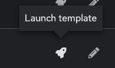

# Ejercicio 7: Crear una Encuesta (Survey)

**Leálo en otros idiomas**:  [English](README.md),   [日本語](README.ja.md),  [Español](README.es.md).

## Índice

* [Objetivo](#objetivo)
* [Guía](#guía)
   * [Paso 1: Crear una plantilla de trabajo](#Paso-1-crear-una-plantilla-de-trabajo)
   * [Paso 2: Examinar el playbook](#Paso-2-examinar-el-playbook)
   * [Paso 3: Crear una encuesta o survey](#Paso-3-crear-una-encuesta-survey)
   * [Paso 4: Lanzar una plantilla de trabajo](#Paso-4-lanzar-una-plantilla-de-trabajo)
   * [Paso 5: Verificar la pancarta o banner](#Paso-5-verificar-la-pancarta-o-banner)
* [Consejos a recordar](#consejos-a-recordar)
* [Completado](#completado)

## Objetivo

Demonstrate the use of controlador de Automatización [survey feature](https://docs.ansible.com/automation-controller/latest/html/userguide/job_templates.html#surveys). Surveys set extra variables for the playbook similar to ‘Prompt for Extra Variables’ does, but in a user-friendly question and answer way. Surveys also allow for validation of user input.

## Guía

### Paso 1: Create a Job Template

1. Open the web UI and Haz click on the `Templates` link on the left menu.

   

2. Haz click on the blue `Add` button and select **Add job template** to create a new job template (make sure to select `Job Template` and not `Workflow Template`)

   | Parameter | Value |
   |---|---|
   | Name  | Network-Banner |
   |  Job Type |  Run |
   |  Inventory |  Workshop Inventory |
   |  Project |  Workshop Project |
   | Execution Environment | Default execution environment |
   |  Playbook |  `playbooks/network_banner.yml` |
   |  Credential |  Workshop Credential |

3. Scroll down and Haz click the blue `Save` button.

### Paso 2: Examinar el playbook

Here is what the  `network_banner.yml` Ansible Playbook looks like:

<!--  -->

```yaml
---
- name: set router banners
  hosts: routers
  gather_facts: no

  tasks:
    - name: load banner onto network device
      vars:
        - network_banner:  "{{ net_banner | default(None) }}"
        - banner_type: "{{ net_type | default('login') }}"
      include_role:
        name: "../roles/banner"
```

<!--  -->

> Note:
>
> You can also view the Ansible Playbook here: [https://github.com/network-automation/toolkit](https://github.com/network-automation/toolkit)

The role **banner** has a very simple `main.yml` file:

<!--  -->

```yaml
- name: configure banner
  include_tasks: "{{ ansible_network_os }}.yml"
```

<!--  -->

The `ansible_network_os` variable is being used to parameterize the network OS and create a vendor neutral playbook.

If you are working with a junos device, this playbook would call for a task file called `junos.yml`.  If you are using an IOS-XE device, this playbook would call for a task file called `ios.yml`. This file will in turn contain the platform specific tasks:

<!--  -->

```yaml
---
- name: add the junos banner
  junos_banner:
    text: "{{ network_banner }}"
    banner: "{{ banner_type }}"
```

<!--  -->

> Note:
>
> Please observe that there are task files created for ios, nxos, eos and junos for this playbook.

Also note that we are passing in 2 variables to the task file.

1. `network_banner`: This variable is populated using the `net_banner` variable

2. `banner_type`: This variable is populated by a variable named `net_type`

### Paso 3: Crear una Encuesta o Survey

In this Paso you will create a *"survey"* of user input form to collect input from the user and populate the values for the variables `net_banner` and `banner_type`

1. Haz click on the **Survey** tab within the Network-Banner Job Template

   

2. Haz click the blue **Add** button

   

3. Fill out the fields

   | Parameter | Value |
   |---|---|
   | Question  | Please enter the banner text |
   |  Description |  Please type into the text field the desired banner |
   |  Answer Variable Name |  `net_banner` |
   |  Answer type |  Textarea |
   |  Required |  Checkmark |

   For example:

   

4. Haz click the green `Add` button to create another question

   

5. Next we will create a survey prompt to gather the `banner_type`. This will either be "motd" or "login" and will default to "login" per the playbook above.

   | Parameter               | Value                          |
   |-------------------------|--------------------------------|
   | Question                | Please enter the  banner type  |
   | Description             | Please choose an option        |
   | Answer Variable Name    | `net_type`                    |
   | Answer type             | Multiple Choice(single select) |
   | Multiple Choice Options | login <br>motd                        |
   | default answer          | login                          |
   | Required                | Checkmark                      |

   For example:

   

5. Haz click Save

6. Haz click the toggle switch to activate the survey and turn it On

   

7. Haz click **Back to Templates**

### Paso 4: Lanzar una plantilla de trabajo

1. Haz click on the rocket ship to launch the job template.

   

   The job will immediately prompt the user to set the banner and the type.

2. Type in the banner message you want for the routers.

3. Choose between `login` and `motd`.

4. Haz click next to see how the survey rendered the input as extra vars for the Ansible Playbook.  For this example the banner text is set as "This router was configured by Ansible".

   

5. Haz click the blue **Launch** button to kick off the job.

   

Let the job run to completion.  Let the instructor know if anything fails.

### Paso 5: Verificar la pancarta o banner

1. Login to one of the routers and see the banner setup

   ```sh
   [student1@ansible]$ ssh rtr1
   ```

   The banner will appear on login.  Here is an example from above:

   ```
   [student1@ansible-1 ~]$ ssh rtr1
  Warning: Permanently added 'rtr1,3.237.253.154' (RSA) to the list of known hosts.

  This router was configured by Ansible
  ```

2. Verify on additional routers

## Takeaways

You have successfully demonstrated

* Creation of a Job Template for configuring a banner on multiple network operating systems including Arista EOS, Cisco IOS and Juniper Junos.
* Creation of a self service survey for the Job Template to fill out the `network_banner` and `banner_type` variables
* Executing a Job Template on all four routers, loading a banner on them simultaneously

## Complete

You have completed lab exercise 7

---
[Previous Exercise](../6--controller-job-template/README.md) | [Next Exercise](../8-controller-rbac/README.md)

[Haz click here to return to the Ansible Network Automation Workshop](../README.md)
