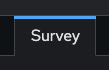
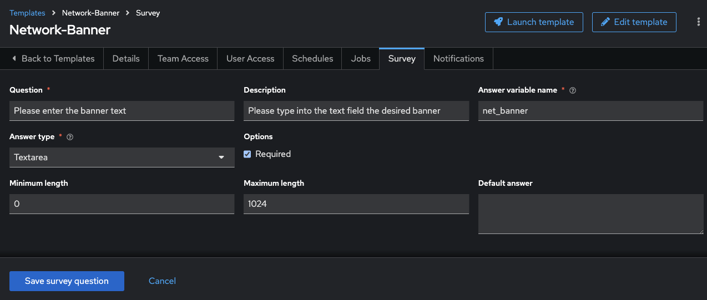

# Exercice 7 : Création d'un questionnaire

**Lisez ceci dans d'autres langues** :  [English](README.md),  [日本語](README.ja.md),  [Español](README.es.md),  [Français](README.fr.md).

## Table des matières

- [Exercice 7 : Création d'un questionnaire](#exercice-7--création-dun-questionnaire)
  - [Table des matières](#table-des-matières)
  - [Objectif](#objectif)
  - [Guide](#guide)
    - [Étape 1 : Créer un modèle de job](#étape-1--créer-un-modèle-de-job)
    - [Étape 2 : Examiner le Playbook](#étape-2--examiner-le-playbook)
    - [Étape 3 : Créer un questionnaire](#étape-3--créer-un-questionnaire)
    - [Étape 4 : Lancer le modèle de Job](#étape-4--lancer-le-modèle-de-job)
    - [Étape 5 : Vérifier la Bannière](#étape-5--vérifier-la-bannière)
  - [Points Clés](#points-clés)
  - [Conclusion](#conclusion)

## Objectif

Démontrer l'utilisation de la [fonctionnalité de questionnaire](https://docs.ansible.com/automation-controller/latest/html/userguide/job_templates.html#surveys) du Contrôleur d'Automatisation. Les questionnaires permettent de définir des variables supplémentaires pour le playbook de manière similaire à « Prompt for Extra Variables », mais sous la forme de questions-réponses conviviales. Elles permettent également de valider les entrées utilisateur.

## Guide

### Étape 1 : Créer un modèle de job

1. Ouvrez l'interface Web et cliquez sur le lien `Modèles` dans le menu à gauche.

   

2. Cliquez sur le bouton bleu `Créer un modèle` et sélectionnez **Créer un modèle de travail** (assurez-vous de choisir `Modèle de Jobs` et non `Modèle de Flux de Travail`).

   | Paramètre | Valeur |
   |---|---|
   | Nom  | Network-Banner |
   | Type de Travail | Exécuter |
   | Inventaire | Workshop Inventory |
   | Projet | Workshop Project |
   | Environnement d'Exécution | network workshop execution environment |
   | Playbook | `playbooks/network_banner.yml` |
   | Identifiant | Workshop Credential |

3. Faites défiler la page et cliquez sur le bouton bleu `Créer un modèle de travail`.

### Étape 2 : Examiner le Playbook

Voici à quoi ressemble le Playbook Ansible `network_banner.yml` :

```yaml
---
- name: set router banners
  hosts: routers
  gather_facts: no

  tasks:
    - name: load banner onto network device
      vars:
        - network_banner:  "{{ net_banner | default(None) }}"
        - banner_type: "{{ net_type | default('login') }}"
      include_role:
        name: "../roles/banner"
```

> **Note :** Vous pouvez également consulter le Playbook Ansible [ici](https://github.com/network-automation/toolkit).

Le rôle **banner** contient un fichier `main.yml` simple :

```yaml
- name: configure banner
  include_tasks: "{{ ansible_network_os }}.yml"
```

La variable `ansible_network_os` permet de paramétrer le système d'exploitation réseau et de créer un playbook neutre vis-à-vis du fournisseur.

Si vous travaillez avec un dispositif Junos, ce playbook appellera un fichier de tâches nommé `junos.yml`. Si vous utilisez un dispositif IOS-XE, il appellera un fichier `ios.yml`, qui contiendra les tâches spécifiques à la plateforme :

```yaml
---
- name: add the junos banner
  junos_banner:
    text: "{{ network_banner }}"
    banner: "{{ banner_type }}"
```

> **Note :**
> Des fichiers de tâches sont prévus pour ios, nxos, eos et junos pour ce playbook.

Les variables suivantes sont passées au fichier de tâches :

1. `network_banner` : cette variable est alimentée par `net_banner`

2. `banner_type` : cette variable est alimentée par `net_type`

### Étape 3 : Créer un questionnaire

Dans cette étape, vous créerez un formulaire de questionnaire pour collecter les entrées utilisateur et renseigner les valeurs des variables `net_banner` et `banner_type`.

1. Cliquez sur l'onglet **Questionnaire** dans le Modèle de Jobs Network-Banner

   

2. Cliquez sur le bouton bleu **Ajouter**

   

3. Remplissez les champs suivants :

   | Paramètre | Valeur |
   |---|---|
   | Question  | Veuillez entrer le texte de la bannire |
   | Description | Veuillez saisir le texte souhaité dans le champ |
   | Nom de la Variable de Réponse | `net_banner` |
   | Type de Réponse | Zone de Texte |
   | Obligatoire | Cocher |

   Exemple :

   

4. Cliquez sur `Enregistrer la question du questionnaire`

5. Cliquez à nouveau sur le bouton bleu `Ajouter` pour créer une autre question

   

6. Créez une invite pour collecter le `banner_type`. Celui-ci sera soit "motd" soit "login" et sera défini par défaut sur "login" dans le playbook ci-dessus.

   | Paramètre               | Valeur                          |
   |-------------------------|--------------------------------|
   | Question                | Veuillez entrer le type de bannire  |
   | Description             | Veuillez choisir une option        |
   | Nom de la Variable de Réponse    | `net_type`                    |
   | Type de Réponse             | Choix Multiple (sélection unique) |
   | Options de Choix Multiples | login <br>motd                        |
   | Valeur par Défaut          | login                          |
   | Obligatoire                | Cocher                      |

   Exemple :

   

7. Cliquez sur `Enregistrer la question du questionnaire`

8. Assurez-vous que le bouton bascule est positionné sur `Questionnaire Activée`

   

### Étape 4 : Lancer le modèle de job

1. Revenez à la page des `Modèles` sous la section Automation Execution et cliquez sur le bouton fusée pour lancer le modèle de travail `Network-Banner`.

   

2. Une fenêtre s'ouvrira avec les questions du questionnaire. Entrez les valeurs des variables :

   | Question | Réponse Exemple |
   |----------|-----------------|
   | Veuillez entrer le texte de la bannère | Bienvenue sur ce dispositif réseau |
   | Veuillez entrer le type de bannère | login |

   Cliquez sur `Lancer`.

   

3. Attendez que le modèle de travail termine son exécution.

   

### Étape 5 : Vérifier la Bannière

1. Connectez-vous à l'un des routeurs pour vérifier la bannière configurée.

   ```bash
   $ ssh rtr1
   ```

2. Affichez la bannière configurée avec une commande propre au système d'exploitation réseau. Voici des exemples :

   - Pour IOS :

     ```bash
     rtr1#show run | include banner
     ```

   - Pour Junos :

     ```bash
     rtr1> show configuration system login
     ```

3. Vous devriez voir la bannière configurée comme étant "Bienvenue sur ce dispositif réseau".

## Points Clés

- Les questionnaires permettent de rendre les modèles de travail interactifs en collectant des entrées utilisateur.
- Les questionnaires peuvent inclure des validations pour garantir la qualité des entrées utilisateur.
- Les modèles de travail deviennent plus dynamiques et adaptables avec l'utilisation des questionnaires.

## Conclusion

Vous avez complété l'exercice 7.

Dans le prochain exercice, nous examinerons les modèles de restauration de configuration.

---
[Exercice précédent](../6-controller-job-template/README.fr.md) | [Exercice suivant](../8-controller-rbac/README.fr.md)

[Retour à l'atelier d'automatisation réseau Ansible](../README.fr.md)

