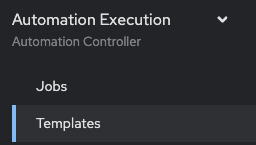
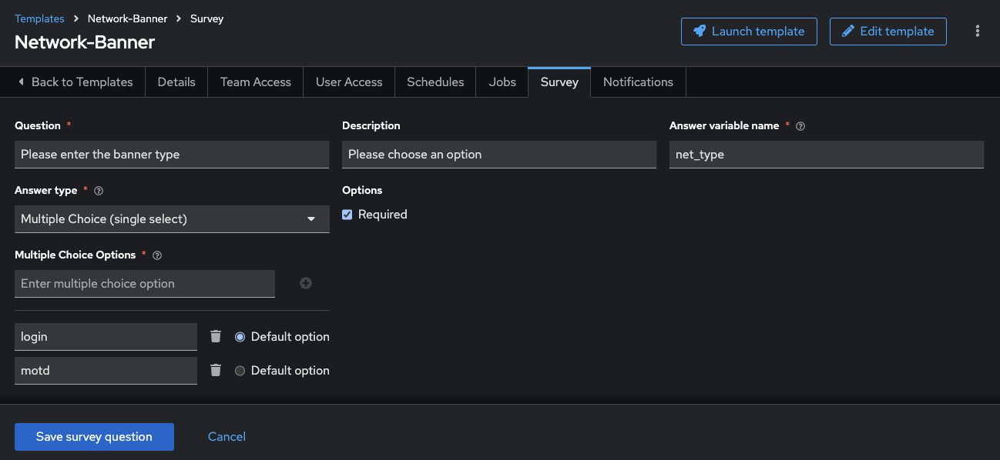

# 演習 7: Survey の作成

**他の言語でもお読みいただけます**:  [English](README.md),  [日本語](README.ja.md),  [Español](README.es.md).

## 目次

* [目的](#objective)
* [ガイド](#guide)
   * [ステップ 1: ジョブテンプレートの作成](#step-1-create-a-job-template)
   * [ステップ 2: Playbook の検証](#step-2-examine-the-playbook)
   * [ステップ 3: Survey の作成](#step-3-create-a-survey)
   * [ステップ 4: ジョブテンプレートの起動](#step-4-launch-the-job-template)
   * [ステップ 5: バナーの確認](#step-5-verify-the-banner)
*  [重要なこと](#takeaways)
*  [完了](#complete)

## 目的

自動コントローラー[survey
機能](https://docs.ansible.com/automation-controller/latest/html/userguide/job_templates.html#surveys)
の使用のデモンストレーションを行います。Survey は、「Prompt for Extra Variables (追加変数のプロンプト)」と同様に
Playbook の追加変数を設定しますが、ユーザーが使いやすい質問と回答を使ってこれを実行します。また、Survey
ではユーザー入力を検証することもできます。

## ガイド

### ステップ 1: ジョブテンプレートの作成

1. Web UI を開き、左側のメニューの `Templates` リンクをクリックします。

   

2. 青い `Add` ボタンをクリックして **Add job template** を選択し、新しいジョブテンプレートを作成します
   (`Workflow Template` ではなく必ず `Job Template` を選択してください)

   | Parameter | Value |
   |---|---|
   | Name  | Network-Banner |
   |  Job Type |  Run |
   |  Inventory |  Workshop Inventory |
   |  Project |  Workshop Project |
   | Execution Environment | network workshop execution environment |
   |  Playbook |  `playbooks/network_banner.yml` |
   |  Credential |  Workshop Credential |

3. 下にスクロールして、青い `Save` ボタンをクリックします。

### ステップ 2: Playbook の検証

`network_banner.yml` Ansible Playbook は次のようになります。

<!--  -->

```yaml
---
- name: set router banners
  hosts: routers
  gather_facts: no

  tasks:
    - name: load banner onto network device
      vars:
        - network_banner:  "{{ net_banner | default(None) }}"
        - banner_type: "{{ net_type | default('login') }}"
      name: "../roles/banner"
```

<!--  -->

> 注記:
>
> [https://github.com/network-automation/toolkit](https://github.com/network-automation/toolkit) で Ansible Playbook を確認することもできます

ロール **banner** には、非常に単純な `main.yml` ファイルがあります。

<!--  -->

```yaml
- name: configure banner include_tasks: "{{ ansible_network_os }}.yml"
```

<!--  -->

`ansible_network_os` 変数は、ネットワーク OS をパラメーター化し、ベンダーに依存しない playbook
を作成するために使用されています。

junos デバイスを使用している場合、この Playbook は `junos.yml` と呼ばれるタスクファイルを要求します。IOS-XE
デバイスを使用している場合、このプレイブックは `ios.yml`
と呼ばれるタスクファイルを要求します。このファイルには、プラットフォーム固有のタスクが含まれます。

<!--  -->

```yaml
---
- name: add the junos banner
  junos_banner:
    text: "{{ network_banner }}"
    banner: "{{ banner_type }}"
```

<!--  -->

> 注記:
>
> この Playbook の ios、nxos、eos、およびjunos 用に作成されたタスクファイルがあることに注意してください。

また、2 つの変数をタスクファイルに渡していることにも注意してください。

1. `network_banner`: この変数は `net_banner` 変数を使用して入力されます

2. `banner_type`: この変数には `net_type` という名前の変数が入力されます

### ステップ 3: Survey の作成

このステップでは、ユーザー入力フォームの *"survey"* を作成して、ユーザーからの入力を収集し、変数 `net_banner` と
`banner_type` の値を入力します

1. Network-Banner ジョブテンプレート内の **Survey** タブをクリックします

   

2. 青い **Add** ボタンをクリックします

   

3. 以下に記入してください。

   | Parameter | Value |
   |---|---|
   | Question  | Please enter the banner text |
   |  Description |  Please type into the text field the desired banner |
   |  Answer Variable Name |  `net_banner` |
   |  Answer type |  Textarea |
   |  Required |  Checkmark |

   例:

   

4. 緑色の `Add` ボタンをクリックして別の質問を作成します

   

5. 次に、`banner_type` を収集するための調査プロンプトを作成します。これは "motd" または "login"
   のいずれかになり、上記のプレイブックに従ってデフォルトで "login" になります。

   | Parameter               | Value                          |
   |-------------------------|--------------------------------|
   | Question                | Please enter the  banner type  |
   | Description             | Please choose an option        |
   | Answer Variable Name    | `net_type`                    |
   | Answer type             | Multiple Choice(single select) |
   | Multiple Choice Options | login <br>motd                        |
   | default answer          | login                          |
   | Required                | Checkmark                      |

   例:

   

5. 保存をクリックします。

6. トグルスイッチをクリックして Survey をアクティブにし、オンにします

   

7. **Back to Templates** をクリックします

### ステップ 4: ジョブテンプレートの起動

1. ロケットをクリックして、ジョブテンプレートを起動します。

   

   ジョブはすぐにユーザーに、バナーとタイプを設定するように促します。

2. ルーターに必要なバナーメッセージを入力します。

3. `login` と `motd` のどちらかを選択します。

4. 次へをクリックして、Survey が Ansible Playbook
   の追加の変数として入力をどのようにレンダリングしたかを確認します。この例のバナーテキストは "This router was configured
   by Ansible" に設定されています。

   

5. 青い **Launch** ボタンをクリックして、ジョブを開始します。

   

ジョブを最後まで実行します。何かが失敗した場合は、インストラクターに知らせてください。

### ステップ 5: バナーの確認

1. ルーターの 1 つにログインして、バナーの設定を確認します

   ```sh
   [student@ansible]$ ssh rtr1
   ```

   ログイン時にバナーが表示されます。上記の例を以下に示します。

   ```
   [student@ansible-1 ~]$ ssh rtr1
   Warning: Permanently added 'rtr1,3.237.253.154' (RSA) to the list of known hosts.

   This router was configured by Ansible
   ```

2. 追加のルーターでの確認

## 重要なこと

デモンストレーションに成功しました

* Arista EOS、Cisco IOS、JuniperJunos
  などの複数のネットワークオペレーティングシステムでバナーを構成するためのジョブテンプレートの作成。
* `network_banner` 変数と `banner_type` 変数に入力するためのジョブテンプレートのセルフサービス Survey の作成
* 4 つのルーターすべてでジョブテンプレートを実行し、それらにバナーを同時にロードする

## 完了

ラボ演習 7 を完了しました

---
[前の演習](../6-controller-job-template/README.ja.md) |
[次の演習](../8-controller-rbac/README.ja.md)

[Ansible Network Automation ワークショップに戻る](../README.ja.md)
