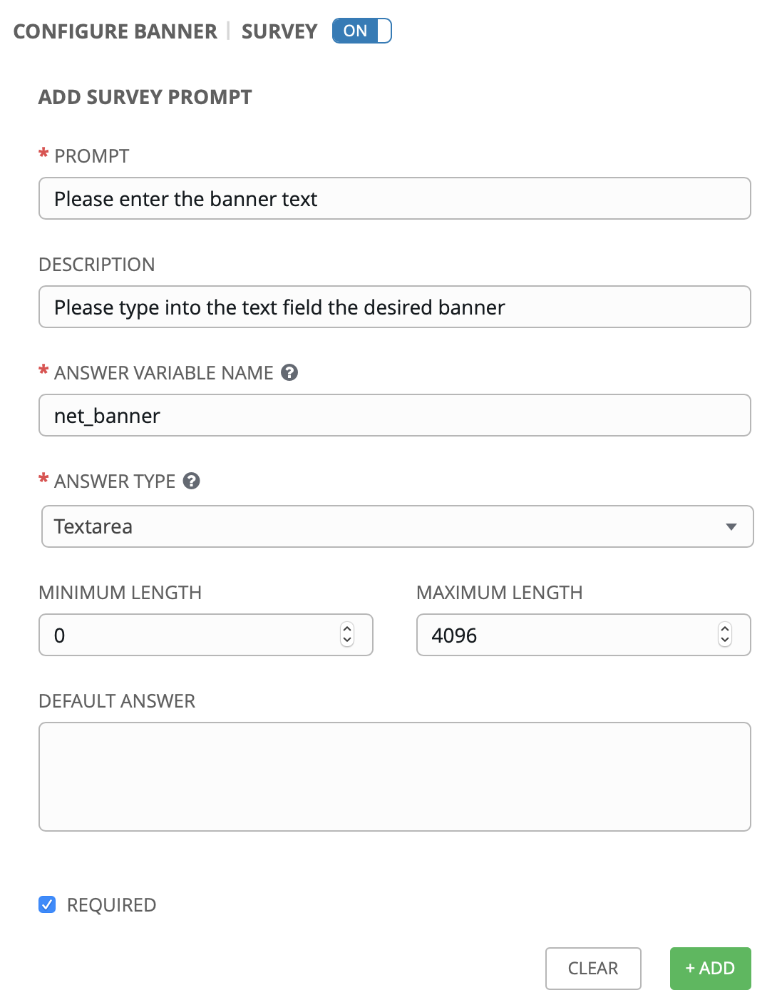
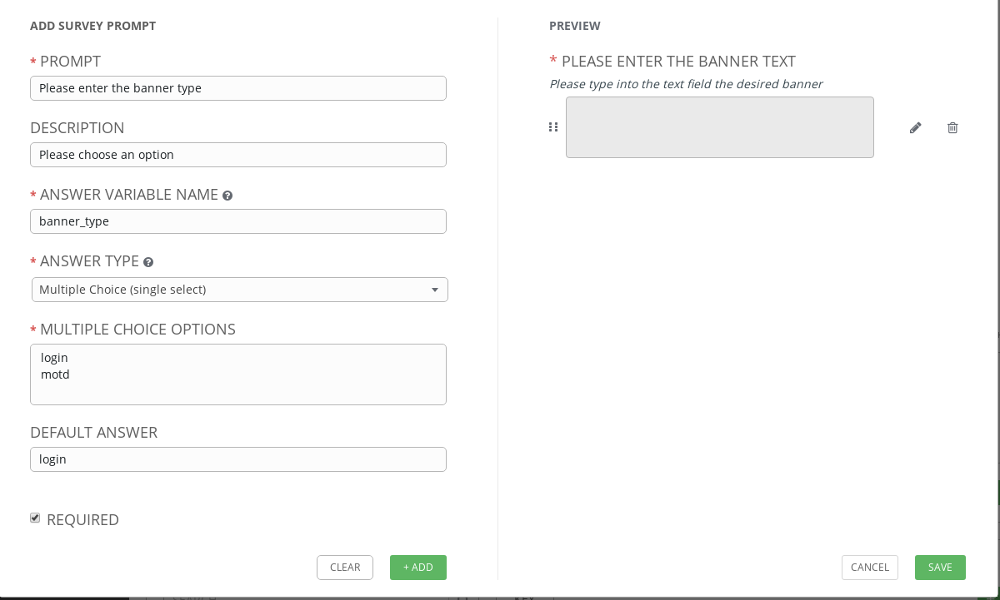
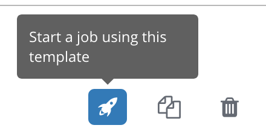
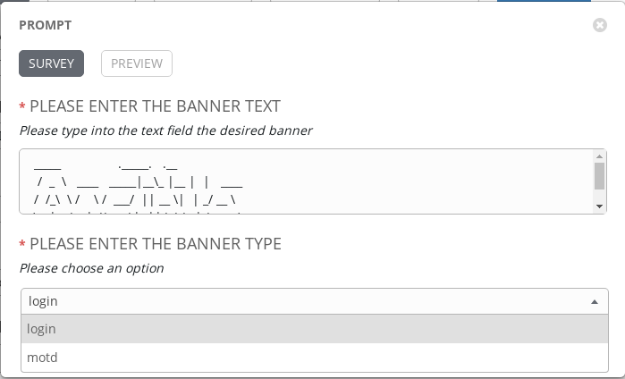
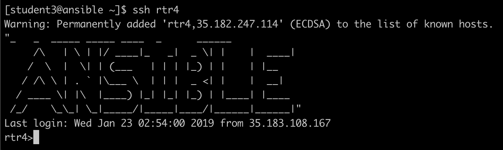

# Exercise 7: Survey の作成

**別の言語で読む**:  [English](README.md),   [日本語](README.ja.md).

## Table of Contents

- [Objective](#objective)
- [Guide](#guide)
   - [Step 1: Create a Job Template](#step-1-create-a-job-template)
   - [Step 2: Examine the playbook](#step-2-examine-the-playbook)
   - [Step 3: Create a survey](#step-3-create-a-survey)
   - [Step 4: Launch the Job Template](#step-4-launch-the-job-template)
   - [Step 5: Verify the banner](#step-5-verify-the-banner)
- [Takeaways](#takeaways)

# Objective

ここでは Ansible Tower の [survey](https://docs.ansible.com/ansible-tower/latest/html/userguide/job_templates.html#surveys) 機能について確認します。Survey は ‘Prompt for Extra Variables’ と同じように Playbook に対して extra variables を設定しますが、ユーザーフレンドリーな質問と回答方法を提供できます。また Survey では入力値のバリデーションも可能です。

# Guide

## Step 1: Create a Job Template

1. 左メニューから `Templates` をクリックします。

   

2. グリーンの `+` ボタンをクリックし、以下のパラメーターで新しいジョブテンプレートを作成します(`Job Template` を選択します。`Workflow Template` ではないので注意)

   | Parameter | Value |
   |---|---|
   | Name  | Network-Banner |
   |  Job Type |  Run |
   |  Inventory |  Workshop Inventory |
   |  Project |  Workshop Project |
   |  Playbook |  `network_banner.yml` |
   |  Credential |  Workshop Credential |

3. 画面を下へスクロールしグリーンの `SAVE` ボタンをクリックします。


## Step 2: Examine the playbook

ここに `network_banner.yml` があります。内容は以下です:

<!--  -->
```yml
---
- name: set router banners
  hosts: routers
  gather_facts: no

  tasks:
    - name: load banner onto network device
      vars:
        - network_banner:  "{{ net_banner | default(None) }}"
        - banner_type: "{{ net_type | default('login') }}"
      include_role:
        name: banner
```
<!--  -->


> Note: こちらから同じ Playbook を参照できます: [https://github.com/network-automation/tower_workshop](https://github.com/network-automation/tower_workshop)

このロール **banner** はシンプルな `main.yml` ファイルを持っています:

<!--  -->
```yml
- name: configure banner
  include_tasks: "{{ ansible_network_os }}.yml"
```
<!--  -->

この `ansible_network_os` 変数はネットワークOSをパラメーター化して、ベンダーニュートラルなPlaybookとなるように動作します。

もし、この Playbook を Junos 機器に実行すると、このPlaybookは `junos.yml` を呼び出します。同様に、この Playbook を IOS-XE 機器に実行すると、この Playbook は `ios.yml` を呼び出します。それぞれのファイルにはプラットフォーム固有のタスクが含まれています:

<!--  -->
```yml
---
- name: add the junos banner
  junos_banner:
    text: "{{ network_banner }}"
    banner: "{{ banner_type }}"
```
<!--  -->

> Note: この Playbook のために作成されている ios, nxos, eos, junos を確認してください。

また、ここでは2つの変数をタスクに渡していことに注意してください。

1. `network_banner`: この変数は `net_banner` 変数を使って渡されます。

2. `banner_type`: この変数は `net_type` 変数の値を確認して渡されます。


## Step 3: Create a survey


このステップでは *"survey"* を作成し、変数 `net_banner` と `banner_type` のためにユーザーの入力を回収して設定します。


1. ブルーの survey ボタンをクリックします。

   

2. 以下の値で項目を入力します

   | Parameter | Value |
   |---|---|
   | Prompt  | Please enter the banner text |
   |  Description |  Please type into the text field the desired banner |
   |  Answer Variable Name |  `net_banner` |
   |  Answer type |  Textarea |
   |  Required |  Checkmark |

   入力例は以下:

   

3. グリーンの `+Add` ボタンをクリックします。

   

4. 次に `banner_type` の値を回収するための survey を作成します。ここでは "motd" か "login" の値を選択させ、このデフォルトは "login" とします。

   | Parameter               | Value                          |
   |-------------------------|--------------------------------|
   | Prompt                  | Please enter the  banner type  |
   | Description             | Please choose an option        |
   | Answer Variable Name    | `net_type`                    |
   | Answer type             | Multiple Choice(single select) |
   | Multiple Choice Options | login <br>motd                        |
   | default answer          | login                          |
   | Required                | Checkmark                      |

   - Note: ブラウザによっては改行が入力できない場合があります。その場合は、別のエディタで作成してからコピーして貼り付けてください。

   設定画面の例は以下:

   

5. グリーンの `+Add` ボタンをクリックします。

   

6. グリーンの **SAVE** ボタンをクリックして survey を保存します。これでジョブテンプレート画面のメインへと戻ります。画面を下へスクロールしてグリーンの **SAVE** ボタンをクリックしてから、ジョブテンプレートの編集を終了し、ジョブテンプレート一覧へ戻ります。

## Step 4: Launch the Job Template

1. 作成したジョブテンプレートのロケットボタンをクリックしてジョブを起動します。

   

   ジョブを起動するとバナーの入力とタイプを選択するプロンプトが起動します。

2.  ルーターに設定したい好きなバナーメッセージを入力します。

3.  `login` か `motd` のどちらかを選択します。

4.  next をクリックし、Playbook に設定される extra vars を確認します。以下の例では ANSIBLE という単語をアスキーアートで入力しています。

   

5. グリーンの **LAUNCH** ボタンをクリックしてジョブを起動します。

   

ジョブの完了を待ちます。もしエラーが出る場合は講師に確認してください。


## Step 5: Verify the banner

1. 1つのルーターにログインし、バナーの設定を確認します。

   ```
   [student1@ansible]$ ssh rtr4
   ```

   バナーはログインで表示されます。ここの例では上記の **ANSIBLE** が表示されています。

   

2. 他のルーターも確認してください。

# Takeaways

ここで確認した内容は以下となります。
 - Arista EOS や Cisco IOS 、Juniper Junos を含んだ複数のネットワークOSにバナーを設定するジョブテンプレートを作成しました。
 - 変数 `network_banner` と `banner_type` に値を入力するセルフサービス survey 作成しました。
 - 4台のルーターにジョブテンプレートを実行し、一斉にバナーの設定を行いました。

---

# Complete

以上で exercise 7 は終了です。

[Click here to return to the Ansible Network Automation Workshop](../README.ja.md)
