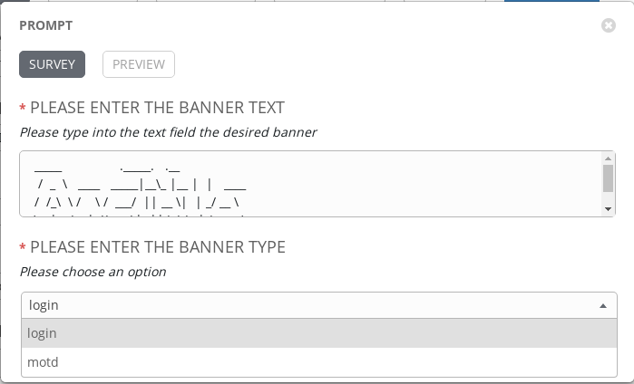

# Exercise 4-2: Creating a Survey

## Table of Contents

- [Objective](#objective)
- [Guide](#guide)
- [Playbook Output](#playbook-output)
- [Solution](#solution)

# Objective

Demonstrate the use of Ansible Tower [survey feature](https://docs.ansible.com/ansible-tower/latest/html/userguide/job_templates.html#surveys). Surveys set extra variables for the playbook similar to ‘Prompt for Extra Variables’ does, but in a user-friendly question and answer way. Surveys also allow for validation of user input.

# Guide

## Step 1:

Open the web UI and click on the `Templates` link on the left menu.


Click on the green `+` button to create a new job template (make sure to select `Job Template` and not `Workflow Template`)

| Parameter | Value |
|---|---|
| Name  | CONFIGURE BANNER  |
|  Job Type |  Run |
|  Inventory |  Workshop Inventory |
|  Project |  Workshop Project |
|  Playbook |  network_banner.yml |
|  Credential |  Workshop Credential |

Scroll down and click the green `save` button.  


## Step 2:

In the previous exercise (Creating a Job Template), you observed that the playbooks are being from the /var/lib/awx/projects/*_workshop_project directory

> Note: You can also view them here: https://github.com/network-automation/tower_workshop

The playbook referenced in the above step is reproduced here:


``` yaml
---
- name: SET ROUTER BANNERS
  hosts: all
  gather_facts: no

  tasks:


    - name: LOAD BANNER ONTO NETWORK DEVICE
      include_tasks: "{{ ansible_network_os }}_banner.yaml"
      vars:
        - network_banner:  "{{ net_banner | default(None) }}"
        - banner_type: "{{ banner_type | default('login') }}"

```


Here we are using the `ansible_network_os` variable to parameterize the network OS and create a vendor neutral playbook. 

So if you are working with a junos device, this playbook would call for a task file called `junos_banner.yaml`. This file will in turn contain the platform specific tasks:

``` yaml
---

- name: ADD THE IOS BANNER
  junos_banner:
    text: "{{ network_banner }}"
    banner: "{{ banner_type }}"

```

> Note: Please observe that there are task files created for ios, nxos, eos and junos for this playbook.


Also note that we are passing in 2 variables to the task file. 

1. `network_banner`: This variable is populated using the `net_banner` variable

2. `banner_type`: This variable is populated by yet another variable called `banner_type`


## Step 3:


In this step you will create a *"survey"* of user input form to collect input from the user and populate the values for the variables `net_banner` and `banner_type` 


Click on the blue add survey button


Fill out the fields

| Parameter | Value |
|---|---|
| Prompt  | Please enter the  banner text  |
|  Description |  Please type into the text field the desired banner |
|  Answer Variable Name |  net_banner |
|  Answer type |  Textarea |
|  Required |  Checkmark |

It should look like this screenshot:


Next we will create a survey prompt to gather the *banner type*. This will either be "motd" or "login" and will default to "login" per the playbook above.

| Parameter               | Value                          |
|-------------------------|--------------------------------|
| Prompt                  | Please enter the  banner type  |
| Description             | Please choose an option        |
| Answer Variable Name    | banner_type                    |
| Answer type             | Multiple Choice(single select) |
| Multiple Choice Options | login                          |
|                         | motd                           |
| default answer          | login                          |
| Required                | Checkmark                      |

It should look like this screenshot:


Click the green `+Add` button


Click the green **save** button to save the survey.  This will exit back to the main job template window.  Scroll down and click the second green **save** button to exit to the job templates window.

## Step 3

Click on the rocket ship to launch the job template.


The job will immediately prompt the user to set the banner and the type.  Type in the banner message you want for the routers. Choose between `login` and `motd`. Click next to see how the survey rendered the input as extra vars for the Playbook launch.  For this example I used the word ANSIBLE rendered into ASCII art.



Click the green **Launch** button to kick off the job.


Let the job run to completion.  Let the instructor know if anything fails.


## Step 4

Login to one of the routers and see the banner setup

```
[student1@ansible]$ ssh rtr4
```

The banner will appear on login.  Here is an example from the **ANSIBLE** shown above.


# Solution
You have finished this exercise.  

You have
 - created a job template for configuring a banner on multiple network operating systems (Arista EOS, Cisco IOS and Juniper Junos)
 - Create a self service survey for the job template to fill out the network_banner variable
 - run the vendor agnostic job template on all four routers loading the banner on them

[Click here to return to the lab guide](../README.md)
