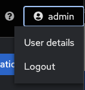

# Exercise 8: Understanding RBAC in controlador de Automatización

**Leálo en otros idiomas**:  [English](README.md),   [日本語](README.ja.md),  [Español](README.es.md).

## Índice

* [Objetivo](#objetivo)
* [Guía](#guía)
  * [Paso 1: Explorando las organizaciones](#Paso-1-explorando-las-organizaciones)
  * [Paso 2: Explorando las organizaciones de red](#Paso-2-explorando-las-organizaciones-de-red)
  * [Paso 3: Examinar los equipos](#Paso-3-examinar-los-equipos)
  * [Paso 4: Examinar los equipos de operaciones de red](#Paso-4-examinar-los-equipos-de-operaciones-de-red)
  * [Paso 5: Entrar como administrador de red](#Paso-5-entrar-como-administrador-de-red)
  * [Paso 6: Comprender los Roles de Equipo](#Paso-6-comprender-los-roles-de-equipo)
  * [Paso 7: Job Template Permissions](#Paso-7-job-template-permissions)
  * [Paso 8: Entrar como operador de red](#Paso-8-entrar-como-operador-de-red)
  * [Paso 9: Lauzar una plantilla de trabajo](#Paso-9-launching-a-job-template)
  * [Bonus](#bonus)
* [Consejos a recordar](#consejos-a-recordar)
* [Completado](#completado)

## Objetivo

Uno de los de usar el controlador de Automatización es el control sobre los usuarios que usan el sistema. El objetivo de este ejercicio es comprender el Control De Acceso Basado en Roles ([RBACs](https://docs.ansible.com/automation-controller/latest/html/userguide/security.html#role-based-access-controls)) con el que los administradores pueden definir proyectos, equipos, roles y asociar usuarios a esos roles. Esto les da a las organizaciones la posibilidad de asegurar la automatización del sistema y satisfacer los objetivos y requerimientos de conformidad.

## Guía

Observemos alguna terminología del controlador de Automatización:

* **Organizations:** Define un proyecto, como por ejemplo *Network-org*, *Compute-org*. Esto podría usarse para reflejar la estructura organizativa interna de la organización del cliente.
* **Teams:** Dentro de cada organización, pueden existir más de un equipo. Por ejemplo *tier1-helpdesk*, *tier2-support*, *tier3-support*, *build-team* etc.
* **Users:** Los usuarios típicamente pertenecen a equipos. Lo que el usuario puede hacer dentro del controlador de Automatización está controlado/definido mediante **roles**.
* **Roles:** Los roles definen qué acciones puede hacer un usuario. Esto se puede mapear claramente a organizaciones de red que tiene acceso restringido basado en si el usuario es una persona de soporte de Nivel-1, Nivel-2 o un administrador sénior. La [documentation](https://docs.ansible.com/automation-controller/latest/html/userguide/security.html#built-in-roles) del controlador de Automatización define un conjunto de roles pre establecidos.

### Paso 1: Explorando las organizaciones

* Entra al controlador de Automatización con el usuario **admin**.

  | Parameter | Value |
  |---|---|
  | username  | `admin`  |
  |  password|  provided by instructor |

* Confirma que has entrado como el usuario **admin**.

  

* Bajo la sección **Access**, haz click en **Organizations**

  Como el usuario *admin*, podrás ver todas las organizaciones configuradas en el  controlador de Automatización:

  <table>
  <thead>
    <tr>
      <th>Note: The orgs, teams and users were auto-populated for this workshop</th>
    </tr>
  </thead>
  </table>

* Examina las organizaciones

  Hay 2 organizaciones (además de la por defecto, Default):

  * **Red Hat compute organization**
  * **Red Hat network organization**

   

   <table>
   <thead>
     <tr>
       <th>Observa que esta página muestra un resumen de todos los equipos, usuarios, inventarios, proyectos y plantillas de trabajo asociadas con ellas. Si un administrador de nivel de organización se ha configurado, también se mostrará.</th>
     </tr>
   </thead>
   </table>

### Paso 2: Explorando las organizaciones de red

1. Haz click en **Red Hat network organization**.

   Se mostrará una sección que presenta los detalles de la organización.

   

2. Haz click en la pestaña **Access** para ver los usuarios asociados con esta organización.

   <table>
   <thead>
    <tr>
      <th>Observa que tanto el usuario <b>network-admin</b> como <b>network-operator</b> están asociados a esta organización.</th>
    </tr>
   </thead>
   </table>

### Paso 3: Examinar los equipos

1. Haz click en **Teams** en la barra lateral.

   

2. Examina los equipos. El administrador del controlador de Automatización podrá ver los equipos disponibles. Hay cuatro equipos:

   * Compute T1
   * Compute T2
   * Netadmin
   * Netops

   

### Paso 4: Examinar los equipos de operaciones de red

* Haz click el equipo **Netops** y luego Haz click en la pestaña **Access**. Observa dos usuarios en particular:

  * network-admin
  * network-operator

  

* Observa los siguientes dos puntos:

  * El usuario **network-admin** tiene privilegios de administrador para la **organización Red Hat network**
  * El usuario **network-operator** es un miembro del equipo Netops. Profundizaremos en ésto para entender los roles.

### Paso 5: Entrar como administrador de red

* Cierra la sesión del usuario admin haciendo click en el botón admin en la esquina superior derecha de la interfaz de usuario del controlador de Automatización:

   

* Entra al sistema con el usuario **network-admin**.

  | Parameter | Value |
  |---|---|
  | username  | network-admin  |
  |  password|  provided by instructor |

* Confirma que has entrado como el usuario **network-admin**.

  

* Haz click el link de la barra lateral **organizations**.

  Observarás que la visibilidad es la de la organización que estás administrando, **Red Hat network organización**.

  Las siguientes dos organizacionesre ya no son visibles:

  * Red Hat compute organización
  * Default

* Bonus: Repite los pasos como el usuario network-operator (misma password que network-admin).

   * ¿Qué diferencias observas entre network-operator y network-admin? 
   * Como operador de red, ¿eres capaz de ver otros usuarios?
   * ¿Eres capaz de añadir un usuario o de editar sus credenciales?

### Paso 6: Comprender los Roles de Equipo

1. Para comprender los diferentes roles, y por tanto, cómo se aplica el RBAC, cierra la sesión y entra otra vez como el usuario **admin**.

2. Navega hasta **Inventories** y haz click en  **Workshop Inventory**

3. Haz click en el botón **Access**

   

4. Examina los permisos asignados a cada usuario

   

   <table>
   <thead>
     <tr>
       <th>Nota: Observa los <b>ROLES</b> asignados para los usuarios <b>network-admin</b> y <b>network-operator</b>. Mediante el rol <b>Use</b>, el usuario <b>network-operator</b> ha obtenido permiso para ver este inventario en particular.</th>
     </tr>
   </thead>
   </table>

### Paso 7: Job Template Permissions

1. Haz click en el botón **Templates** en el menú de la izquierda

2. Haz click en la plantilla de trabajo **Network-Commands**

3. Haz click en el botón **Access** en la barra superior

   

   <table>
   <thead>
     <tr>
       <th>Nota: los mismos usuarios tienen roles diferentes para una plantilla de trabajo. Con esto se subraya la granularidad que los operadores pueden introducir con el controlador de Automatización para decidir "quién accede a qué". En este ejemplo, el usuario network-admin (<b>Admin</b>) puede actualizar la plantilla de trabajo <b>Network-Commands</b>, mientras que el que el network-operator sólo puede ejecutarlo, <b>Execute</b>.</th>
     </tr>
   </thead>
   </table>

### Paso 8: Entrar como operador de red

Finally, to see the RBAC in action!

1. Log out at admin and log back in as the **network-operator** user.

   | Parameter | Value |
   |---|---|
   | username  | `network-operator`  |
   |  password|  provided by instructor |

2. Navigate to **Templates** and Haz click on the **Network-Commands** Job Template.

   

   <table>
   <thead>
     <tr>
       <th>Note that, as the <b>network-operator</b> user, you will have no ability to change any of the fields.  The <b>Edit</b> button is no longer available.</th>
     </tr>
   </thead>
   </table>

### Paso 9: Lauzar una plantilla de trabajo

1. Launch the **Network-Commands** template by Haz clicking on the **Launch** button:

4. You will be prompted by a dialog-box that lets you choose one of the pre-configured show commands.

   

5. Go ahead and choose a command and Haz click **Next** and then **Launch** to see the playbook being executed and the results being displayed.

### Bonus

If time permits, log back in as the network-admin and add another show command you would like the operator to run. This will also help you see how the *Admin* Role of the network-admin user allows you to edit/update the job template.

## Consejos a recordar

* Using controlador de Automatización's powerful RBAC feature, you can see it is easy to restrict access to operators to run prescribed commands on production systems without requiring them to have access to the systems themselves.
* controlador de Automatización can support multiple organizacións, multiple Teams and users.  Users can even belong to multiple Teams and organizacións if needed.  Something not covered in this exercise is that we do not need to manage users in controlador de Automatización, we can use [enterprise authentication](https://docs.ansible.com/automation-controller/latest/html/administration/ent_auth.html) including Active Directory, LDAP, RADIUS, SAML and TACACS+.
* If there needs to be an exception (a user needs access but not his entire team) this is also possible.  The granularity of RBAC can be down to the credential, inventory or Job Template for an individual user.

## Complete

You have completed lab exercise 8

---
[Previous Exercise](../7-controller-survey/) | [Next Exercise](../9-controller-workflow/README.md)

[Haz click here to return to the Ansible Network Automation Workshop](../README.md)
