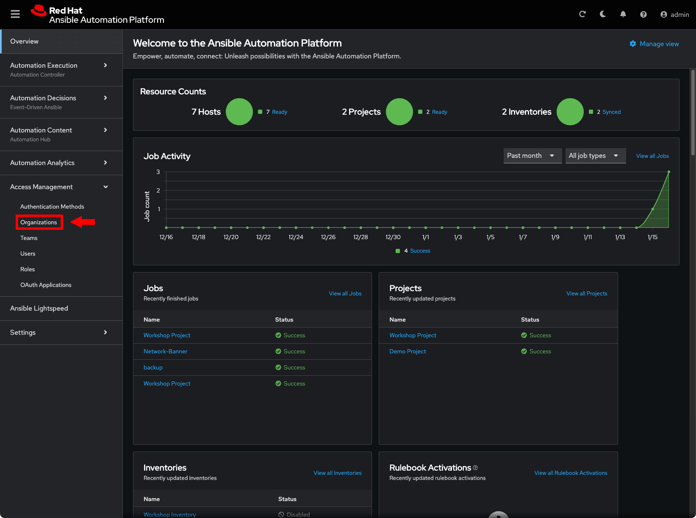
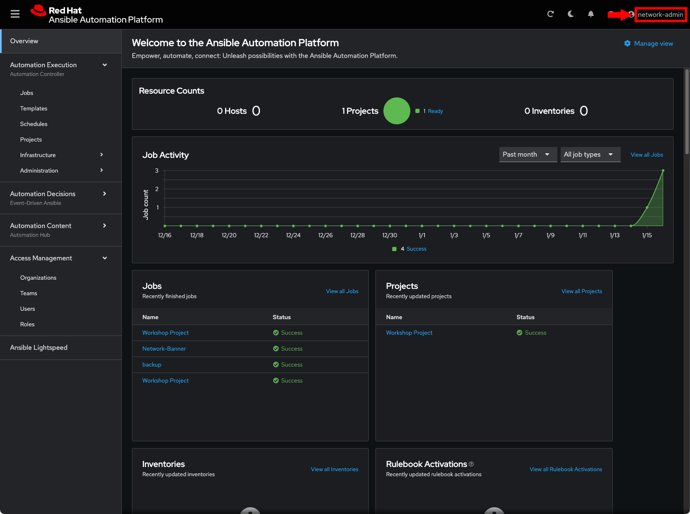
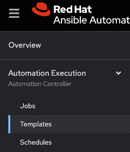
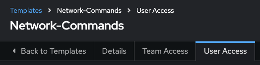
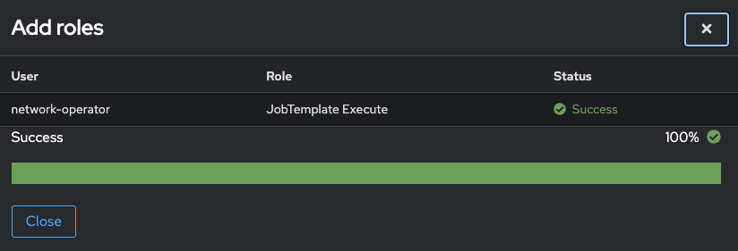
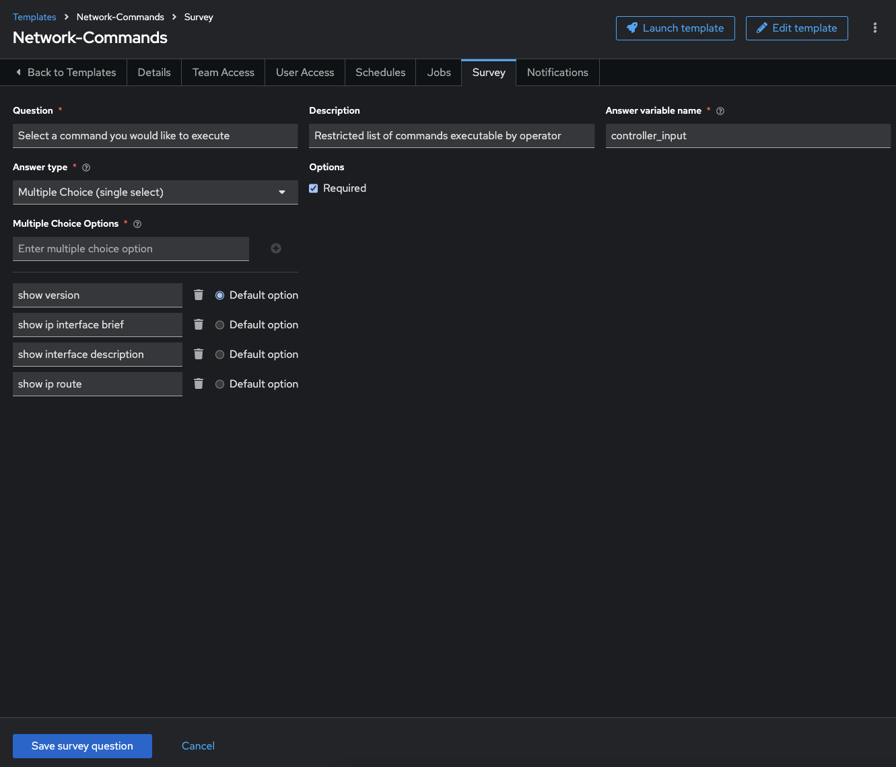

# Exercice 8 : Comprendre le RBAC dans le Contrôleur d'Automatisation

**Lisez ceci dans d'autres langues** :  [English](README.md),  [日本語](README.ja.md),  [Español](README.es.md),  [Français](README.fr.md).

## Table des matières

- [Exercice 8 : Comprendre le RBAC dans le Contrôleur d'Automatisation](#exercice-8--comprendre-le-rbac-dans-le-contrôleur-dautomatisation)
  - [Table des matières](#table-des-matières)
  - [Objectif](#objectif)
  - [Guide](#guide)
    - [Étape 1 : Accéder aux Organisations](#étape-1--accéder-aux-organisations)
    - [Étape 2 : Ouvrir l'Organisation réseau](#étape-2--ouvrir-lorganisation-réseau)
    - [Étape 3 : Ajouter `network-admin` comme administrateur](#étape-3--ajouter-network-admin-comme-administrateur)
    - [Étape 4 : Se connecter en tant que `network-admin`](#étape-4--se-connecter-en-tant-que-network-admin)
    - [Étape 5 : Accorder l'accès au modèle de job à `network-operator`](#étape-5--accorder-laccès-au-modèle-de-job-à-network-operator)
    - [Étape 6 : Vérifier le modèle de job `Network-Commands`](#étape-6--vérifier-le-modèle-de-job-network-commands)
    - [Étape 7 : Se connecter en tant que `network-operator`](#étape-7--se-connecter-en-tant-que-network-operator)
    - [Étape 8 : Lancer un modèle de job](#étape-8--lancer-un-modèle-de-job)
    - [Étape Bonus](#étape-bonus)
  - [Points Clés](#points-clés)
  - [Conclusion](#conclusion)

## Objectif

L'un des principaux avantages de l'utilisation du Contrôleur d'Automatisation est le contrôle des utilisateurs du système. L'objectif de cet exercice est de comprendre les Contrôles d'Accès Basés sur les Rôles ([RBAC](https://docs.ansible.com/automation-controller/latest/html/userguide/security.html#role-based-access-controls)). Ces RBAC permettent aux administrateurs de définir des organisations, des équipes et des rôles, ainsi que d'y associer des utilisateurs. Cela permet aux organisations de sécuriser le système d'automatisation tout en respectant les exigences de conformité.

## Guide

Voici quelques définitions clés :

* **Organisations** : Définissent une entité, par exemple *Réseau* ou *Systèmes*. Cela peut refléter la structure interne d'une organisation cliente.
* **Équipes** : Au sein de chaque organisation, il peut y avoir plusieurs équipes, par exemple *support-niveau-1*, *support-niveau-2*, *équipe-bâtiment*, etc.
* **Utilisateurs** : Les utilisateurs appartiennent généralement à des équipes. Ce qu'un utilisateur peut faire est défini par ses **rôles**.
* **Rôles** : Définissent les actions autorisées pour un utilisateur. Cela peut correspondre à des rôles de type support-niveau-1, support-niveau-2, administrateur senior, etc. La [documentation](https://docs.ansible.com/automation-controller/latest/html/userguide/security.html#built-in-roles) du Contrôleur d'Automatisation décrit des rôles prédéfinis.

### Étape 1 : Accéder aux Organisations

* Connectez-vous au Contrôleur d'Automatisation avec l'utilisateur **admin**.

  | Paramètre | Valeur |
  |---|---|
  | Nom d'utilisateur | `admin` |
  | Mot de passe | Fournit par l'instructeur |

* Confirmez que vous êtes connecté en tant qu'utilisateur **admin**.

  

* Sous la section **Gestion des Accès**, cliquez sur **Organisations**.

En tant qu'utilisateur `admin`, vous pouvez voir toutes les organisations configurées pour le Contrôleur d'Automatisation :

* Examinez les organisations.

Il existe deux organisations (en plus de l'organisation par défaut) :

1. **Red Hat compute organization**
2. **Red Hat network organization**

   

> Note :
>
> Cette page vous donne un résumé de toutes les équipes, utilisateurs, inventaires, projets et modèles de job associés.
>
> Si un administrateur de niveau Organisation est configuré, vous le verrez également.

### Étape 2 : Ouvrir l'Organisation réseau

1. Cliquez sur l'organisation **Red Hat network organization**.

   Cette action ouvre une section affichant les détails de l'organisation.

   

### Étape 3 : Ajouter `network-admin` comme administrateur

1. Cliquez sur l'onglet **Administrateurs**.

   

2. Cliquez sur le bouton bleu **Ajouter des administrateurs** :

   

3. Sélectionnez l'utilisateur **network-admin**, puis cliquez sur le bouton bleu **Ajouter des administrateurs**.

   

### Étape 4 : Se connecter en tant que `network-admin`

1. Déconnectez-vous de l'utilisateur admin en cliquant sur le bouton admin en haut à droite de l'interface utilisateur :

   

2. Connectez-vous avec l'utilisateur **network-admin**.

   | Paramètre | Valeur |
   |---|---|
   | Nom d'utilisateur | network-admin |
   | Mot de passe | Fournit par l'instructeur |

3. Confirmez que vous êtes connecté en tant qu'utilisateur **network-admin**.

   

4. Cliquez sur le lien **Organisations** dans la barre latérale sous la section `Gestion des Accès`.

  Vous remarquerez que vous avez uniquement accès à l'organisation dont vous êtes administrateur, soit **Red Hat network organization**.

  Les deux organisations suivantes ne sont plus visibles :

  * `Red Hat compute organization`
  * `Default`

> Étape Bonus :
>
> Essayez cette action avec l'utilisateur `network-operator` (même mot de passe que `network-admin`).
> Quelle est la différence entre `network-operator` et `network-admin` ?
> En tant que `network-operator`, pouvez-vous voir d'autres utilisateurs ?
> Pouvez-vous ajouter un nouvel utilisateur ou modifier les informations d'un utilisateur ?

### Étape 5 : Accorder l'accès au modèle de job à `network-operator`

En tant qu'utilisateur `network-admin`, nous pouvons maintenant configurer l'accès pour `network-operator`.

1. Cliquez sur **Modèles** dans le menu de gauche.

   

2. Cliquez sur le modèle de job `Network-Commands`.

   

3. Cliquez sur l'onglet `Accès`.

   

4. Cliquez sur le bouton bleu `Ajouter des rôles`.

   

5. Cliquez sur `network-operator`, puis cliquez sur le bouton bleu `Suivant` en bas.

   

6. Cliquez sur `Exécuter Modèle de job`, puis sur le bouton bleu `Suivant`.

   

7. Vérifiez que tout est correctement configuré, puis cliquez sur le bouton bleu `Terminer`.

   

8. Cliquez sur le bouton `Fermer` après l'application du rôle.

   

### Étape 6 : Vérifier le Modèle de job `Network-Commands`

1. Retournez au Modèle de job `Network-Commands`.

   

2. Vérifiez que l'Enquête est activée.

  

3. Vérifiez les questions de l'Enquête.

   

4. Cliquez sur le bouton bleu `Enregistrer la question de l'enquête`.

### Étape 7 : Se connecter en tant que `network-operator`

Pour voir le RBAC en action !

1. Déconnectez-vous de l'utilisateur admin et reconnectez-vous en tant que **network-operator**.

   | Paramètre | Valeur |
   |---|---|
   | Nom d'utilisateur | `network-operator` |
   | Mot de passe | Fournit par l'instructeur |

2. Naviguez vers **Modèles** sous la section Automation Execution, puis cliquez sur le Modèle de job **Network-Commands**.

   

> Note :
>
> En tant qu'utilisateur `network-operator`, vous n'avez pas la possibilité de modifier les champs. Le bouton **Modifier** n'est plus disponible.

### Étape 8 : Lancer un modèle de job

1. Lancez le modèle de job **Network-Commands** en cliquant sur le bouton **Lancer**.

2. Une boîte de dialogue vous invitera à choisir l'une des commandes préconfigurées.

   

3. Choisissez une commande, cliquez sur **Suivant**, puis sur **Lancer** pour voir l'exécution du playbook et les résultats affichés.

### Étape Bonus

Si le temps le permet, reconnectez-vous en tant que network-admin et ajoutez une autre commande à exécuter par l'opérateur. Cela vous permettra de voir comment le rôle d'administrateur permet de modifier le modèle de job.

## Points Clés

<ul>
  <li>
    Avec la puissante fonctionnalité <strong>RBAC</strong> de la Plateforme d'Automatisation Ansible, il est facile de restreindre l'accès des opérateurs à des commandes prédéfinies sur les systèmes de production sans leur donner accès direct aux systèmes eux-mêmes.
  </li>
  <li>
    La Plateforme d'Automatisation Ansible peut prendre en charge plusieurs <code>Organisations</code>, <code>Équipes</code> et <code>Utilisateurs</code>. Bien que non abordé dans cet exercice, il est possible d'utiliser une <a target="_blank" href="https://docs.redhat.com/en/documentation/red_hat_ansible_automation_platform/latest/html-single/access_management_and_authentication/index#gw-config-authentication-type">authentification d'entreprise</a> incluant Active Directory, LDAP, RADIUS, SAML et TACACS+.
  </li>
  <li>
    Si une exception est nécessaire (un utilisateur a besoin d'un accès spécifique sans que toute son équipe n'y ait accès), cela est également possible. La granularité du RBAC peut aller jusqu'à l'identifiant, l'inventaire ou le Modèle de job pour un utilisateur individuel.
  </li>
</ul>

## Conclusion

Vous avez complété l'exercice 8.

---
[Exercice précédent](../7-controller-survey/) | [Exercice suivant](../9-controller-workflow/README.fr.md)

[Retour à l'atelier d'automatisation réseau Ansible](../README.fr.md)

