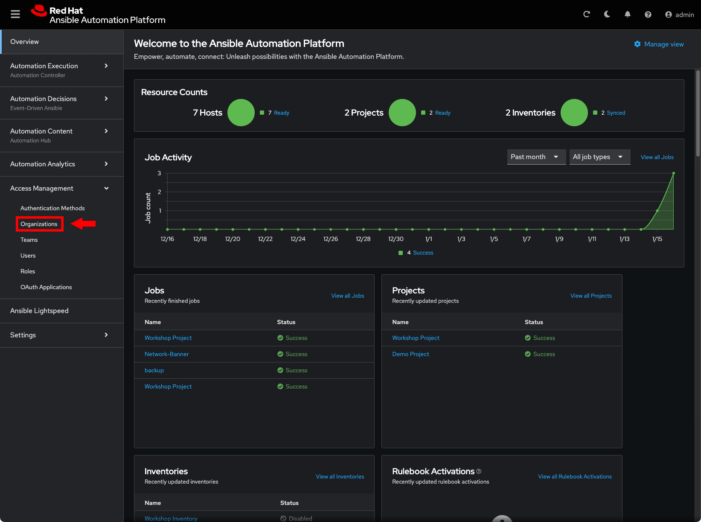
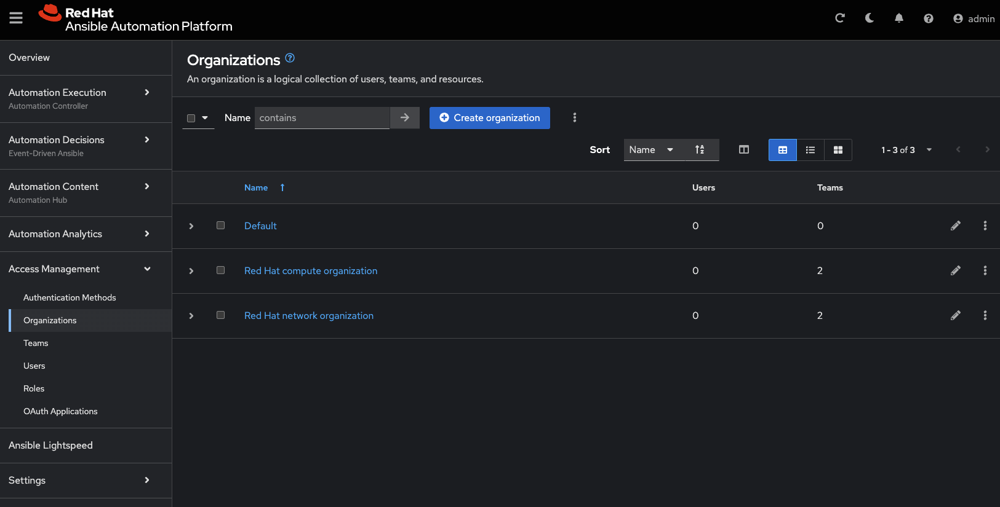
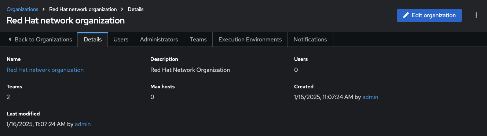
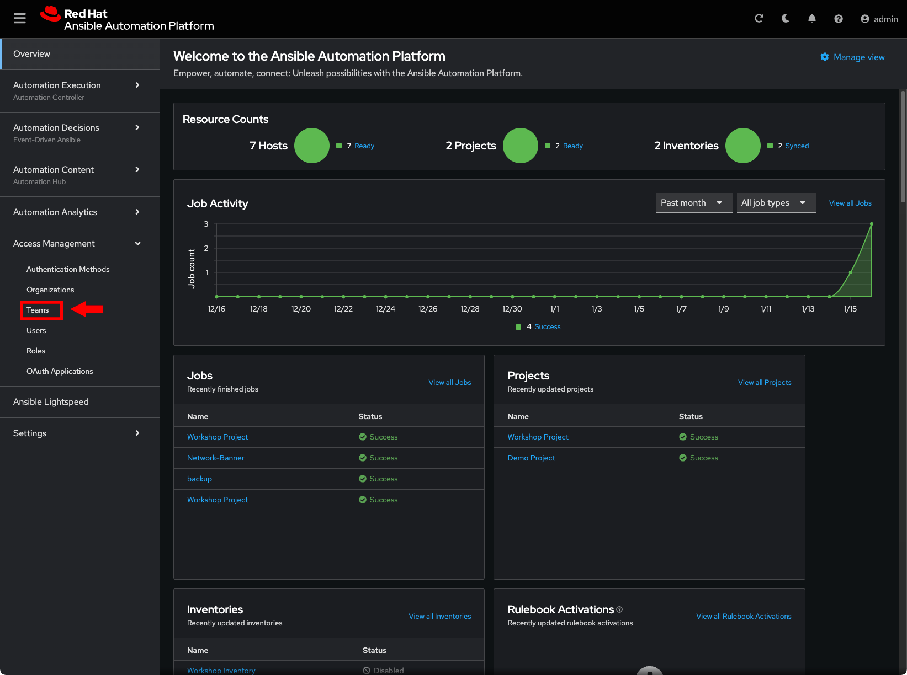
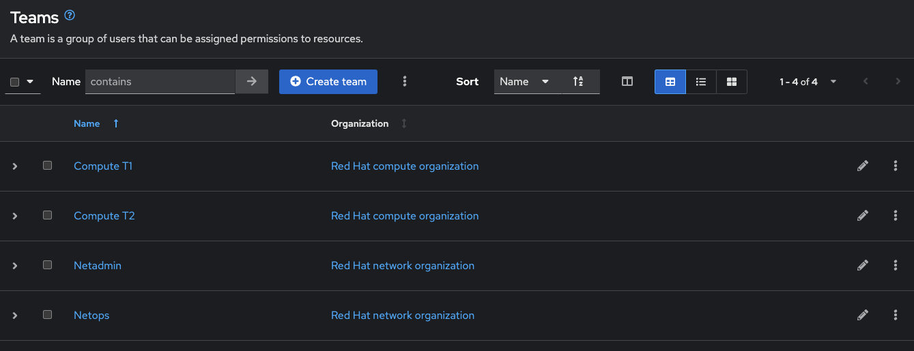
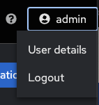
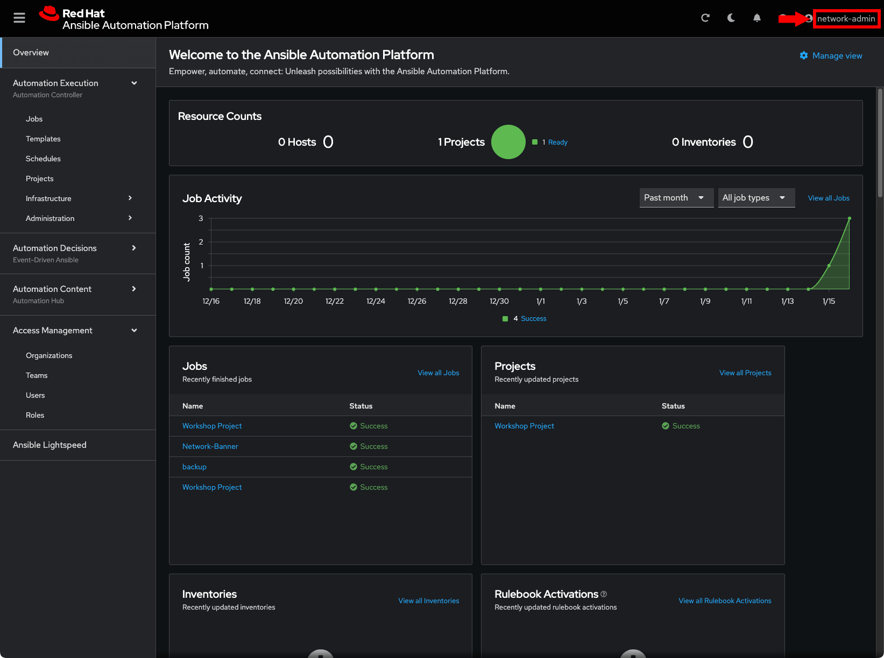
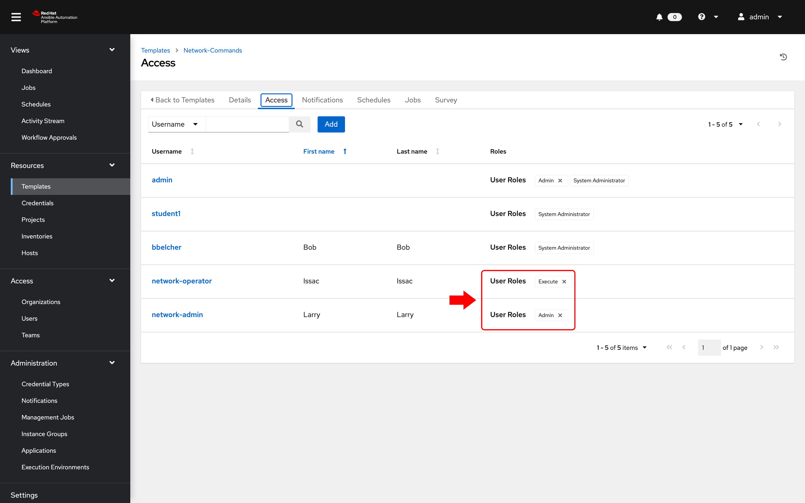
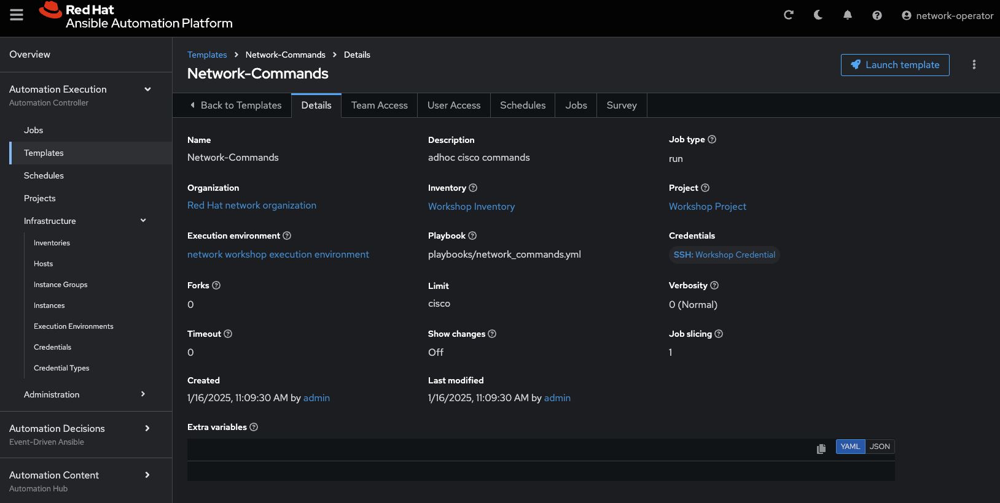
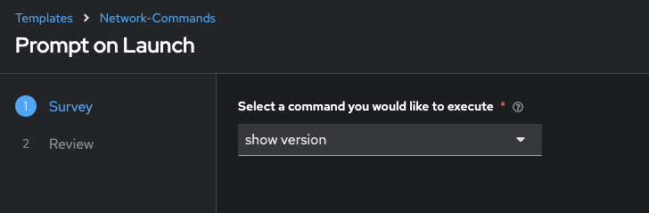

# Exercise 8: Understanding RBAC in Automation controller

**Read this in other languages**:  [English](README.md),   [日本語](README.ja.md).

## Table of Contents

  * [Objective](#objective)
  * [Guide](#guide)
    * [Step 1: Opening up Organizations](#step-1-opening-up-organizations)
    * [Step 2: Open the network organization](#step-2-open-the-network-organization)
    * [Step 3: Examine Teams](#step-3-examine-teams)
    * [Step 4: Examine the Netops Team](#step-4-examine-the-netops-team)
    * [Step 5: Login as network-admin](#step-5-login-as-network-admin)
    * [Step 6: Understand Team Roles](#step-6-understand-team-roles)
    * [Step 7: Job Template Permissions](#step-7-job-template-permissions)
    * [Step 8: Login as network-operator](#step-8-login-as-network-operator)
    * [Step 9: Launching a Job Template](#step-9-launching-a-job-template)
    * [Bonus Step](#bonus-step)
  * [Takeaways](#takeaways)
  * [Complete](#complete)

## Objective

One of the key benefits of using Automation controller is the control of users that use the system. The objective of this exercise is to understand Role Based Access Controls ([RBACs](https://docs.ansible.com/automation-controller/latest/html/userguide/security.html#role-based-access-controls)) with which Automation controller admins can define tenancies, teams, roles and associate users to those roles. This gives organizations the ability to secure the automation system and satisfy compliance goals and requirements.

## Guide

Lets review some Automation controller terminology:

* **Organizations:** Defines a tenancy for example *Network-org*, *Compute-org*. This might be reflective of internal organizational structure of the customer's organization.
* **Teams:** Within each organization, there may be more than one team. For instance *tier1-helpdesk*, *tier2-support*, *tier3-support*, *build-team* etc.
* **Users:** Users typically belong to teams. What the user can do within Automation controller is controlled/defined using **roles**
* **Roles:** Roles define what actions a user may perform. This can map very nicely to typical network organizations that have restricted access based on whether the user is a Level-1 helpdesk person, Level-2 or senior admin. Automation controller [documentation](https://docs.ansible.com/automation-controller/latest/html/userguide/security.html#built-in-roles)defines a set of built-in roles.

### Step 1: Opening up Organizations

* Login to Automation controller with the **admin** user.

  | Parameter | Value |
  |---|---|
  | username  | `admin`  |
  |  password|  provided by instructor |

* Confirm that you are logged in as the **admin** user.

  

* Under the **Access** section, click on **Organizations**

  As the *admin* user, you will be able to view all organizations configured for Automation controller:

  <table>
  <thead>
    <tr>
      <th>Note: The orgs, teams and users were auto-populated for this workshop</th>
    </tr>
  </thead>
  </table>

* Examine the organizations

  There are 2 organizations (other than Default):

  * **Red Hat compute organization**
  * **Red Hat network organization**

   

   <table>
   <thead>
     <tr>
       <th>Observe that this page gives you a summary of all the teams, users, inventories, projects and job templates associated with it. If a Organization level admin is configure you will see that as well.</th>
     </tr>
   </thead>
   </table>

### Step 2: Open the network organization

1. Click on the **Red Hat network organization**.

   This brings up a section that displays the details of the organization.

   

2. Click on the **Access** tab to see users associated with this organization.

   <table>
   <thead>
    <tr>
      <th>Observe that both the <b>network-admin</b> and <b>network-operator</b> users are associated with this organization.</th>
    </tr>
   </thead>
   </table>

### Step 3: Examine Teams

1. Click on **Teams** in the sidebar

   

2. Examine the teams.  The Automation controller admin  will be able to see all available teams.  There are four teams:

   * Compute T1
   * Compute T2
   * Netadmin
   * Netops

   

### Step 4: Examine the Netops Team

* Click on the **Netops** Team and then click on the **Access** tab. Take note  to two particular users:

  * network-admin
  * network-operator

  

* Observe the following two points:

  * The **network-admin** user has administrative privileges for the **Red Hat network organization**
  * The **network-operator** is simply a member of the Netops team. We will dive into each of these users to understand the roles

### Step 5: Login as network-admin

* Log out from the admin user by clicking the admin button in the top right corner of the Automation controller UI:

   

* Login to the system with the **network-admin** user.

  | Parameter | Value |
  |---|---|
  | username  | network-admin  |
  |  password|  provided by instructor |

* Confirm that you are logged in as the **network-admin** user.

  

* Click on the **Organizations** link on the sidebar.

  You will notice that you only have visibility to the organization you are an admin of, the **Red Hat network organization**.

  The following two Organizations are not seen anymore:

  * Red Hat compute organization
  * Default

* Bonus step: Try this as the network-operator user (same password as network-admin).

   * What is the difference between network-operator and network-admin?
   * As the network operator are you able to view other users?
   * Are you able to add a new user or edit user credentials?

### Step 6: Understand Team Roles

1. To understand how different roles and therefore RBACs may be applied, log out and log back in as the **admin** user.

2. Navigate to **Inventories** and click on the  **Workshop Inventory**

3. Click on the **Access** button

   

4. Examine the permissions assigned to each user

   

   <table>
   <thead>
     <tr>
       <th>Note: <b>ROLES</b> assigned for the <b>network-admin</b> and <b>network-operator</b> users. By assigning the <b>Use</b> Role, the <b>network-operator</b> user has been granted permission to use this particular inventory.</th>
     </tr>
   </thead>
   </table>

### Step 7: Job Template Permissions

1. Click on the **Templates** button in the left menu

2. Click on the **Network-Commands** Job Template

3. Click on the **Access** button at the top

   

   <table>
   <thead>
     <tr>
       <th>Note: the same users have different roles for the job template. This highlights the granularity operators can introduce with Automation controller in controlling "Who gets access to what". In this example, the network-admin can update (<b>Admin</b>) the <b>Network-Commands</b> job template, whereas the network-operator can only <b>Execute</b> it.</th>
     </tr>
   </thead>
   </table>

### Step 8: Login as network-operator

Finally, to see the RBAC in action!

1. Log out at admin and log back in as the **network-operator** user.

   | Parameter | Value |
   |---|---|
   | username  | `network-operator`  |
   |  password|  provided by instructor |

2. Navigate to **Templates** and click on the **Network-Commands** Job Template.

   

   <table>
   <thead>
     <tr>
       <th>Note that, as the <b>network-operator</b> user, you will have no ability to change any of the fields.  The <b>Edit</b> button is no longer available.</th>
     </tr>
   </thead>
   </table>

### Step 9: Launching a Job Template

1. Launch the **Network-Commands** template by clicking on the **Launch** button:

4. You will be prompted by a dialog-box that lets you choose one of the pre-configured show commands.

   

5. Go ahead and choose a command and click **Next** and then **Launch** to see the playbook being executed and the results being displayed.

### Bonus Step

If time permits, log back in as the network-admin and add another show command you would like the operator to run. This will also help you see how the *Admin* Role of the network-admin user allows you to edit/update the job template.

## Takeaways

* Using Automation controller's powerful RBAC feature, you can see it is easy to restrict access to operators to run prescribed commands on production systems without requiring them to have access to the systems themselves.
* Automation controller can support multiple Organizations, multiple Teams and users.  Users can even belong to multiple Teams and Organizations if needed.  Something not covered in this exercise is that we do not need to manage users in Automation controller, we can use [enterprise authentication](https://docs.ansible.com/automation-controller/latest/html/administration/ent_auth.html) including Active Directory, LDAP, RADIUS, SAML and TACACS+.
* If there needs to be an exception (a user needs access but not his entire team) this is also possible.  The granularity of RBAC can be down to the credential, inventory or Job Template for an individual user.

## Complete

You have completed lab exercise 8

---
[Previous Exercise](../7--controller-survey/README.md) | [Next Exercise](../9-controller-workflow/README.md)

[Click here to return to the Ansible Network Automation Workshop](../README.md)
