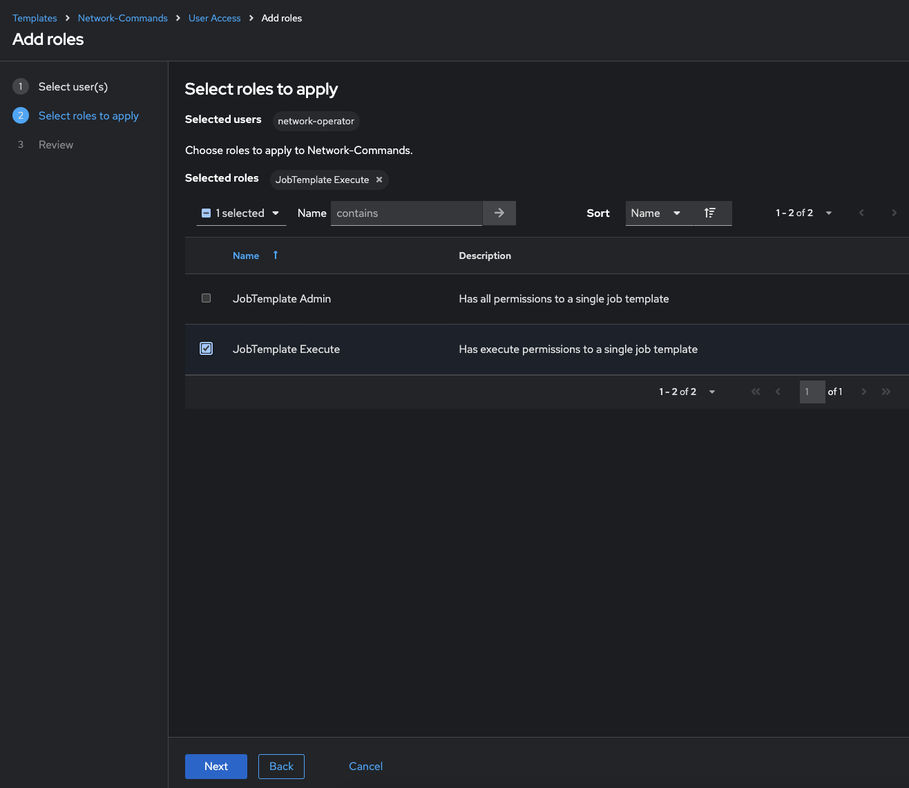
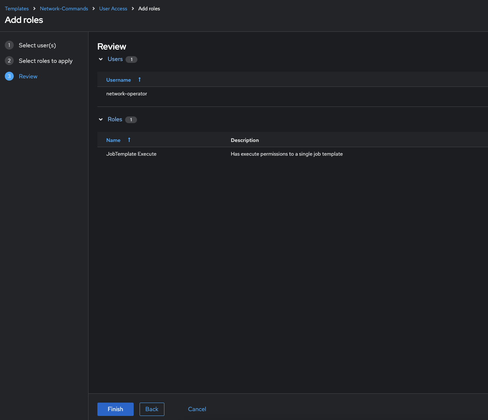

# Exercise 8: Understanding RBAC in Automation controller

**Read this in other languages**:  [English](README.md),  [日本語](README.ja.md),  [Español](README.es.md),  [Français](README.fr.md).

## Table of Contents

- [Exercise 8: Understanding RBAC in Automation controller](#exercise-8-understanding-rbac-in-automation-controller)
  - [Table of Contents](#table-of-contents)
  - [Objective](#objective)
  - [Guide](#guide)
    - [Step 1: Opening up Organizations](#step-1-opening-up-organizations)
    - [Step 2: Open the network organization](#step-2-open-the-network-organization)
    - [Step 3: Add network-admin as an administrator](#step-3-add-network-admin-as-an-administrator)
    - [Step 4: Login as network-admin](#step-4-login-as-network-admin)
    - [Step 5: Give job template access to the network-operator user](#step-5-give-job-template-access-to-the-network-operator-user)
    - [Step 6: Verify the Network-Commands job template](#step-6-verify-the-network-commands-job-template)
    - [Step 7: Login as network-operator](#step-7-login-as-network-operator)
    - [Step 8: Launching a Job Template](#step-8-launching-a-job-template)
    - [Bonus Step](#bonus-step)
  - [Takeaways](#takeaways)
  - [Complete](#complete)

## Objective

One of the key benefits of using Automation controller is the control of users that use the system. The objective of this exercise is to understand Role Based Access Controls ([RBACs](https://docs.ansible.com/automation-controller/latest/html/userguide/security.html#role-based-access-controls)) with which Automation controller admins can define tenancies, teams, roles and associate users to those roles. This gives organizations the ability to secure the automation system and satisfy compliance goals and requirements.

## Guide

Lets review some Automation controller terminology:

* **Organizations:** Defines a tenancy for example *Network-org*, *Compute-org*. This might be reflective of internal organizational structure of the customer's organization.
* **Teams:** Within each organization, there may be more than one team. For instance *tier1-helpdesk*, *tier2-support*, *tier3-support*, *build-team* etc.
* **Users:** Users typically belong to teams. What the user can do within Automation controller is controlled/defined using **roles**
* **Roles:** Roles define what actions a user may perform. This can map very nicely to typical network organizations that have restricted access based on whether the user is a Level-1 helpdesk person, Level-2 or senior admin. Automation controller [documentation](https://docs.ansible.com/automation-controller/latest/html/userguide/security.html#built-in-roles)defines a set of built-in roles.

### Step 1: Opening up Organizations

* Login to Automation controller with the **admin** user.

  | Parameter | Value |
  |---|---|
  | username  | `admin`  |
  |  password|  provided by instructor |

* Confirm that you are logged in as the **admin** user.

  

* Under the **Access Management** section, click on **Organizations**

  As the `admin` user, you will be able to view all organizations configured for Automation controller:

  <table>
  <thead>
    <tr>
      <th>Note: The orgs, teams and users were auto-populated for this workshop</th>
    </tr>
  </thead>
  </table>

* Examine the organizations

  There are 2 organizations (other than Default):
   1.  **Red Hat compute organization**
   2.  **Red Hat network organization**

   

> Note:
>
> This page gives you a summary of all the teams, users, inventories, projects and job templates associated with it.
> If a Organization level admin is configure you will see that as well.

### Step 2: Open the network organization

1. Click on the **Red Hat network organization**.

   This brings up a section that displays the details of the organization.

   

### Step 3: Add network-admin as an administrator

1. Click on the **Administrators** tab

   

2. Click on the blue **Add administrators** button:

   

3. Select the **network-admin** user and then click the blue **Add administrators** button

   

### Step 4: Login as network-admin

1. Log out from the admin user by clicking the admin button in the top right corner of the Automation controller UI:

   

2. Login to the system with the **network-admin** user.

   | Parameter | Value |
   |---|---|
   | username  | network-admin  |
   |  password|  provided by instructor |

3. Confirm that you are logged in as the **network-admin** user.

   

4. Click on the **Organizations** link on the sidebar under the `Access Management` section.

  You will notice that you only have visibility to the organization you are an admin of, the **Red Hat network organization**.

  The following two Organizations are not seen anymore:

  * `Red Hat compute organization`
  * `Default`

> Bonus step:
>
> Try this as the network-operator user (same password as network-admin).
> What is the difference between `network-operator` and `network-admin`?
> As the `network-operator` are you able to view other users?
> Are you able to add a new user or edit user credentials?

### Step 5: Give job template access to the network-operator user

As the `network-admin` we can now setup access for the `network-operator` user.

1. Click on Templates on the left menu

   

2. Click on the `Network-Commands` job template.

   

3. Click on the `User Access` tab

   

4. Click on the blue `Add roles` button

   

5. Click `network-operator` then click the blue `Next` button at the bottom

   

6. Click on  `JobTemplate Execute` then click on the blue `Next button at the bottom

   

7. Review to make sure you set it up correctly, and click the blue `Finish` button at the bottom.

   

8. Click the `Close` button after the role is applied

   

### Step 6: Verify the Network-Commands job template

1. Navigate back to the `Network-Commands` Job Template

   

2. Verify the Survey is enabled

  

3. Verify the Survey questions

   

4. Click on the blue `Save survey question`

### Step 7: Login as network-operator

Finally, to see the RBAC in action!

1. Log out at admin and log back in as the **network-operator** user.

   | Parameter | Value |
   |---|---|
   | username  | `network-operator`  |
   |  password|  provided by instructor |

2. Navigate to **Templates** under the Automation Execution section, and click on the **Network-Commands** Job Template.

   

> Note:
>
> The `network-operator` user, you will have no ability to change any of the fields.  The **Edit** button is no longer available

### Step 8: Launching a Job Template

1. Launch the **Network-Commands** template by clicking on the **Launch** button:

4. You will be prompted by a dialog-box that lets you choose one of the pre-configured show commands.

   

5. Go ahead and choose a command and click **Next** and then **Launch** to see the playbook being executed and the results being displayed.

### Bonus Step

If time permits, log back in as the network-admin and add another show command you would like the operator to run. This will also help you see how the *Admin* Role of the network-admin user allows you to edit/update the job template.

## Takeaways

<ul>
  <li>
    Using Ansible Automation Platform's powerful <strong>RBAC</strong> feature, you can see it is easy to restrict access to operators to run prescribed commands on production systems without requiring them to have access to the systems themselves.
  </li>
  <li>
    Ansible Automation Platform can support multiple <code>Organizations</code>, multiple <code>Teams</code>, and <code>Users</code>. Something not covered in this exercise is that we do not need to manage users in Ansible Automation Platform; we can use <a target="_blank" href="https://docs.redhat.com/en/documentation/red_hat_ansible_automation_platform/latest/html-single/access_management_and_authentication/index#gw-config-authentication-type" target="_blank">enterprise authentication</a> including Active Directory, LDAP, RADIUS, SAML, and TACACS+.
  </li>
  <li>
    If there needs to be an exception (a user needs access but not their entire team), this is also possible. The granularity of RBAC can be down to the credential, inventory, or Job Template for an individual user.
  </li>
</ul>

## Complete

You have completed lab exercise 8

---
[Previous Exercise](../7-controller-survey/) | [Next Exercise](../9-controller-workflow/README.md)

[Click here to return to the Ansible Network Automation Workshop](../README.md)
