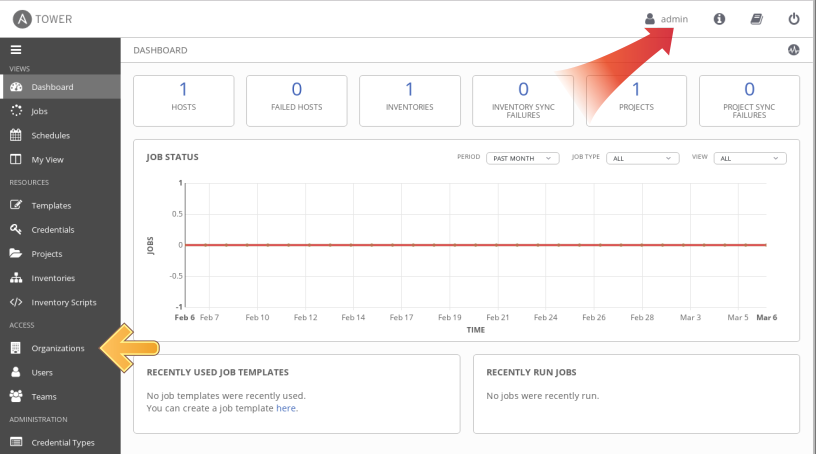
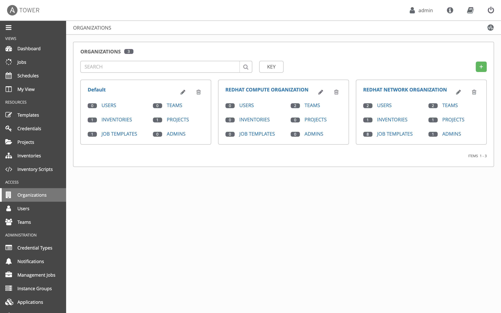
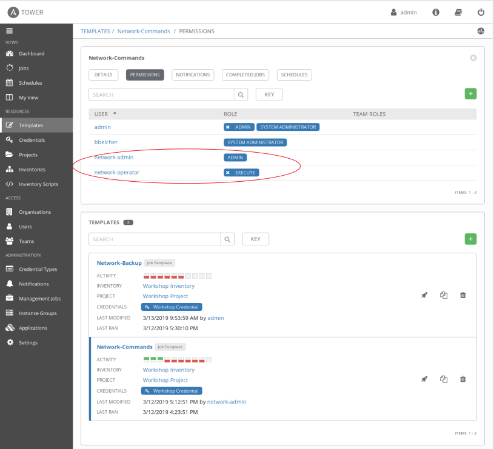
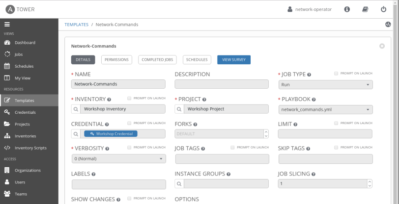
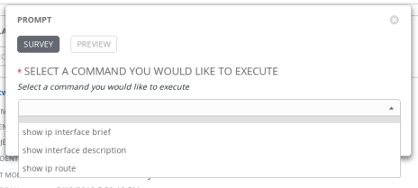

# Exercise 8: RBAC によるアクセスコントロール

**別の言語で読む**:  [English](README.md),   [日本語](README.ja.md).

## Table of Contents

- [Objective](#Objective)
- [Guide](#Guide)
  - [Step 1: Login as network-admin](#step-1-login-as-network-admin)
  - [Step 2: Open the NETWORK ORGANIZATION](#step-2-open-the-network-organization)
  - [Step 3: Examine Teams](#step-3-examine-teams)
  - [Step 4: Examine the Netops Team](#step-4-examine-the-netops-team)
  - [Step 5: Login as network-admin](#step-5-login-as-network-admin)
  - [Step 6: Understand Team Roles](#step-6-understand-team-roles)
  - [Step 7: Job Template Permissions](#step-7-job-template-permissions)
  - [Step 8: Login as network-operator](#Step-8-login-as-network-operator)
  - [Step 9: Launching a Job Template](#step-9-launching-a-job-template)
  - [Bonus Step](#bonus-step)
- [Takeaways](#takeaways)

# Objective

Ansible Tower を利用するメリットとして、システムを利用するユーザーのコントロールがあります。 この演習の目的は、管理者が定義できるテナント、チーム、ロールと、これらの役割に割り当てるユーザーを使って、ロールベースのアクセス制御([RBAC](https://docs.ansible.com/ansible-tower/latest/html/userguide/security.html#role-based-access-controls))を理解することです。これは組織にセキュアな自動化システムとコンプライアンス要件の達成をサポートします。

# Guide

いくつかの Ansible Tower 用語を確認します:

- **Organizations:** テナントを定義します。例、 *Network-org* 、 *Compute-org* 。 これは顧客の組織の内部構造を写したものになるかもしれません。
- **Teams:** 各 organization 内で複数のチームがあるかもしれません。例えば、 *tier1-helpdesk*, *tier2-support*, *tier3-support*, *build-team* などです。
- **Users:** 一般的にユーザーはチームに所属します。Tower でユーザーは何ができるかは **role** によって制御、定義されます。
- **Roles:** ロールはユーザーが実行可能なアクションを定義します。この仕組みは、Lv1 ヘルプデスクのメンバー、Lv2 または上級管理者といった役割に応じたアクセス制限を設けている一般的なネットワーク組織とうまくマッピングすることができるはずです。Tower は組み込みの role セットを持っています。[documentation ](https://docs.ansible.com/ansible-tower/latest/html/userguide/security.html#built-in-roles) 

より詳細な RBAC 関連の用語に関しては [documentation](https://docs.ansible.com/ansible-tower/latest/html/userguide/security.html#role-based-access-controls) を参照してください。

## Step 1: Opening up Organizations

1. Tower へ **admin** ユーザーでログインします。

   | Parameter | Value |
   |---|---|
   | username  | `admin`  |
   |  password|  講師から指示があります |

2. **admin** としてログインしたことを確認してください。

   

3. 左メニューから **ACCESS** の下の **Organizations** をクリックします。

   *admin* ユーザーの時には、Tower 上で構成されている全ての組織を確認できます:

   >Note: 組織、チーム、ユーザーは演習のために自動作成されています。

4. 組織の確認

   2つの組織が作成されています(他はデフォルトで存在している組織です):

   1. **RED HAT COMPUTE ORGANIZATION**
   2. **RED HAT NETWORK ORGANIZATION**

   

   >このページでは、組織に割り当てられている全てのチーム、ユーザー、インベントリー、プロジェクト、ジョブテンプレートのサマリーが確認できます。他のユーザーでも、組織レベルの管理者権限が設定されている場合には同じ画面を確認することができます。

## Step 2: Open the NETWORK ORGANIZATION

1. **RED HAT NETWORK ORGANIZATION** をクリックしてください。

   組織の詳細を表示する画面が表示されます。

   

2. **USERS** をクリックすると、この組織に割り当てられているユーザーを確認できます。

   >**network-admin** と **network-operator** ユーザーの両方がこの組織に割り当てられていることを確認します。

## Step 3: Examine Teams

1. サイドバーの **TEAMS** をクリックします。

   

2. チームを確認します。Ansible Tower 管理者は全ての有効なチームを確認できます。ここでは4つのチームが存在します:

     1. Compute T1
     2. Compute T2
     3. Netadmin
     4. Netops

   

## Step 4: Examine the Netops Team

1. **Netops** チームをクリックし、その後に **USERS** ボタンをクリックします。ここには2つの特定ユーザーがいることに注意してください:

   1. network-admin
   2. network-operator

   

2. 以下の2つを確認します:

   1. **network-admin** ユーザーは **RED HAT NETWORK ORGANIZATION** の管理者権限を持っています。
   2. **network-operator** は Netops チームの一般メンバーです。ロールについ理解するために、それぞれのユーザーでログインします。

## Step 5: Login as network-admin

1. Tower 右上の電源アイコンボタンをクリックして admin をログアウトします:

   電源アイコン: 

2. **network-admin** ユーザーで再ログインします。

   | Parameter | Value |
   |---|---|
   | username  | network-admin  |
   |  password|  講師から指示があります |

3. **network-admin** でログインしていることを確認してください。

   

4. サイドバーから **Organizations** をクリックします。

   自分が管理者である **REDHAT NETWORK ORGANIZATION** のみが確認できることに注目してください。

   以下の2つの組織は表示されません:
    - REDHAT COMPUTE ORGANIZATION
    - Default

5. オプション: network-operator ユーザーで同じ手順を実行します(パスワードは network-admin と同じです)。

   - どのような違いが確認できるでしょうか？
   - network-operator は他のユーザーを確認できますか？
   - 新しいユーザーを追加したり、資格情報の編集を行えますか？

## Step 6: Understand Team Roles

1. ロールの違いと RBAC の割当てを理解するために、**admin** ユーザーでログインし直します。

2. **Inventories** へ移動し、 **Workshop Inventory** をクリックします。

3. **PERMISSIONS** ボタンをクリックします。

   

4.  それぞれのユーザーへの権限の割当てを確認します。

   

   **network-admin** と **network-operator** ユーザーに割り当てられた **TEAM ROLE** に注意してください。 **network-operator** は **USE** ロールを割り当てられたことで、このインベントリーを使用する権限を得ています。

## Step 7: Job Template Permissions

1. 左メニューから **Templates** をクリックします。

2. **Network-Commands** ジョブを選択します。

3. 上部の **PERMISSIONS** ボタンをクリックします。

   

   >先と同じユーザーがジョブテンプレートに対しては異なるロールを持っていることに注意してください。Ansible Tower では「誰が何にアクセス可能か」を操作の粒度で指定できることに注目してください。この例では、network-admin は **Network-Commands** を更新(**ADMIN**)できますが、network-operator は実行(**EXECUTE**) しかできません。

## Step 8: Login as network-operator

最後に操作を実行して RBAC を確認します。

1. admin からログアウトし、**network-operator** ユーザーでログインし直します。

   | Parameter | Value |
   |---|---|
   | username  | `network-operator`  |
   |  password|  講師から指示されます |

2. **Templates** へ移動し、**Network-Commands** をクリックします。

   

3. ここで、 *network-operator* ユーザーはどのフィールドも変更できないことに注目してください。

## Step 9: Launching a Job Template

1. `network-operator` ユーザーでログインしていることを確認します。

2. サイドバーの **Templates** を再びクリックします。

3. 今回は **Network-Commands** のロケットアイコンをクリックしてジョブを起動します:

   

4. 事前設定された、show コマンドを1つ選択するプロンプトが表示されます。

   

5. 1つのコマンドを選択して、**Next** 、 **Launch** と選択し Playbook が実行され結果が表示されることを確認します。

## Bonus Step

時間に余裕があれば、network-admin でログインし直して、オペレーターに実行してもらいたい好きな show コマンドを追加してください。これは、 network-admin の *Admin* ロールがジョブテンプレートの編集と更新を許可していることを確認するのに役立ちます。

# Takeaways

 - Ansible Tower の RBAC 機能を使うことで、運用オペレーターが商用環境へのアクセスを必要とせずに、許可されたコマンドだけを実行をさせることが簡単に行なえます。
 - Ansible Tower は複数の組織、チーム、ユーザーをサポートしています。ユーザーは必要に応じて、複数の組織とチームに所属することができます。この演習ではカバーされていませんが、Ansible Tower は Active Directory, LDAP, RADIUS, SAML, TACACS+ などの [enterprise authentication](https://docs.ansible.com/ansible-tower/latest/html/administration/ent_auth.html) を使うと Tower でユーザー管理を行う必要はなくなります。
 - 例外的なアクセス権(ユーザーはアクセスできるが、このユーザーが属するチームはアクセスできない等)にも対応可能です。RBAC の粒度は個別のユーザーに対してクレデンシャル、インベントリー、ジョブテンプレートまで落とし込めます。

---

# Complete

以上で exercise 8 は終了です。

[Click here to return to the Ansible Network Automation Workshop](../README.ja.md)
