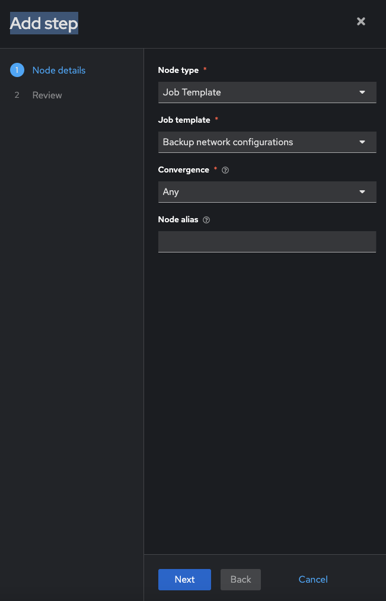
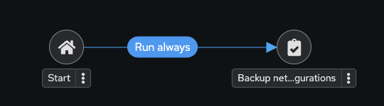
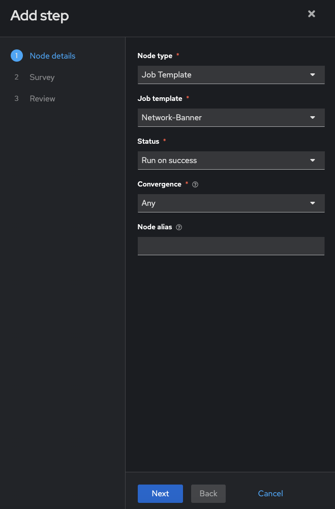
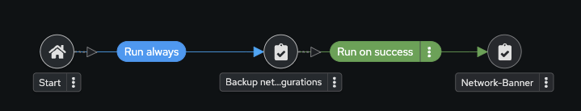
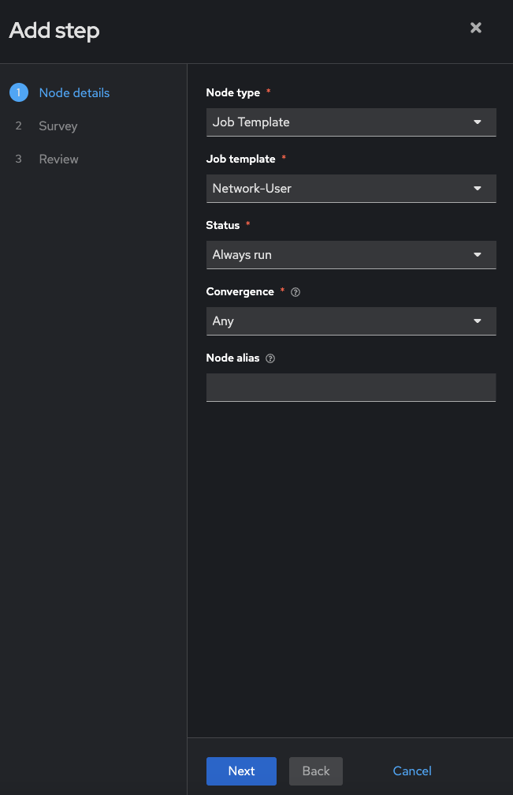
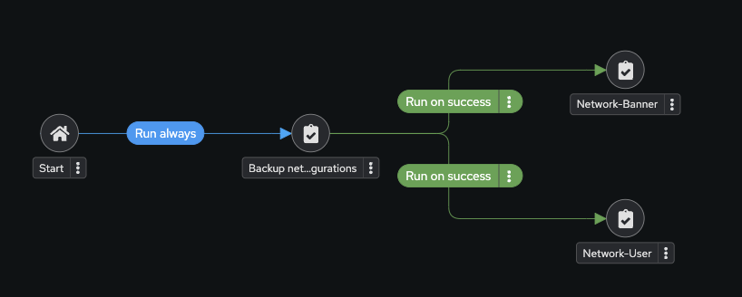
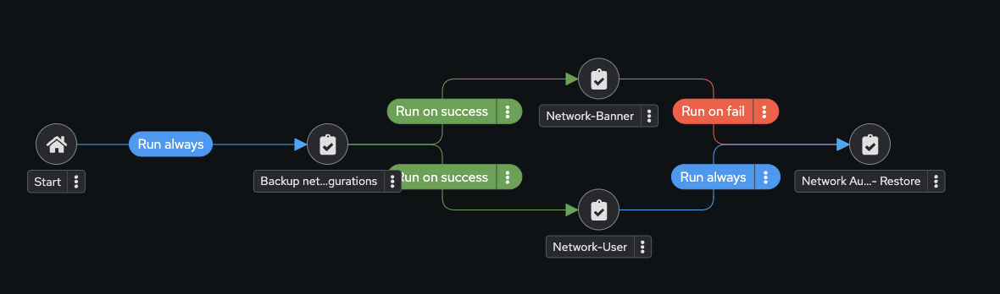
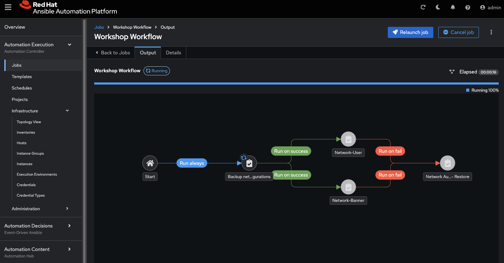

# Exercice 9 : Création d'un flux de travail

**Lisez ceci dans d'autres langues** :  [English](README.md),  [日本語](README.ja.md),  [Español](README.es.md),  [Français](README.fr.md).

## Table des matières

- [Exercice 9 : Création d'un flux de travail](#exercice-9--création-dun-flux-de-travail)
  - [Table des matières](#table-des-matières)
  - [Objectif](#objectif)
  - [Guide](#guide)
    - [Étape 1 : Créer un modèle de flux de travail](#étape-1--créer-un-modèle-de-flux-de-travail)
    - [Étape 2 : Le Visualiseur de flux de travail](#étape-2--le-visualiseur-de-flux-de-travail)
    - [Étape 3 : Ajouter le modèle de flux de travail Configure Banner](#étape-3--ajouter-le-modèle-de-travail-configure-banner)
    - [Étape 4 : Ajouter le modèle de flux de travail Configure Network-User](#étape-4--ajouter-le-modèle-de-travail-configure-network-user)
    - [Étape 5 : Ajouter le modèle de flux de travail Network-Restore](#étape-5--ajouter-le-modèle-de-travail-network-restore)
    - [Étape 6 : Créer un lien convergent](#étape-6--créer-un-lien-convergent)
    - [Étape 7 : Exécuter le flux de travail](#étape-7--exécuter-le-flux-de-travail)
  - [Points Clés](#points-clés)
  - [Conclusion](#conclusion)

## Objectif

Démontrer l'utilisation de la <a target="_blank" href="https://docs.redhat.com/en/documentation/red_hat_ansible_automation_platform/latest/html/using_automation_execution/controller-workflow-job-templates">plateforme d'automatisation Ansible pour les workflows</a>. Les workflows permettent de configurer une séquence de modèles de travail distincts (ou modèles de flux de travail) qui peuvent ou non partager des inventaires, des playbooks ou des permissions.

Dans cet exercice, nous créerons une sauvegarde horodatée. Si le travail de sauvegarde réussit, le flux de travail configurera simultanément une bannère et un utilisateur. Si l'un des modèles de travail échoue, nous restaurerons la sauvegarde horodatée.

## Guide

### Étape 1 : Créer un modèle de flux de travail

1. Assurez-vous d'être connecté en tant qu'utilisateur **admin**.

2. Cliquez sur le lien **Modèles** dans le menu de gauche.

   

3. Cliquez sur le bouton bleu **Créer un modèle** et sélectionnez **Créer un modèle de flux de travail**.

   

4. Remplissez le formulaire comme suit :

   | Paramètre | Valeur |
   |---|---|
   | Nom  | Workshop Workflow |
   | Organisation | Red Hat network organization |
   | Inventaire | Workshop Inventory |

5. Cliquez sur le bouton bleu **Créer un modèle de flux de travail**.

### Étape 2 : Le Visualiseur de flux de travail

1. En cliquant sur **Créer un modèle de flux de travail**, le **Visualiseur de flux de travail** devrait s'ouvrir automatiquement. Sinon, cliquez sur le bouton **Afficher le visualiseur de flux de travail**.

   

2. Par défaut, seul un bouton bleu **Ajouter une étape** apparaîtra. Cliquez sur le bouton **Ajouter une étape**.

   

3. La fenêtre **Ajouter une étape** apparaîtra.

  * Définissez le Type de Nœud sur `Modèle de Job`.
  * Sélectionnez le modèle de job `Backup network configurations` créé lors de l'exercice 6.
  * Laissez Convergence sur **Any**.
  * Laissez l'alias de nœud vide.

   

  * Cliquez sur le bouton bleu **Suivant**.
  * Cliquez sur le bouton bleu **Terminer**.

> Note :
>
> Le modèle de job `Backup network configurations` est maintenant un nœud. Les modèles de travail ou de flux de travail sont liés entre eux en utilisant une structure graphique appelée nœuds. Ces nœuds peuvent être des approbations, des travaux, des synchronisations de projets, des synchronisations d'inventaire ou même d'autres workflows.

   

### Étape 3 : Ajouter le modèle de job Configure Banner

1. Survolez les trois points **\u22ee** sur le nœud `Backup network configurations` et cliquez sur le lien **Ajouter une étape et lier**.

   

2. Remplissez les valeurs suivantes :

   | Paramètre | Valeur |
   |---|---|
   | Type de Nœud | Modèle de Job |
   | Modèle de Job | Network-Banner |
   | Statut | Exécuter en cas de succès |
   | Convergence | Any |
   | Alias de Nœud | (laisser vide) |

   

> Note :
>
> Les workflows peuvent être configurés pour exécuter des travaux d'automatisation lorsque le nœud précédent réussit, échoue, ou pour toujours s'exécuter quel que soit l'état du travail précédent. Cela permet aux workflows de corriger des problèmes ou de revenir à l'état précédent d'un dispositif.

1. Cliquez sur le bouton bleu **Suivant** et remplissez le champ de l'enquête.

   

2. Cliquez à nouveau sur le bouton bleu **Suivant**, passez en revue, puis cliquez sur le bouton bleu **Terminer**.

3. Une ligne verte devrait exister entre `Backup network configurations` et `Network-Banner`.

   

### Étape 4 : Ajouter le modèle de job Configure Network-User

1. Survolez les trois points **\u22ee** sur le nœud `Backup network configurations` et cliquez sur le lien **Ajouter une étape et lier** (pas sur le nœud `Network-Banner`).

2. Remplissez les valeurs suivantes :

   | Paramètre | Valeur |
   |---|---|
   | Type de Nœud | Modèle de Job |
   | Modèle de Job | Network-User |
   | Statut | Exécuter en cas de succès |
   | Convergence | Any |
   | Alias de Nœud | (laisser vide) |

   

3. Cliquez sur le bouton bleu **Suivant** et remplissez le champ de l'enquête (vous pouvez laisser les valeurs par défaut).

   

4. Cliquez sur **Suivant**, passez en revue, puis cliquez sur **Terminer**.

   Votre flux de travail devrait maintenant ressembler à l'image suivante :

   

### Étape 5 : Ajouter le modèle de job Network-Restore

1. Survolez le nœud **Network-Banner** et cliquez sur les trois points **\u22ee**. La fenêtre **Ajouter une étape et lier** apparaîtra à nouveau.

2. Remplissez les valeurs suivantes :

   | Paramètre | Valeur |
   |---|---|
   | Type de Nœud | Modèle de Job |
   | Modèle de Job | Network Automation - Restore |
   | Statut | Exécuter en cas d'échec |
   | Convergence | Any |
   | Alias de Nœud | (laisser vide) |

   Votre formulaire devrait ressembler à l'image suivante :

   

3. Cliquez sur le bouton bleu **Suivant** pour l'étape d'enquête, puis choisissez une date de rollback (Note : il peut n'y avoir qu'un seul choix si vous avez effectué une seule sauvegarde).

4. Cliquez à nouveau sur le bouton bleu **Suivant**, passez en revue et cliquez sur **Terminer**.

   Votre flux de travail devrait maintenant ressembler à l'image suivante :

   

### Étape 6 : Créer un lien convergent

1. Survolez le nœud `Network-User` jusqu'à ce qu'une petite flèche apparaisse à droite.

   

2. Cliquez sur la flèche (elle deviendra grise) et faites-la glisser jusqu'au nœud `Network Automation - Restore`.

   

3. Cliquez maintenant sur **Toujours exécuter** et changez-le en **Exécuter en cas d'échec**.

   

4. Cliquez sur **Enregistrer**, puis cliquez sur le **X** pour quitter le visualiseur.

   

### Étape 7 : Exécuter le flux de travail

1. Cliquez sur le bouton **Lancer**.

   

2. Observez le **flux de travail Workshop**.

   

   À tout moment pendant le travail du flux de travail, vous pouvez sélectionner un modèle de job individuel en cliquant sur le nœud pour voir l'état.

## Points Clés

Vous avez :

* Créé un **modèle de flux de travail** qui effectue une sauvegarde, puis tente de créer un utilisateur et une bannère pour tous les nœuds réseau.
* Rendu le flux de travail **robuste** : si l'un des modèles de travail échoue, il restaurera la sauvegarde spécifiée.
* Lancé le modèle de flux de travail et exploré le **Visualiseur de flux de travail**.

## Conclusion

Vous avez complété l'exercice 9. Cela conclut l'atelier d'automatisation réseau. Merci pour votre participation !

Pour des exercices supplémentaires, consultez [Exercices Supplémentaires](../supplemental/README.fr.md)

---
[Exercice précédent](../8-controller-rbac/README.fr.md)

[Retour à l'atelier d'automatisation réseau Ansible](../README.fr.md)

