# Exercise 9: Creating a Workflow

**Read this in other languages**:  [English](README.md),   [日本語](README.ja.md).

## Table of Contents

* [Objective](#objective)
* [Guide](#guide)
  * [Step 1: Create a workflow template](#step-1-create-a-workflow-template)
  * [Step 2: The Workflow Visualizer](#step-2-the-workflow-visualizer)
  * [Step 3: Add the Configure Banner Job Template](#step-3-add-the-configure-banner-job-template)
  * [Step 4: Add the Configure Network-User Job Template](#step-4-add-the-configure-network-user-job-template)
  * [Step 5: Add the Network-Restore Job Template](#step-5-add-the-network-restore-job-template)
  * [Step 6: Create a converged link](#step-6-create-a-converged-link)
  * [Step 7: Run the Workflow](#step-7-run-the-workflow)
* [Takeaways](#takeaways)
* [Complete](#complete)

## Objective

Demonstrate the use of [Automation Controller workflow](https://docs.ansible.com/automation-controller/latest/html/userguide/workflows.html).  Workflows allow you to configure a sequence of disparate job templates (or workflow templates) that may or may not share inventory, playbooks, or permissions.

For this exercise we will create a time-stamped backup, if the backup job successfully completes the workflow will simultaneously configure a banner and a user.  If either job template fails we will restore to the time stamped backup.

## Guide

### Step 1: Create a workflow template

1. Make sure you are logged in as the **admin** user.

2. Click on the **Templates** link on the left menu.

3. Click on the blue Add button and select  **Add workflow template**.

   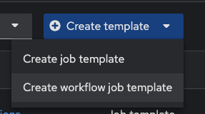

4. Fill out the form as follows:

   | Parameter | Value |
   |---|---|
   | Name  | Workshop Workflow  |
   |  Organization |  Default |
   |  Inventory |  Workshop Inventory |

5. Click on the blue **Save** button

### Step 2: The Workflow Visualizer

1. When you click the **Save** the **Workflow visualizer** should automatically open.  If not click on the  **Visualizer** tab.

   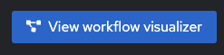

2. By default only a green **Start** button will appear.  Click on the **Start** button.

3. The **Add Node** window will appear.  

  * Set the Node Type to `Job Template`.

  * Select the `Backup` Job Template that was created in exercise 6.

   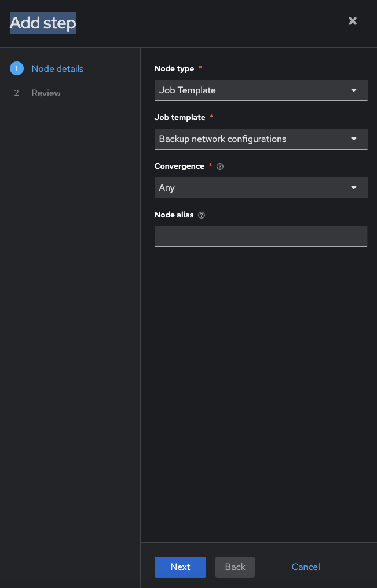

  * Click the blue **Save** button.

  <table>
  <thead>
    <tr>
      <th>The <b>Backup network configurations</b> job template is now a node.  Job or workflow templates are linked together using a graph-like structure called nodes. These nodes can be approvals, jobs, project syncs, inventory syncs, or even other workflows. A template can be part of different workflows or used multiple times in the same workflow. </th>
    </tr>
  </thead>
  </table>

   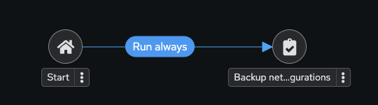

### Step 3: Add the Configure Banner Job Template

1. Hover over the *Backup network configurations* node and click the **+** symbol.  The **Add Node** window will appear again.

2.  For the **Run type** select **On Success** from the drop down menu.  Press the blue **Next** button.

   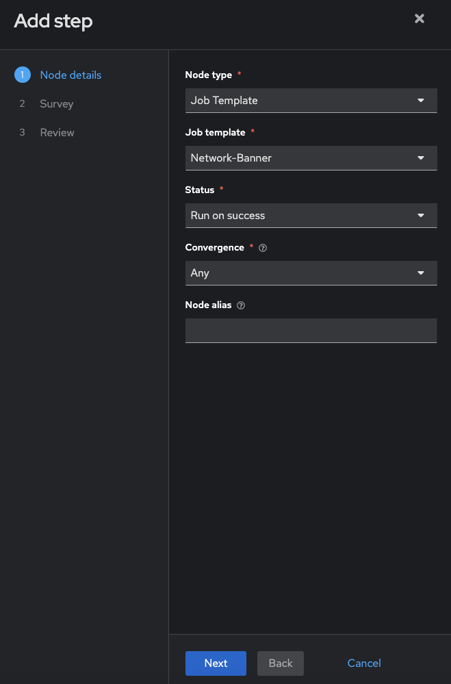

   <table>
   <thead>
     <tr>
       <th>Workflows can be configured to run automation jobs when the previous node succeeds, fails, or have it always run no matter what the previous job did.  This allows workflows to fix issues or revert the state of a device.
       </th>
     </tr>
   </thead>
   </table>

3. Select the **Network-Banner** Job Template.

   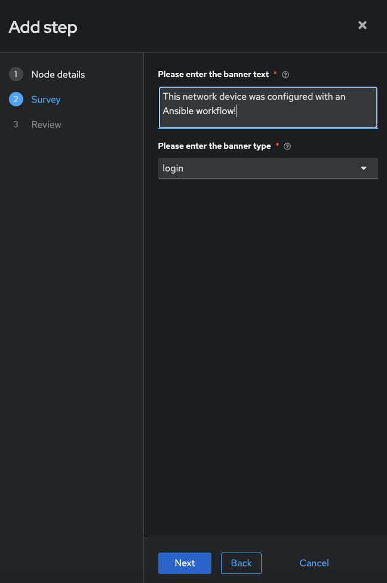

   * Click the blue **Next** button

4. Fill out the Survey similar to exercise 7.

   

5. Click Next and then Save.

4. A green line should exist between **Backup network configurations** and **Configure Banner**

   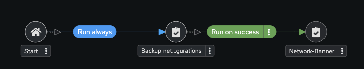

### Step 4: Add the Configure Network-User Job Template

1. Hover over the *Backup network configurations* node (not the **Configure Banner** node) and click the **+** symbol.  The **Add Node** will appear again.

2.  For the **Run type** select **On Success** from the drop down menu.  Press the blue **Next** button.

   

3. Select the **Network-User** Job Template.  

   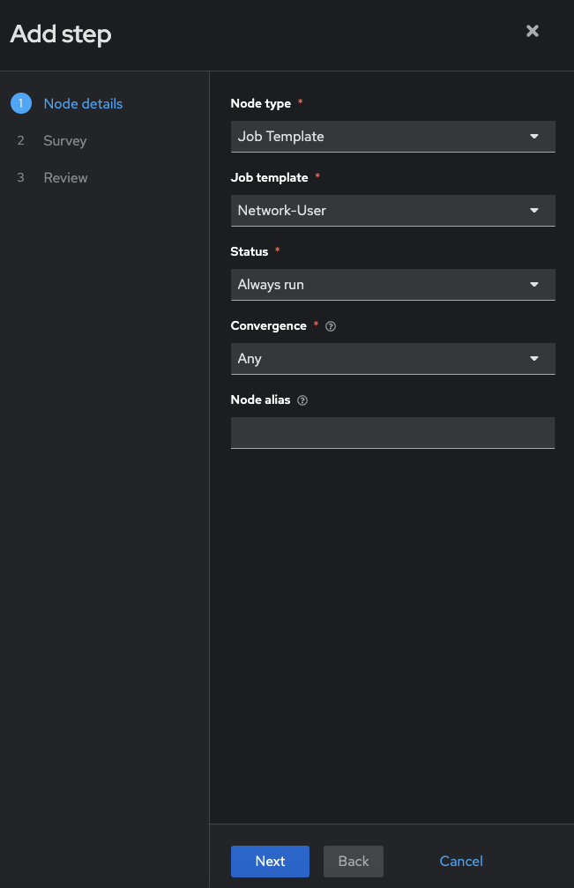

4. Fill out the survey (or just let it default to configure the `ansible` user

5. Click **Next** and **Save**

   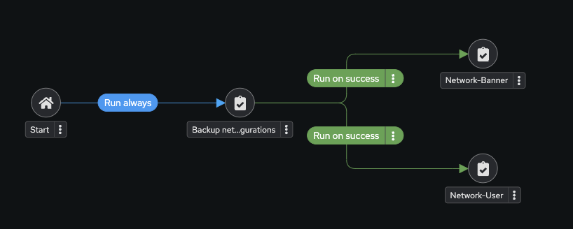

### Step 5: Add the Network-Restore Job Template

1. Hover over the **Network-Banner** node and click the **+** symbol.  The **Add Node** window will appear again.

2. Select **On Failure** for Run type

   

   * Click Next

3. Select the **Network-Restore** job template.

   

4. Select a rollback date and click **Next** and **Save**

   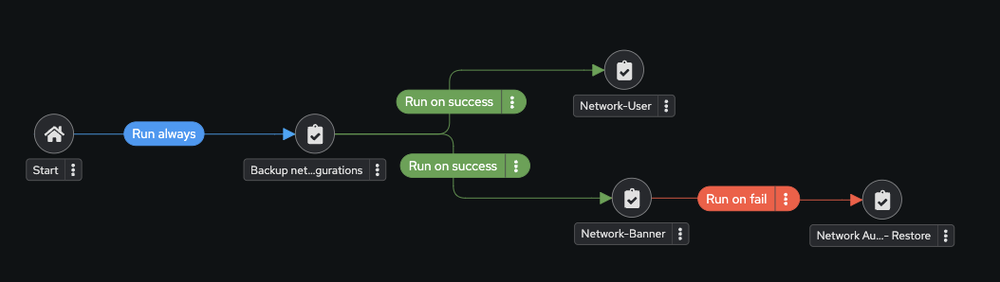

### Step 6: Create a converged link

1. Hover over the **Network-User** node and click the **chain**  symbol.

2. Now, double click on the existing **Network-Restore**.  A **Add Link** window will appear.  For the **RUN** parameter choose **On Failure**.

   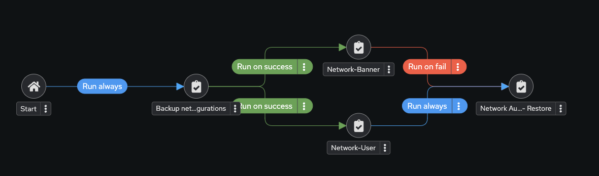

   *  Click Save

3. Now your workflow should look like the following:

   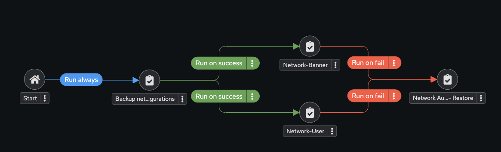

4. Click Save to exit the visualizer.

### Step 7: Run the Workflow

1. Click Launch button.

   

2. Watch the **Workshop Workflow**.

   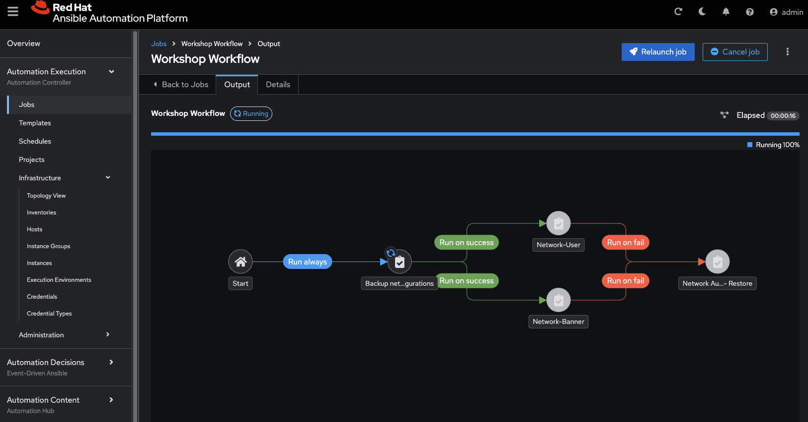

   At any time during the workflow job you can select an individual job template by clicking on the node to see the status.

## Takeaways

You have

* Created a workflow template that creates a backup, attempts to create a user and banner for all network nodes
* Made the workflow robust, if either job template fails it will restore to the specified backup
* Launched the workflow template and explored the **Workflow Visualizer**

## Complete

You have completed lab exercise 9.  This concludes the Network Automation workshop.  Thank you for attending!

For additional supplemental exercises check out [Supplemental Exercises](../supplemental/README.md)

---
[Previous Exercise](../8--controller-rbac/README.md)

[Click here to return to the Ansible Network Automation Workshop](../README.md)
