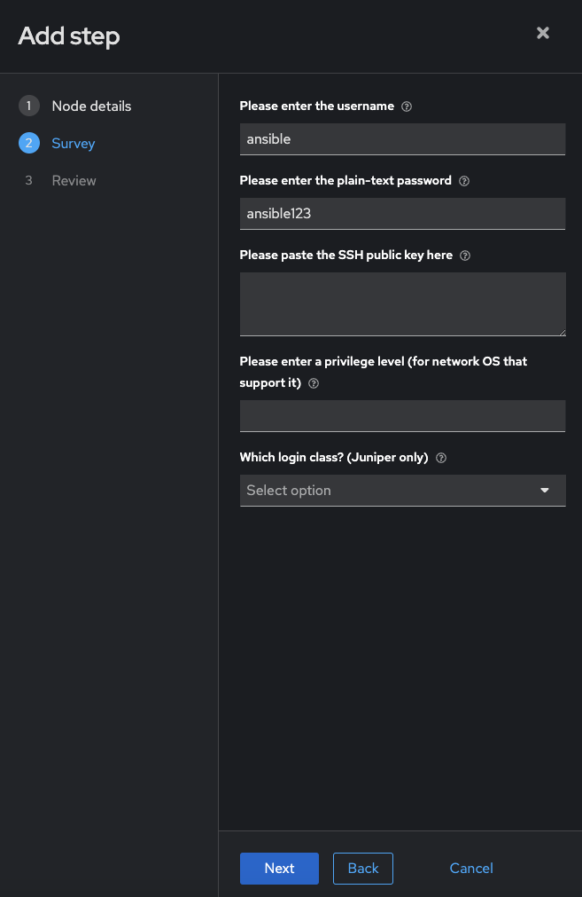
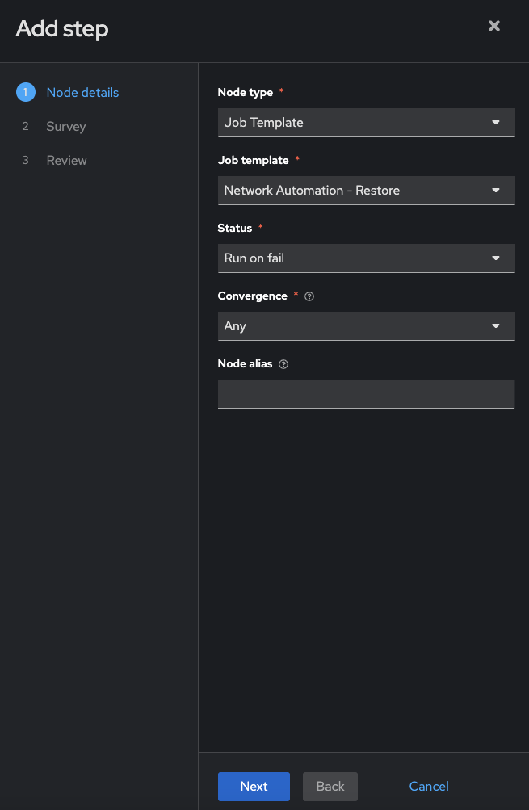
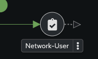

# Exercise 9: Creating a Workflow

**Read this in other languages**:  [English](README.md),  [日本語](README.ja.md),  [Español](README.es.md),  [Français](README.fr.md).

## Table of Contents

- [Exercise 9: Creating a Workflow](#exercise-9-creating-a-workflow)
  - [Table of Contents](#table-of-contents)
  - [Objective](#objective)
  - [Guide](#guide)
    - [Step 1: Create a workflow template](#step-1-create-a-workflow-template)
    - [Step 2: The Workflow Visualizer](#step-2-the-workflow-visualizer)
    - [Step 3: Add the Configure Banner Job Template](#step-3-add-the-configure-banner-job-template)
    - [Step 4: Add the Configure Network-User Job Template](#step-4-add-the-configure-network-user-job-template)
    - [Step 5: Add the Network-Restore Job Template](#step-5-add-the-network-restore-job-template)
    - [Step 6: Create a converged link](#step-6-create-a-converged-link)
    - [Step 7: Run the Workflow](#step-7-run-the-workflow)
  - [Takeaways](#takeaways)
  - [Complete](#complete)

## Objective

Demonstrate the use of <a target="_blank" href="https://docs.redhat.com/en/documentation/red_hat_ansible_automation_platform/latest/html/using_automation_execution/controller-workflow-job-templates">Ansible Automation Platform workflow</a> . Workflows allow you to configure a sequence of disparate job templates (or workflow templates) that may or may not share inventory, playbooks, or permissions.

For this exercise we will create a time-stamped backup, if the backup job successfully completes the workflow will simultaneously configure a banner and a user.  If either job template fails we will restore to the time stamped backup.

## Guide

### Step 1: Create a workflow template

1. Make sure you are logged in as the **admin** user.

2. Click on the **Templates** link on the left menu.

   

3. Click on the blue **Create template** button and select  **Create workflow job template**.

   

4. Fill out the form as follows:

   | Parameter | Value |
   |---|---|
   | Name  | Workshop Workflow  |
   |  Organization |  Red Hat network organization |
   |  Inventory |  Workshop Inventory |

5. Click on the blue **Create workflow job template** button

### Step 2: The Workflow Visualizer

1. When you clicked the **Create workflow job template** the **Workflow visualizer** should automatically open.  If not click on the  **View workflow visualizer** button.

   

2. By default only a blue **Add step** button will appear.  Click on the **Add step** button.

   

3. The **Add step** window will appear.

  * Set the Node Type to `Job Template`.

  * Select the `Backup network configurations` Job Template that was created in exercise 6.

  * Convergence can be left as **Any**

  * Node alias can be left blank

   

  * Click the blue **Next** button.

  * Click on the blue **Finish** button

> Note:
>
> The `Backup network configurations` job template is now a node.  Job or workflow templates are linked together using a graph-like structure called nodes. These nodes can be approvals, jobs, project syncs, inventory syncs, or even other workflows. A template can be part of different workflows or used multiple times in the same workflow.

   

### Step 3: Add the Configure Banner Job Template

1. Hover over the three dots **⋮** on the `Backup network configurations` node and click the **Add step and link** link.

   

   The **Add Step** window will appear again.

2.  Fill out the following values:

   <table>
   <tr>
   <th>Parameter</th>
   <th>Value</th>
   </tr>
   <tr>
   <td>Node Type</td>
   <td>Job Template</td>
   </tr>
   <tr>
   <td>Job template</td>
   <td>Network-Banner</td>
   </tr>
   <tr>
   <td>Status</td>
   <td>Run on success</td>
   </tr>
   <tr>
   <td>Convergence</td>
   <td>Any</td>
   </tr>
   <tr>
   <td>Node alias</td>
   <td></td>
   </tr>
   </table>

   

> Note:
>
> Workflows can be configured to run automation jobs when the previous node succeeds, fails, or have it always run no matter what the previous job did.  This allows workflows to fix issues or revert the state of a device.

1. Click the blue **Next** button and fill out the survey field

   

2. Click the blue **Next** button again, review, and then click the blue **Finish** button.

3. A green line should exist between `Backup network configurations` and `Network-Banner`

   

### Step 4: Add the Configure Network-User Job Template

1. Hover over the three dots **⋮** on the `Backup network configurations` node and click the **Add step and link** link. (not the `Network-Banner` node)

2. Fill out the following values:

   <table>
   <tr>
   <th>Parameter</th>
   <th>Value</th>
   </tr>
   <tr>
   <td>Node Type</td>
   <td>Job Template</td>
   </tr>
   <tr>
   <td>Job template</td>
   <td>Network-User</td>
   </tr>
   <tr>
   <td>Status</td>
   <td>Run on success</td>
   </tr>
   <tr>
   <td>Convergence</td>
   <td>Any</td>
   </tr>
   <tr>
   <td>Node alias</td>
   <td></td>
   </tr>
   </table>

    

3. Click the blue **Next** button and fill out the survey field (feel free to leave the defaults!)

   

4. Click **Next**, review then click **Finish**

   Your workflow should now look similar to the following image:

    

### Step 5: Add the Network-Restore Job Template

1. Hover over the **Network-Banner** node and click the three dots **⋮**  The **Add step and link** window will appear again.

2. Fill out the following values:

   <table>
   <tr>
   <th>Parameter</th>
   <th>Value</th>
   </tr>
   <tr>
   <td>Node Type</td>
   <td>Job Template</td>
   </tr>
   <tr>
   <td>Job template</td>
   <td>Network Automation - Restore</td>
   </tr>
   <tr>
   <td>Status</td>
   <td>Run on fail</td>
   </tr>
   <tr>
   <td>Convergence</td>
   <td>Any</td>
   </tr>
   <tr>
   <td>Node alias</td>
   <td></td>
   </tr>
   </table>

   Your forum should  look similar to the following image:

    

3. Click the blue **Next** button for the Survey step, then choose a rollback date (Note: there may only be one choice if you only ran the backup one time)

4. Click the blue **Next** button again, then review and click the **Finish** button.

   Your workflow should now look similar to the following image:

    

### Step 6: Create a converged link

1. Hover over the `Network-User` node until a a small arrow appears to the right.

   

2. Click on the arrow (it will turn gray), and drag it over to the `Network Automation - Restore` node

    

3. Now click on the **Run always** and change to **Run on fail**

    

4. Click Save, then click on the **X** to exit the visualizer.

   

### Step 7: Run the Workflow

1. Click Launch button.

    

2. Watch the **Workshop Workflow**.

    

   At any time during the workflow job you can select an individual job template by clicking on the node to see the status.

## Takeaways

You have

* Created a **Workflow template** that creates a backup, then attempts to create a user and banner for all network nodes
* Made the workflow **robust**, if either job template fails it will restore to the specified backup
* Launched the Workflow template and explored the **Workflow Visualizer**

## Complete

You have completed lab exercise 9.  This concludes the Network Automation workshop.  Thank you for attending!

For additional supplemental exercises check out [Supplemental Exercises](../supplemental/README.md)

---
[Previous Exercise](../8-controller-rbac/README.md)

[Click here to return to the Ansible Network Automation Workshop](../README.md)
