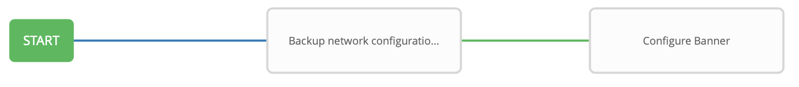

# Exercise 9: ワークフローの作成

**Read this in other languages**:  [English](README.md),   [日本語](README.ja.md).

## Table of Contents

- [Objective](#objective)
- [Guide](#guide)
  - [Step 1: Create a Job Template](#step-1-create-a-job-template)
  - [Step 2: The Workflow Visualizer](#step-2-the-workflow-visualizer)
  - [Step 3: Add the Configure Banner Job Template](#step-3-add-the-configure-banner-job-template)
  - [Step 4: Add the Configure Network-User Job Template](#step-4-add-the-configure-network-user-job-template)
  - [Step 5: Add the Network-Restore Job Template](#step-5-add-the-network-restore-job-template)
  - [Step 6: Create a converged link](#step-6-create-a-converged-link)
  - [Step 7: Run the Workflow](#step-7-run-the-workflow)
- [Takeaways](#takeaways)

# Objective

[Ansible Tower workflow](https://docs.ansible.com/ansible-tower/latest/html/userguide/workflows.html)を確認します。ワークフローでは、インベントリー、Playbook、認証を共有する（また共有しない）異なるジョブテンプレート（またはワークフローテンプレート）でシーケンスを設定できます。

この演習では、まずタイムスタンプ付きのバックアップを作成し、それに成功したらバナーとユーザーを同時に作成します。しかし、いずれかのジョブテンプレートが失敗したらタイムスタンプ付きバックアップからリストアを実行します。

# Guide

## Step 1: Create a Job Template

1. **admin** ユーザーでログインしていることを確認します。

2. 左メニューから **Templates** をクリックします。

3. グリーンの **+** ボタンをクリックし、**Workflow Template** を選択します。

4. 以下のパラメーターを入力します:

| Parameter | Value |
|---|---|
| Name  | Workshop Workflow  |
|  Organization |  Default |
|  Inventory |  Workshop Inventory |

5. **Save** ボタンをクリックします。

## Step 2: The Workflow Visualizer

1. **SAVE** ボタンを押すと、上部の **WORKFLOW VISUALIZER** が選択可能になります。**WORKFLOW VISUALIZER** ボタンがブルーのときはクリックしないでください。

2. デフォルトではグリーンの **START** ボタンだけが配置されています。この **START** ボタンをクリックします。

3. 右側に **ADD A TEMPLATE** ウィンドが表示されます。Exercise 6 で作成した *Backup* ジョブテンプレートを選択します。ドロップダウンボックスから `always` を選択します。最後にグリーンの **SELECT** ボタンをクリックします。

   

   これで `Backup network configurations` ジョブテンプレートがノードとなります。ジョブやワークフロージョブはノード呼ばれるグラフ構造で相互に接続されていきます。これらのノードにはジョブ、プロジェクトの同期、インベントリーの同期を選択することができます。ワークフローテンプレートを別のワークフローの一部にすることや、同じワークフロー内で複数回使用することもできます。ワークフローを起動すると、グラフ構造のコピーがワークフロージョブに保存されます。

   

## Step 3: Add the Configure Banner Job Template

1. *Backup network configurations* ノードにマウスオーバーして、グリーンの **+** アイコンをクリックします。再度 **ADD A TEMPLATE** ウインドが表示されます。

2. **Network Banner** ジョブテンプレートを選択します。 **Run** パラメーターはドロップダウンメニューから **On Success** を選択します。

3. プロンプトの入力を設定するまで **SELECT** をクリックしないでください。**PROMPT** をクリックして好きなバナーを入力します。

4.  ここまでで **Backup network configurations** と **Network Banner** はグリーンの線で繋がれているはずです。

    

## Step 4: Add the Configure Network-User Job Template

1. *Backup* ノード(**Network Banner** ノードではありません)にマウスオーバーして、グリーンの **+** アイコンをクリックします。**ADD A TEMPLATE** が再び表示されます。

2. **Network-User** ジョブテンプレートを選択します。 **Run** パラメーターにはドロップダウンメニューから **On Success** を選択します。先の手順と同じように、プロンプトの入力をしてから **SELECT** をクリックします。

    

## Step 5: Add the Network-Restore Job Template

1.  **Network Banner** ノードにマウスオーバーし、グリーンの **+** アイコンをクリックします。**ADD A TEMPLATE** が再度表示されます。

2. **Network-Restore** ジョブテンプレートを選択します。 **Run** パラメーターにはドロップダウンメニューから **On Failure** を選択します。

   

## Step 6: Create a converged link

1. **Network-User** ノードにマウスオーバーしてブルーの **chain** アイコンをクリックします。

2. ここですでに存在している **Network-Restore** をクリックします。**ADD LINK** が表示されます。**RUN** パラメーターには **On Failure** を選択します。

    

3. グリーンの **SAVE** ボタンをクリックします。

## Step 7: Run the Workflow

1. **Templates** の一覧画面へ戻ります。

2. **Workshop Workflow** ワークフローテンプレートのロケットアイコンをクリックしワークフローを起動します。

   

    この画面で、個々のノードをクリックするとジョブの詳細を確認できます。

# Takeaways

この演習では以下を学習しました。
 - 全てのネットワークノードに対して、バックアップを取得し、バナーとユーザーを設定するワークフロージョブテンプレートを作成しました。
 - ワークフローを堅牢にするため、いずれかのジョブテンプレートが失敗した場合に、特定のバックアップからリストアを行います。
 - ワークフロージョブテンプレートを起動し、 **VISUALIZER** を確認しました。

---

# Complete

以上で exercise 9 は終了です。

[Click here to return to the Ansible Network Automation Workshop](../README.ja.md)
