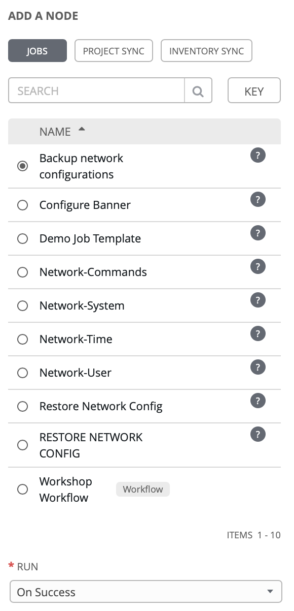
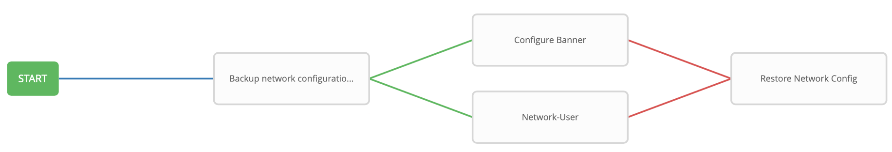

# Exercise 9: Creating a Workflow

**Read this in other languages**:  [English](README.md),   [日本語](README.ja.md).

## Table of Contents

- [Objective](#objective)
- [Guide](#guide)
  - [Step 1: Create a Job Template](#step-1-create-a-job-template)
  - [Step 2: The Workflow Visualizer](#step-2-the-workflow-visualizer)
  - [Step 3: Add the Configure Banner Job Template](#step-3-add-the-configure-banner-job-template)
  - [Step 4: Add the Configure Network-User Job Template](#step-4-add-the-configure-network-user-job-template)
  - [Step 5: Add the Network-Restore Job Template](#step-5-add-the-network-restore-job-template)
  - [Step 6: Create a converged link](#step-6-create-a-converged-link)
  - [Step 7: Run the Workflow](#step-7-run-the-workflow)
- [Takeaways](#takeaways)

# Objective

Demonstrate the use of [Ansible Tower workflow](https://docs.ansible.com/ansible-tower/latest/html/userguide/workflows.html).  Workflows allow you to configure a sequence of disparate job templates (or workflow templates) that may or may not share inventory, playbooks, or permissions.

For this exercise we will create a time-stamped backup, if the backup job successfully completes the workflow will simultaneously configure a banner and a user.  If either job template fails we will restore to the time stamped backup.

# Guide

## Step 1: Create a Job Template

1. Make sure you are logged in as the **admin** user.

2. Click on the **Templates** link on the left menu.  

3. Click on the green **+** button. Select the **Workflow Template**.  

4. Fill out the the form as follows:

| Parameter | Value |
|---|---|
| Name  | Workshop Workflow  |
|  Organization |  Default |
|  Inventory |  Workshop Inventory |

5. Click on the **Save** button

## Step 2: The Workflow Visualizer

1. When you click the **SAVE** the **WORKFLOW VISUALIZER** should automatically open.  If not click on the blue **WORKFLOW VISUALIZER** button.  

2. By default only a green **START** button will appear.  Click on the **START** button.  

3. The **ADD A TEMPLATE** window will appear on the right.  Select the *Backup* Job Template that was created in exercise 6 (whatever you named it!).  Use the drop down box to select `always`.  Click the green **SELECT** button.

   

   The `Backup network configurations` job template is now a node.  Job or workflow templates are linked together using a graph-like structure called nodes. These nodes can be jobs, project syncs, or inventory syncs. A template can be part of different workflows or used multiple times in the same workflow. A copy of the graph structure is saved to a workflow job when you launch the workflow.

   

## Step 3: Add the Configure Banner Job Template

1. Hover over the *Backup network configurations* node and click the green **+** symbol.  The **ADD A TEMPLATE** window will appear again.

2. Select the **Configure Banner** Job Template.  For the **Run** parameter select **On Success** from the drop down menu.

3. You will not be able to click **SELECT** until you pre-populate the prompt.  Fill out the **PROMPT** with your desired banner.

4.  A green line should exist between **Backup network configurations** and **Configure Banner**

    

## Step 4: Add the Configure Network-User Job Template

1. Hover over the *Backup* node (not the **Configure Banner** node) and click the green **+** symbol.  The **ADD A TEMPLATE** will appear again.

2. Select the **Network-User** Job Template.  For the **Run** parameter and select **On Success** from the drop down menu.  Just like the previous step fill out the prompt or it will not let you **SELECT** the job.  Once the **SELECT** button appears green click it.

    

## Step 5: Add the Network-Restore Job Template

1.  Hover over the **Configure Banner** node and click the green **+** symbol.  The **ADD A TEMPLATE** will appear again.

2. Select the **Network-Restore** job template.  For the **Run** parameter select **On Failure** from the drop down menu.  

   

## Step 6: Create a converged link

1. Hover over the **Network-User** node and click the blue **chain** symbol.

2. Now, click on the existing **Network-Restore**.  A **ADD LINK** window will appear.  For the **RUN** parameter choose **On Failure**.

    

3. Click the green **SAVE** button

## Step 7: Run the Workflow

1. Return to the **Templates** window

2. Click the rocket ship to launch the **Workshop Workflow** workflow template.

   

    At any time during the workflow job you can select an individual job template by clicking on the node to see the status.

# Takeaways

You have
 - created a workflow template that creates a backup, attempts to create a user and banner for all network nodes
 - made the workflow robust, if either job template fails it will restore to the specified backup
 - launched the workflow template and explored the **VISUALIZER**

---

# Complete

You have completed lab exercise 9

[Click here to return to the Ansible Network Automation Workshop](../README.md)
