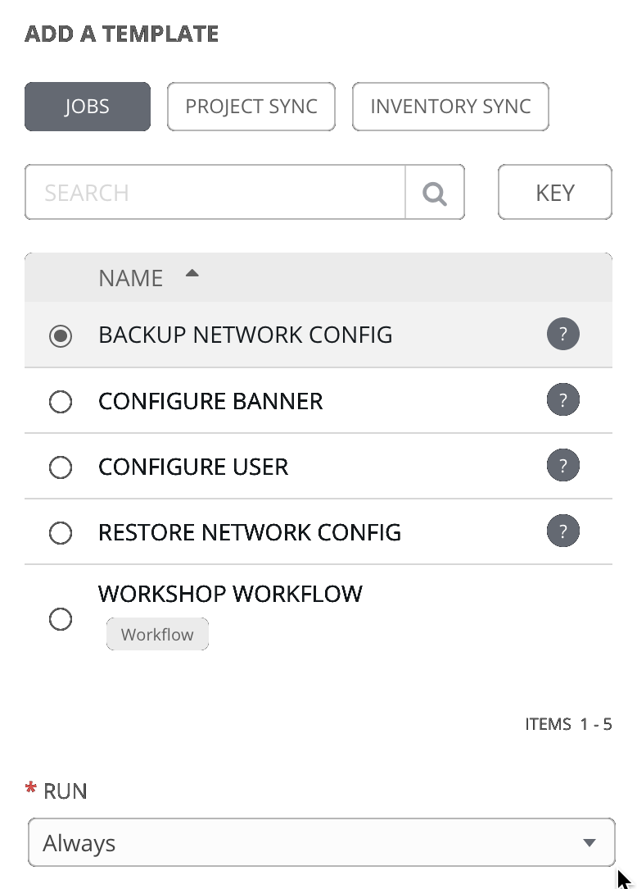
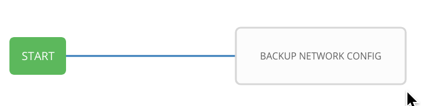
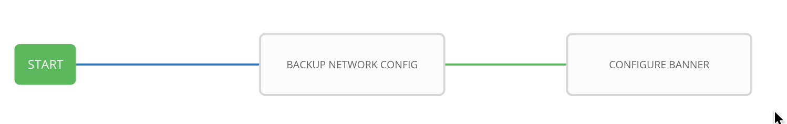
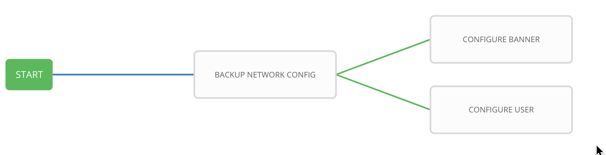
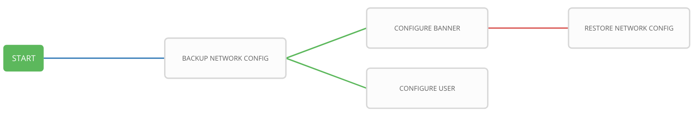
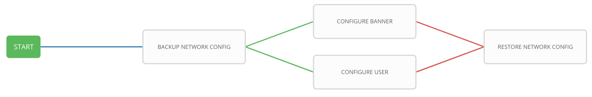
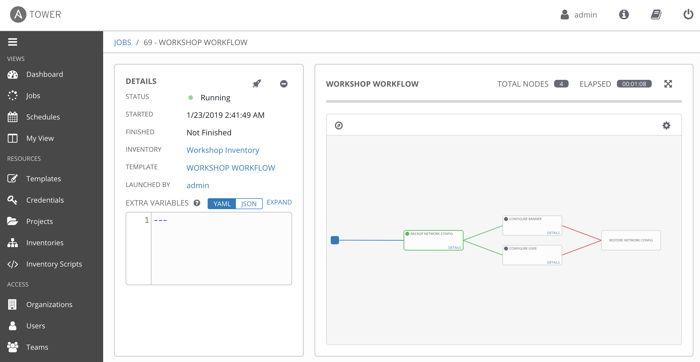

# Exercise 4-4: Creating a Workflow

## Table of Contents

- [Objective](#objective)
- [Guide](#guide)
- [Solution](#solution)

# Objective

Demonstrate the use of [Ansible Tower workflow](https://docs.ansible.com/ansible-tower/latest/html/userguide/workflows.html).  Workflows allow you to configure a sequence of disparate job templates (or workflow templates) that may or may not share inventory, playbooks, or permissions.

For this exercise we will create a time-stamped backup, if the backup job successfully completes the workflow will simultaneously configure a banner and a user.  If either job template fails we will restore to the time stamped backup.

# Guide

## Step 1

Click on the **templates** link on the left menu.  Then click on the green **+** button.  Select the **Workflow Template**.  Fill out the the form as follows:

| Parameter | Value |
|---|---|
| Name  | WORKSHOP WORKFLOW  |
|  Organization |  Default |
|  Inventory |  Workshop Inventory |

Click on the **Save** button

## Step 2

When you click the **SAVE** the **WORKFLOW VISUALIZER** should automatically open.  If not click on the blue **WORKFLOW VISUALIZER** button.  

By default only a green **START** button will appear.  Click on the **START** button.  

The **ADD A TEMPLATE** window will appear on the right.  Select the **BACKUP NETWORK CONFIG** job template that was created earlier.  Use the drop down box to select run.  Click the green **SELECT** button.

The **BACKUP NETWORK CONFIG** job template is now a node.  Job or workflow templates are linked together using a graph-like structure called nodes. These nodes can be jobs, project syncs, or inventory syncs. A template can be part of different workflows or used multiple times in the same workflow. A copy of the graph structure is saved to a workflow job when you launch the workflow.

## Step 3

Hover over the **BACKUP NETWORK CONFIG** node and click the green **+** symbol.  The **ADD A TEMPLATE** window will appear again.  This time select the **CONFIGURE BANNER** job template.  For the **Run** parameter select **On Success** from the drop down menu.

You will not be able to click **SELECT** until you pre-populate the prompt.  Just fill out the **PROMPT** with your desired banner.

A green line should exist between **BACKUP NETWORK CONFIG** and **CONFIGURE BANNER**

## Step 4

Hover over the **BACKUP NETWORK CONFIG** node (not the **CONFIGURE BANNER** node) and click the green **+** symbol.  The **ADD A TEMPLATE** will appear again.

This time select the **CONFIGURE USER** job template.  For the **Run** parameter and select **On Success** from the drop down menu.  Just like the previous step fill out the prompt or it will not let you **SELECT** the job.  Once the **SELECT** button appears green click it.

## Step 5

Hover over the **CONFIGURE BANNER** node and click the green **+** symbol.  The **ADD A TEMPLATE** will appear again.

Select the **RESTORE NETWORK CONFIG** job template.  For the **Run** parameter select **On Failure** from the drop down menu.  

## Step 6

Hover over the **CONFIGURE USER** node and click the blue **chain** symbol.  Now click on the existing **RESTORE NETWORK CONFIG**.  A **ADD LINK** window will appear.  For the **RUN** parameter choose **On Failure**.

Click the green **SAVE** button

## Step 7

Return to the **templates** menu and click the rocket ship to launch the **WORKSHOP WORKFLOW** workflow template.

At any time during the workflow job you can select an individual job template by clicking on the node to see the status.

# Solution
You have finished this exercise.  

You have
 - created a workflow template that creates a backup, attempts to create a user and banner for all network nodes
 - made the workflow robust, if either job template fails it will restore to the specified backup
 - launched the workflow template and explored the **VISUALIZER**

[Click here to return to the lab guide](../README.md)
