# Exercise 1: Understanding RBAC in Ansible Tower

## Table of Contents

- [Objective](#Objective)
- [Guide](#Guide)
- [Playbook Output](#Playbook_Output)
- [Solution](#Solution)

# Objective

One of the key benefits of using Ansible Tower is the control of users that use the system. The objective of this exercise is to understand Role Based Access Controls([RBACs](https://docs.ansible.com/ansible-tower/latest/html/userguide/security.html#role-based-access-controls)) with which Tower admins can define tenancies, teams, roles and associate users to those roles. This gives organizations the ability to secure the automation system and satisfy compliance goals and requirements.

# Guide

While the [documentation](https://docs.ansible.com/ansible-tower/latest/html/userguide/security.html#role-based-access-controls) goes into depth, for purposes of this exercise it is necessary to understand a few key terms with respect to Ansible Tower:

- **Organizations:** Defines a tenancy for example *Network-org*, *Compute-org*. This might be reflective of internal organizational structure of the customer's organization.
- **Teams:** Within each organization, there may be more than one team. For instance *tier1-helpdesk*, *tier2-support*, *tier3-support*, *build-team* etc.
- **Users:** Users typically belong to teams. What the user can do within Tower is controlled/defined using **roles**
- **Roles:** Roles define what actions a user may perform. This can map very nicely to typical network organizations that have restricted access based on whether the user is a Level-1 helpdesk person, Level-2 or senior admin. Tower [documentation ](https://docs.ansible.com/ansible-tower/latest/html/userguide/security.html#built-in-roles)defines a set of built-in roles.

## Step 1:

Confirm that you are logged in as the *network-admin* user. This user has administrator privileges to the " RED HAT NETWORK ORGANIZATION" organization.

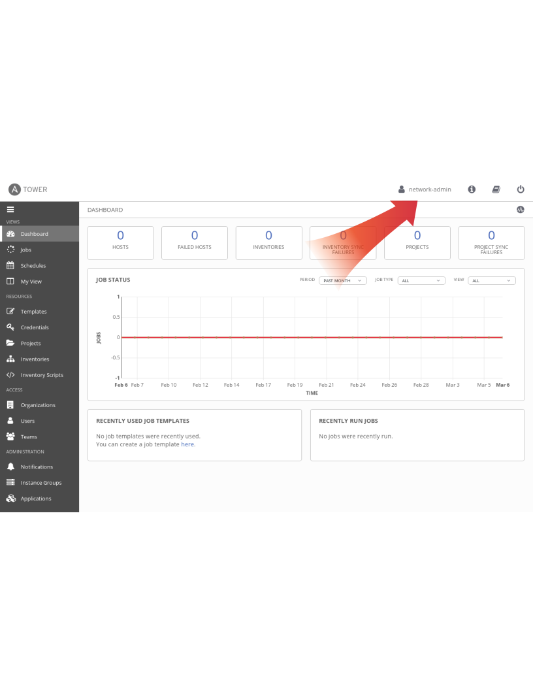

## Step 2

Log out of Tower and log back in as the admin user.
> Please check with your instructor to find the login credentials.

Under the *ACCESS* section, click on **Organizations**

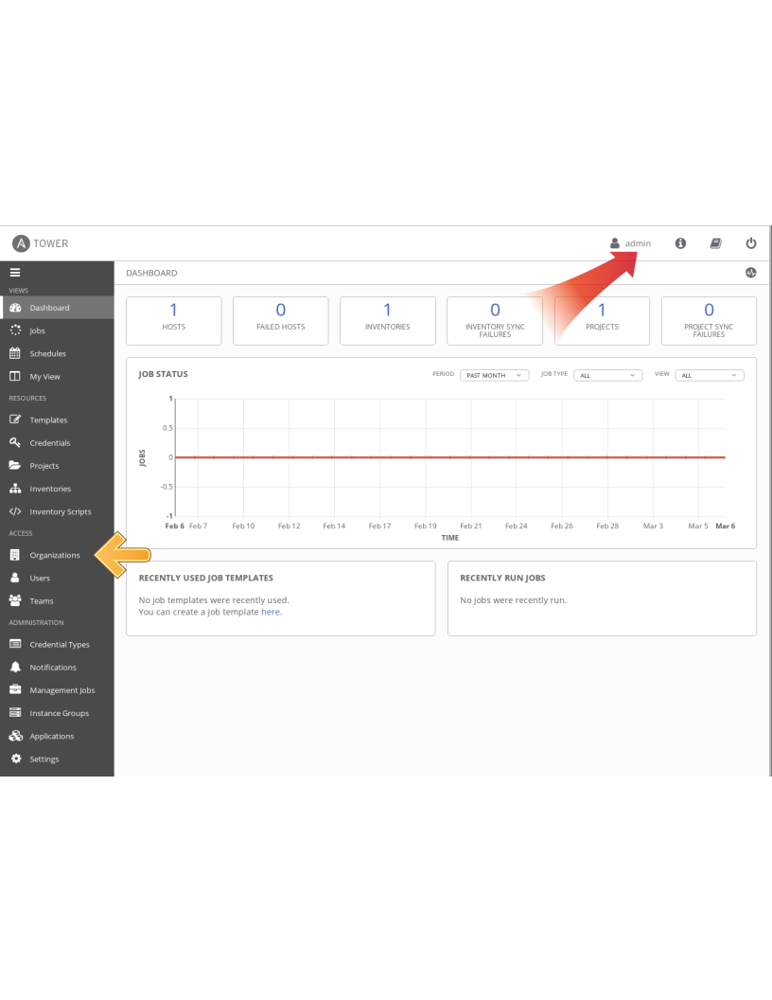

As the *admin* user, you should be able to view all organizations configured for this Tower:

>Note: The orgs, teams and users were auto-populated for this workshop 

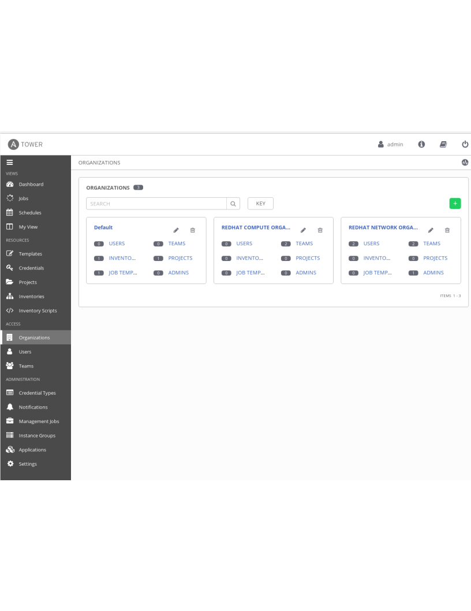

You will see that there are 2 organizations(other than Default) pre-configured for you:

1. **RED HAT COMPUTE ORGANIZATION**
2. **RED HAT NETWORK ORGANIZATION**

>Observe that this page gives you a summary of all the teams, users, inventories, projects and job templates associated with it. If a Organization level admin is configure you will see that as well.

## Step 3

Go ahead and click on the **RED HAT NETWORK ORGANIZATION**. This brings up a section that displays the details of the organization. Feel free to click through *Users*, *Permissions* etc.

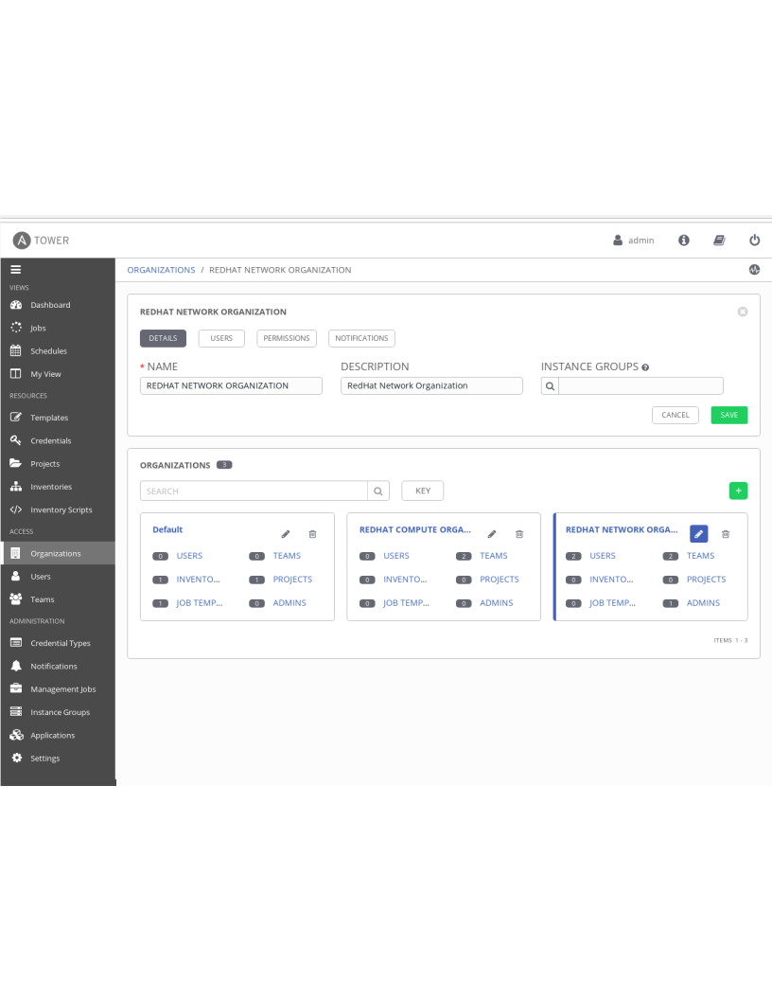 

## Step 4

Now, click on *TEAMS* in the sidebar
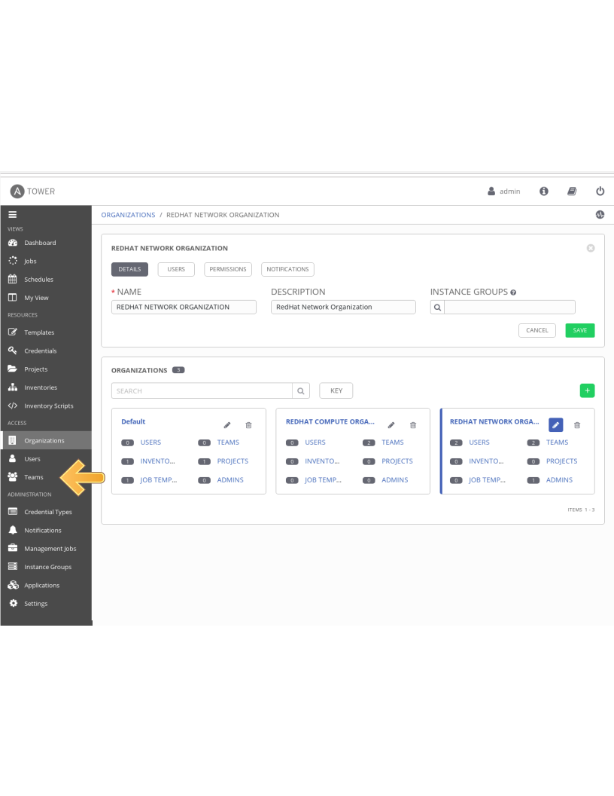 

As the tower admin you will now be able to see all available teams
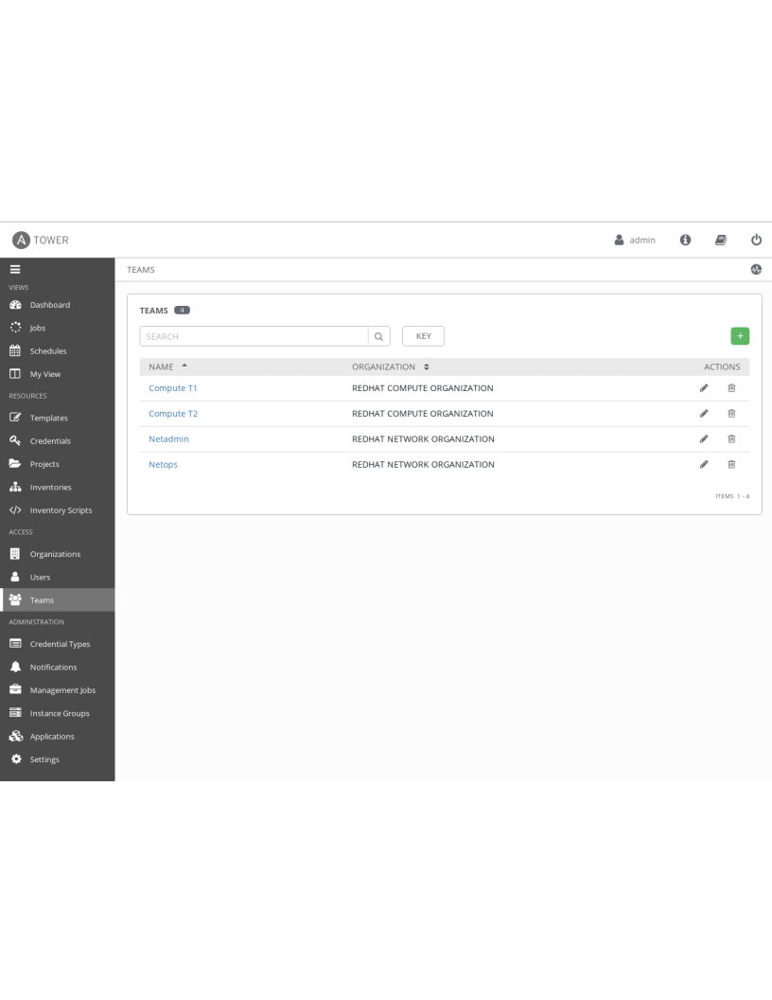 

>Note: The orgs, teams and users were auto-populated for this workshop 

## Step 5

Click on the *Netops* team and then click on *Users*
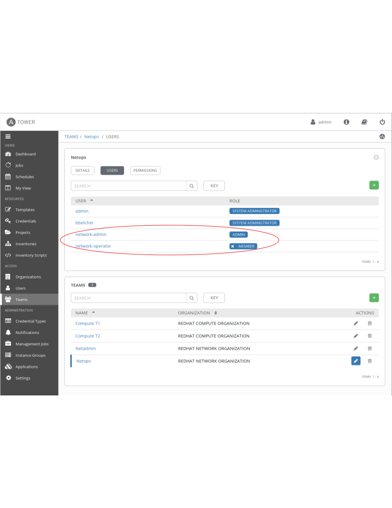 

You will see auto-populated users for this team with different roles. Pay attention to 2 particular users:

1. network-admin
2. network-operator

The *network-admin* user has Administrative privileges for the **RED HAT NETWORK ORGANIZATION** organization.

The *network-operator* is simply a member of the Netops team. We will log in as each of these users to understand the roles

## Step 6

Log out as the *admin* and log back in as the *network-admin*. Now when you click on the *Organizations* link on the sidebar, you will notice that you only have visibility to the organization you are an admin of. 

> Bonus step: Try this as the network-operator user. What is the difference? As the network operator are you able to view other users? Are you able to add a new user or edit user credentials?

## Step 7

To understand how different roles and therefore RBACs may be applied, log out and log back in as the "admin" user. Then, navigate to *Inventories* >> *Workshop Inventory* >> *Permissions*
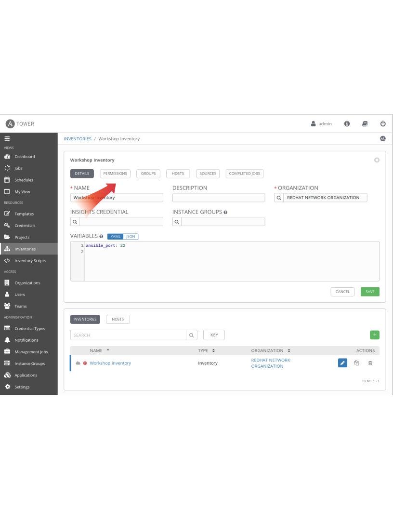 

Note the *Team Roles* assigned for the *network-admin* and *network-operator* users. By assigning the **Use** Role, these users have been granted permission to use this particular inventory:
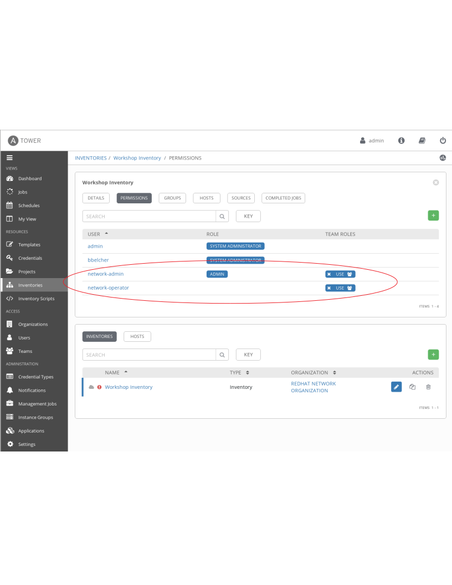 

## Step 8

No, continuing as admin, click on the *Templates* >> *Network-Commands* >> *Permissions*

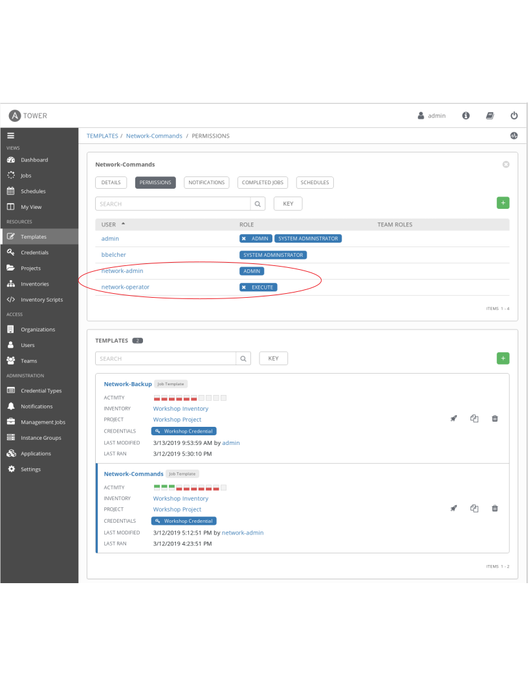 

Note how the same users have different roles for the job template. This highlights the granularity operators can introduce with Ansible Tower in controlling "Who gets access to what". In this example, the network-admin can update(administer) the *Network-Commands* job template, whereas the network-operator can only *execute* it.

## Step 9

Finally, to see the RBAC in action, log out at admin and log back in as the *network-operator* user.

Navigate to *Templates* and click on the *Network-Commands* template.

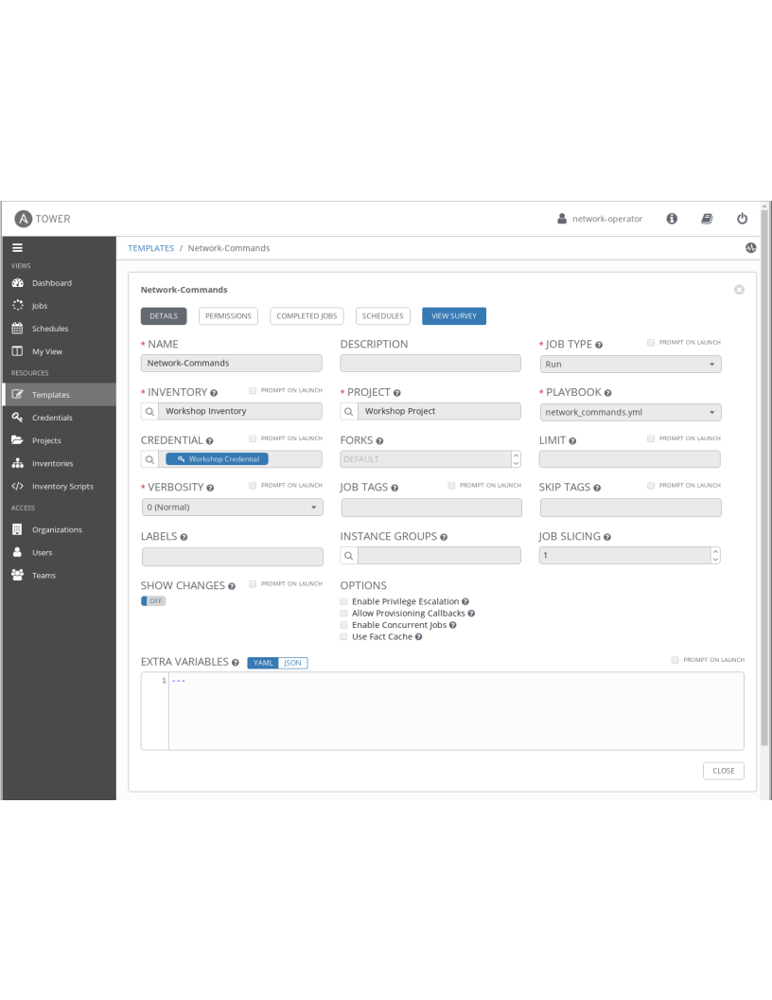 

Note that, as the *network-operator* user, you will have no ability to change any of the fields.

## Step 10

As the network-operator user, click on *Templates* on the sidebar again and this time launch the *Network-Commands* template by clicking on the little "rocket" icon:

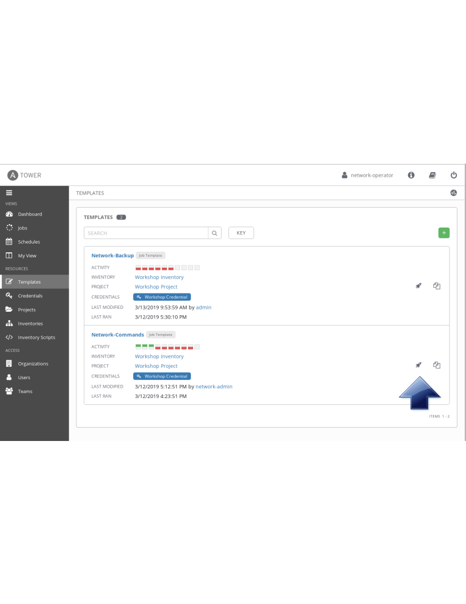 

You will be prompted by a dialog-box that lets you choose one of the pre-configured show commands. Using Ansible Tower's powerful RBAC feature, you can see it is easy to restrict access to operators to run prescribed commands on production systems without requiring them to have access to the systems themselves. 

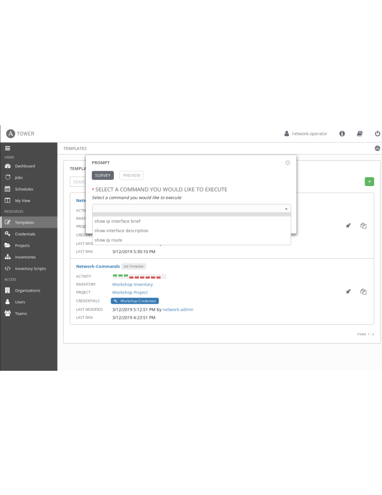 

Go ahead and choose a command and click *Next* >> *Launch* to see the playbook being executed and the results being displayed

## Bonus Step

If time permits, log back in as the network-admin and add another show command you would like the operator to run. This will also help you see how the *Admin* Role of the network-admin user allows you to edit/update the job template.

You have finished this exercise.  [Click here to return to the lab guide](../README.md)
