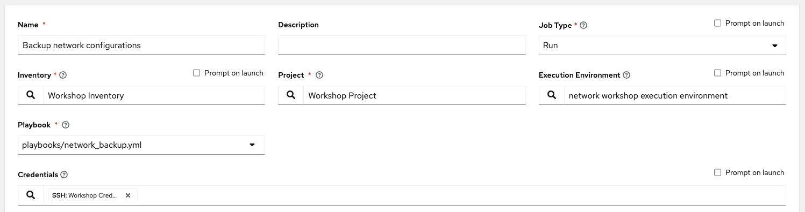

# 演習 6: 自動コントローラージョブテンプレートの作成

**他の言語でもお読みいただけます**:  [English](README.md)、 [日本語](README.ja.md),  [Español](README.es.md)

## 目次

* [目的](#objective)
* [ガイド](#guide)
  * [ステップ 1: ジョブテンプレートの作成](#step-1-create-a-job-template)
  * [ステップ 2: ジョブテンプレートの起動](#step-2-launch-the-job-template)
  * [ステップ 3: ジョブ詳細ビューの検証](#step-3-examine-the-job-details-view)
  * [ステップ 4: ジョブウィンドウの検証](#step-4-examine-the-jobs-window)
  * [ステップ 5: バックアップが作成されたことの確認](#step-5-verify-the-backups-were-created)
* [重要なこと](#takeaways)

## 目的

自動コントローラーでネットワークバックアップ構成ジョブテンプレートをデモンストレーションします。このジョブテンプレートは、4
つのルーターすべてから実行中の構成を保存し、タイムスタンプ付きでコントロールノードの /backup の下に保存します。

自動コントローラーで Ansible Playbook を実行するには、**ジョブテンプレート** を作成する必要があります。**ジョブテンプレート**
には以下が必要です。

* ジョブを実行するための **インベントリー**
* デバイスにログインするための **認証情報**。
* Ansible Playbook を含む **プロジェクト**

## ガイド

### ステップ 1: ジョブテンプレートの作成

* Web UI を開き、左側のメニューの `Templates` リンクをクリックします。

   

* 青い **Add** ボタンをクリックして、新しいジョブテンプレートを作成します。

   

> 注記:
>
> `workflow template` ではなく必ず `job template` を選択してください

* 次のようにジョブテンプレートパラメータを入力します。

  | Parameter | Value |
  |---|---|
  | Name  | Backup network configurations  |
  |  Job Type |  Run |
  |  Inventory |  Workshop Inventory |
  |  Project |  Workshop Project |
  |  Execution Environment | network workshop execution environment |
  |  Playbook |  playbooks/network_backup.yml |
  |  Credential |  Workshop Credential |

  記入されたジョブテンプレートパラメータのスクリーンショット:
   

* ジョブテンプレートに 2 番目の認証情報を追加します。

   **コントローラー認証情報** もこのジョブテンプレートに追加する必要があります。これは、自動コントローラーが **Network-Restore** ジョブテンプレートが使用するバックアップのプールを更新できるようにするためです。自動コントローラーは、ジョブテンプレートを使用してプログラムで更新し、構成を動的に追加または更新できます。ドロップダウンボックスを使用して 2 番目の認証情報を選択し、**Red Hat Ansible Automation Platform** 認証情報タイプを選択します。

  

  両方の認証情報がジョブテンプレートに正常に追加されると、次の図のようになります。

  

* 下にスクロールして、青い `Save` ボタンをクリックします。

### ステップ 2: ジョブテンプレートの起動

1. すべてのジョブテンプレートが一覧表示されている `Templates` ウィンドウに戻ります。

2. ロケットボタンをクリックして、`Backup network configurations` ジョブテンプレートを起動します。

    

    ロケットボタンをクリックすると、ジョブが起動します。このジョブは、**Job Details View** と呼ばれる新しいウィンドウで開きます。[自動コントローラージョブ](https://docs.ansible.com/automation-controller/latest/html/userguide/jobs.html) の詳細は、ドキュメントをご覧ください。

### ステップ 3: ジョブの検証

ジョブテンプレートを実行すると、自動的に [Standard Out
ウィンドウ](https://docs.ansible.com/automation-controller/latest/html/userguide/jobs.html#standard-out)
が開きます


1. *Standard Out ウィンドウ** を調べます

   Standard Out ウィンドウには、Ansible Playbook からの出力が表示されます。すべてのタスク出力は、コマンドラインに表示されるものと正確に一致します。

2. **Standard Out pane** でタスクをクリックして、その特定のタスクからの構造化された出力を開きます。

   > **changed** または **ok** がある行をクリックします

   

3. **Details** タブをクリックして、**Details ウィンドウ** を開きます。

   **Details ウィンドウ** には、ジョブの開始と終了のタイムスタンプ、ジョブの種類 (チェックまたは実行)、ジョブを開始したユーザー、使用された Project とAnsible Playbook などの情報が表示されます。

   ジョブがまだ終了していない場合、**Details ウィンドウ** には **Cancel Job** ボタンがあり、ジョブを停止するために使用できます。

### ステップ 4: ジョブウィンドウを調べます

実行済みまたは現在実行中の **ジョブテンプレート** は、**Jobs** ウィンドウの下に表示されます。

1. 左側のメニューのジョブボタンをクリックします。

   

   ジョブリンクには、ジョブの一覧とそれらのステータスが表示 (正常に完了、失敗、またはアクティブ (実行中の) ジョブとして表示) されます。この画面から実行できるアクションには、特定のジョブの詳細および標準出力、ジョブの起動、またはジョブの削除が含まれます。

2. **Backup network configurations** ジョブをクリックします

   

   **Backup network configurations** ジョブは最新のものでした (より多くのジョブを起動していない場合に限る)。このジョブをクリックして、**Standard Out ウィンドウ** に戻ります。自動コントローラーは、開始されたすべてのジョブの履歴を保存します。

### ステップ 5: バックアップが作成されたことを確認する

* Ansible コントロールノードのコマンドライン `ls /backup` で、タイムスタンプ付きのフォルダー
  (または複数のバックアップを作成した場合はフォルダー) を表示します

  ```sh
  [student@ansible-1 ~]$ ls /backup
  2021-08-31-12-58  2021-08-31-13-04  2021-08-31-13-11
  ```

  `ls` は、Linux オペレーティングシステムのコンピュータファイルを一覧表示するコマンドです。

* Visual Studio Code で `/backup` を開くか、または `cat`
  コマンドを使用して、タイムスタンプ付きのネットワークデバイスの 1 つのコンテンツを表示します

  ```sh
  [student@ansible-1 ~]$ cat /backup/2021-08-31-1
  2021-08-31-12-58/ 2021-08-31-13-04/ 2021-08-31-13-11/
  [student@ansible-1 ~]$ cat /backup/2021-08-31-12-58/rtr1.txt
  Building configuration...

  Current configuration : 5072 bytes
  !
  ! Last configuration change at 12:53:30 UTC Tue Aug 31 2021 by ec2-user
  !
  version 16.9
  service timestamps debug datetime msec
  service timestamps log datetime msec
  platform qfp utilization monitor load 80
  no platform punt-keepalive disable-kernel-core
  platform console virtual
  !
  hostname rtr1
  ```

* 残りのルーターを調べます。インストラクターは、ジュニパーやアリスタなど、この演習用に複数のベンダーを設定している場合があります。Ansible
  Playbook はベンダーに依存しないように作成できます。この場合、Github リポジトリ
  [https://github.com/network-automation/toolkit](https://github.com/network-automation/toolkit)
  を介して Ansible Playbook を提供しました。

## 重要なこと

デモンストレーションに成功しました

* ネットワーク構成をバックアップするためのジョブテンプレートの作成
* 自動コントローラー UI からのジョブテンプレートの起動
* バックアップが正しく保存されていることの確認

## 完了

ラボ演習 6 を完了しました

---
[前の演習](../5-explore-controller/README.ja.md) |
[次の演習](../7-controller-survey/README.ja.md)

[Ansible Network Automation ワークショップに戻る](../README.ja.md)
