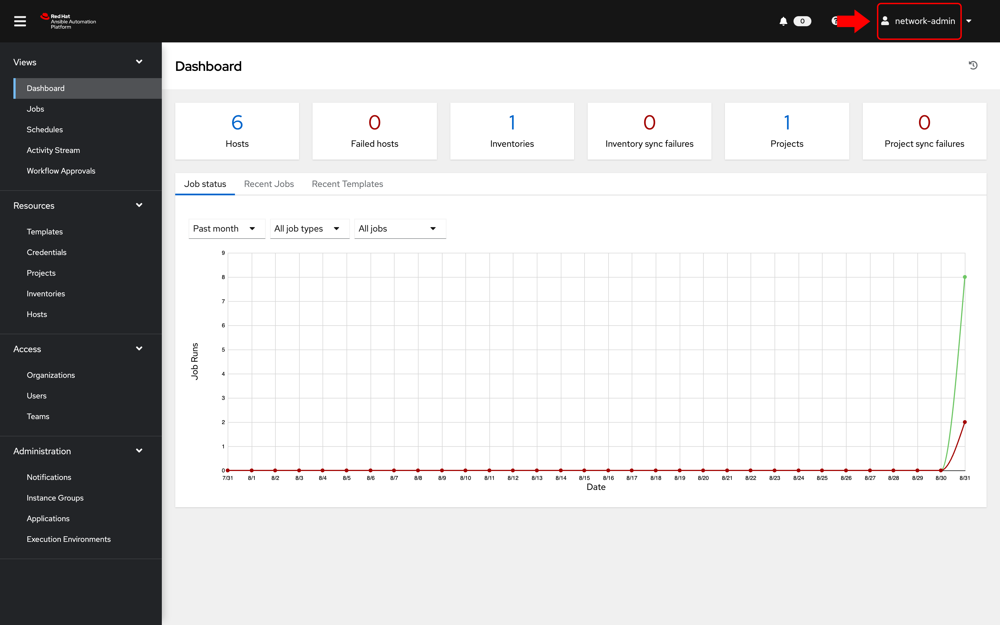

# 演習 8: 自動コントローラーの RBAC について

**他の言語でもお読みいただけます**:  [English](README.md)、 [日本語](README.ja.md),  [Español](README.es.md).

## 目次

  * [目的](#objective)
  * [ガイド](#guide)
    * [ステップ 1: 組織を開く](#step-1-opening-up-organizations)
    * [ステップ 2: ネットワーク組織を開く](#step-2-open-the-network-organization)
    * [ステップ 3: チームの検証](#step-3-examine-teams)
    * [ステップ 4: Netops チームの検証](#step-4-examine-the-netops-team)
    * [ステップ 5: network-admin としてのログイン](#step-5-login-as-network-admin)
    * [ステップ 6: チームのロールについて](#step-6-understand-team-roles)
    * [ステップ 7: ジョブテンプレートのパーミッション](#step-7-job-template-permissions)
    * [ステップ 8: network-operator としてのログイン](#step-8-login-as-network-operator)
    * [ステップ 9: ジョブテンプレートの起動](#step-9-launching-a-job-template)
    * [ボーナスステップ](#bonus-step)
  * [重要なこと](#takeaways)
  * [完了](#complete)

## 目的

自動コントローラーを使用する主な利点の 1 つは、システムを使用するユーザーを制御できることです。この演習の目的は、ロールベースのアクセス制御
([RBAC](https://docs.ansible.com/automation-controller/latest/html/userguide/security.html#role-based-access-controls))
を理解することです。自動コントローラー管理者は、これを使用してテナント、チーム、ロールを定義し、ユーザーをそれらのロールに関連付けることができます。これにより、組織は自動化システムを保護し、コンプライアンスの目標と要件を満たすことができます。

## ガイド

自動コントローラーの用語をいくつか確認しましょう。

* **組織:** たとえば、*Network-org*、*Compute-org*
  などのテナンシーを定義します。これは、顧客の組織の内部組織構造を反映している可能性があります。
* **チーム:**
  各組織内には、複数のチームが存在する場合があります。たとえば、*tier1-helpdesk*、*tier2-support*、*tier3-support*、*build-team*
  などです。
* **ユーザー:** ユーザーは通常、チームに属しています。自動コントローラー内でユーザーが実行できることは、**ロール**
  を使用して制御/定義されます。
* **ロール:** ロールは、ユーザーが実行できるアクションを定義します。これは、ユーザーがレベル 1 のヘルプデスク担当者、レベル
  2、または上級管理者のいずれであるかに基づいてアクセスが制限されている一般的なネットワーク組織に非常にうまく対応できます。自動コントローラー
  [ドキュメント](https://docs.ansible.com/automation-controller/latest/html/userguide/security.html#built-in-roles)
  は、一連の組み込みロールを定義します。

### ステップ 1: 組織を開く

* **admin** ユーザーで自動コントローラーにログインします。

  | Parameter | Value |
  |---|---|
  | username  | `admin`  |
  |  password|  provided by instructor |

* **admin** ユーザーとしてログインしていることを確認します。

  

* **Access** セクションで、**Organizations** をクリックします

  *admin* ユーザーとして、自動コントローラー用に設定されたすべての組織を表示できます。

  <table>
  <thead>
    <tr>
      <th>注記: このワークショップでは、組織、チーム、およびユーザーが自動入力されました</th>
    </tr>
  </thead>
  </table>

* 組織を調べます

  2 つの組織があります (デフォルト以外):

  * **Red Hat compute organization**
  * **Red Hat network organization**

   

   <table>
   <thead>
     <tr>
       <th>このページには、それに関連するすべてのチーム、ユーザー、インベントリ、プロジェクト、およびジョブテンプレートの概要が表示されます。組織レベルの管理者が構成されている場合は、それも表示されます。</th>
     </tr>
   </thead>
   </table>

### ステップ 2: ネットワーク組織を開く

1. **Red Hat network organization** をクリックします。

   これにより、組織の詳細を表示するセクションが表示されます。

   

2. **Access** タブをクリックして、この組織に関連付けられているユーザーを表示します。

   <table>
   <thead>
    <tr>
      <th><b>network-admin</b> と <b>network-operator</b> ユーザーの両方がこの組織に関連付けられていることを確認します。</th>
    </tr>
   </thead>
   </table>

### ステップ 3: チームの検証

1. サイドバーの **Teams** をクリックします

   

2. チームを調べます。自動コントローラー管理者は、利用可能なすべてのチームを表示できます。4 つのチームがあります。

   * Compute T1
   * Compute T2
   * Netadmin
   * Netops

   

### ステップ 4: Netops チームの検証

* **Netops** チームをクリックしてから、**Access** タブをクリックします。2 人の特定のユーザーに注意してください。

  * network-admin
  * network-operator

  

* 次の 2 つの点に注意してください。

  * **network-admin** ユーザーには、**Red Hat network organization** の管理者権限があります。
  * **network-operator** は、単に Netops チームのメンバーです。これらの各ユーザーについて詳しく調べ、ロールを理解します

### ステップ 5: network-admin としてのログイン

* 自動コントローラー UI の右上隅にある admin ボタンをクリックして、管理者ユーザーからログアウトします。

   

* **network-admin** ユーザーでシステムにログインします。

  | Parameter | Value |
  |---|---|
  | username  | network-admin  |
  |  password|  provided by instructor |

* **network-admin** ユーザーとしてログインしていることを確認します。

  

* サイドバーの **Organization** リンクをクリックします。

  自分が管理者である組織 **Red Hat network organization** のみを表示できることに気付くでしょう。

  次の 2 つの組織はもう表示されません。

  * Red Hat compute organization
  * Default

* ボーナスステップ: これをネットワークオペレーターユーザーとして試してください (network-admin と同じパスワード)。

   * network-operator と network-admin の違いは?
   * ネットワーク事業者として、他のユーザーを表示できるか。
   * 新しいユーザーを追加したり、ユーザーの資格情報を編集したりできるか。

### ステップ 6: チームのロールについて

1. さまざまなロール、つまり RBAC がどのように適用されるかを理解するには、**admin**
   ユーザーとしてログアウトしてから再度ログインします。

2. **インベントリー** に移動し、**Workshop Inventory** をクリックします

3. **Access** ボタンをクリックします。

   

4. 各ユーザーに割り当てられているパーミッションを調べます

   

   <table>
   <thead>
     <tr>
       <th>注記: <b>network-admin</b> および <b>network-operator</b> ユーザーに割り当てられた <b>ロール</b>。*<b>Use</b> ロールを割り当てることにより、<b>network-operator</b> ユーザーにこの特定のインベントリを使用する権限が付与されます。</th>
     </tr>
   </thead>
   </table>

### ステップ 7: ジョブテンプレートのパーミッション

1. 左側のメニューの **Template** ボタンをクリックします

2. **Netowork-Commands** ジョブテンプレートをクリックします

3. 上部の **Access** ボタンをクリックします

   

   <table>
   <thead>
     <tr>
       <th>注記: 同じユーザーがジョブテンプレートに対して異なるロールを持ちます。これは、「誰が何にアクセスできるか」を制御することにおいて、自動コントローラーを使用して運用者が導入できる粒度を強調しています。この例では、network-adminは <b>Network-Commands</b> ジョブテンプレートを更新 (<b>管理</b>) できますが、network-operator はそれを <b>実行</b> することしかできません。</th>
     </tr>
   </thead>
   </table>

### ステップ 8: network-operator としてのログイン

最後に、RBAC の動作を確認します。

1. admin でログアウトし、**network-operator** ユーザーとして再度ログインします。

   | Parameter | Value |
   |---|---|
   | username  | `network-operator`  |
   |  password|  provided by instructor |

2. **Templates** に移動し、**Network-Commands** ジョブテンプレートをクリックします。

   

   <table>
   <thead>
     <tr>
       <th><b>network-operator</b> ユーザーは、どのフィールドも変更できないことに注意してください。<b>Edit</b> ボタンは利用できなくなります。</th>
     </tr>
   </thead>
   </table>

### ステップ 9: ジョブテンプレートの起動

1. **Launch** ボタンをクリックして、**Network-Commands** テンプレートを起動します。

4. 事前設定された show コマンドの 1 つを選択できるダイアログボックスが表示されます。

   

5. 先に進んでコマンドを選択し、** Next** に続いて **Launch** をクリックして、実行中の Playbook
   と表示されている結果を確認します。

### ボーナスステップ

時間があれば、network-admin として再度ログインし、オペレーターに実行させたい別の show
コマンドを追加します。これは、network-admin ユーザーの *Admin*
ロールでジョブテンプレートを編集/更新する方法を確認するのにも役立ちます。

## 重要なこと

* 自動コントローラーの強力な RBAC
  機能を使用すると、オペレーターがシステム自体にアクセスせずに、本番システムで所定のコマンドを実行できるアクセスを簡単に制限できることがわかります。
* 自動コントローラーは、複数の組織、複数のチーム、およびユーザーに対応できます。ユーザーは、必要に応じて複数のチームや組織に属することもできます。この演習で説明されていないことは、自動コントローラーでユーザーを管理する必要がないことです。[エンタープライズ認証](https://docs.ansible.com/automation-controller/latest/html/administration/ent_auth.html)
  を使用できます。これは、Active Directory、LDAP、RADIUS、SAML、および TACACS+ を含みます。
* 例外が必要な場合 (ユーザーはアクセスが必要ですが、チーム全体は必要ありません)、これも可能です。RBAC
  の粒度は、個々のユーザーの資格情報、インベントリー、またはジョブテンプレートにまで及ぶ可能性があります。

## 完了

ラボ演習 8 を完了しました

---
[前の演習](../7-controller-survey/README.ja.md) | [次の演習](../9-controller-workflow/README.ja.md)

[Ansible Network Automation ワークショップに戻る](../README.ja.md)
