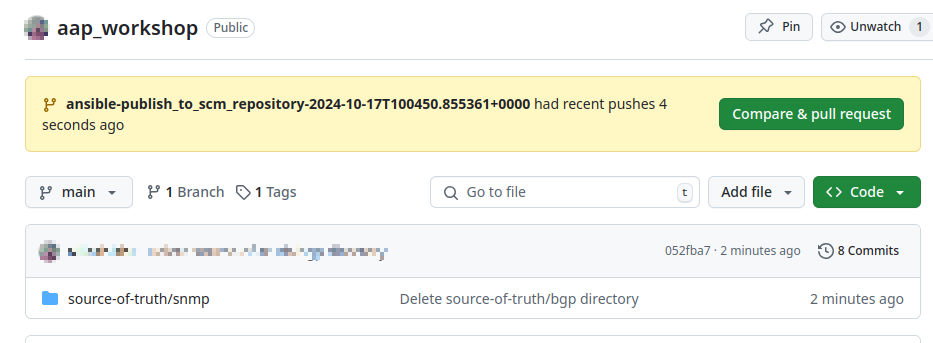

# Exercise 6: Configuring BGP and OSPF using Automation Controller

## Table of Contents

* [Objective](#objective)
* [Guide](#guide)
   * [Step 1: Examine the Automation controller Inventory](#step-1-examine-the-automation-controller-inventory)
   * [Step 2: Examine the Automation controller Workshop Credential](#step-2-examine-the-automation-controller-workshop-credential)
   * [Step 3: Examine the Automation controller Workshop Project](#step-3-examine-the-automation-controller-workshop-project)
* [Takeaways](#takeaways)
* [Complete](#complete)

## Objective

In this exercise, we will write new playbooks using **Resource Modules** to configure BGP on the lab routers and validate
the BGP operational state.

## Guide

### Step 1: Examine the topology of the lab routers


* There are 4 routers in the topology - `rtr1`, `rtr2`, `rtr3` and `rtr4`. They are connected over pre-configured Tunnel interfaces.

* `rtr1` is connected to `rtr3` over Tunnel0 (network `10.100.100.0/24`).

* `rtr2` is connected to `rtr4` over Tunnel0 (network `10.101.101.0/24`).

* `rtr1` and `rtr2` are connected over Tunnel1 (network `10.200.200.X/24`).

* Go the VS code WebUI terminal and verify the interface configuration on these routers by ssh-ing into them and executing the
  following command:

   ```bash
   rtr1#show running-config | section ^interface
   ```

* Routers `rtr1` - `rtr3` and `rtr2` - `rtr4` are configured to be OSPF neighbors.

  To verify the OSPF configuration execute the following command:

  ```sh
  rtr1#show ip ospf neighbor
  ```

  For example, the OSPF configuration on `rtr1` is:

  ```sh
  rtr1#show running-config | section ^router ospf
  router ospf 1
  router-id 192.168.1.1
  redistribute bgp 65000
  ```

  To validate the OSPF neighbor information on a per-interface basis, use the following command:
  
  ```sh
  rtr1#show ip ospf neighbor

  Neighbor ID     Pri   State           Dead Time   Address         Interface
  192.168.3.3       0   FULL/  -        00:00:39    10.100.100.2    Tunnel0
  ```

### Step 2: Configuring BGP on `rtr1` and `rtr2`

* In this step, we will write playbooks to establish BGP between `rtr1` and `rtr2`.

* In the VS code WebUI terminal, create a new directory named `bgp` under `aap_workshop/source-of-truth` directory with the
  following:

  ```bash
  mkdir -p aap_workshop/source-of-truth/bgp
  ```

* Create two new YAML files in the `aap_workshop/source-of-truth/bgp` directory named `rtr1.yaml` and `rtr2.yaml`.

  ```bash
  touch aap_workshop/source-of-truth/bgp/rtr1.yml
  touch aap_workshop/source-of-truth/bgp/rtr2.yml
  ```

* These two files will act as the Source-of-Truth for the BGP configuration on these devices respectively.
  Populate these files with the following:

    **rtr1.yaml**

    ```yaml
    # bgp configuration for rtr1
    bgp_address_family:
        address_family:
        -   afi: ipv4
            neighbors:
            -   activate: true
                neighbor_address: 10.200.200.2
            networks:
            -   address: 10.100.100.0
                mask: 255.255.255.0
            -   address: 10.200.200.0
                mask: 255.255.255.0
            redistribute:
            -   ospf:
                    process_id: 1
        as_number: '65000'
    bgp_global:
        as_number: '65000'
        bgp:
            log_neighbor_changes: true
            router_id:
                address: 192.168.1.1
        neighbors:
        -   neighbor_address: 10.200.200.2
            remote_as: '65001'
    ```

    **rtr2.yaml**

    ```yaml
    # bgp configuration for rtr2
    bgp_address_family:
        address_family:
        -   afi: ipv4
            neighbors:
            -   activate: true
                neighbor_address: 10.200.200.1
            networks:
            -   address: 10.101.101.0
                mask: 255.255.255.0
            -   address: 10.200.200.0
                mask: 255.255.255.0
            redistribute:
            -   ospf:
                    process_id: 1
        as_number: '65001'
    bgp_global:
        as_number: '65001'
        bgp:
            log_neighbor_changes: true
            router_id:
                address: 192.168.2.2
        neighbors:
        -   neighbor_address: 10.200.200.1
            remote_as: '65000'
    ```

* Next, create a new playbook named `configure_bgp.yaml` in the `aap_workshop` directory.

  ```bash
  touch aap_workshop/configure_bgp.yml
  ```

* Open the `configure_bgp.yml` playbook in VS code and populate it with the following:

  ```yaml
    ---
    - hosts: rtr1, rtr2
      gather_facts: false
      tasks:
        - name: "Load source-of-truth for {{ inventory_hostname }}"
          ansible.builtin.include_vars:
            file: ./source-of-truth/bgp/{{ inventory_hostname }}.yml

        - name: "Configure BGP Global Configuration on {{ inventory_hostname }}"
          cisco.ios.ios_bgp_global:
            config: "{{ bgp_global }}"
            state: overridden

        - name: "Configure BGP Address Family Configuration on {{ inventory_hostname }}"
          cisco.ios.ios_bgp_address_family:
            config: "{{ bgp_address_family }}"
            state: overridden
  ```
  
  **Notes**:

  * In the first task, we're loading the BGP configuration from the flat-files for the respective hosts using the `include_vars`
    plugin. This plugin loads YAML/JSON variables dynamically from a file or directory, recursively, during task runtime. For more
    information on this, refer to the [documentation](https://docs.ansible.com/ansible/latest/collections/ansible/builtin/include_vars_module.html).

  * Next, we are using the `ios_bgp_global` module from the `cisco.ios` collection to configure global BGP configuration lines
    on both the routers. As a part of this, we are passing the contents of `bgp_global` variable that was loaded from the flat-files
    to the `config` key of this module. Along with that, we have also set `state: overridden`, this ensures that when this playbook is executed any superfluous BGP global config that maybe present on the routers will be negated and the routers will move to the desired state as defined in the source-of-truth.

  * In the third task, we essential do the same as the previous one but with the `ios_bgp_address_family` module which manages all
    the BGP Address Family configuration on IOS-XE routers.

### Step 3: Execute this playbook with `ansible-navigator`.

* Before executing the playbook, login to `rtr1` and `rtr2` and check the output of `show ip bgp summary`.
  It should say `% BGP not active`.

  ```bash
  rtr1#show ip bgp summary
  % BGP not active
  ```

* Once you have verified that BGP is not configured and running of these two routers, execute the playbook with `ansible-navigator`.

  ```bash
  [student@ansible-1 network-workshop]$ ansible-navigator run aap_workshop/configure_bgp.yaml --mode stdout
  ```

* Once the playbook run has completed, the BGP configuration should be correctly pushed to the routers.
  To validate this, ssh to `rtr1` and `rtr2` and observe the output of `show ip bgp summary`.
  
  ```bash
  rtr1#show ip bgp summary
  BGP router identifier 192.168.1.1, local AS number 65000
  BGP table version is 4, main routing table version 4
  3 network entries using 744 bytes of memory
  4 path entries using 544 bytes of memory
  2/2 BGP path/bestpath attribute entries using 592 bytes of memory
  1 BGP AS-PATH entries using 24 bytes of memory
  0 BGP route-map cache entries using 0 bytes of memory
  0 BGP filter-list cache entries using 0 bytes of memory
  BGP using 1904 total bytes of memory
  BGP activity 3/0 prefixes, 4/0 paths, scan interval 60 secs
  3 networks peaked at 08:41:45 Oct 17 2024 UTC (02:26:40.722 ago)

  Neighbor        V           AS MsgRcvd MsgSent   TblVer  InQ OutQ Up/Down  State/PfxRcd
  10.200.200.2    4        65001     166     167        4    0    0 02:27:31        2
  ```

  ```bash
  rtr2#show ip bgp summary
  BGP router identifier 192.168.2.2, local AS number 65001
  BGP table version is 4, main routing table version 4
  3 network entries using 744 bytes of memory
  4 path entries using 544 bytes of memory
  2/2 BGP path/bestpath attribute entries using 592 bytes of memory
  1 BGP AS-PATH entries using 24 bytes of memory
  0 BGP route-map cache entries using 0 bytes of memory
  0 BGP filter-list cache entries using 0 bytes of memory
  BGP using 1904 total bytes of memory
  BGP activity 3/0 prefixes, 4/0 paths, scan interval 60 secs
  3 networks peaked at 08:41:45 Oct 17 2024 UTC (02:27:21.165 ago)

  Neighbor        V           AS MsgRcvd MsgSent   TblVer  InQ OutQ Up/Down  State/PfxRcd
  10.200.200.1    4        65000     167     166        4    0    0 02:28:11        2
  ```

  **Note:** It might take some time for the prefix count to reflect `2`.


### Step 3: Publish the newly added files to the `aap_workshop` Github repository

* In this step, we will use the previously written `publish.yaml` playbook to update our `aap_workshop` repository with the playbook
  and BGP configuration flat-files. The `publish.yaml` playbook pushes all the content in the `aap_workshop` local directory to the Github repository.

* To update the remote repository, run the playbook from the terminal.

  ```bash
  ansible-navigator run publish.yml --mode stdout
  ```

* After the playbook execution has completed, go to the Github repository. It should prompt you to **Compare & pull request**.
  Click on the button and it will take you to the `Open a pull request` page.

  

* Click on **Create pull request**.
  
  

* Examine the changes by going to **Files changed** and if everything looks as expected, merge the PR into `main` branch by clicking on **Merge pull request**.

  

* Go to the main repository page and it should now have the new playbook and the new source-of-truth flat-files.

## Takeaways

- **Resource Modules** can be used configure specific network resources like BGP global and BGP address family.
- Using **Resource Modules**, the source-of-truth can be easily decoupled from the playbooks that use it. This simplifies
  the content in the playbooks, allowing network administrators to focus on the correctness of the configuration being
  pushed to the target devices by modifying the source-of-truth ONLY.

## Solution

The finished Ansible Playbook is provided here for an answer key:

-  [rtr1.yaml](./rtr1.yml)
-  [rtr1.yaml](./rtr2.yml)
-  [configure.yml](./configure.yml)
