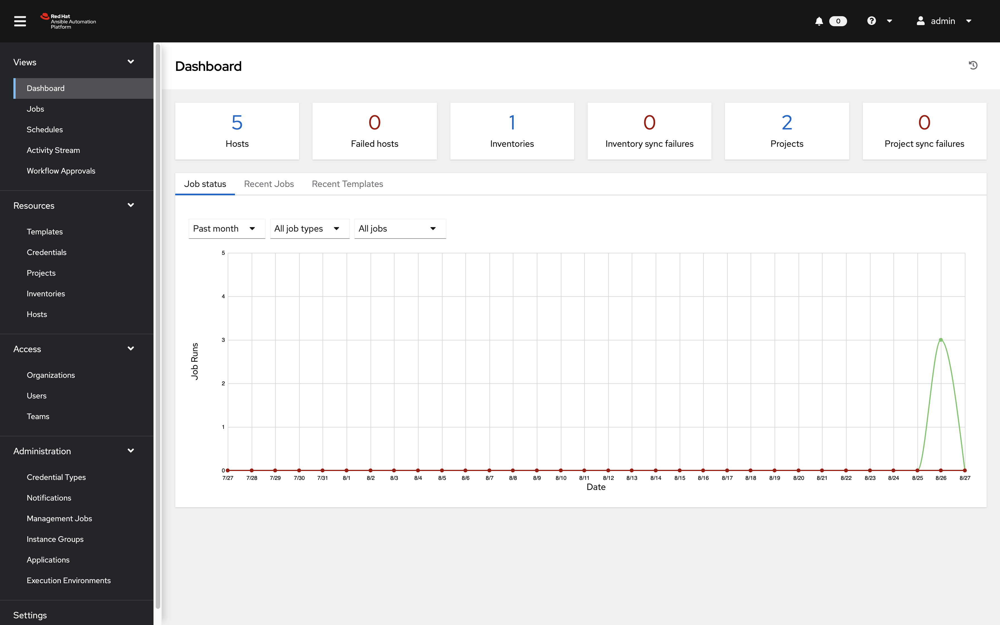
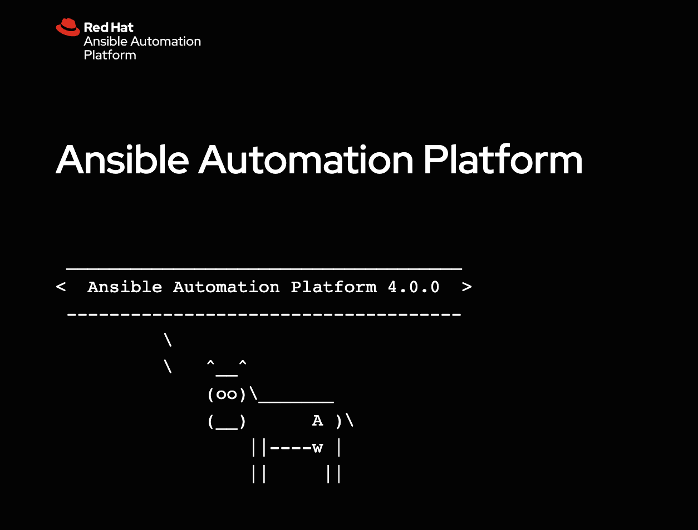
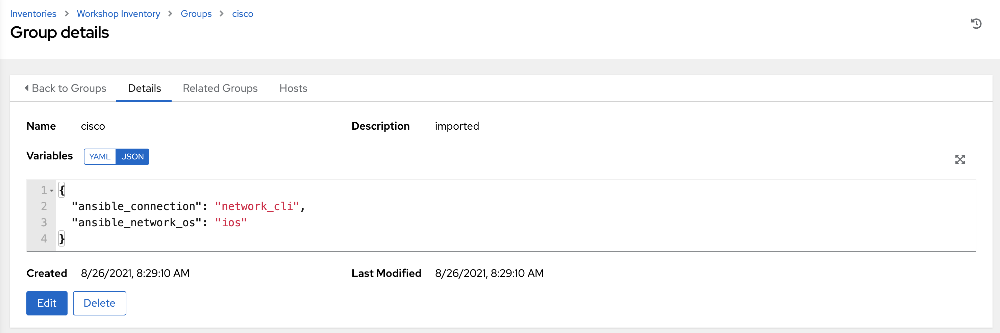
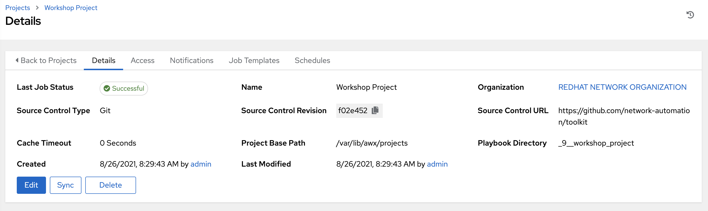

# 演習 5: 自動コントローラーの探索

**他の言語でもお読みいただけます**:  [English](README.md)、 [日本語](README.ja.md),  [Español](README.es.md)

## 目次

* [目的](#objective)
* [ガイド](#guide)
   * [ステップ 1: 自動コントローラーへのログイン](#step-1-login-to-automation-controller)
   * [ステップ 2:
     自動コントローラーインベントリーの検証](#step-2-examine-the-automation-controller-inventory)
   * [ステップ 3:
     自動コントローラーワークショッププロジェクトの検証](#step-3-examine-the-automation-controller-workshop-project)
   * [ステップ 4:
     自動コントローラーワークショップ認証情報の検証](#step-4-examine-the-automation-controller-workshop-credential)
* [重要なこと](#takeaways)
* [完了](#complete)

## 目的

ラボ環境を調べて理解します。この演習では、以下を対象とします。

* コントロールノードで実行されている Ansible Automation Platform バージョンの判別
* 以下を見つけて理解:
  * 自動コントローラー **インベントリー**
  * 自動コントローラー **認証情報**
  * 自動コントローラー **プロジェクト**

## ガイド

### ステップ 1: 自動コントローラーへのログイン

1.  インストラクターが提供するワークショップの起動ページに戻ります。

2.  自動コントローラーの Web UI へのリンクをクリックします。以下のようなログイン画面が表示されるはずです。

   自動コントローラーログイン画面のスクリーンショット。

   * ユーザー名は `admin` です
   * 起動ページで指定されたパスワード

3. ジョブダッシュボードにログインすると、以下に示すようにデフォルトのビューになります。

   

4. ユーザーインターフェイスの右上にある **?** ボタンをクリックし、**About** をクリックします。

   

5. 次のようなウィンドウがポップアップ表示されます。

   

### ステップ 2: 自動コントローラーインベントリーの検証

自動コントローラーがジョブを実行できるようにするには、インベントリーが必要です。インベントリーは、Ansible
インベントリーファイルと同じように、ジョブを起動できる一連のホストのコレクションです。さらに、自動コントローラーは、ServiceNow
やInfoblox DDI などの既存の設定管理データベース (cmdb) を利用できます。

> 注記:
>
> 自動コントローラーに関するインベントリーの詳細は、[このドキュメント](https://docs.ansible.com/automation-controller/4.0.0/html/userguide/inventories.html) を参照してください。

1. 左側のメニューバーの **RESOURCES** の下にある **Inventories** ボタンをクリックします。

    

2. Inventories で `Workshop Inventory` をクリックします。

    

3. `Workshop Inventory` で、上部の **Hosts** ボタンをクリックします。ここには、rtr1 から rtr4 の 4
   つのホストと、Ansible コントロールノードがあります。

   

4. これらのデバイスの 1 つをクリックします。

   

     **VARIABLES** フィールドに注意してください。`host_vars` は、`ansible_host` 変数を含めてここで設定されます。

5. **GROUPS** をクリックします。ここには、`routers` と `cisco` を含む複数のグループがあります。これらのグループの 1
   つをクリックします。

   

6. これらのグループの 1 つをクリックします。

   

     **VARIABLES** フィールドに注意してください。`group_vars` は、`ansible_connection` および `ansible_network_os` 変数を含めてここで設定されます。

### ステップ 3: 自動コントローラーワークショッププロジェクトの検証

プロジェクトは、Ansible Playbook が自動コントローラーにインポートされる仕組みです。Playbook および Playbook
ディレクトリーを自動コントローラーサーバーのプロジェクトのベースパスに手動で配置するか、自動コントローラーがサポートするソースコード管理 (SCM)
システム (例: Git、Subversion) に Playbook を配置することで、Playbook と Playbook
ディレクトリーを管理できます。

> 注記:
>
> 自動コントローラーのプロジェクトの詳細については、[ドキュメントを参照してください](https://docs.ansible.com/automation-controller/latest/html/userguide/projects.html)

1. 左側のメニューバーの **RESOURCES** の下にある **Projects** ボタンをクリックします。

   

2. **PROJECTS** の下に `Workshop Project` があります。

    

    このプロジェクトには `GIT` がリストされていることに注意してください。これは、このプロジェクトが SCM に Git を使用していることを意味します。

3. `Workshop Project` をクリックします。

  

    ソースコントロールの URL が [https://github.com/network-automation/toolkit](https://github.com/network-automation/toolkit
) に設定されていることに注意してください。

### ステップ 4: 自動コントローラーワークショップ認証情報の検証

認証情報は、**Jobs**
をマシンに対して起動したり、インベントリーソースと同期したり、プロジェクトのコンテンツをバージョン管理システムからインポートしたりする際の認証用に、自動コントローラーによって使用されます。ワークショップでは、ネットワークデバイスへの認証に認証情報が必要です。

> 注記:
>
> 自動コントローラーの認証情報の詳細は、[ドキュメントを参照してください](https://docs.ansible.com/automation-controller/4.0.0/html/userguide/credentials.html)。

1. 左側のメニューバーの **Resources** の下にある **Credentials** ボタンをクリックします。

    

2. **Credentials** には、`Workshop Credential`、`Controller Credential`、および
   `registry.redhat.io credential` を含む複数の事前設定された認証情報があります。`Workshop
   Credential` をクリックします。

    

3. `Workshop Credential` で以下を確認します。

* **CREDENTIAL TYPE**は **Machine* 認証情報です。
* **USERNAME** は `ec2-user` に設定されています。
* **PASSWORD** は空白です。
* **SSH PRIVATE KEY** はすでに構成されており、**ENCRYPTED** されています。

## 重要なこと

* 自動コントローラーは、Ansible Playbook
  を再度実行するためのインベントリーが必要です。このインベントリーは、ユーザーがコマンドラインのみの Ansible
  プロジェクトで使用するものと同じです。
* このワークショップではすでにインベントリーが設定されていますが、既存の Ansible Automation
  インベントリーをインポートするのは簡単です。既存のインベントリーを自動コントローラーに簡単に取り込むその他の方法については、[このブログポスト](https://www.ansible.com/blog/three-quick-ways-to-move-your-ansible-inventory-into-red-hat-ansible-tower)
  をご覧ください。
* 自動コントローラーは、Github を含む既存の SCM (ソース管理) と同期できます。
* 自動コントローラーは、SSH 秘密鍵やプレーンテキストパスワードなどの資格情報を保存および暗号化できます。自動コントローラーは、HashiCorp
  の CyberArk や Vault などの既存の資格情報ストレージシステムと同期することもできます。

## 完了

ラボ演習 5 を完了しました

これで、自動コントローラーの使用を開始するために必要な認証情報、インベントリー、およびプロジェクトの 3
つのコンポーネントすべてを調べました。次の演習では、ジョブテンプレートを作成します。

---
[前の演習](../4-resource-module/README.ja.md) |
[次の演習](../6-controller-job-template/README.ja.md)

[Ansible Network Automation ワークショップに戻る](../README.ja.md)