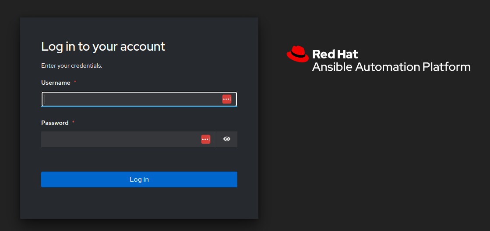
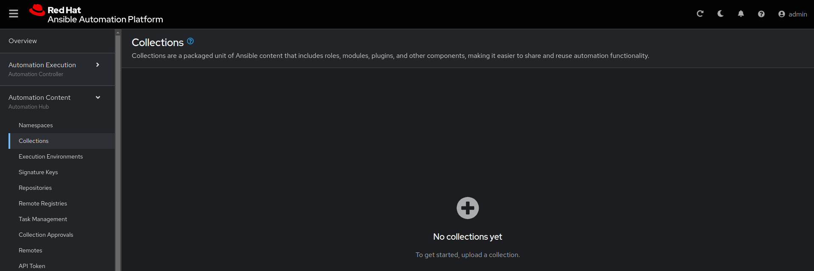

# Exercise 4: Explore Ansible Automation Platform 2.5

With Ansible Automation Platform, you can create, manage, and scale automation for your organization across users, teams, and regions. The release of Ansible Automation Platform 2.5 introduces an updated, unified user interface (UI) that allows you to interact with and manage each part of the platform.

## Table of Contents

* [Objective](#objective)
* [Guide](#guide)
   * [Step 1: Login to Ansible Automation Platform UI](#step-1-login-to-ansible-automation-platform)
   * [Step 2: Examine the Automation controller Inventory](#step-2-examine-the-automation-controller-inventory)
   * [Step 3: Examine the Automation controller Workshop Project](#step-3-examine-the-automation-controller-workshop-project)
   * [Step 4: Examine the Automation controller Workshop Credential](#step-4-examine-the-automation-controller-workshop-credential)
* [Takeaways](#takeaways)
* [Complete](#complete)

## Objective

Explore and understand the lab environment.  This exercise will cover

* Determining the Ansible Automation Platform version running on the control node
* Locating and understanding:
  * Automation controller **Inventory**
  * Automation controller **Credentials**
  * Automation controller **Projects**

## Guide

### Step 1: Login to Ansible Automation Platform

1.  Return to the workshop launch page provided by your instructor.

2.  Click on the link to the AAP UI.  You should see a login screen similar to the follow:

   Screenshot of Automation controller login window.

   * The username will be `admin`
   * password provided on launch page

3. After logging in the Dashboard will be the default view as shown below.

   

4. Click on the **?** button on the top right of the user interface and click **About**

   

5. A window will pop up similar to the following:

   

### Step 2: Explore the unified platform UI

AAP 2.5 comes with an unified UI that provides a consistent and centralized WebUI, API, authentication, authorization and role based access controls (RBAC), along with automation analytics that helps let's users utilize reporting at scale.

Take a look at the left sidebar in the dashboard.

1. **Automation Controller**

The centerpiece of Ansible Automation Platform is its automation execution command and control center, where you can deploy, define, operate, scale and delegate automation across your enterprise. With this functionality, you can perform a variety of tasks from a single location, such as running playbooks from a simple, straightforward web UI, monitoring dashboard activity, and centralized logging to manage and track job execution.

2. **Automation Hub**

Automation hub is the central location for your Ansible Automation Platform content. In automation hub you can also find content collections that you can download and integrate into your automation environment. You can also create and upload your own content to distribute to your users.

3. **Event-Driven Ansible**

Red Hat AAP includes Event-Driven Ansible, an automation engine that listens to your system’s event stream and reacts to events that you have specified with targeted automation tasks. In this way, Event-Driven Ansible manages routine automation tasks and responses, freeing you up to work on more complex tasks.

4. **Automation Analytics**

### Step 3: Examine the Automation controller Workshop Project

A project is how Ansible Playbooks are imported into Automation controller.  You can manage playbooks and playbook directories by either placing them manually under the Project Base Path on your Automation controller server, or by placing your playbooks into a source code management (SCM) system supported by Automation controller, including Git and Subversion.

> Note:
>
> For more information on Projects in Automation controller, please [refer to the documentation](https://docs.ansible.com/automation-controller/latest/html/userguide/projects.html)

1. Click on the **Projects** button under **RESOURCES** on the left menu bar.

   

2. Under **PROJECTS** there will be a `Workshop Project`.  

    

    Note that `GIT` is listed for this project.  This means this project is using Git for SCM.

3. Click on the `Workshop Project`.

  

    Note that Source Control URL is set to [https://github.com/network-automation/toolkit](https://github.com/network-automation/toolkit
)

### Step 4: Examine the Automation controller Workshop Credential

Credentials are utilized by Automation controller for authentication when launching **Jobs** against machines, synchronizing with inventory sources, and importing project content from a version control system.  For the workshop we need a credential to authenticate to the network devices.

> Note:
>
> For more information on Credentials in Automation controller please [refer to the documentation](https://docs.ansible.com/automation-controller/4.0.0/html/userguide/credentials.html).

1. Click on the **Credentials** button under **Resources** on the left menu bar.

    

2. Under **Credentials** there will be multiple pre-configured credentials, including `Workshop Credential`, `Controller Credential` and the `registry.redhat.io credential`.  Click on the `Workshop Credential`.

    

3. Under the `Workshop Credential` examine the following:

* The **CREDENTIAL TYPE** is a **Machine** credential.
* The **USERNAME** is set to `ec2-user`.
* The **PASSWORD** is blank.
* The **SSH PRIVATE KEY** is already configured, and is **ENCRYPTED**.
  


## Takeaways

* Automation controller needs an inventory to execute Ansible Playbooks again.  This inventory is identical to what users would use with the command line only Ansible project.
* Although this workshop already setup the inventory, importing an existing Ansible Automation inventory is easy.  Check out [this blog post](https://www.ansible.com/blog/three-quick-ways-to-move-your-ansible-inventory-into-red-hat-ansible-tower) for more ways to easily get an existing inventory into Automation controller.
* Automation controller can sync to existing SCM (source control management) including Github.
* Automation controller can store and encrypt credentials including SSH private keys and plain-text passwords.  Automation controller can also sync to existing credential storage systems such as CyberArk and Vault by HashiCorp

## Complete

You have completed lab exercise 5

You have now examined all three components required to get started with Automation controller.  A credential, an inventory and a project.  In the next exercise we will create a job template.

---
[Previous Exercise](../4-resource-module/README.md) | [Next Exercise](../6-controller-job-template/README.md)

[Click here to return to the Ansible Network Automation Workshop](../README.md)
