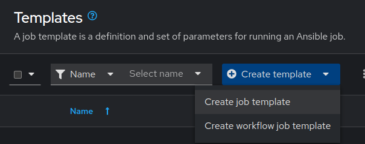

# Exercise 5: Executing Automation Jobs with Automation Controller

## Table of Contents

* [Objective](#objective)
* [Guide](#guide)
   * [Step 1: Examine the Automation controller Inventory](#step-1-examine-the-automation-controller-inventory)
   * [Step 2: Examine the Automation controller Workshop Credential](#step-2-examine-the-automation-controller-workshop-credential)
   * [Step 3: Examine the Automation controller Workshop Project](#step-3-examine-the-automation-controller-workshop-project)
* [Takeaways](#takeaways)
* [Complete](#complete)

## Objective

Explore and understand foundational Automation Controller concepts. This exercise will cover:

* Automation controller **Inventory**
* Automation controller **Credentials**
* Automation controller **Projects**
* Automation controller **Job Templates**

## Guide

### Step 1: Examine the Automation Controller inventory

An inventory is required for Automation controller to be able to run jobs.  An inventory is a collection of hosts against which jobs may be launched, the same as an Ansible inventory file. In addition, Automation controller can make use of an existing configuration management data base (cmdb) such as ServiceNow or Infoblox DDI.

> Note:
>
> More info on Inventories in respect to Automation controller can be found in the [documentation here](https://docs.redhat.com/en/documentation/red_hat_ansible_automation_platform/2.5/html/getting_started_with_ansible_automation_platform/assembly-gs-auto-dev#proc-gs-auto-dev-create-automation-decision-proj)

1. Click on the **Inventories** button under the **Automation Execution** drop-down menu in the left sidebar.

2. Under **Inventories** click on the `Workshop Inventory`.


3. Under the `Workshop Inventory` click the **Hosts** button at the top. There will be four hosts here, rtr1 through rtr4 as well as the ansible control node.


4. Click on one of the devices.


Take note of the **VARIABLES** field. The `host_vars` are set here including the `ansible_host` variable.

5. Click on **GROUPS**. There will be multiple groups here including `routers` and `cisco`.  Click on one of the groups.


6. Click on one of the groups.


Take note of the **VARIABLES** field. The `group_vars` are set here including the `ansible_connection` and `ansible_network_os` variable.

### Step 2: Examine the Automation Controller Workshop Credential

Credentials are utilized by Automation controller for authentication when launching **Jobs** against machines, synchronizing with inventory sources, and importing project content from a version control system. For the workshop we need a credential to authenticate to the network devices.

> Note:
>
> For more information on Projects in Automation controller, please [refer to the documentation](https://docs.ansible.com/automation-controller/latest/html/userguide/credentials.html)

1. Click on the **Credentials** button under the **Automation Execution** drop-down menu in the left sidebar.


2. Under **Credentials** there will be multiple pre-configured credentials. Click on the `Workshop Credential`.


3. Under the `Workshop Credential` examine the following:

* The **CREDENTIAL TYPE** is a **Machine** credential.
* The **USERNAME** is set to `ec2-user`.
* The **PASSWORD** is blank.
* The **SSH PRIVATE KEY** is already configured, and is **ENCRYPTED**.

### Step 3: Examine the Automation Controller Workshop Project

A project is how Ansible Playbooks are imported into Automation controller. You can manage playbooks and playbook directories by either placing them manually under the Project Base Path on your Automation controller server, or by placing your playbooks into a source code management (SCM) system supported by Automation controller, including Git and Subversion.

> Note:
>
> For more information on Projects in Automation controller, please [refer to the documentation](https://docs.redhat.com/en/documentation/red_hat_ansible_automation_platform/2.5/html/getting_started_with_ansible_automation_platform/assembly-gs-auto-op#proc-gs-auto-op-projects)

1. Click on the **Projects** button under the **Automation Execution** drop-down menu in the left sidebar.


2. Under **Projects** there will be a `Workshop Project`.


Note that Source Control URL is set to [https://github.com/network-automation/toolkit](https://github.com/network-automation/toolkit)

### Step 4: Create Automation Controller Job Template

A **Job Template** is a definition and set of parameters for running a playbook in AAP. A **Job Template** requires:

* An **Inventory** to run the job against.
* A **Credential** to login to devices.
* A **Project** which contains Ansible Playbooks.

1. Click on the **Templates** button under the **Automation Execution** drop-down menu in the left sidebar.


2. Click on the **Add** button to create a new job template.



> Note:
>
> Make sure to select `job template` and not `workflow template`

3. Fill out the job template parameters as follows:

  | Parameter | Value |
  |---|---|
  | Name  | Backup network configurations  |
  |  Job Type |  Run |
  |  Inventory |  Workshop Inventory |
  |  Project |  Workshop Project |
  |  Execution Environment | network workshop execution environment |
  |  Playbook |  playbooks/network_backup.yml |
  |  Credential |  Workshop Credential |

  Screenshot of the job template parameters filled out:

   

4. Add a second credential to the Job Template.

   The **Controller Credential** also must be added to this particular Job Template.  This is so Automation controller can update the pool of backups the **Network-Restore** Job Template will use. Automation controller can be programmatically updated with Job Templates to add or update configurations dynamically. Select the 2nd credential by using the drop down box to select the **Red Hat Ansible Automation Platform** credential type:

   

   When you have both credential successfully added to the `Job Template` it will look like the following picture:

   

5. Navigate back to the `Templates` window, where all Job Templates are listed.

6. Launch the `Backup network configurations` Job Template by clicking the Rocket button.

    

    When the rocket button is clicked this will launch the job.  The job will open in a new window called the **Job Details View**.  More info about [Automation controller jobs](https://docs.ansible.com/automation-controller/latest/html/userguide/jobs.html) can be found in the documentation.

7. Examine the Job

    * After executing the Job Template, it will automatically open the [Standard Out pane](https://docs.ansible.com/automation-controller/latest/html/userguide/jobs.html#standard-out)

    * Examine the **Standard Out pane**

    The Standard Out pane will display the output from the Ansible Playbook.  Every task output will match exactly what would be seen on the command line.

    * Click on a task in the **Standard Out pane** to open up structured output from that particular task.

    > Click on any line where there is a **changed** or **ok**

    * Click on the **Details**  tab to open the **Details pane**

    The **Details pane** will information such as the timestamp for when the job started and finished, the job type (Check or Run), the user that launched the job, which Project and Ansible Playbook were used and more.

    If the Job has not finished yet, the **Details Pane** will have a **Cancel Job** button that can be used to stop the Job.

8. Examine the Jobs window

    * Any **Job Template** that has been run or is currently running will show up under the **Jobs** window. 
      Click the Jobs button the left menu.

        

    The Jobs link displays a list of jobs and their status–shown as completed successfully or failed, or as an active (running) job. Actions you can take from this screen include viewing the details and standard output of a particular job, relaunch jobs, or remove jobs.

    * Click on the **Backup network configurations** Job

    The **Backup network configurations** job was the most recent (unless you have been launching more jobs).  Click on this job to return to the **Standard Out pane**.  Automation controller will save the history of every job launched.

9. Verify the backups were created

    * On the Ansible control node command line `ls /backup` to view the time stamped folder (or folders if you created multiple backups)

        ```sh
        [student@ansible-1 ~]$ ls /backup
        2021-08-31-12-58  2021-08-31-13-04  2021-08-31-13-11
        ```

        `ls` is a command to list computer files in Linux operating systems

    * Either open `/backup` with Visual Studio Code or use the `cat` command to view the contents of one of the time stamped network devices

        ```sh
        [student@ansible-1 ~]$ cat /backup/2021-08-31-1
        2021-08-31-12-58/ 2021-08-31-13-04/ 2021-08-31-13-11/
        [student@ansible-1 ~]$ cat /backup/2021-08-31-12-58/rtr1.txt
        Building configuration...

        Current configuration : 5072 bytes
        !
        ! Last configuration change at 12:53:30 UTC Tue Aug 31 2021 by ec2-user
        !
        version 16.9
        service timestamps debug datetime msec
        service timestamps log datetime msec
        platform qfp utilization monitor load 80
        no platform punt-keepalive disable-kernel-core
        platform console virtual
        !
        hostname rtr1
        ```

## Takeaways

* Automation controller needs an inventory to execute Ansible Playbooks again.  This inventory is identical to what users would use with the command line only Ansible project.
* Although this workshop already setup the inventory, importing an existing Ansible Automation inventory is easy.  Check out [this blog post](https://www.ansible.com/blog/three-quick-ways-to-move-your-ansible-inventory-into-red-hat-ansible-tower) for more ways to easily get an existing inventory into Automation controller.
* Automation controller can sync to existing SCM (source control management) including Github.
* Automation controller can store and encrypt credentials including SSH private keys and plain-text passwords. Automation controller can also sync to existing credential storage systems such as CyberArk and Vault by HashiCorp.
* Creating a Job Template for backing up network configurations.
* Launching a Job Template from the Automation controller UI.
* Verifying the backups are correctly stored.

## Complete

You have completed lab exercise 5

You have now examined all three components required to get started with Automation controller.  A credential, an inventory and a project.

---
[Previous Exercise](../4-explore-aap-2.5/README.md)

[Click here to return to the Ansible Network Automation Workshop](../README.md)
