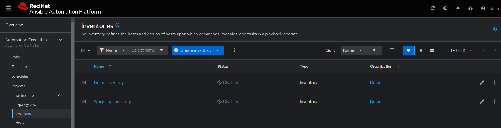

# Exercise 5: Executing Automation Jobs with Automation Controller

## Table of Contents

* [Objective](#objective)
* [Guide](#guide)
   * [Step 1: Login to Ansible Automation Platform UI](#step-1-login-to-ansible-automation-platform)
   * [Step 2: Examine the Automation controller Inventory](#step-2-examine-the-automation-controller-inventory)
   * [Step 3: Examine the Automation controller Workshop Project](#step-3-examine-the-automation-controller-workshop-project)
   * [Step 4: Examine the Automation controller Workshop Credential](#step-4-examine-the-automation-controller-workshop-credential)
* [Takeaways](#takeaways)
* [Complete](#complete)

## Objective

Explore and understand foundational Automation Controller concepts. This exercise will cover:

* Automation controller **Inventory**
* Automation controller **Credentials**
* Automation controller **Projects**

## Guide

### Step 1: Examine the Automation Controller inventory

An inventory is required for Automation controller to be able to run jobs.  An inventory is a collection of hosts against which jobs may be launched, the same as an Ansible inventory file. In addition, Automation controller can make use of an existing configuration management data base (cmdb) such as ServiceNow or Infoblox DDI.

> Note:
>
> More info on Inventories in respect to Automation controller can be found in the [documentation here](https://docs.redhat.com/en/documentation/red_hat_ansible_automation_platform/2.5/html/getting_started_with_ansible_automation_platform/assembly-gs-auto-dev#proc-gs-auto-dev-create-automation-decision-proj)

1. Click on the **Inventories** button under the **Automation Execution** drop-down menu in the left sidebar.

2. Under **Inventories** click on the `Workshop Inventory`.

3. Under the `Workshop Inventory` click the **Hosts** button at the top. There will be four hosts here, rtr1 through rtr4 as well as the ansible control node.

4. Click on one of the devices.

Take note of the **VARIABLES** field. The `host_vars` are set here including the `ansible_host` variable.

5. Click on **GROUPS**. There will be multiple groups here including `routers` and `cisco`.  Click on one of the groups.

6. Click on one of the groups.

Take note of the **VARIABLES** field. The `group_vars` are set here including the `ansible_connection` and `ansible_network_os` variable.

### Step 2: Examine the Automation Controller Workshop Credentials

Credentials are utilized by Automation controller for authentication when launching **Jobs** against machines, synchronizing with inventory sources, and importing project content from a version control system. For the workshop we need a credential to authenticate to the network devices.

> Note:
>
> For more information on Projects in Automation controller, please [refer to the documentation](https://docs.ansible.com/automation-controller/latest/html/userguide/credentials.html)

1. Click on the **Credentials** button under the **Automation Execution** drop-down menu in the left sidebar.

2. Under **Credentials** there will be multiple pre-configured credentials. Click on the `Workshop Credential`.

3. Under the `Workshop Credential` examine the following:

* The **CREDENTIAL TYPE** is a **Machine** credential.
* The **USERNAME** is set to `ec2-user`.
* The **PASSWORD** is blank.
* The **SSH PRIVATE KEY** is already configured, and is **ENCRYPTED**.

### Step 3: Examine the Automation Controller Workshop Project

A project is how Ansible Playbooks are imported into Automation controller. You can manage playbooks and playbook directories by either placing them manually under the Project Base Path on your Automation controller server, or by placing your playbooks into a source code management (SCM) system supported by Automation controller, including Git and Subversion.

> Note:
>
> For more information on Projects in Automation controller, please [refer to the documentation](https://docs.redhat.com/en/documentation/red_hat_ansible_automation_platform/2.5/html/getting_started_with_ansible_automation_platform/assembly-gs-auto-op#proc-gs-auto-op-projects)

1. Click on the **Projects** button under the **Automation Execution** drop-down menu in the left sidebar.

2. Under **Projects** there will be a `Workshop Project`.

Note that Source Control URL is set to [https://github.com/network-automation/toolkit](https://github.com/network-automation/toolkit)

As a part of this workshop, we will create our own Project with playbooks and execute those.

## Takeaways

* Automation controller needs an inventory to execute Ansible Playbooks again.  This inventory is identical to what users would use with the command line only Ansible project.
* Although this workshop already setup the inventory, importing an existing Ansible Automation inventory is easy.  Check out [this blog post](https://www.ansible.com/blog/three-quick-ways-to-move-your-ansible-inventory-into-red-hat-ansible-tower) for more ways to easily get an existing inventory into Automation controller.
* Automation controller can sync to existing SCM (source control management) including Github.
* Automation controller can store and encrypt credentials including SSH private keys and plain-text passwords. Automation controller can also sync to existing credential storage systems such as CyberArk and Vault by HashiCorp.

## Complete

You have completed lab exercise 5

You have now examined all three components required to get started with Automation controller.  A credential, an inventory and a project.

---
[Previous Exercise](../4-explore-aap-2.5/README.md)

[Click here to return to the Ansible Network Automation Workshop](../README.md)
