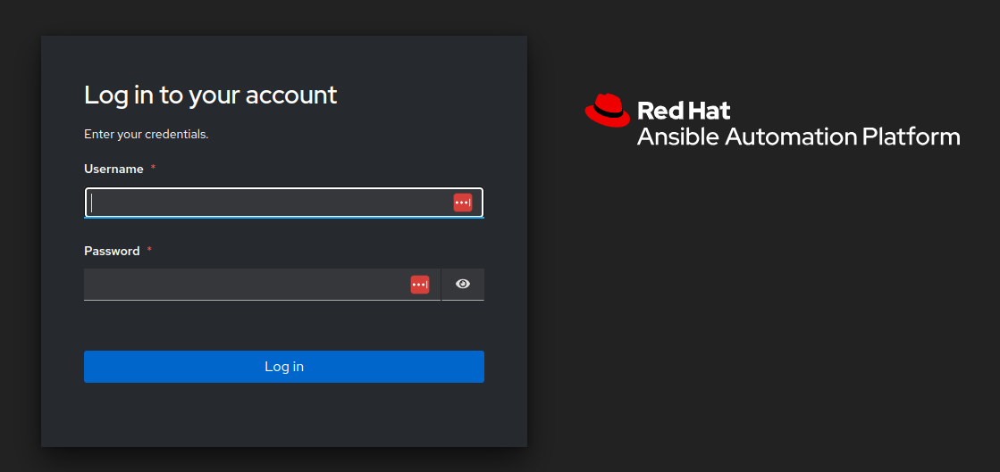
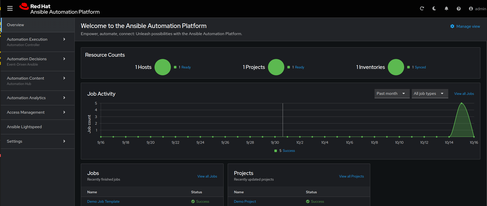
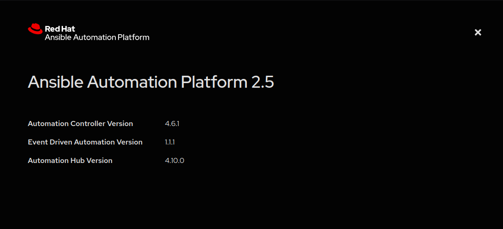
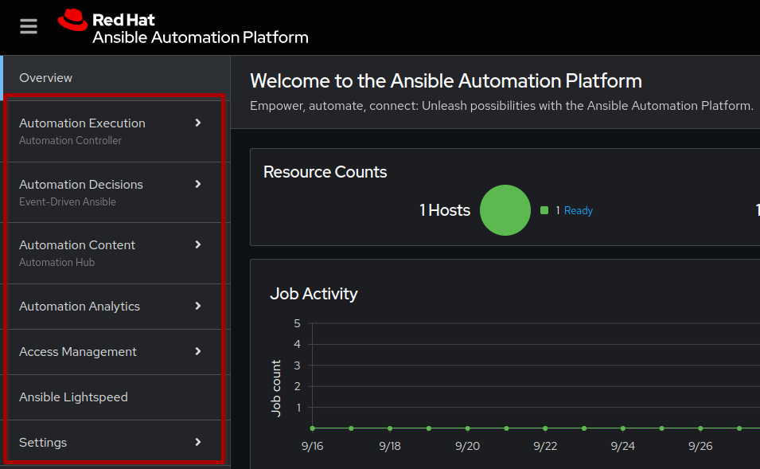
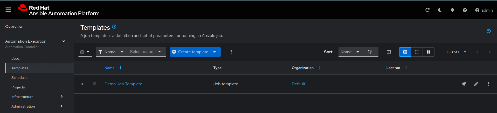
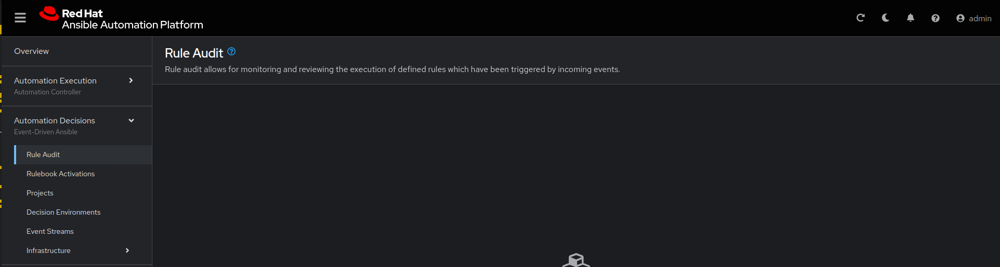
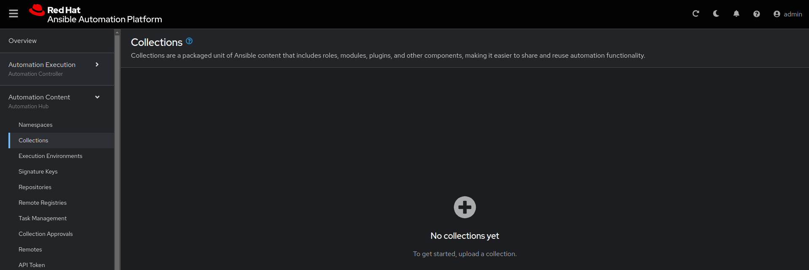
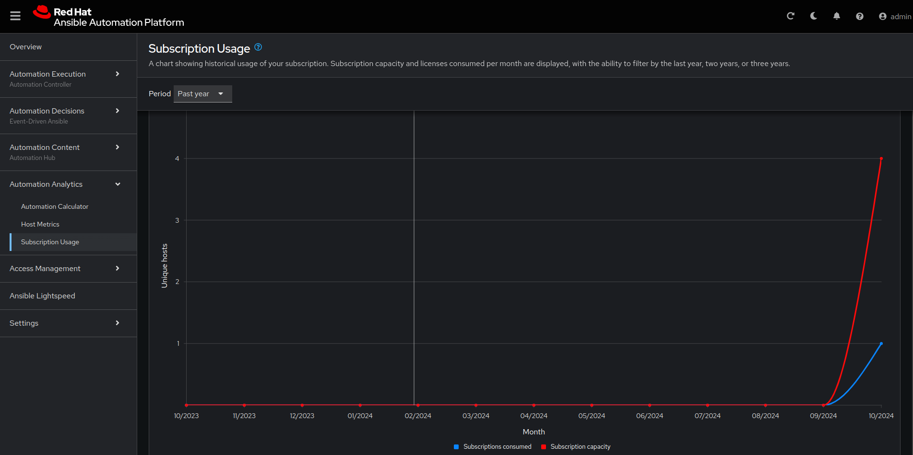
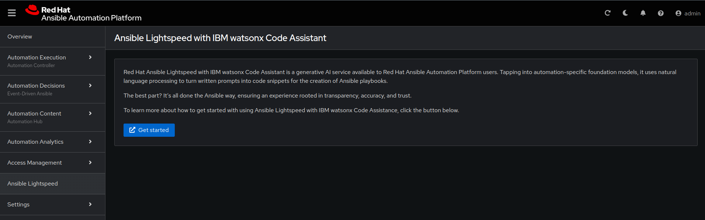

# Exercise 4: Explore Ansible Automation Platform 2.5

With Ansible Automation Platform, you can create, manage, and scale automation for your organization across users, teams, and regions. The release of Ansible Automation Platform 2.5 introduces an updated, unified user interface (UI) that allows you to interact with and manage each part of the platform.

## Table of Contents

* [Objective](#objective)
* [Guide](#guide)
   * [Step 1: Login to Ansible Automation Platform UI](#step-1-login-to-ansible-automation-platform)
   * [Step 2: Examine the Automation controller Inventory](#step-2-examine-the-automation-controller-inventory)
   * [Step 3: Examine the Automation controller Workshop Project](#step-3-examine-the-automation-controller-workshop-project)
   * [Step 4: Examine the Automation controller Workshop Credential](#step-4-examine-the-automation-controller-workshop-credential)
* [Takeaways](#takeaways)
* [Complete](#complete)

## Objective

Explore and understand the lab environment.  This exercise will cover

* Determining the Ansible Automation Platform version running on the control node
* Locating and understanding:
  * Automation Execution
  * Automation Decisions
  * Automation Content
  * Automation Analytics
  * Access Management

## Guide

### Step 1: Login to Ansible Automation Platform

1.  Return to the workshop launch page provided by your instructor.

2.  Click on the link to the AAP UI.  You should see a login screen similar to the follow:

   Screenshot of Automation controller login window.
   

   * The username will be `admin`
   * password provided on launch page

3. After logging in the Dashboard will be the default view as shown below.

   

4. Click on the **?** button on the top right of the user interface and click **About**.
   A window will pop up similar to the following:

   

### Step 2: Explore the unified platform UI

AAP 2.5 comes with an unified UI that provides a consistent and centralized WebUI, API, authentication, authorization and role based access controls (RBAC), along with automation analytics that helps let's users utilize reporting at scale.

Take a look at the left sidebar in the dashboard.

1. **Automation Controller**

The centerpiece of Ansible Automation Platform is its automation execution command and control center, where you can deploy, define, operate, scale and delegate automation across your enterprise. With this functionality, you can perform a variety of tasks from a single location, such as running playbooks from a simple, straightforward web UI, monitoring dashboard activity, and centralized logging to manage and track job execution.

2. **Event-Driven Ansible**

AAP includes Event-Driven Ansible, an automation engine that listens to your system’s event stream and reacts to events that you have specified with targeted automation tasks. In this way, Event-Driven Ansible manages routine automation tasks and responses, freeing you up to work on more complex tasks.

3. **Automation Hub**

Automation hub is the central location for your Ansible Automation Platform content. In automation hub you can also find content collections that you can download and integrate into your automation environment. You can also create and upload your own content to distribute to your users.

4. **Automation Analytics**

Automation Analytics provides key data on Job Template usage, Ansible Module usage, organizational comparisons across your enterprise, and much more. With automation analytics, you can measure the business impact of Ansible Automation Platform, such as your return on investment (ROI). You can see what you’re monitoring—and how it’s performing—so you can make informed, data-driven decisions and scale faster.

5. **Access Management**

This section allows platform administrators to manage users, roles, team, organizations and various authentication methods.

6. **Ansible Lightspeed**

Ansible Lightspeed with watsonx Code Assistant is a generative AI service designed by and for Ansible platform engineers and developers. It accepts natural-language prompts entered by a user and then interacts with IBM watsonx foundation models to produce code recommendations built on Ansible best practices. Ansible Lightspeed can help you convert subject matter expertise into trusted, reliable Ansible code that scales across teams and domains.

## Takeaways

* In this exercise, we walked through the Ansible Automation Platform UI and explored the services available.
* For this remaining part of this workshop, our focus will be on Automation Controller and Event-Driven Ansible.

## Complete

You have completed lab exercise 4

---
[Previous Exercise](../3-ansible-lightspeed/README.md) | [Next Exercise](../5-controller-job-template/README.md)

[Click here to return to the Ansible Network Automation Workshop](../README.md)
