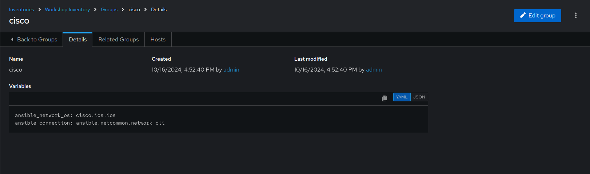
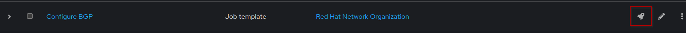

# Exercise 5: Executing Automation Jobs with Automation Controller

## Table of Contents

* [Objective](#objective)
* [Guide](#guide)
   * [Step 1: Examine the Automation controller Inventory](#step-1-examine-the-automation-controller-inventory)
   * [Step 2: Examine the Automation controller Workshop Credential](#step-2-examine-the-automation-controller-workshop-credential)
   * [Step 3: Examine the Automation controller Workshop Project](#step-3-examine-the-automation-controller-workshop-project)
* [Takeaways](#takeaways)
* [Complete](#complete)

## Objective

Explore and understand foundational Automation Controller concepts. This exercise will cover:

* Automation controller **Inventory**
* Automation controller **Credentials**
* Automation controller **Projects**
* Automation controller **Job Templates**

## Guide

### Step 1: Examine the Automation Controller inventory

An inventory is required for Automation controller to be able to run jobs.  An inventory is a collection of hosts against which jobs may be launched, the same as an Ansible inventory file. In addition, Automation controller can make use of an existing configuration management data base (cmdb) such as ServiceNow or Infoblox DDI.

> Note:
>
> More info on Inventories in respect to Automation controller can be found in the [documentation here](https://docs.redhat.com/en/documentation/red_hat_ansible_automation_platform/2.5/html/getting_started_with_ansible_automation_platform/assembly-gs-auto-dev#proc-gs-auto-dev-create-automation-decision-proj)

1. Click on the **Inventories** button under the **Automation Execution** drop-down menu in the left sidebar.

2. Under **Inventories** click on the `Workshop Inventory`.

3. Under the `Workshop Inventory` click the **Hosts** button at the top. There will be four hosts here, rtr1 through rtr4 as well as the ansible control node.

4. Click on one of the devices.

Take note of the **VARIABLES** field. The `host_vars` are set here including the `ansible_host` variable.

5. Click on **GROUPS**. There will be multiple groups here including `routers` and `cisco`.  Click on one of the groups.

6. Click on one of the groups.

Take note of the **VARIABLES** field. The `group_vars` are set here including the `ansible_connection` and `ansible_network_os` variable.

### Step 2: Examine the Automation Controller Workshop Credential

Credentials are utilized by Automation controller for authentication when launching **Jobs** against machines, synchronizing with inventory sources, and importing project content from a version control system. For the workshop we need a credential to authenticate to the network devices.

> Note:
>
> For more information on Projects in Automation controller, please [refer to the documentation](https://docs.ansible.com/automation-controller/latest/html/userguide/credentials.html)

1. Click on the **Credentials** button under the **Automation Execution** drop-down menu in the left sidebar.

2. Under **Credentials** there will be multiple pre-configured credentials. Click on the `Workshop Credential`.

3. Under the `Workshop Credential` examine the following:

* The **CREDENTIAL TYPE** is a **Machine** credential.
* The **USERNAME** is set to `ec2-user`.
* The **PASSWORD** is blank.
* The **SSH PRIVATE KEY** is already configured, and is **ENCRYPTED**.

### Step 3: Creating a new Automation Controller Project

A project is how Ansible Playbooks are imported into Automation controller. You can manage playbooks and playbook directories by either placing them manually under the Project Base Path on your Automation controller server, or by placing your playbooks into a source code management (SCM) system supported by Automation controller, including Git and Subversion.

> Note:
>
> For more information on Projects in Automation controller, please [refer to the documentation](https://docs.redhat.com/en/documentation/red_hat_ansible_automation_platform/2.5/html/getting_started_with_ansible_automation_platform/assembly-gs-auto-op#proc-gs-auto-op-projects)

**1.** Click on the **Projects** button under the **Automation Execution** drop-down menu in the left sidebar.

**2.** Click on the **Create project** button.

**3.** Fill out the project parameters as follows and click on **Create Project**.

  | Parameter | Value |
  |---|---|
  | Name  | Workshop BGP Project  |
  | Organization |  Red Hat Network Organization |
  |  Source control type |  Git |
  |  Source control URL |  https://github.com/your-github-username/aap_workshop |

  

**4.** Once done, you should have a new project named `Workshop BGP Project` added under **Projects**.

### Step 4: Creating an Automation Controller Job Template

A **Job Template** is a definition and set of parameters for running a playbook in AAP. A **Job Template** requires:

* An **Inventory** to run the job against.
* A **Credential** to login to devices.
* A **Project** which contains Ansible Playbooks.

**1.** Click on the **Templates** button under the **Automation Execution** drop-down menu in the left sidebar.

**2.** Click on **Create Template** button and choose **Create job template**.

**3.** Fill out the **Job Template** parameters as follows and click on **Create job template** button.

  | Parameter | Value |
  |---|---|
  | Name  | Configure BGP  |
  |  Job Type |  Run |
  |  Inventory |  Workshop Inventory |
  |  Project |  Workshop BGP Project |
  |  Execution Environment | network workshop execution environment |
  |  Playbook | configure_bgp.yml |
  |  Credential |  Workshop Credential |

**4.** At this point, you should have a new `Configure BGP` job template created and ready to launch.

### Step 5: Launching the new Job Template

**1.** Navigate back to the `Templates` window, where all Job Templates are listed.

**2.** Launch the `Configure BGP` Job Template by clicking the Rocket button.

**3.** After executing the Job Template it will automatically open the [Standard Out pane](https://docs.ansible.com/automation-controller/latest/html/userguide/jobs.html#standard-out)

   * Examine the **Standard Out pane**

      The Standard Out pane will display the output from the Ansible Playbook.  Every task output will match exactly what would be seen on the command line.

   * Click on a task in the **Standard Out pane** to open up structured output from that particular task.

      > Click on any line where there is a **changed** or **ok**

      

   * Click on the **Data**  tab to open the **Data pane** which has more information on the task run

      

**4.** Since we previously configured BGP on both the routers using the same playbook with ansible-navigator, this job template run is `idempotent` and results in no changes pushed, which is expected.

## Takeaways

* Automation controller needs an inventory to execute Ansible Playbooks again.  This inventory is identical to what users would use with the command line only Ansible project.
* Although this workshop already setup the inventory, importing an existing Ansible Automation inventory is easy.  Check out [this blog post](https://www.ansible.com/blog/three-quick-ways-to-move-your-ansible-inventory-into-red-hat-ansible-tower) for more ways to easily get an existing inventory into Automation controller.
* Automation controller can sync to existing SCM (source control management) including Github.
* Automation controller can store and encrypt credentials including SSH private keys and plain-text passwords. Automation controller can also sync to existing credential storage systems such as CyberArk and Vault by HashiCorp.
* Creating a new Project for our BGP task.
* Creating a Job Template for configuring BGP on `rtr1` and `rtr2`.
* Launching a Job Template from the Automation Execution UI.

## Complete

You have completed lab exercise 5

You have now explore all four components required to get started with Automation controller.  A credential, an inventory, a project
and a job template.

---
[Previous Exercise](../5-explore-aap-2.5/README.md)

[Click here to return to the Ansible Network Automation Workshop](../README.md)
