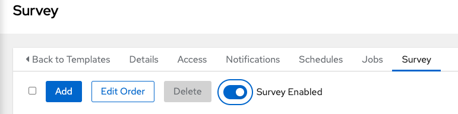
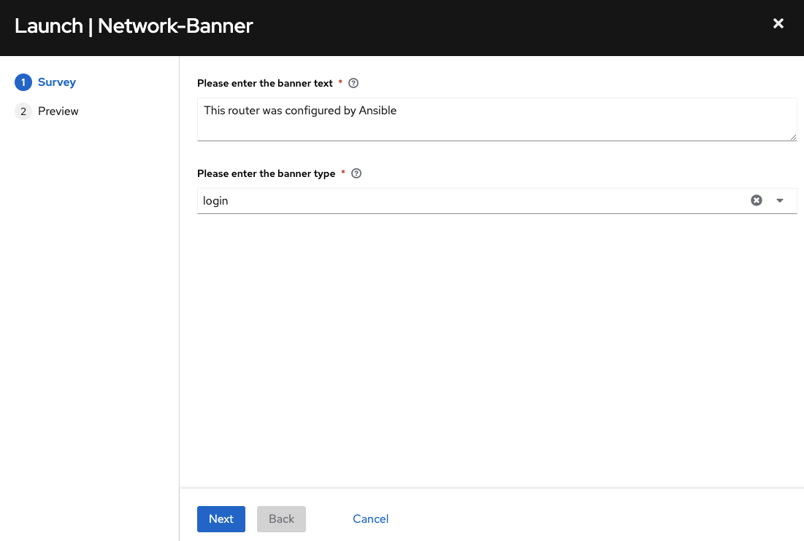

# Ejercicio 7: Crear una Encuesta (Survey)

**Leálo en otros idiomas**:  [English](README.md),  [日本語](README.ja.md),  [Español](README.es.md).

## Índice

* [Objetivo](#objetivo)
* [Guía](#guía)
   * [Paso 1: Crear una plantilla de trabajo](#Paso-1-crear-una-plantilla-de-trabajo)
   * [Paso 2: Examinar el playbook](#Paso-2-examinar-el-playbook)
   * [Paso 3: Crear una encuesta o survey](#Paso-3-crear-una-encuesta-survey)
   * [Paso 4: Ejecutar una plantilla de trabajo](#Paso-4-ejecutar-una-plantilla-de-trabajo)
   * [Paso 5: Verificar la mensaje de bienvenida o banner](#Paso-5-verificar-la-mensaje de bienvenida-o-banner)
* [Consejos a recordar](#consejos-a-recordar)
* [Completado](#completado)

## Objetivo

Demostrar el uso de la [funcionalidad encuesta o survey](https://docs.ansible.com/automation-controller/latest/html/userguide/job_templates.html#surveys) del controlador de Automatización. Las encuestas (o surveys) configuran las variables extra para un playbook de forma similar a como el ‘Prompt for Extra Variables’ lo hace, pero de una manera amigable de pregunta y respuesta para el usuario. Las encuestas (o surveys) también proveen de validación de entrada de usuario.

## Guía

### Paso 1: Crear una plantilla de trabajo

1. Abre la web UI y Haz click en el enlace `Templates` del menú de la izquierda.

   

2. Haz click en el botón azul `Add` y seleccion **Add job template** para crear una nueva plantilla de trabajo o job template. (Asegúrate de seleccionar `Job Template` y no `Workflow Template`)

   | Parameter | Value |
   |---|---|
   | Name  | Network-Banner |
   |  Job Type |  Run |
   |  Inventory |  Workshop Inventory |
   |  Project |  Workshop Project |
   | Execution Environment | Default execution environment |
   |  Playbook |  `playbooks/network_banner.yml` |
   |  Credential |  Workshop Credential |

3. Baja y haz click en el botón azul `Save`.

### Paso 2: Examinar el playbook

Observa el Playbook de Ansible `network_banner.yml`:

<!--  -->

```yaml
---
- name: set router banners
  hosts: routers
  gather_facts: no

  tasks:
    - name: load banner onto network device
      vars:
        - network_banner:  "{{ net_banner | default(None) }}"
        - banner_type: "{{ net_type | default('login') }}"
      include_role:
        name: "../roles/banner"
```

<!--  -->

> Nota:
>
> También puedes consultar el Playbook de Ansible aquí: [https://github.com/network-automation/toolkit](https://github.com/network-automation/toolkit)

El rol **banner** tiene un fichero `main.yml` muy simple:

<!--  -->

```yaml
- name: configure banner
  include_tasks: "{{ ansible_network_os }}.yml"
```

<!--  -->

La variable `ansible_network_os` se usa para parametrizar el SO de red y crear un playbook agnóstico al fabricante.

Si has creado la red con un dispositivo junos, este playbook bucará un fichero de tareas llamado `junos.yml`. Si estás usando un dispositivo IOS-XE, este playbook buscará un fichero de tareas llamado `ios.yml`. Este fichero contendrá las tareas específicas de la plataforma:

<!--  -->

```yaml
---
- name: add the junos banner
  junos_banner:
    text: "{{ network_banner }}"
    banner: "{{ banner_type }}"
```

<!--  -->

> Nota:
>
> Por favor, observa que hay distintos ficheros de tareas creados para ios, nxos, eos y junos en este playbook.

Observa también que se pasan dos variables al fichero de tareas.

1. `network_banner`: Esta variable toma el valor usando el de la variable `net_banner`.

2. `banner_type`: Esta variable toma el valor usando el de la variable `net_type`.

### Paso 3: Crear una Encuesta o Survey

En este paso crearás una encuesta o *"survey"* de usuario de entrada para recoger la entrada del usuario y asignar los valores de las variables `net_banner` y `banner_type`.

1. Haz click en la pestaña **Survey** dentro de la template de trabajo `Network-Banner`

   

2. Haz click en el botón azul **Add**.

   

3. Rellena los siguientes campos:

   | Parameter | Value |
   |---|---|
   | Question  | Please enter the banner text |
   |  Description |  Please type into the text field the desired banner |
   |  Answer Variable Name |  `net_banner` |
   |  Answer type |  Textarea |
   |  Required |  Checkmark |

   Por ejemplo:

   

4. Haz click en el botón verde `Add` para añadir otra pregunta.

   

5. A continuación, crearemos un indicador de encuesta para recopilar el `banner_type`. Los valores pueden ser "motd" o "login" siendo por defecto "login" para seguir el playbook anterior.

   | Parameter               | Value                          |
   |-------------------------|--------------------------------|
   | Question                | Please enter the  banner type  |
   | Description             | Please choose an option        |
   | Answer Variable Name    | `net_type`                    |
   | Answer type             | Multiple Choice(single select) |
   | Multiple Choice Options | login <br>motd                        |
   | default answer          | login                          |
   | Required                | Checkmark                      |

   Por ejemplo:

   

5. Haz click en Save

6. Haz click en el interruptor para activar la encuesta, dejándolo en **On**

   

7. Haz click **Back to Templates**

### Paso 4: Ejecutar una plantilla de trabajo

1. Haz click en el icono del cohete para ejecutar la plantilla de trabajo.

   

   El trabajo pedirá inmediatamente al usuario que indique el mensaje de bienvenida (banner) y el tipo.

2. Escribe el mensaje de bienvenida que deseas para los enrutadores.

3. Elige entre `login` y `motd`.

4. Haz click en el botón `next` para ver cómo la encuesta ha transformado esta entrada de variables extra en el Playbook de Ansible. Por ejemplo, el mensaje de bienvenida existente es "This router was configured by Ansible".

   

5. Haz click en el botón azul **Launch** para lanzar el trabajo.

   

Espera a que la ejecución del trabajo concluya. Por favor, índicale al instructor si hay algún problema.

### Paso 5: Verificar la mensaje de bienvenida o banner

* Entra en uno de los enrutadores para observar la configuración de la pantalla de bienvenida:

   ```sh
   [student@ansible]$ ssh rtr1
   ```

   La pantalla de bienvenida aparecerá justo al entra. Como por ejemplo:

   ```
   [student@ansible-1 ~]$ ssh rtr1
   Warning: Permanently added 'rtr1,3.237.253.154' (RSA) to the list of known hosts.

   This router was configured by Ansible
   ```

* Verifícalo en los otros enrutadores

## Consejos a recordar

Has probado existosamente lo siguiente:

* La creación de una plantilla de trabajo para configurar un mensaje de bienvenida en múltiples sistemas operativos de red, incluyendo Arista EOS, Cisco IOS y Juniper Junos.
* La creación de una encuesta personalizada para la plantilla de trabajo para introducir los valores de las variables `network_banner` y `banner_type`.
* Ejecutar una plantilla de trabajo en los cuatro enrutadores, cargando el mensaje de bienvenida simultáneamente.

## Completado

¡Felicidades, has completado el ejercicio de laboratorio 7!

---
[Ejercicio Anterior](../6-controller-job-template/README.md) | [Próximo ejercicio](../8-controller-rbac/README.es.md)

[Haz click aquí para volver al taller Ansible Network Automation](../README.es.md)
