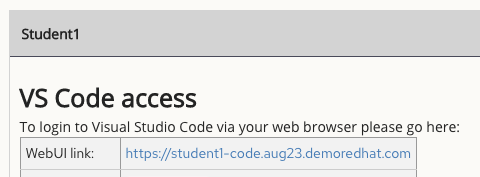
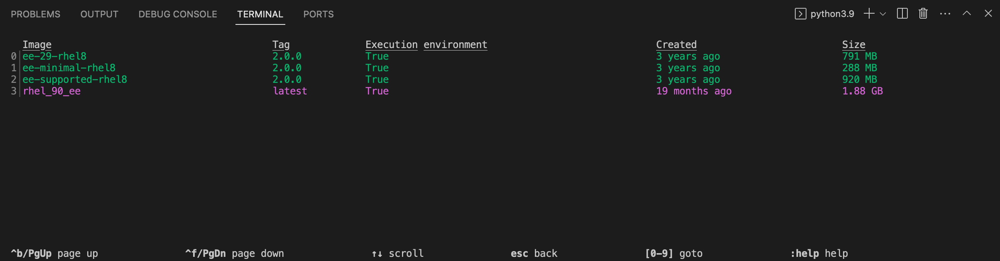
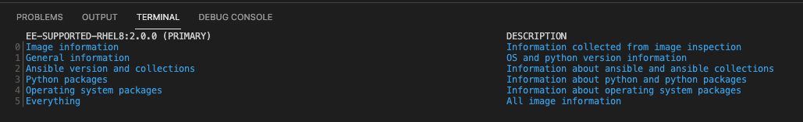

# ワークショップ演習 - 前提条件の確認

**他の言語でもお読みいただけます**:
<br> [English](README.md)、[日本語](README.ja.md)、 [Portugues do Brasil](README.pt-br.md)、 [Française](README.fr.md)、 [Español](README.es.md)

## 目次

* [目的](#目的)
* [ガイド](#ガイド)
   * [ラボ環境](#ラボ環境)
   * [ステップ 1 - 環境へのアクセス](#ステップ-1---環境へのアクセス)
   * [ステップ 2 - ターミナルの使用](#ステップ-2---ターミナルの使用)
   * [ステップ 3 - 実行環境の検証](#ステップ-3---実行環境の検証)
   * [ステップ 4 - ansible-navigator 設定の検証](#ステップ-4---ansible-navigator-設定の検証)
   * [ステップ 5 - チャレンジラボ](#ステップ-5---チャレンジラボ)

## 目的

* ラボトポロジーと環境へのアクセス方法を理解する。
* ワークショップの演習の仕組みを理解する。
* チャレンジラボについて理解する。

この最初のいくつかのラボ演は、Ansible Automation Platform のコマンドラインユーティリティーを使用します。これには、以下が含まれます。

- [ansible-navigator](https://github.com/ansible/ansible-navigator) - Ansible オートメーションコンテンツを実行・開発するためのコマンドラインユーティリティとテキストベースのユーザーインターフェース（TUI）。
- [ansible-core](https://docs.ansible.com/core.html) - Ansible Automation Platform を支えるフレームワーク、言語、機能を提供する基本的な実行ファイルです。また、`ansible`、`ansible-playbook`、`ansible-doc` などのさまざまなクリエートツールも含まれています。Ansible Coreは、無料でオープンソースの Ansible を提供するアップストリームのコミュニティと、Red Hat が提供するダウンストリームのエンタープライズオートメーション製品であるAnsible Automation Platform との橋渡しの役割を果たします。
- [実行環境](https://docs.ansible.com/automation-controller/latest/html/userguide/execution_environments.html) - このワークショップでは特に取り上げません。なぜなら、ビルトインの Ansible 実行環境には、Red Hatがサポートするすべてのコレクションがすでに含まれており、このワークショップで使用するすべてのコレクションも含まれているからです。実行環境とは、Ansible の実行環境として利用できるコンテナイメージです。
- [ansible-builder](https://github.com/ansible/ansible-builder) - このワークショップでは特に取り上げませんが、`ansible-builder` は実行環境の構築プロセスを自動化するためのコマンドラインユーティリティです。

Ansible Automation Platformの新しいコンポーネントに関する情報が必要な場合は、このランディングページをブックマークしてください [https://red.ht/AAP-20](https://red.ht/AAP-20)

## ガイド

### ラボ環境

このラボでは、事前設定されたラボ環境で作業します。ここでは、以下のホストにアクセスできます。

| Role                 | Inventory name |
| ---------------------| ---------------|
| Ansible Control Host | ansible-1      |
| Managed Host 1       | node1          |
| Managed Host 2       | node2          |
| Managed Host 3       | node3          |

### ステップ 1 - 環境へのアクセス

<table>
<thead>
  <tr>
    <th>ワークショップの演習には、Visual Studio Codeの使用が強く推奨されます。Visual Studio Codeは以下を提供します。
    <ul>
    <li> ファイルブラウザ</li>
    <li>構文強調表示の機能付きテキストエディタ</li>
    <li>ブラウザ内ターミナル</li>
    </ul>
    バックアップとして、あるいはVisual Studio Codeでは不十分な場合には、SSHによる直接アクセスが可能です。さらなる説明が必要な場合は、短い YouTube ビデオが用意されています。<a href="https://youtu.be/Y_Gx4ZBfcuk"> Ansible Workshops - ワークベンチ環境へのアクセス</a>
</th>
</tr>
</thead>
</table>

- ワークショップの起動ページ（講師が用意したもの）からVisual Studio Codeに接続します。パスワードは、WebUIのリンクの下に記載されています。

  

- 接続する提供されたパスワードを入力します。

  

  - Visual Studio Code で `rhel-workshop` ディレクトリーを開きます。

### ステップ 2 - ターミナルの使用

- Visual Studio Code でターミナルを開きます。

  

Ansible コントロールノードターミナルで `rhel-workshop` ディレクトリーに移動します。

```bash
[student@ansible-1 ~]$ cd ~/rhel-workshop/
[student@ansible-1 rhel-workshop]$ pwd
/home/student/rhel-workshop
[student@ansible-1 rhel-workshop]$
```

* `~` - このコンテキストでのチルダは `/home/student` のショートカットです
* `cd` - ディレクトリーを変更する Linux コマンド
* `pwd` - 作業ディレクトリーを印刷するための Linux コマンド。これにより、現在の作業ディレクトリーへのフルパスが表示されます。

### ステップ 3 - 実行環境の検証

`ansible-navigator` 引数を指定して `images` コマンドを実行し、コントロールノードに設定された実行環境を確認します。

```bash
$ ansible-navigator images
```




> 注意: 表示される出力は、上記の出力とは異なる場合があります

このコマンドは、現在インストールされているすべての実行環境（略してEE）に関する情報を提供します。対応する番号を押すことで、EE を調べることができます。例えば、上記の例で **2** を押すと、`ee-supported-rhel8` の実行環境が表示されます。



`2` に `Ansible version and collections` を選択すると、その特定の EE にインストールされたすべての Ansible Collections と、`ansible-core` のバージョンが表示されます。


### ステップ 4 - ansible-navigator 設定の検証

Visual Studio Code を使用して `ansible-navigator.yml` ファイルを開くか、`cat` コマンドを使用してファイルの内容を表示します。このファイルはホームディレクトリーにあります。

```bash
$ cat ~/.ansible-navigator.yml
---
ansible-navigator:
  ansible:
    inventory:
      entries:
      - /home/student/lab_inventory/hosts

  execution-environment:
    image: registry.redhat.io/ansible-automation-platform-20-early-access/ee-supported-rhel8:2.0.0
    enabled: true
    container-engine: podman
    pull:
      policy: missing
    volume-mounts:
    - src: "/etc/ansible/"
      dest: "/etc/ansible/"
```

`ansible-navigator.yml` ファイル内の次のパラメータに注意してください。

* `inventories`: 使用されている Ansible インベントリーの場所を示します
* `execution-environment`: デフォルトの実行環境が設定されている場所

設定可能なすべての knob の詳細な一覧については、[ドキュメント](https://ansible-navigator.readthedocs.io/en/latest/settings/) を参照してください。

### ステップ 5 - チャレンジラボ

これらのラボガイドの多数の章には、「チャレンジラボ」セクションが用意されています。これらのラボは、これまで学んだ知識で解決するための小さなタスクを行うことを目的としています。タスクの回答は、警告サインの下に表示されます。

---
**ナビゲーション**

<br>


[Next Exercise](../2-thebasics)

[Next Exercise](../1.2-thebasics)

<br><br>
[Click here to return to the Ansible for Red Hat Enterprise Linux Workshop](../README.md)
