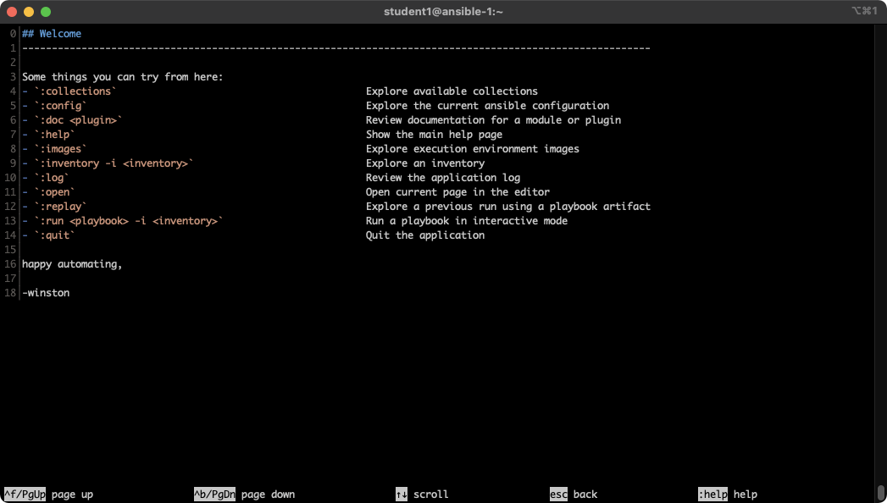
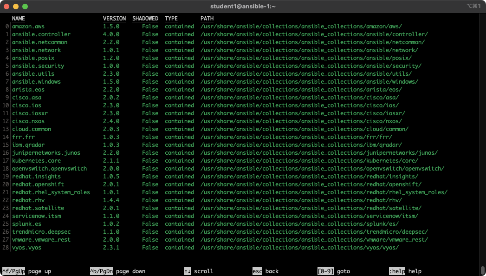
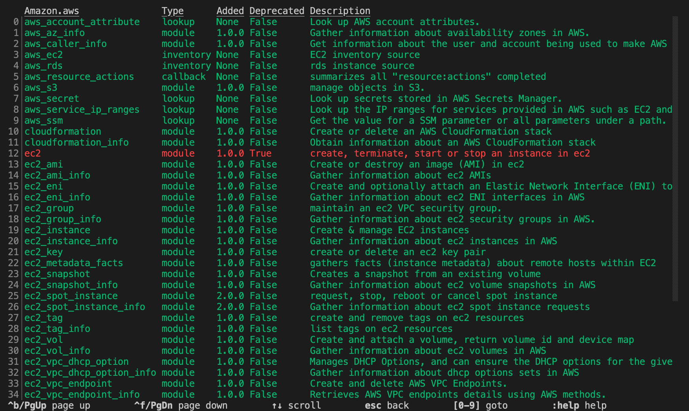
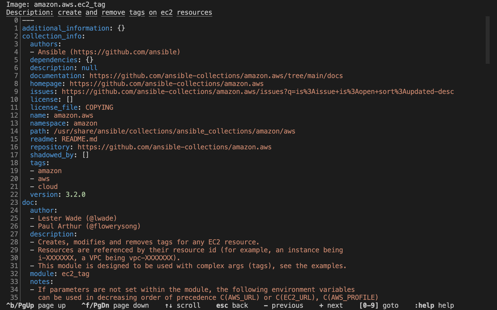

# ワークショップ演習 - Ansible の基本

**他の言語でもお読みいただけます**:
<br> [English](README.md)、[日本語](README.ja.md)、 [Portugues do Brasil](README.pt-br.md)、 [Française](README.fr.md)、 [Español](README.es.md)

## 目次

* [目的](#目的)
* [ガイド](#ガイド)
  * [ステップ 1 - インベントリーの操作](#ステップ-1---インベントリーの操作)
  * [ステップ 2 - モジュールの一覧表示とヘルプの利用](#ステップ-2---モジュールの一覧表示とヘルプの利用)

## 目的

この演習では、最新の Ansible コマンドラインユーティリティー`ansible-navigator` を使用して、インベントリーファイルの操作方法や、サポートが必要な場合のモジュールの一覧表示について学びます。その目的は`ansible-navigator` がどのように機能するか、また、Ansible の経験を豊かにするためにどのように使用できるかを理解することです。

この演習の内容

* インベントリーファイルの使用
* `ini` 形式のインベントリーファイルの場所の確認と理解
* モジュールの一覧表示と、モジュール使用の際のヘルプの利用

## ガイド

### ステップ 1 - インベントリーの操作

インベントリーファイルとは、コントロールマシンが管理するノードを特定するためのテキストファイルです。管理対象となるノードには、そのノードのホスト名や IP アドレスのリストを含めることができます。インベントリーファイルでは、大かっこ（[]）の中にホストグループ名を宣言することで、ノードをグループにまとめることができます。

ホストの管理に `ansible-navigator` コマンドを使用するには、インベントリーファイルを指定する必要があります。このファイルは、コントロールノードから管理されるホストの一覧を定義します。このラボでは、インベントリーはインストラクターから渡されます。このインベントリーファイルは `ini` 形式のファイルです。このファイルでは、グループで並び替えられたホストの一覧があります。また、変数いくつか指定しています。

```bash
[web]
node1 ansible_host=<X.X.X.X>
node2 ansible_host=<Y.Y.Y.Y>
node3 ansible_host=<Z.Z.Z.Z>

[control]
ansible-1 ansible_host=44.55.66.77
```

Ansible はすでに、お使いの環境に固有のインベントリーを使用するように設定されています。これを行うための次の手順を説明します。今のところは、簡単なコマンドをいくつか実行して、インベントリーの操作を行います。

すべてのインベントリホストを参照するには、`ansible-navigator` コマンドにパターンを指定します。 `ansible-navigator inventory` には `--list` オプションがあり、インベントリファイルに含まれるすべてのホストを、それらが関連付けられているグループも含めて表示するのに便利です。


```bash
[student@ansible-1 rhel_workshop]$ cd /home/student
[student@ansible-1 ~]$ ansible-navigator inventory --list -m stdout
{
    "_meta": {
        "hostvars": {
            "ansible-1": {
                "ansible_host": "3.236.186.92"
            },
            "node1": {
                "ansible_host": "3.239.234.187"
            },
            "node2": {
                "ansible_host": "75.101.228.151"
            },
            "node3": {
                "ansible_host": "100.27.38.142"
            }
        }
    },
    "all": {
        "children": [
            "control",
            "ungrouped",
            "web"
        ]
    },
    "control": {
        "hosts": [
            "ansible-1"
        ]
    },
    "web": {
        "hosts": [
            "node1",
            "node2",
            "node3"
        ]
    }
}

```

注記: `-m` は `--mode` の略で、テキストベースのユーザーインターフェース (TUI) を使用する代わりに、モードを標準出力に切り替えることができます。

`--list` が冗長すぎる場合は、`--graph` のオプションを使用して、より補正されたバージョンの `--list` を提供することができます。

```bash
[student@ansible-1 ~]$ ansible-navigator inventory --graph -m stdout
@all:
  |--@control:
  |  |--ansible-1
  |--@ungrouped:
  |--@web:
  |  |--node1
  |  |--node2
  |  |--node3

```

ノード `node1`、`node2`、`node3` が `web` グループの一部であることを明確に確認することができます。`ansible-1` は `control` グループの一部であることが分かります。


インベントリーファイルにはより多くの情報が含まれます。また、このファイルは、グループでホストを整理したり、変数を定義したりできます。この例では、現在のインベントリーにグループ `web` と `control` がります。Ansible をこれらのホストパターンで実行し、出力を確認します。

`ansible-navigator inventory` コマンドを使用して、1つのホストまたはグループに情報を提供するコマンドを実行することもできます。たとえば、以下のコマンドを実行すると出力が表示されます。

```bash
[student@ansible-1 ~]$ ansible-navigator inventory --graph web -m stdout
[student@ansible-1 ~]$ ansible-navigator inventory --graph control -m stdout
[student@ansible-1 ~]$ ansible-navigator inventory --host node1 -m stdout
```

> **ヒント**
>
> このイベントリーには、その他のデータを含めることができます。たとえば、標準以外の SSH ポートで実行するホストがある場合は、コロン付きのホスト名の後にポート番号を指定できます。あるいは、Ansible 固有の名前を定義して、真の IP またはホスト名に参照するようにできます。


### ステップ 2 - モジュールの一覧表示とヘルプの利用

Ansible Automation Platform には、サポートされる複数の実行環境 (EE) が同梱されています。これらの EE には、モジュールを含む、サポートされているコンテンツが含まれるバンドルされたサポート対象のコレクションが同梱されています。利用可能なモジュールを参照するには、最初にインタラクティブモードに入ります。

```bash
$ ansible-navigator
```



> **ヒント**
>
> 終了するには、`ansible-navigator` で `ESC` ボタンを押します。

まず、`:collections` と入力してコレクションを参照します

```bash
$ :collections
```



特定のコレクションのコンテンツを参照するには、対応する番号を入力します。たとえば、上記のスクリーンショットの例では、数字 `0` は `amazon.aws` コレクションに対応します。コレクションタイプにズームインするには、番号 `0` を入力します。

```bash
$ 0
```




さらにズームすることで、使用など特定のモジュールに関するヘルプを利用します。たとえば、モジュール `ec2_tag` は `24` に対応します。

```bash
$ :24
```

矢印キーまたはページアップとページダウンを使用してスクロールダウンすると、ドキュメントと例が表示されます。



`:doc namespace.collection.module-name` を入力して、特定のモジュールに直接ジャンプすることもできます。たとえば、`:doc amazon.aws.ec2_tag` を入力すると、上記の最後のページに直接ジャンプします。

> **ヒント**
>
> 実行環境によって、アクセスできるコレクションおよびそのコレクションのバージョンが異なります。組み込みのドキュメントを使用して、コレクションのその特定のバージョンに対して正確であることが分かります。

---
**Navigation**

[Previous Exercise](../1-setup) - [Next Exercise](../3-playbook)

[Previous Exercise](../1.1-setup) - [Next Exercise](../1.3-playbook)

<br><br>

<br>

[Click here to return to the Ansible for Red Hat Enterprise Linux Workshop](../README.md)
