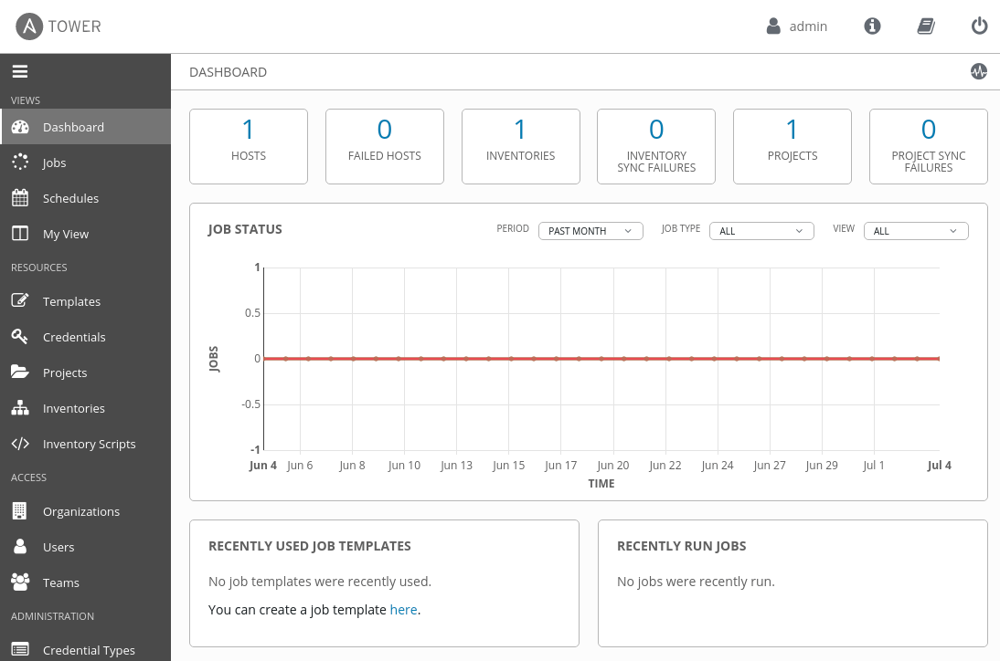

# Workshop - Introducción a Ansible Tower

**Lee esto en otros idiomas**:
  [English](README.md),  [日本語](README.ja.md),  [Portugues do Brasil](README.pt-br.md),  [Française](README.fr.md), [Español](README.es.md).

## Tabla de contenidos

* [Objetivos](#Objetivos)
* [Guía](#Guía)
* [¿Por qué Ansible Tower?](#Por-qué-Ansible-Tower)
* [Su entorno de laboratorio de Tower Ansible](#Su-entorno-de-laboratorio-de-Tower-Ansible)
* [Tablero de control](#tablero-de-control)
* [Conceptos](#Conceptos)

# Objetivos

Este ejercicio proporcionará una visión general de Ansible Tower que incluye repasar las funciones proporcionadas por Red Hat Ansible Automation Platform.  Esto cubrirá los fundamentos de Ansible Tower tales como:

  - Plantillas de trabajo / Job Templates
  - Proyectos / Projects
  - Inventarios / Inventories
  - Credenciales / Credentials
  - Flujos de trabajo / Workflows

# Guía

## ¿Por qué Ansible Tower?

Ansible Tower es una interfaz de usuario basada en web que proporciona una solución empresarial para la automatización de TI. este

  - tiene un panel fácil de usar

  - complementa Ansible, añadiendo automatización, gestión visual y capacidades de monitorización.

  - proporciona control de acceso de usuario a los administradores.

  - gestiona o sincroniza gráficamente los inventarios con una amplia variedad de fuentes.

  - tiene una API RESTful

  - Y mucho más..

## Su entorno de laboratorio de Tower Ansible

En este laboratorio se trabaja en un entorno de laboratorio preconfigurado. Tendrá acceso a los siguientes hosts:

| Role                         | Inventory name |
| -----------------------------| ---------------|
| Ansible Control Host & Tower | ansible        |
| Managed Host 1               | node1          |
| Managed Host 2               | node2          |
| Managed Host 2               | node3          |

El Ansible Tower proporcionado en este laboratorio se configura individualmente para usted. Asegúrese de acceder a la máquina adecuada y siempre que trabaje con ella. Ansible Tower ya se ha instalado y licenciado para usted, la interfaz de usuario web será accesible a través de HTTP/HTTPS.

## Tablero de control

Echemos un primer vistazo al Tower: Apunte su navegador a la URL que se le dio, similar a `https://student<X>.workshopname.rhdemo.io` (reemplazar `<X>` con su número de estudiante y `nombre del taller` con el nombre de su taller actual) e iniciar sesión como `admin`. La contraseña será proporcionada por el instructor.

La interfaz de usuario web de Ansible Tower le da la bienvenida con un panel con un gráfico que muestra:

  - actividad trabajo reciente

  - el número de hosts gestionados

  - punteros rápidos a listas de hosts con problemas.

El panel también muestra datos en tiempo real sobre la ejecución de tareas completadas en los playbooks.

## Conceptos

Antes de profundizar en el uso de Ansible Tower para su automatización, debe familiarizarse con algunos conceptos y convenciones de nomenclatura.

**Proyectos**

Los proyectos son colecciones lógicas de playbooks de ansibles en Ansible Tower. Estos playbooks residen en la instancia de Ansible Tower o en un sistema de control de versiones de código fuente compatible con Tower.

**Inventarios**

Un inventario es una colección de hosts en los que se pueden iniciar trabajos, lo mismo que un archivo de inventario de Ansible. Los inventarios se dividen en grupos y estos grupos contienen los hosts reales. Los grupos se pueden rellenar manualmente, introduciendo nombres de host en Tower, desde uno de los proveedores de nube compatibles con Ansible Tower o a través de scripts de inventario dinámicos.

**Credenciales**

Tower utiliza las credenciales para la autenticación al ejecutar trabajos en las maquinas, sincronizar con fuentes de inventario e importar contenido de proyecto desde un sistema de control de versiones. La configuración de credenciales se puede encontrar en Configuración.

Las credenciales usadas por Tower se importan y almacenan cifradas y ningún usuario puede recuperarlas en texto sin formato en la línea de comandos. Puede conceder a los usuarios y equipos la capacidad de usar estas credenciales, sin exponer realmente la credencial al usuario.

**Plantillas**

Una plantilla de trabajo es una definición y un conjunto de parámetros para ejecutar un trabajo de Ansible. Las plantillas de trabajo son útiles para ejecutar el mismo trabajo muchas veces. Las plantillas de trabajo también fomentan la reutilización del contenido del playbook de Ansible y la colaboración entre equipos. Para ejecutar un trabajo, Tower requiere que primero cree una plantilla de trabajo.

**Trabajos**

Un trabajo es básicamente una instancia en la que Tower lanza un playbook de Ansible contra un inventario de hosts.

----
**Navegación**
 
[Ejercicio anterior](../1.7-role/README.es.md) - [Próximo Ejercicio](../2.2-cred/README.es.md)

[Haga clic aquí para volver al Taller Ansible for Red Hat Enterprise Linux](../README.md#Sección-2---Ejercicios-de-Ansible-Tower)
