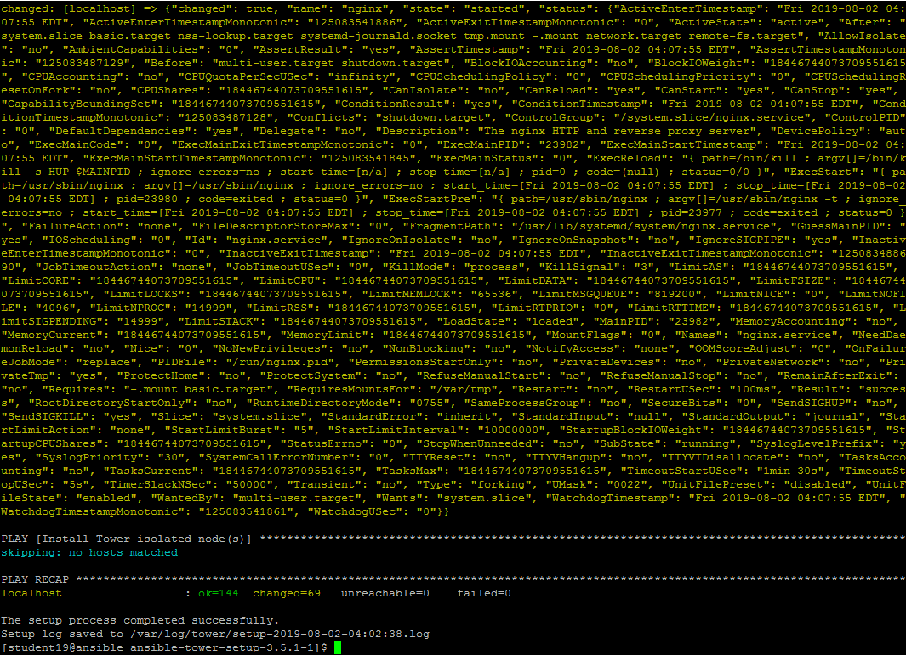
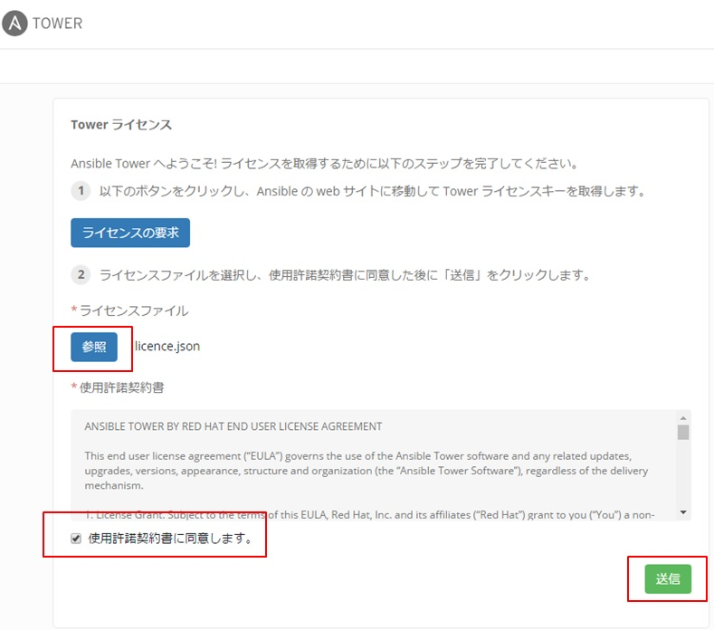

# 演習 2.1 - Tower の紹介（インストール）

## Ansible Tower の価値

Ansible Towerは、IT自動化のためのエンタープライズソリューションを提供するWebベースのUIです。

  - ユーザーフレンドリーなダッシュボード形式

  - Ansibleを補完し、自動化、ビジュアル管理、および監視機能を追加します

  - 管理者にユーザーアクセス制御を提供します

  - 仮想化、クラウドなど様々な情報ソース内のグラフィカルなインベントリの管理と同期

  - RESTful API への対応

  - などなど...

## Ansible Tower ラボ環境

この実習ラボでは、事前設定された実習ラボ環境で作業します。以下のホストにアクセスできます。  

| Role                         | Inventory name |
| -----------------------------| ---------------|
| Ansible Control Host & Tower | ansible        |
| Managed Host 1               | node1          |
| Managed Host 2               | node2          |
| Managed Host 2               | node3          |

Ansible Towerはすでにインストールされ、ライセンスが付与されています。WebUIにはHTTP / HTTPS経由でアクセスできます。  

※講師の意向により Ansible Tower がインストールされていない場合もあります。その際は講師より指示がありますので、Ansible Tower のインストールから実施ください。  

## Ansible Tower インストール

Ansible Tower のインストールが未実施の場合、以下の手順で Tower のインストールを実施ください。既にインストールされている場合はこの手順はスキップしてください。  

> **Warning**
> 
> **11.22.33.44** は自分自身の Ansible Control Host のIPアドレスに置き換えてください。  

Ansible Control Host に ssh でログインします。  

    ssh studentX@11.22.33.44

Ansible Control Host に Tower をインストールします。  
`<xxxxx>` の部分には、ダウンロードしたファイルに適合する、適切な値を入力ください。  

    [student<X>@ansible ~]$ cd /tmp
    [student<X>@ansible ~]$ curl -O https://releases.ansible.com/ansible-tower/setup/ansible-tower-setup-latest.tar.gz
    [student<X>@ansible ~]$ tar xvzf ansible-tower-setup-<xxxxx>.tar.gz
    [student<X>@ansible ~]$ cd ansible-tower-setup-<xxxxx>
    [student<X>@ansible ~]$ vi inventory
  
※ファイルの中でブランクになっている、3つのパスワードを以下の通り設定し、ファイルを保存します。  
  
 admin_password='ansibleWS'  
 pg_password='ansibleWS'  
 rabbitmq_password='ansibleWS'  

以下のコマンドを実行し、Ansible Tower のインストールを開始します！！  
  
    [student<X>@ansible ~]$ sudo ./setup.sh
  
    
インストール完了には10分程かかります。セットアップが成功したことを確認します。  

  
  
  
ライセンスファイルの適応  

1.Ansible Tower サーバーにブラウザでアクセスし"参照"をクリックします。  
　`https://<Ansigle Control Host & Tower>/`  
　IDとパスワードは、インストール時に指定した `admin` / `ansibleWS` です。  
2. 参照をクリックし、ライセンスファイルを指定します。  
　※ライセンスファイルに関しては講師より指示があります。  
3.使用許諾にチェックを入れて"送信"を押下します。  

   
  
 
## ダッシュボード

Web UI を使用して Ansible Tower に `admin` 権限でログインすると、グラフと以下のような情報が表示されます。  

  - 最近実行したジョブ

  - 管理対象ホストの台数

  - 問題のあるホストの台数とそのホストへのリンク

ダッシュボードには、 Playbook で完了したタスクの実行に関するリアルタイムデータも表示されます。  

## Ansible Tower の概念

Ansible Tower を使い始めるには、いくつかの概念と Ansible Tower 独特のオブジェクト名に慣れておく必要があります。  

**プロジェクト**

プロジェクトは Ansible Tower の Playbook の論理的な集まりです。これらの Playbook は Ansible Tower インスタンス上にあるか、または Tower がサポートするソースコードバージョン管理システム内にあります。  

**インベントリー**

インベントリーは、 Ansible Engine のインベントリーファイルと同じように、ジョブを実行する対象ノードの集まりです。インベントリーはグループに分けられ、これらのグループの中に実際のホストが含まれています。インベントリーホストの登録は、１台１台手動で登録することも可能ですし、 Ansible Tower がサポートするクラウドプロバイダや、インベントリースクリプトを使用して自動で登録することも可能です。  

**認証情報**

認証情報は、対象ノードに対してジョブを実行したり、インベントリーをダイナミックに同期したり、バージョン管理システムからプロジェクトコンテンツをインポートする時に使用されます。  

認証情報は保存の際、 Tower によって暗号化されます。このため、登録された後はどのユーザーもコマンドラインでプレーンテキストで取得することはできません。このため、登録されたユーザーの資格情報を公開することなく、他のユーザーおよびチームに、これらの認証情報の使用権限を安全に付与することが可能です。  

**テンプレート**

テンプレートにはジョブテンプレートとワークフローテンプレートがあります。ジョブテンプレートは、 Playbook を実行するための定義とパラメータのセットです。ジョブテンプレートは、同じジョブを何度も実行する際に便利です。ジョブテンプレートは、Ansible プレイブックのコンテンツの再利用とチーム間のコラボレーションも促進します。ジョブを実行するには、 Tower では最初に仕事テンプレートを作成する必要があります。ワークフローテンプレートは、複数のジョブテンプレートやワークフローテンプレートをまとめて実行するための機能を提供します。

**Jobs**

ジョブは基本的に、実行されたジョブテンプレートやワークフローテンプレートのことを指します。

----

[Click here to return to the Ansible for Red Hat Enterprise Linux Workshop](../README.ja.md)

