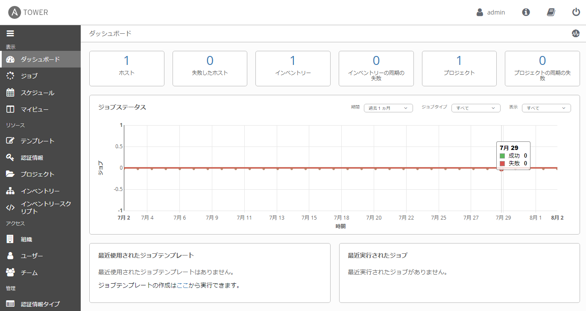

# 演習 - Tower の紹介

**Read this in other languages**:
  [English](README.md),  [日本語](README.ja.md),  [Portugues do Brasil](README.pt-br.md),  [Française](README.fr.md), [Español](README.es.md).

* [Ansible Tower の価値](#ansible-tower-の価値)
* [Ansible Tower ラボ環境](#ansible-tower-ラボ環境)
* [ダッシュボード](#ダッシュボード)
* [Ansible Tower の概念](#ansible-tower-の概念)

## Ansible Tower の価値

Ansible Towerは、IT自動化のためのエンタープライズソリューションを提供するWebベースのUIです。

  - ユーザーフレンドリーなダッシュボード形式

  - Ansibleを補完し、自動化、ビジュアル管理、および監視機能を追加します

  - 管理者にユーザーアクセス制御を提供します

  - 仮想化、クラウドなど様々な情報ソース内のグラフィカルなインベントリの管理と同期が可能です

  - RESTful API に対応しています

  - などなど...

## Ansible Tower ラボ環境

この実習ラボでは、事前設定された実習ラボ環境で作業します。以下のホストにアクセスできます。  

| Role                         | Inventory name |
| -----------------------------| ---------------|
| Ansible Control Host & Tower | ansible        |
| Managed Host 1               | node1          |
| Managed Host 2               | node2          |
| Managed Host 2               | node3          |

Ansible Tower はすでにインストールされ、ライセンスが付与されています。WebUI には HTTP / HTTPS 経由でアクセスできます。  

## ダッシュボード

Web UI を使用して Ansible Tower に `admin` 権限でログインすると、グラフと以下のような情報が表示されます。  

  - 最近実行したジョブ

  - 管理対象ホストの台数

  - 問題のあるホストの台数とそのホストへのリンク

ダッシュボードには、 Playbook で完了したタスクの実行に関するリアルタイムデータも表示されます。  

## Ansible Tower の概念

Ansible Tower を使い始めるには、いくつかの概念と Ansible Tower 独特のオブジェクト名に慣れておく必要があります。  

**プロジェクト(Projects)**

プロジェクトは Ansible Tower の Playbook の論理的な集まりです。これらの Playbook は Ansible Tower インスタンス上にあるか、または Tower がサポートするソースコードバージョン管理システム内にあります。  

**インベントリー(Inventories)**

インベントリーは、 Ansible Engine のインベントリーファイルと同じように、ジョブを実行する対象ノードの集まりです。インベントリーはグループに分けられ、これらのグループの中に実際のホストが含まれています。インベントリーホストの登録は、１台１台手動で登録することも可能ですし、 Ansible Tower がサポートするクラウドプロバイダや、インベントリースクリプトを使用して自動で登録することも可能です。  

**認証情報(Credentials)**

認証情報は、対象ノードに対してジョブを実行したり、インベントリーをダイナミックに同期したり、バージョン管理システムからプロジェクトコンテンツをインポートする時に使用されます。  

認証情報は保存の際、 Tower によって暗号化されます。このため、登録された後はどのユーザーもコマンドラインでプレーンテキストで取得することはできません。このため、登録されたユーザーの資格情報を公開することなく、他のユーザーおよびチームに、これらの認証情報の使用権限を安全に付与することが可能です。  

**テンプレート(Templates)**

テンプレートにはジョブテンプレートとワークフローテンプレートがあります。ジョブテンプレートは、 Playbook を実行するための定義とパラメータのセットです。ジョブテンプレートは、同じジョブを何度も実行する際に便利です。ジョブテンプレートは、Ansible プレイブックのコンテンツの再利用とチーム間のコラボレーションも促進します。ジョブを実行するには、 Tower では最初にジョブテンプレートを作成する必要があります。ワークフローテンプレートは、複数のジョブテンプレートやワークフローテンプレートをまとめて実行するための機能を提供します。

**ジョブ(Jobs)**

ジョブは基本的に、実行されたジョブテンプレートやワークフローテンプレートのことを指します。

----

[Ansible Tower ワークショップ表紙に戻る](../README.ja.md#section-2---ansible-towerの演習)
