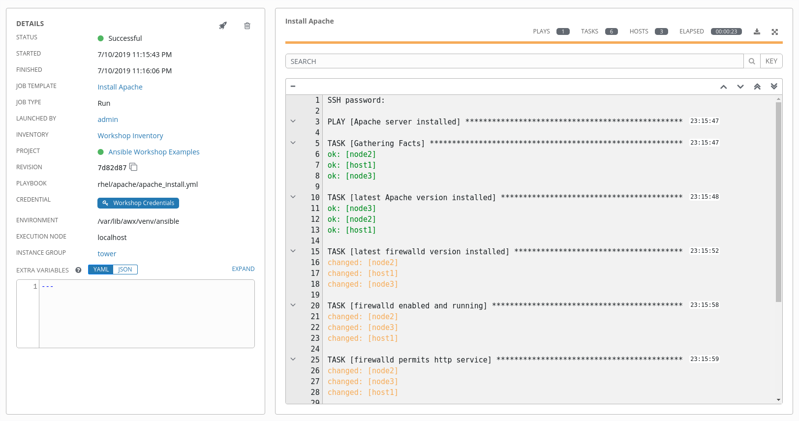

#Atelier - Les projets & modèles

**Lisez ceci dans d'autres langues**:
<br> [English](README.md),  [日本語](README.ja.md),  [Portugues do Brasil](README.pt-br.md),  [Française](README.fr.md),  [Español](README.es.md).

## Table des matières

* [Objectif](#objectif)
* [Guide](#guide)
* [Configuration du référentiel Git](#Configuration-du-référentiel-Git)
* [Création de projet](#création-de-projet)
* [Création de model et exécution de tache](#création-de-modèle-et-exécution-de-tache)
* [Défi: Vérification du résultat](#Défi-vérification-du-résultat)
* [Qu en est-il des bonnes pratiques?](#Qu-en-est-il-des-bonnes-pratiques)

# Objectif

Un projet Ansible Tower est une collection logique de Playbooks Ansible. Vous pouvez gérer vos playbooks en les plaçant dans un système de gestion de code source (SCM) pris en charge par Tower, y compris Git, Subversion et Mercurial.

Cet exercice couvre
- Comprendre et utiliser un projet de tour Ansible
- Utilisation de Playbooks Ansible conservés dans un référentiel Git.
- Création et utilisation d'un modèle de travail Ansible

# Guide

## Configuration du référentiel Git

Pour cette démonstration, nous utiliserons des playbooks stockés dans un référentiel Git:

**https://github.com/ansible/workshop-examples**


Un Playbook pour installer le serveur Web Apache a déjà été validé dans le répertoire **rhel/apache**, `apache_install.yml`:
```yaml
---
- name: Apache server installed
  hosts: all

  tasks:
  - name: latest Apache version installed
    yum:
      name: httpd
      state: latest

  - name: latest firewalld version installed
    yum:
      name: firewalld
      state: latest

  - name: firewalld enabled and running
    service:
      name: firewalld
      enabled: true
      state: started

  - name: firewalld permits http service
    firewalld:
      service: http
      permanent: true
      state: enabled
      immediate: yes

  - name: Apache enabled and running
    service:
      name: httpd
      enabled: true
      state: started
```

> **Astuce**
>
> Notez la différence avec les autres Playbooks que vous avez peut-être écrits \! Plus important encore, il n'y a pas de "become" et "hosts" est défini sur "all".

Pour configurer et utiliser ce référentiel en tant que système **Source Control Management (SCM)** dans Tower, vous devez créer un **projet** qui utilise le référentiel

## Création de projet

   - Allez à **RESSOURCES → Projets** dans la vue du menu latéral, cliquez sur le bouton vert **+**. Remplissez le formulaire:
  <table>
    <tr>
      <th>Parametre</th>
      <th>Valeur</th>
    </tr>
    <tr>
      <td>NOM</td>
      <td>Ansible Workshop Examples</td>
    </tr>
    <tr>
      <td>ORGANISATION</td>
      <td>Default</td>
    </tr>
    <tr>
      <td>TYPE DE SCM</td>
      <td>Git</td>
    </tr>
  </table>

Vous avez maintenant besoin de l'URL pour accéder au dépôt. Accédez au référentiel Github mentionné ci-dessus, choisissez le bouton vert **Cloner ou télécharger** à droite, cliquez sur **Utiliser https** et copiez l'URL HTTPS.

> **Remarque**
>
> S'il n'y a pas **Utilisez https** pour cliquer, mais un **Utilisez SSH**, ça va: copiez simplement l'URL. L'important est que vous copiez l'URL commençant par **https**.

  Entrez l'URL dans la configuration du projet:

 <table>
   <tr>
     <th>Parametre</th>
     <th>Valeur</th>
   </tr>
   <tr>
     <td>URL DU SCM</td>
     <td><code>https://github.com/ansible/workshop-examples.git</code></td>
   </tr>
   <tr>
     <td>OPTIONS DE MISE A JOUR SCM</td>
     <td>Cocher les 3 premieres cases.</td>
   </tr>
 </table>


- Cliquez sur **ENREGISTRER**

Le nouveau projet sera synchronisé automatiquement après sa création. Mais vous pouvez également le faire manuellement: Synchronisez à nouveau le projet avec le référentiel Git en accédant à la vue **Projets** et en cliquant sur la flèche circulaire **Icône Obtenir la dernière révision SCM** à droite du projet.

Après avoir démarré le job de synchronisation, accédez à la vue **Taches**: il y a un nouveau job pour la mise à jour du référentiel Git.

## Création de modèle et exécution de tache

Un modèle de travail est une définition et un ensemble de paramètres permettant d'exécuter un travail Ansible. Les modèles de travaux sont utiles pour exécuter plusieurs fois le même travail. Donc, avant d'exécuter une **Tache** à partir de Tower, vous devez créer un **Modèle** qui rassemble les informations suivantes:

- **Inventaire**: Sur quels hôtes le travail doit-il s'exécuter?

- **Informations d'identification** Quelles informations d'identification sont nécessaires pour se connecter aux hôtes?

- **Projet**: Où est le Playbook?

- **Quoi** Playbook à utiliser?

D'accord, allons-y: accédez à la vue **Modèles**, cliquez sur le bouton  et choisissez **Modèle de tâche**.

> ** Astuce **
>
> N'oubliez pas que vous pouvez souvent cliquer sur la loupe pour obtenir un aperçu des options à choisir pour remplir les champs.

<table>
  <tr>
    <th>Parametre</th>
    <th>Valeur</th>
  </tr>
  <tr>
    <td>NOM</td>
    <td>Install Apache</td>
  </tr>
  <tr>
    <td>TYPE DE TACHE</td>
    <td>Run</td>
  </tr>
  <tr>
    <td>INVENTAIRE</td>
    <td>Workshop Inventory</td>
  </tr>
  <tr>
    <td>PROJET</td>
    <td>Ansible Workshop Examples</td>
  </tr>
  <tr>
    <td>PLAYBOOK</td>
    <td><code>rhel/apache/apache_install.yml</code></td>
  </tr>    
  <tr>
    <td>INFORMATIONS D'IDENTIFICATION</td>
    <td>Workshop Credentials</td>
  </tr>
  <tr>
    <td>LIMITE</td>
    <td>web</td>
  </tr>    
  <tr>
    <td>OPTIONS</td>
    <td>Cochez "Activer l'élévation des previlèges"</td>
  </tr>           
</table>

- Cliquez sur **ENREGISTRER**

Vous pouvez démarrer le travail en cliquant directement sur le bouton bleu **LANCEMENT**, ou en cliquant sur la fusée dans l'aperçu des modèles de travail. Après avoir lancé la taches, vous êtes automatiquement amené à l'aperçu des taches où vous pouvez suivre l'exécution du playbook en temps réel:



Étant donné que cela peut prendre un certain temps, examinez de plus près tous les détails fournis:

- Tous les détails du modèle de travail comme l'inventaire, le projet, les informations d'identification et le playbook sont affichés.

- De plus, la révision réelle du playbook est enregistrée ici - cela facilite l'analyse ultérieure des travaux.

- Le temps d'exécution avec l'heure de début et de fin est également enregistré, ce qui vous donne une idée de la durée réelle de l'exécution d'un travail.

- Sur le côté droit, la sortie du jeu de lecture est affichée. Cliquez sur un nœud sous une tâche et vérifiez que des informations détaillées sont fournies pour chaque tâche de chaque nœud.

Une fois le travail terminé, accédez à la vue principale **Taches**: tous les travaux sont répertoriés ici, vous devriez voir directement avant que le Playbook n'exécute une mise à jour SCM. Il s'agit de la mise à jour Git que nous avons configurée pour le **Projet** au début \!

## Défi: Vérification du résultat

Il est temps de relever un petit défi:

  - Utilisez une commande Ad-hoc sur les deux hôtes pour vous assurer qu'Apache a été installé et fonctionne.

Vous avez déjà franchi toutes les étapes nécessaires, essayez donc par vous-même.

> **Astuce**
>
> Qu'en est-il de `systemctl status httpd`?

> **Avertissement**
>
> **Solution ci-dessous**

- Accédez à **Inventaires** → **Workshop Inventory**

- Dans la vue **HOTES**, sélectionnez tous les hôtes et cliquez sur **EXECUTER DES COMMANDES**

- Remplissez les champs suivants:

<table>
  <tr>
    <th>Parametre</th>
    <th>Valeur</th>
  </tr>
  <tr>
    <td>MODULE</td>
    <td>command</td>
  </tr>
  <tr>
    <td>ARGUMENTS</td>
    <td>systemctl status httpd</td>
  </tr>
  <tr>
    <td>MACHINE CREDENTIALS</td>
    <td>Workshop Credentials</td>
  </tr>   
</table>

- Cliquez sur **LANCER**

## Qu en est-il des bonnes pratiques?

Voici une liste de tâches:

> **Avertissement**
>
> Veuillez vous assurer de terminer ces étapes car le prochain chapitre en dépend \!

- Créez un nouvel inventaire appelé «Webserver» et n'en faites membre que «node1».

- Copiez le modèle `Installer Apache` à l'aide de l'icône de copie dans la vue **Modèles**

- Changez le nom en `Install Apache Ask`

- Modifiez le paramètre **INVENTAIRE** du projet pour qu'il demande l'inventaire au lancement

- **ENREGISTRER**

- Lancez le modèle `Install Apache Ask`.

- Il va maintenant demander l'inventaire à utiliser, choisissez l'inventaire `Webserver` et cliquez sur **LANCEMENT**

- Attendez la fin du Job et assurez-vous qu'il ne s'exécute que sur `node1`

> **Astuce**
>
> Le Job n'a rien changé car Apache était déjà installé dans la dernière version.
----
**Navigation**
<br>
[Exercice précédent](../2.2-cred/README.fr.md) - [Exercice suivant](../2.4-surveys/README.fr.md)

[Cliquez ici pour revenir à l'atelier Ansible pour Red Hat Enterprise Linux](../README.fr.md)
