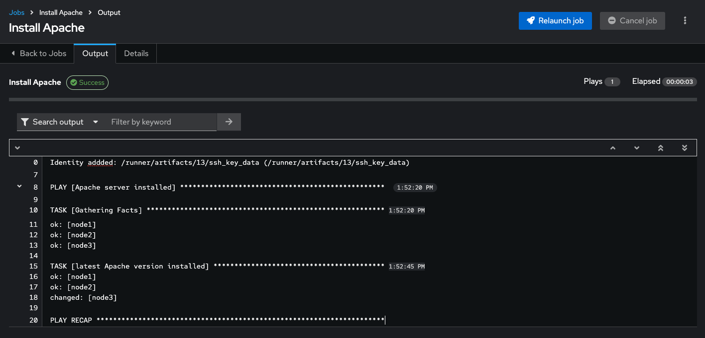

# ワークショップ演習 - プロジェクトとジョブテンプレート

**他の言語でもお読みいただけます**:
<br> [English](README.md)、[日本語](README.ja.md)、 [Portugues do Brasil](README.pt-br.md)、 [Française](README.fr.md)、 [Español](README.es.md)

## 目次

* [目的](#目的)
* [ガイド](#ガイド)
* [Git リポジトリーのセットアップ](#git-リポジトリーのセットアップ)
* [プロジェクトの作成](#プロジェクトの作成)
* [ジョブテンプレートの作成とジョブの実行](#ジョブテンプレートの作成とジョブの実行)
* [チャレンジラボ: 結果のチェック](#チャレンジラボ-結果のチェック)

## 目的

Ansible 自動コントローラー **Project** は、AnsiblePlaybook の論理的なコレクションです。Playbook は、Git、Subversion などの自動コントローラーがサポートするソースコード管理 (SCM) システムに配置することで管理できます。

この演習では、以下について説明します。

* Ansible 自動コントローラープロジェクトの概要と利用
* Git リポジトリーに保存されている AnsiblePlaybook の使用
* Ansible ジョブテンプレートの作成と使用

## ガイド

### Git リポジトリーのセットアップ

このデモでは、Git リポジトリーに保存されている Playbook を使用します。

[https://github.com/ansible/workshop-examples](https://github.com/ansible/workshop-examples)

Apache Web サーバーをインストールする Playbook が既に **rhel/apache** ディレクトリーにコミットされている (`apache_install.yml`):

```yaml
---
- name: Apache server installed
  hosts: web

  tasks:
  - name: latest Apache version installed
    yum:
      name: httpd
      state: latest

  - name: latest firewalld version installed
    yum:
      name: firewalld
      state: latest

  - name: firewalld enabled and running
    service:
      name: firewalld
      enabled: true
      state: started

  - name: firewalld permits http service
    firewalld:
      service: http
      permanent: true
      state: enabled
      immediate: yes

  - name: Apache enabled and running
    service:
      name: httpd
      enabled: true
      state: started
```

> **ヒント**
>
> 作成した Playbook の違いをメモしてください。最も重要なのは、`become` がなく、`hosts` が `all` に設定されていることです。

自動コントローラーで **Source Control Management (SCM)** として、このレポジトリーを設定して使用するには、このレポジトリーを使用する **Project** を作成する必要があります。

### プロジェクトの作成

* **Resources → Projects** に移動します。フォームで **Add** ボタンをクリックします。フォームを記入します。

 <table>
   <tr>
     <th>パラメーター</th>
     <th>値</th>
   </tr>
   <tr>
     <td>Name</td>
     <td>Workshop Project</td>
   </tr>
   <tr>
     <td>Organization</td>
     <td>Default</td>
   </tr>
   <tr>
     <td>Default Execution Environment</td>
     <td>Default execution environment</td>
   </tr>
   <tr>
     <td>Source Control Credential Type</td>
     <td>Git</td>
   </tr>
 </table>

 Project 構成に URL を入力します。

 <table>
   <tr>
     <th>パラメーター</th>
     <th>値</th>
   </tr>
   <tr>
     <td>Source Control URL</td>
     <td><code>https://github.com/ansible/workshop-examples.git</code></td>
   </tr>
   <tr>
     <td>Options</td>
     <td>Select Clean, Delete, Update Revision on Launch to request a fresh copy of the repository and to update the repository when launching a job.</td>
   </tr>
 </table>

* **SAVE** をクリックします。


新しい Project は、作成後に自動的に同期されます。ただし、これを手動で行うこともできます。**Projects** ビューに移動し、プロジェクトの右側にある円形の矢印 *Sync Project** アイコンをクリックして、プロジェクトを Git リポジトリーと再度同期します。

同期ジョブを開始した後、**Jobs** ビューに移動します。Git リポジトリーを更新するための新しいジョブがあります。

### ジョブテンプレートの作成とジョブの実行

ジョブテンプレートは、Ansible ジョブを実行するための定義とパラメーターのセットです。ジョブテンプレートは、同じジョブを何度も実行するのに役立ちます。したがって、自動コントローラーから Ansible **Job**を実行する前に、まとめる **Job Template** を作成する必要があります。

* **Inventory**: ジョブが実行するホスト

* **Credentials** ホストへのログインに必要な認証情報

* **Project**: Playbook の場所

* **What** 使用する Playbook

実際にやってみましょう。**Resources -> Templates** ビューに移動して、*Add** button and choose ** ボタンをクリックし、**Add job template** を選択します。

> **ヒント**
>
> フィールドへの記入を選ぶにあたり、オプションの概要を得るには拡大鏡をクリックすることができます。

 <table>
   <tr>
     <th>パラメーター</th>
     <th>値</th>
   </tr>
   <tr>
     <td>Name</td>
     <td>Install Apache</td>
   </tr>
   <tr>
     <td>Job Type</td>
     <td>Run</td>
   </tr>
   <tr>
     <td>Inventory</td>
     <td>Workshop Inventory</td>
   </tr>
   <tr>
     <td>Project</td>
     <td>Workshop Project</td>
   </tr>
   <tr>
     <td>Execution Environment</td>
     <td>Default execution environment</td>
   </tr>
   <tr>
     <td>Playbook</td>
     <td><code>rhel/apache/apache_install.yml</code></td>
   </tr>
   <tr>
     <td>Credentials</td>
     <td>Workshop Credential</td>
   </tr>
   <tr>
     <td>Limit</td>
     <td>web</td>
   </tr>
   <tr>
     <td>Options</td>
     <td>tasks need to run as root so check **Privilege Escalation**</td>
   </tr>
 </table>

* **Save** をクリックします。

青い **Launch** ボタンを直接クリックするか、Job Templates の概要でロケットをクリックすると、ジョブを開始できます。ジョブテンプレートを起動すると、自動的にジョブの概要が表示され、Playbook の実行をリアルタイムで追跡できます。

ジョブの詳細


ジョブの実行


これには時間がかかる場合があるため、提供されているすべての詳細を詳しく調べてください。

* インベントリー、プロジェクト、認証情報、Playbook などのジョブテンプレートのすべての詳細が表示されます。

* さらに、Playbook の実際のリビジョンがここに記録されます。これにより、後でジョブの実行を分析しやすくなります。

* また、開始時間と終了時間の実行時間が記録されるため、ジョブの実行が実際にどのくらいの時間であったかがわかります。

* **Output** を選択すると、Playbook の実行の出力が表示されます。タスクの下のノードをクリックして、各ノードの各タスクの詳細情報が表示されていることを確認します。

ジョブが終了したら、メインの **Jobs** ビューに移動します。すべてのジョブがここに一覧表示されます。Playbook が実行される前に、Source Control Update が開始されていたことがわかります。これは、起動時に **Project** 用に構成した Git アップデートです。

### チャレンジラボ: 結果のチェック

小チャレンジ:

* 両方のホストでアドホックコマンドを使用して、Apache がインストールされ、実行されていることを確認します。

必要なすべての手順をすでに完了しているので、これを自分で試してください。

> **ヒント**
>
> `systemctl status httpd` はどうでしょうか。


> **警告**
>
> **回答を以下に示します**

* **Resources → Inventories** → **Workshop Inventory** に移動します。

* **Host** ビューでは、`node1`、`node2`、`node3` を選択して、**Run Command** をクリックします。

**Details** ウィンドウで、**Arguments** `systemctl status httpd` で **Module** `command` を選択し、**次へ** をクリックします。

**Execution Environment** ウィンドウで **Default execution environment** を選択し、**Next** をクリックします。

**Machine Credential**ウィンドウで、**Workshop Credential** を選択し、**Launch** をクリックします。

> **ヒント**
>
> 結果の出力は、コマンドが完了すると表示されます。

---
**ナビゲーション**
<br>
[前の演習](../2.2-cred) - [次の演習](../2.4-surveys)

[Click here to return to the Ansible for Red Hat Enterprise Linux Workshop](../README.md#section-2---ansible-tower-exercises)
