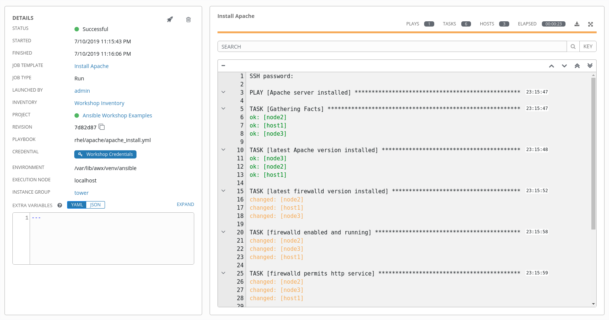

# 演習 - プロジェクトとジョブテンプレート

**Read this in other languages**:
<br> [English](README.md),  [日本語](README.ja.md),  [Portugues do Brasil](README.pt-br.md),  [Française](README.fr.md),  [Español](README.es.md).


* [Git リポジトリのセットアップ](#git-リポジトリのセットアップ)
* [プロジェクトの作成](#プロジェクトの作成)
* [ジョブテンプレートを作成してジョブを実行する](#ジョブテンプレートを作成してジョブを実行する)
* [チャレンジラボ: 結果の確認](#チャレンジラボ-結果の確認)
* [次のラボの準備も含め少し作業します](#次のラボの準備も含め少し作業します)

Tower の **プロジェクト** は、 Git、Subversion、Mercurial、ローカルホルダなど、Playbook の置き場所を定義する仕組みを提供します。 Tower ではサポートとされるソースコード管理（SCM）と連携して Playbook を管理することが可能です。  

Playbook は SCM など、バージョン管理の仕組みの下に置いておくべきです。このラボでは、 Git リポジトリに保存されている Playbook を利用します。  

## Git リポジトリのセットアップ  
このデモでは、既に Git リポジトリに保存されているプレイブックを使用します。  

**https://github.com/ansible/workshop-examples**

このラボで利用する Apache Web Server をインストールするための Playbook は、上記 github サイトの **rhel/apache** に置いてある、`apache_install.yml` です。内容は以下の通りです。  

```yaml
---
- name: Apache server installed
  hosts: all

  tasks:
  - name: latest Apache version installed
    yum:
      name: httpd
      state: latest

  - name: latest firewalld version installed
    yum:
      name: firewalld
      state: latest

  - name: firewalld enabled and running
    service:
      name: firewalld
      enabled: true
      state: started

  - name: firewalld permits http service
    firewalld:
      service: http
      permanent: true
      state: enabled
      immediate: yes

  - name: Apache enabled and running
    service:
      name: httpd
      enabled: true
      state: started
```

> **ヒント**
>
> Engine の演習で書いた Playbook と比較するとちょっと違っているところがあります。重要なところは、 `become` が無いところと、 `hosts` の設定に `all` を指定しているところです。  

このリポジトリを Tower の **Source Control Management (SCM)** として利用するには **プロジェクト** を作成する必要があります。  

## プロジェクトの作成  

  - 左のメニューから **プロジェクト** を選択し、  ボタンをクリック。フォームに以下を入力します。  

  - **名前:** Ansible Workshop Examples  

  - **組織:** Default  

  - **SCM タイプ:** Git  

ここで、リポジトリにアクセスするためのURLが必要です。上記の Github リポジトリに移動し、右側の緑色の **Clone or download** ボタンをクリック。さらに、 **Clone with HTTPS** が選択されていることを確認し、URL をコピーします。  

SCM URL にコピーした URL を貼り付けます。  

- **SCM URL:** `https://github.com/ansible/workshop-examples.git`  

- **SCM 更新オプション** 上から3つのボックスにチェックマークを付けて、常にリポジトリの最新コピーを取得し、ジョブの起動時にリポジトリを更新する設定とします。    

- **保存** をクリックします  

新しいプロジェクトは、作成後に自動的に同期されます。ただし、これを手動で行うこともできます。 **Projects** ビューに移動し、プロジェクトの右側にある円形矢印 **最新のSCMリビジョンを取得** アイコンをクリックすると、プロジェクトを Git リポジトリと再度同期します。  

## ジョブテンプレートを作成してジョブを実行する  

ジョブテンプレートは、Ansible ジョブを実行するための定義とパラメーターのセットです。ジョブテンプレートは、同じジョブを何度も実行するのに役立ちます。ジョブテンプレートではいくつかのパラメータを指定します。それぞれの意味は下記の通りです。  

- **インベントリー:** ジョブを実行するホストを指定します  

- **認証情報:** 管理対象ホストにログインするためのアカウント情報です  

- **プロジェクト:** Playbook の場所を指定します   

- **Playbook の指定**

早速 **ジョブテンプレート** を作成してみましょう。♪  

左のメニューから **テンプレート** を選択し、  ボタンをクリック。選択肢の中から **ジョブテンプレート** を選びます。    

> **ヒント**
>
> 下記フィールドの多くは、虫眼鏡アイコンをクリックの上オプション選択で設定が可能です。  

- **名前:** Apache Install  

- **ジョブタイプ:** 実行  

- **インベントリー:** Workshop Inventory  

- **プロジェクト:** Ansible Workshop Examples  

- **PLAYBOOK:** `rhel/apache/apache_install.yml`  

- **認証情報:** Workshop Credentials  

- オプションで **権限昇格の有効化** にチェックを入れます  

- **保存** をクリックします  

青い **起動** ボタンを直接クリックするか、テンプレートのビューでロケットアイコンをクリックしてジョブを開始します。ジョブテンプレートを起動すると、自動的にジョブの概要が表示され、Playbook の実行をリアルタイムで追跡できます。  


  


完了するまで少し時間がかかりますので、何を行っているか確認してみてください。  

- インベントリ、プロジェクト、認証情報のチェック、Playbook などのジョブテンプレートの詳細が表示されます  

- さらに、Playbook で変更された部分が記録されています  

- また、開始時刻と終了時刻を含む実行時間も記録されるため、ジョブの実行が実際にどれくらいかかったかがわかります  

- 右側に、プレイブック実行の出力が表示されます。タスクの下のノードをクリックして、各ノードの各タスクの詳細情報が提供されていることを確認します  

ジョブが完了したら、左のメニューからジョブをクリックします。すべてのジョブがここに一覧表示されます。Playbook を実行する前に、SCM 更新が開始されるのが分かります。これは、プロジェクト作成時に、 `起動時のリビジョン更新` にチェックを入れましたね？その Git 情報の更新です！  

## チャレンジラボ: 結果の確認  

以下に挑戦してみましょう！

  - アドホックコマンドを使用して、対象ホストに Apache がインストールされ、実行されていることを確認します。

確認する方法は以前のラボで学んでいると思いますので、考えてやってみてください。

> **ヒント**
>
> `systemctl status httpd` を使う！？

> **回答**

- **インベントリー** → **Workshop Inventory**

- **ホスト** をクリックし、対象ホストをチェックにより選択。さらに、 **コマンドの実行** をクリックします。

- **モジュール:** command

- **引数:** systemctl status httpd

- **マシン認証情報:** Workshop Credentials

- **起動** をクリック

## 次のラボの準備も含め少し作業します

以下を実施ください。  

> **注意**  
>
> 次の章がそれに依存するので、これらの手順を必ず完了してください！  

- `Webserver` という名前のインベントリーを作成し、node1 のみ登録します  

- **テンプレート** をクリックし、 `Install Apache` テンプレートをコピーアイコンを使ってコピーします  

- コピーしたジョブテンプレートを開き `Install Apache Ask` に名前を変更します  

- さらに **インベントリー** で、 `起動プロンプト` にチェックを入れます  

- **保存**します  

- `Install Apache Ask` テンプレートを起動します  

- 使用するインベントリーについて聞かれるので `Webserver` を選択し **次へ** をクリックし、**起動**をクリックします  

- ジョブが終了するのを待ち、 `node1` でしか実行されていないことを確認します。  

> **ヒント**  
>
> Apache は既に最新バージョンでインストールされているため、ジョブは何も変更していないことが分かります。  

----

[Ansible Tower ワークショップ表紙に戻る](../README.ja.md#section-2---ansible-towerの演習)
