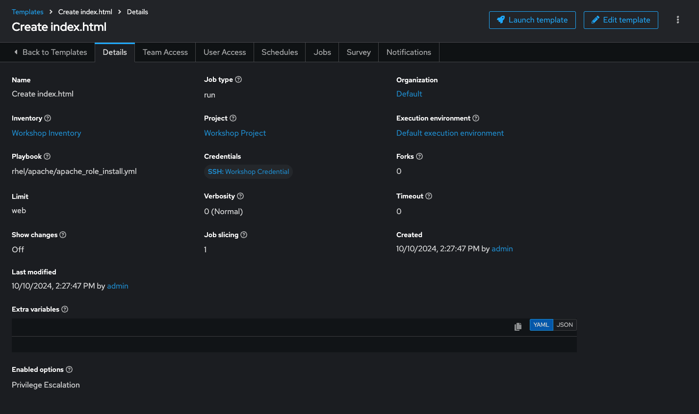
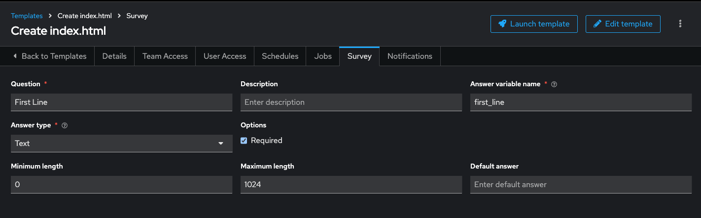
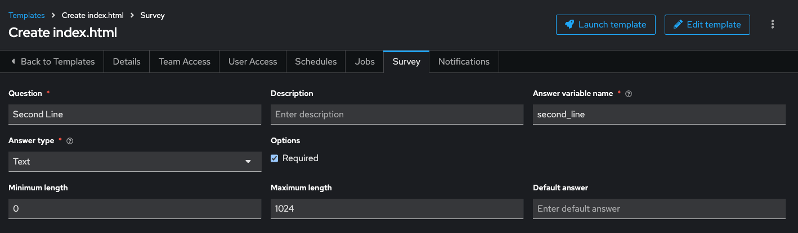
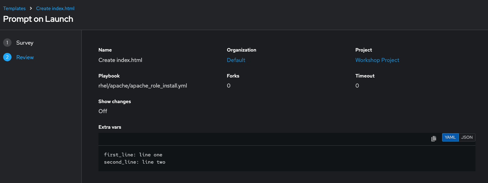
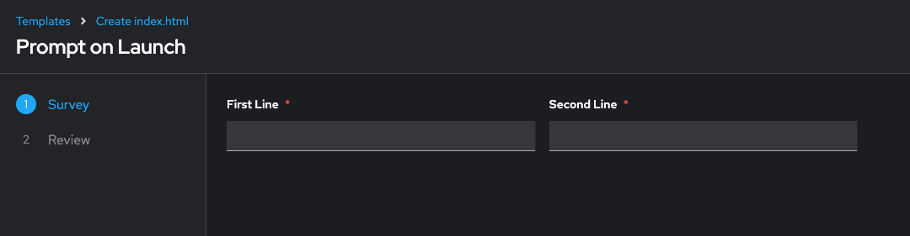

# Exercise - Surveys

**Read this in other languages**:
<br> [English](README.md),  [日本語](README.ja.md),  [Portuguese do Brasil](README.pt-br.md),  [Française](README.fr.md),  [Español](README.es.md)

## Table of Contents

- [Objective](#objective)
- [Guide](#guide)
- [The Apache-Configuration Role](#the-apache-configuration-role)
- [Create the Project](#create-the-project)
- [Create a Template with a Survey](#create-a-template-with-a-survey)
  - [Create Template](#create-template)
  - [Add the Survey](#add-the-survey)
- [Launch the Template](#launch-the-template)
- [What About Some Practice?](#what-about-some-practice)

## Objective

Demonstrate the use of the Ansible Automation Controller [survey feature](https://docs.ansible.com/automation-controller/latest/html/userguide/job_templates.html#surveys). Surveys allow for setting extra variables for the playbook, similar to ‘Prompt for Extra Variables,’ but in a user-friendly Q&A format. They also allow for validation of user input.

## Guide

You've installed Apache on all hosts in the job you just ran. Now, let's build on this:

- Use a proper role that includes a Jinja2 template to deploy an `index.html` file.
- Create a job **Template** with a survey to collect values for the `index.html` template.
- Launch the job **Template**.

Additionally, the role will ensure that the Apache configuration is set up correctly for this exercise.

> **Tip**  
> The survey feature provides a simple query for data but does not support dynamic data queries, nested menus, or four-eye principles.

### The Apache-Configuration Role

The playbook and role with the Jinja2 template are located in the GitHub repository [https://github.com/ansible/workshop-examples](https://github.com/ansible/workshop-examples) in the `rhel/apache` directory.

- Have a look at the playbook `apache_role_install.yml`, which references the role.
- The role is located in the `roles/role_apache` subdirectory.
- Inside the role, note the two variables in the `templates/index.html.j2` template file marked by `{{…​}}`.
- The `tasks/main.yml` file deploys the template.

The playbook creates a file (**dest**) on the managed hosts from the template (**src**).

Because the playbook and role are located in the same GitHub repo as the `apache_install.yml` playbook, you don't need to configure a new project for this exercise.


### Create a Template with a Survey

Now, let's create a new Template that includes a survey.

#### Create Template

1. Go to **Automation Execution → Templates**, click the **Create template** button, and choose **Create job template**.

2. Fill out the following details:

| Parameter                  | Value                           |
|-----------------------------|---------------------------------|
| Name                        | Create index.html               |
| Job Type                    | Run                             |
| Inventory                   | Workshop Inventory              |
| Project                     | Workshop Project                |
| Execution Environment        | Default execution environment   |
| Playbook                    | `rhel/apache/apache_role_install.yml` |
| Credentials                 | Workshop Credential             |
| Limit                       | web                             |
| Options                     | Privilege Escalation            |

3. Click **Save**.



> **Warning**  
> **Do not run the template yet!**

#### Add the Survey

1. In the Template, click the **Survey** tab, then click **Create survey question**.
2. Fill out the following for the first survey question:

| Parameter                  | Value           |
|-----------------------------|-----------------|
| Question                    | First Line      |
| Answer Variable Name        | first_line      |
| Answer Type                 | Text            |



3. Click **Save**.
4. Click **Create survey question** to create a second survey question:

| Parameter                  | Value           |
|-----------------------------|-----------------|
| Question                    | Second Line     |
| Answer Variable Name        | second_line     |
| Answer Type                 | Text            |



5. Click **Save**.
6. Enable the survey by toggling the **Survey disabled** button to the on positon.

### Launch the Template

Now, launch the **Create index.html** job template by clicking the **Launch template** button.

Before the job starts, the survey will prompt for **First Line** and **Second Line**. Enter your text and click **Next**. The **Preview** window shows the values—if all looks good, click **Finish** to start the job.






Once the job completes, verify the Apache homepage by running the following `curl` command in the SSH console on the control host:

```bash
$ curl http://node1
<body>
<h1>Apache is running fine</h1>
<h1>This is survey field "First Line": line one</h1>
<h1>This is survey field "Second Line": line two</h1>
</body>
```

---
**Navigation**
<br>


[Previous Exercise](../4-variables) - [Next Exercise](../../ansible_rhel_90/6-system-roles/)

[Previous Exercise](../2.3-projects) - [Next Exercise](../2.5-rbac)


