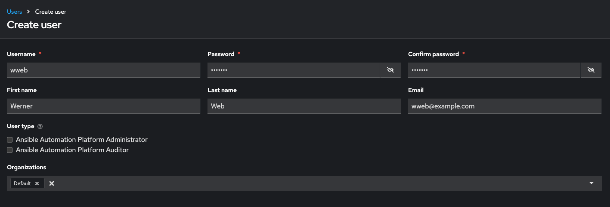
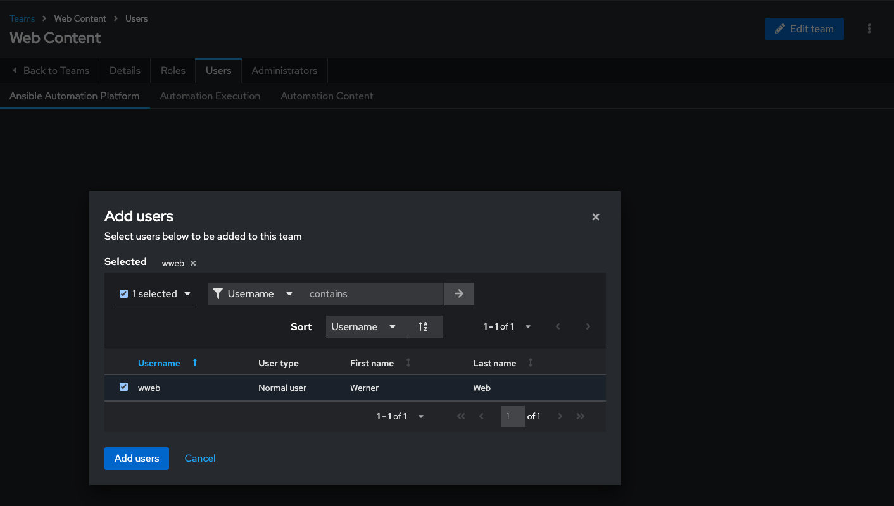

# Workshop Exercise - Role-based Access Control (RBAC)

**Read this in other languages**:
  [English](README.md),  [日本語](README.ja.md),  [Portugues do Brasil](README.pt-br.md),  [Française](README.fr.md),  [Español](README.es.md).

## Table of Contents

* [Objective](#objective)
* [Guide](#guide)
  * [Ansible Automation Controller Users](#ansible-automation-controller-users)
  * [Ansible Automation Controller Teams](#ansible-automation-controller-teams)
  * [Granting Permissions](#granting-permissions)
  * [Testing Permissions](#test-permissions)

---

## Objective

In this exercise, you'll explore how Ansible Automation Controller handles user and group management through Role-Based Access Control (RBAC). This ensures proper delegation of rights while keeping automation secure.

---

## Guide

### Ansible Automation Controller Users

There are three types of users in Ansible Automation Controller:

* **Normal User**: Has read and write access limited to assigned inventories and projects.
* **Ansible Automation Platform Auditor**: Read-only access to all objects within the automation controller environment.
* **Ansible Automation Platform Administrator**: Full admin privileges over the entire automation controller installation.

Let's create a user:

1. Navigate to **Access Management -> Users**.
2. Click the **Create user** button.
3. Fill in the following values:

   | Parameter       | Value           |
   |-----------------|-----------------|
   | Username        | wweb            |
   | Password        | ansible         |
   | Confirm Password| ansible         |
   | First Name      | Werner          |
   | Last Name       | Web             |
   | Email           | wweb@example.com |
   | Organization    | Default         |

4. Click **Create user**.

---

### Ansible Automation Controller Teams

Teams are subdivisions of an organization that include users, projects, credentials, and permissions, helping to implement RBAC efficiently.

**Create a Team:**

1. Navigate to **Access Management -> Teams**.
2. Click the **Create team** button and create a team named `Web Content` within the `Default` organization.
3. Click **Create team**.

**Add a User to the Team:**

1. Select the `Web Content` team.
2. Go to the **Users** tab and click **Add users**.
3. In the **Add users** window, choose **wweb**, then click **Add users**.

---

### Granting Permissions

To grant users the ability to execute tasks, permissions need to be set.

**Grant Permission to Use a Template:**

1. Navigate to **Automation Execution -> Templates**.
2. Select the template `Create index.html`.
3. Click the **User Access** tab.
4. Click **Add roles**.
5. Select the `wweb` user and click **Next**.
6. Choose the roles **JobTemplate Admin** and/or **JobTemplate Execute**, depending on the required level of access, click **Next**.
7. Review the selections and click **Finish**.

---

### Testing Permissions

Now, log out and log in again as the `wweb` user.

1. Navigate to **Templates**. You should only see the `Create index.html` template listed.
2. Run the job by clicking the rocket icon. Enter the required values for the survey questions and launch the job.

Once the job completes, verify the result by relogging back in as an admin user to the Ansible Automation Platform dashboard.

Go to Automation Execution → Infrastructure → Inventories → Workshop Inventory

In the **Automation Execution → Infrastructure → Inventories → Workshop Inventory, select the Hosts tab and select node1 and click Run Command

Within the Details window, select Module command, in Arguments type `curl http://node1` and click Next.

Within the Execution Environment window, select Default execution environment and click Next.

Within the Credential window, select Workshop Credentials and click Next.

Review your inputs and click Finish.

Verify that the output result is as expected. 

Just recall what you have just done: You enabled a restricted user to run an Ansible playbook

* Without having access to the credentials

* Without being able to change the playbook itself

* But with the ability to change variables you predefined\!

Effectively you provided the power to execute automation to another user without handing out your credentials or giving the user the ability to change the automation code. And yet, at the same time the user can still modify things based on the surveys you created.

This capability is one of the main strengths of Ansible automation controller\!

---
**Navigation**
 
[Previous Exercise](../2.4-surveys) - [Next Exercise](../2.6-workflows)

[Click here to return to the Ansible for Red Hat Enterprise Linux Workshop](../README.md#section-2---ansible-tower-exercises)
