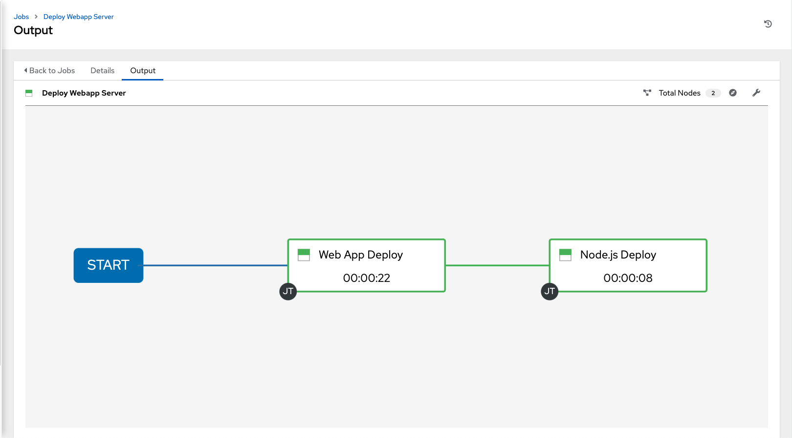

# 演習 - ワークフロー

**Read this in other languages**:
<br> [English](README.md),  [日本語](README.ja.md),  [Portugues do Brasil](README.pt-br.md),  [Française](README.fr.md),  [Español](README.es.md).

* [Ansible Tower ワークフロー](#ansible-tower-ワークフロー)
  * [ラボシナリオ](#ラボシナリオ)
  * [プロジェクトの設定](#プロジェクトの設定)
  * [ジョブテンプレートの作成](#ジョブテンプレートの作成)
  * [ワークフローの設定](#ワークフローの設定)
  * [実行してみましょう](#実行してみましょう)

# Ansible Tower ワークフロー

Ansible Tower の主要な新機能としてバージョン 3.1 からワークフローが導入されました。ワークフローの基本的な考え方は、複数のジョブテンプレートをリンクし実行できることです。各ジョブテンプレートの実行は、例えば以下の様な実行条件を付与することができます。  

  - ジョブテンプレート A が成功すると、ジョブテンプレート B が自動的に実行される  

  - ただし、失敗した場合は、ジョブテンプレート C が実行される  

また、ワークフローはジョブテンプレートだけではなくプロジェクトやインベントリの更新を行うこともできます。  

このラボでは、ワークフローの設定方法を学びます。  

## ラボシナリオ  

組織には以下の2つの部門があります。  

  - 自分の Git リポジトリで Playbook を開発・利用して Web アプリケーションを運用しているチーム  

  - Git リポジトリで Tomcat 用の JSP Web アプリケーションを開発しているチーム  

新しい Tomcat サーバーをデプロイする必要がある場合、以下の 2 つのことを行う必要があります  

  - Tomcat をインストールし、ファイアウォール設定を行い、Tomcatサービスを開始する  

  - Web アプリケーション開発チームが作成した最新の Web アプリケーションを展開する  

Playbook、JSP ファイルなど、必要なものはすべて Git リポジトリーに存在します。それを利用してラボを行います。  

> **メモ**
>
> シナリオでは、2 つの異なる Git リポジトリの利用を想定していますが、このラボでは同じリポジトリの2つの異なるブランチにアクセスしています  

## プロジェクトの設定

先のラボで実施した通り、まずはプロジェクトを作成し、 Git リポジトリを登録する必要があります。必要な情報は以下です。ご自身で設定してみてください。  

> **注意**
>
> このラボは admin アカウントで実施します。 **wweb** ユーザーでログインしている場合は、ログアウトして **admin** でログインしなおしてください！

- web オペレーションのためのプロジェクトを作成します  

  - 名前は **Webops Git Repo** とします  

  - SCM アクセス先は **https://github.com/ansible/workshop-examples.git** です  

  - **SCM BRANCH/TAG/COMMIT** は **webops** とします  

- アプリケーション開発者向けのプロジェクトを作成します。  

  - 名前は **Webdev Git Repo** とします  

  - SCM アクセス先は **https://github.com/ansible/workshop-examples.git** です

  - **SCM BRANCH/TAG/COMMIT** は **webdev** とします


> **回答は以下の通り**

- Web 運用者用のプロジェクトを作成します。**プロジェクト**画面より緑色のプラスボタンをクリックし、以下の値を入力します。  

    - **名前** Webops Git Repo  

    - **組織** Default  

    - **SCM タイプ** Git  

    - **SCM URL:** https://github.com/ansible/workshop-examples.git  

    - **SCM BRANCH/TAG/COMMIT** webops  

    - **SCM 更新オプション** 全てにチェックします  

- **保存**をクリックします    

- Web アプリ開発者用のプロジェクトを作成します。**プロジェクト**画面より緑色のプラスボタンをクリックし、以下の値を入力します。   

    - **名前** Webdev Git Repo

    - **組織** Default

    - **SCM タイプ** Git

    - **SCM URL** https://github.com/ansible/workshop-examples.git

    - **SCM BRANCH/TAG/COMMIT** webdev

    - **SCM 更新オプション** 全てにチェックします

- **保存**をクリックします  

## ジョブテンプレートの作成

最終目標はワークフローの作成ですが、まず、通常のジョブテンプレートを作成する必要があります。

  - **テンプレート** を選択し、色のプラスボタンをクリックして、**Job Template**を選択します

      - **名前** Tomcat Deploy

      - **ジョブタイプ** 実行

      - **インベントリー** Workshop Inventory

      - **プロジェクト** Webops Git Repo

      - **PLAYBOOK** `rhel/webops/tomcat.yml`

      - **認証情報** Workshop Credentials  

      - **オプション** 権限昇格の有効化にチェックを入れます  

  - **保存**をクリック

  - 上記の内容をアプリチームに対して繰り返します。**テンプレート** を選択し、色のプラスボタンをクリックして、**ジョブテンプレート**を選択します  

      - **名前** Web App Deploy

      - **ジョブタイプ** 実行

      - **インベントリー** Workshop Inventory

      - **プロジェクト** Webdev Git Repo

      - **PLAYBOOK:** `rhel/webdev/create_jsp.yml`

      - **認証情報** Workshop Credentials  

      - **オプション** 権限昇格の有効化にチェックを入れます  

  - **保存**をクリック

> **ヒント**  
>
> Playbook の中身をご覧になりたい方は、 Github URL を確認して、適切なブランチに切り替えてご覧ください。  

## ワークフローの設定

ジョブテンプレートが出来上がりましたので、ワークフローテンプレートを作成してみましょう。
ワークフローテンプレートも左メニューの**テンプレート**より作成します。

  - **テンプレート** を選択し、緑色のプラスボタンをクリックして、**ワークフローテンプレート**を選択します。

      - **名前** Deploy Webapp Server

      - **組織** Default

  - **保存**

  - これで**ワークフロービジュアライザー**ボタンがアクティブになります。早速クリックしてグラフィカルエディターを起動します。  

  - **開始** ボタンをクリックすると、Node 画面が開きます。右側で、ノードにアクションを割り当てることができます。**ジョブ**、**プロジェクトの同期**、**インベントリー同期**のいずれかが選択できます。

  - この実習ラボでは、先に作成したジョブテンプレートをリンクします。そのため、**Tomcat Deploy** ジョブを選んで**選択**をクリックします。  

  - 左側にノードが現れます。ノードにはジョブの名前が入っています。ノードの上にマウスポインターを合わせると、赤い**x**と緑の **+** 記号、真ん中には鎖のような青い記号が表示されます。
> **ヒント**
>
> 赤い「x」を使用するとノードを削除でき、緑のプラスを使用すると次のノードを追加できます。青は他のノードへのリンク作成を行う際に使います。  

  - 緑の **+** を選択します

  - 次のジョブとして Web App Deploy を選択します（次のページに切り替える必要がある場合があります）  

  - **実行** は**成功時**のままにします。

> **ヒント**
>
> この実行を使うことにより、より複雑なワークフローが可能になります。Playbook の実行が成功した場合と失敗した場合に、異なる実行パスをレイアウトできます。

  - **選択**  をクリック

  - **ワークフロービジュアライザー**画面で保存をクリックします  

  - **ワークフローテンプレート**画面で保存をクリックします

## 実行してみましょう

作成が完了しましたので早速動作させてみましょう♪  

  - **起動** ボタンを直接クリックしても良いですし、**テンプレート画面**でロケットアイコンをクリックしても起動ができます。  



ジョブビューでワークフローの実行がどのように表示されるかに注意してください。今回の通常のジョブテンプレートジョブの実行とは対照的に、右側にはプレイブックの出力はありませんが、複数のジョブステップの実行状況が表示されます。各ジョブで実行されたプレイブックの状況を確認したい場合は、各ステップの**詳細**をクリックしてください。再度ワークフロー実行画面に戻りたい場合は、左の画面の Web App Deloy の右隣にある小さな  をクリックしてください。  

ジョブが完了した後、すべてがうまく働いたかどうかを確認します。node1、node2またはnode3お使いの制御ホストから以下を実行します。

```bash
$ curl http://localhost:8080/coolapp/
```

> **ヒント**
>
> Tomcat がリクエストに応答するまで、数分待たなければならない場合があります。  

----
[Ansible Tower ワークショップ表紙に戻る](../README.ja.md#section-2---ansible-towerの演習)
