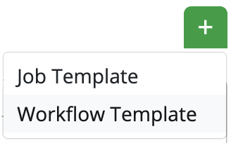
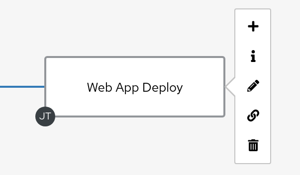
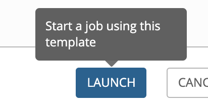

# Workshop Exercise - Workflows

**Read this in other languages**:
<br> [English](README.md),  [日本語](README.ja.md),  [Portugues do Brasil](README.pt-br.md),  [Française](README.fr.md),  [Español](README.es.md).

## Table Contents

* [Objective](#objective)
* [Guide](#guide)
   * [Lab Scenario](#lab-scenario)
   * [Set up Projects](#set-up-projects)
   * [Set up Job Templates](#set-up-job-templates)
   * [Set up the Workflow](#set-up-the-workflow)
   * [Launch Workflow](#launch-workflow)

# Objective

The basic idea of a workflow is to link multiple Job Templates together. They may or may not share inventory, Playbooks or even permissions. The links can be conditional:

  - if job template A succeeds, job template B is automatically executed afterwards

  - but in case of failure, job template C will be run.

And the workflows are not even limited to Job Templates, but can also include project or inventory updates.

This enables new applications for Ansible Tower: different Job Templates can build upon each other. E.g. the networking team creates playbooks with their own content, in their own Git repository and even targeting their own inventory, while the operations team also has their own repos, playbooks and inventory.

In this lab you’ll learn how to setup a workflow.

# Guide

## Lab Scenario

You have two departments in your organization:

  - The web operations team that is developing playbooks in their own Git branch named `webops`

  - The web developers team that is developing playbooks in their own Git branch named `webdev`.

When there is a new Node.js server to deploy, two things need to happen:

**Web Operations Team**:
  - node.js needs to be installed, the firewall needs to be opened and node.js should get started.

**Web Developers Team**
  - The most recent version of the web application needs to be deployed.

---

To make things somewhat easier for you, everything needed already exists in a Github repository: Playbooks, JSP-files etc. You just need to glue it together.

> **Note**
>
> In this example we use two different branches of the same repository for the content of the separate teams. In reality the structure of your SCM repositories depends on a lot of factors and could be different.

## Set up Projects

First you have to set up the Git repo as a Project like you normally would.

> **Warning**
>
> If you are still logged in as user **wweb**, log out of and log in as user **admin** again.**

Create the project for the web operations team.  In the **Projects** view click the green plus button and fill it in as follows:

<table>
  <tr>
    <th>Parameter</th>
    <th>Value</th>
  </tr>
  <tr>
    <td>NAME</td>
    <td>Webops Git Repo</td>
  </tr>
  <tr>
    <td>ORGANIZATION</td>
    <td>Default</td>
  </tr>
  <tr>
    <td>SCM TYPE</td>
    <td>Git</td>
  </tr>  
  <tr>
    <td>SCM URL</td>
    <td><code>https://github.com/ansible/workshop-examples.git</code></td>
  </tr>
  <tr>
    <td>SCM BRANCH/TAG/COMMIT</td>
    <td><code>webops</code></td>
  </tr>
  <tr>
    <td>SCM UPDATE OPTIONS</td>
    <td><ul><li>✓ CLEAN</li><li>✓ DELETE ON UPDATE</li><li>✓ UPDATE REVISION ON LAUNCH</li></ul></td>
  </tr>             
</table>

- Click **SAVE**

---
Create the project for the web developers team. In the **Projects** view click the green plus button and fill it in as follows:

<table>
  <tr>
    <th>Parameter</th>
    <th>Value</th>
  </tr>
  <tr>
    <td>NAME</td>
    <td>Webdev Git Repo</td>
  </tr>
  <tr>
    <td>ORGANIZATION</td>
    <td>Default</td>
  </tr>
  <tr>
    <td>SCM TYPE</td>
    <td>Git</td>
  </tr>  
  <tr>
    <td>SCM URL</td>
    <td><code>https://github.com/ansible/workshop-examples.git</code></td>
  </tr>
  <tr>
    <td>SCM BRANCH/TAG/COMMIT</td>
    <td><code>webdev</code></td>
  </tr>
  <tr>
    <td>SCM UPDATE OPTIONS</td>
    <td><ul><li>✓ CLEAN</li><li>✓ DELETE ON UPDATE</li><li>✓ UPDATE REVISION ON LAUNCH</li></ul></td>
  </tr>             
</table>

- Click **SAVE**

## Set up Job Templates

Now you have to create two Job Templates like you would for "normal" Jobs.


Go to the **Templates** view, click the green plus button and choose **Job Template**:

  <table>
    <tr>
      <th>Parameter</th>
      <th>Value</th>
    </tr>
    <tr>
      <td>NAME</td>
      <td>Web App Deploy</td>
    </tr>
    <tr>
      <td>JOB TYPE</td>
      <td>Run</td>
    </tr>
    <tr>
      <td>INVENTORY</td>
      <td>Workshop Inventory</td>
    </tr>  
    <tr>
      <td>PROJECT</td>
      <td>Webops Git Repo</td>
    </tr>
    <tr>
      <td>PLAYBOOK</td>
      <td><code>rhel/webops/web_infrastructure.yml</code></td>
    </tr>
    <tr>
      <td>CREDENTIAL</td>
      <td>Workshop Credentials</td>
    </tr>
    <tr>
      <td>LIMIT</td>
      <td>web</td>
    </tr>    
    <tr>
      <td>OPTIONS</td>
      <td>✓ ENABLE PRIVILEGE ESCALATION</td>
    </tr>                     
  </table>  

  - Click **SAVE**

---  

Go to the **Templates** view, click the green plus button and choose **Job Template**:


  <table>
    <tr>
      <th>Parameter</th>
      <th>Value</th>
    </tr>
    <tr>
      <td>NAME</td>
      <td>Node.js Deploy</td>
    </tr>
    <tr>
      <td>JOB TYPE</td>
      <td>Run</td>
    </tr>
    <tr>
      <td>INVENTORY</td>
      <td>Workshop Inventory</td>
    </tr>  
    <tr>
      <td>PROJECT</td>
      <td>Webdev Git Repo</td>
    </tr>
    <tr>
      <td>PLAYBOOK</td>
      <td><code>rhel/webdev/install_node_app.yml</code></td>
    </tr>
    <tr>
      <td>CREDENTIAL</td>
      <td>Workshop Credentials</td>
    </tr>
    <tr>
      <td>LIMIT</td>
      <td>web</td>
    </tr>        
    <tr>
      <td>OPTIONS</td>
      <td>✓ ENABLE PRIVILEGE ESCALATION</td>
    </tr>                     
  </table>  

  - Click **SAVE**

> **Tip**
>
> If you want to know what the Ansible Playbooks look like, check out the Github URL and switch to the appropriate branches.

## Set up the Workflow

Set up the workflow. Workflows are configured in the **Templates** view, you might have noticed you can choose between **Job Template** and **Workflow Template** when adding a template.

  

  - Go to the **Templates** view and click the the green plus button. This time choose **Workflow Template**

  <table>
    <tr>
      <td><b>NAME</b></td>
      <td>Deploy Webapp Server</td>
    </tr>
    <tr>
      <td><b>ORGANIZATION</b></td>
      <td>Default</td>
    </tr>    
</table>      

  - Click **SAVE**

After saving the template the **Workflow Visualizer** opens to allow you to build a workflow. You can later open the **Workflow Visualizer** again by using the button on the template details page.

  - Click on the **START** button, a new node opens. To the right you can assign an action to the node, you can choose between **JOBS**, **PROJECT SYNC**, **INVENTORY SYNC** and **APPROVAL**.

  - In this lab we’ll link our two jobs together, so select the **Web App Deploy** job and click **SELECT**.

  - The node gets annotated with the name of the job. Hover the mouse pointer over the node, you’ll see a red **x**, a green **+** and a blue **chain**-symbol appear.

  

> **Tip**
>
> Using the red "x" allows you to remove the node, the green plus lets you add the next node and the chain-symbol links to another node.

  - Click the green **+** sign

  - Choose **Node.js Deploy** as the next Job (you might have to switch to the next page)

  - Leave **Type** set to **On Success**

> **Tip**
>
> The type allows for more complex workflows. You could lay out different execution paths for successful and for failed playbook runs.

  - Click **SELECT**

  - Click **SAVE** in the **WORKFLOW VISUALIZER** view

  - Click **SAVE** in the **Workflow Template** view

> **Tip**
>
> The **Workflow Visualizer** has options for setting up more advanced workflows, please refer to the documentation.

## Launch Workflow

Your workflow is ready to go, launch it.

  - Click the blue **LAUNCH** button directly or go to the the **Templates** view and launch the **Deploy Webapp Server** workflow by clicking the rocket icon.

  

Note how the workflow run is shown in the job view. In contrast to a normal job template job execution this time there is no playbook output on the right, but a visual representation of the different workflow steps. If you want to look at the actual playbooks behind that, click **DETAILS** in each step. If you want to get back from a details view to the corresponding workflow, click the  in the **JOB TEMPLATE** line in the **DETAILS** part on the left side of the job overview.


After the job was finished, check if everything worked fine: log into `node1`, `node2` or `node3` from your control host and run:

```bash
$ curl http://localhost/nodejs
```

You can also execute curl on the control host, pointing it towards the nodes and query the `nodejs` path, it should also show the simple nodejs application.

----
**Navigation**
<br>
[Previous Exercise](../2.5-rbac) - [Next Exercise](../2.7-wrap)

[Click here to return to the Ansible for Red Hat Enterprise Linux Workshop](../README.md#section-2---ansible-tower-exercises)
